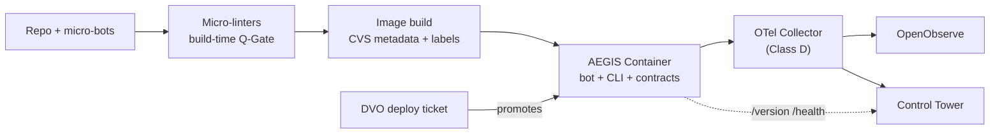

# Containerization in AEGIS: From Micro-Bot to Deployable Unit

**Author:** Oz (Agent), InfraOS Development Team
**Date:** 2026-09-11
**Sources:** AEGIS CLI/Agent and HATHOR Overview architecture documents; InfraOS governance (cr-cvs-001, cr-docker-ports-001, cr-011, cr-aws-gov-001, cr-deploy-gov-001, cr-observability-001, cr-kb-push-001)
**Status:** DRAFT — session knowledge, pending Control Tower KB promotion
**Companion:** `aegis-containerization-presentation-script-20260911.md`

---

## Two Different Quanta

Every architecture eventually has to answer the same question: what is the smallest unit you can trust? AEGIS answered it once at the capability layer with the Micro-Bot — one role, one contract, stateless between calls. Containerization forces us to answer it a second time, at the infrastructure layer.

The answer is the AEGIS Container: the *deployment quantum*. Where the Micro-Bot is the smallest unit of capability, the container is the smallest unit that can be independently versioned, scheduled, and governed. It is the shell that gives one or more bots a runtime identity, a network address, and a promotion path.

The distinction matters because of one rule that keeps the entire model honest: **the container never becomes the interface.** The CLI remains the single point of contact for agents. A container is simply where an executor happens to live. The moment a container grows its own bespoke API surface that agents call directly, the control plane has been bypassed and the architecture has failed — no matter how well the container itself is built.

## Our Role: Builder and Verifier, Never Operator

Before defining what a container *is*, we should be precise about what *we* are to it, because our experience with InfraOS has already settled this question, and AEGIS inherits the settlement.

The agent's role is **builder and verifier, never operator**. We design, build, lint, and validate container images in local and development environments only. Promotion beyond development — to testing, staging, or master — is a DVO, human-operator concern. There is no agent deploy path, and this is a hard security boundary rather than a convention (cr-deploy-gov-001).

Within that boundary, we carry three responsibilities. First, we are the **provenance authors**: version metadata under the Container Version Standard, OCI labels, manifests, and observability contracts are all generated at build time in development, so the container carries our attestation forward and operators never have to trust an unlabeled image. Second, we enforce **registry-first identity**: ports, names, and groups come from the canonical registry (`cfg/gen3-port-registry.yaml` — the InfraOS org-central legacy path; the AEGIS project-canonical location is `cfg/port-registry.yaml` per ADR-004 §2.1), never invented per-repo (cr-docker-ports-001, cr-011). Third, we respect the runtime mandate: AWS-hosted compute is **EKS-only** (cr-aws-gov-001), and local development uses Compose with canonical project naming.

In AEGIS terms, the agent is a Process-level actor for containers. We compose and validate; the Control Tower and DVO own promotion and fleet state.

## A Taxonomy of AEGIS Containers

The container taxonomy deliberately mirrors the bot families. Four classes cover the fleet.

**Class A — Control-Plane Containers** host the CLI-facing services and orchestration-tier bots — the Process, Proctor, and Operator surfaces — along with the MCP servers (InfraMCP, KnowMCP). These are the only containers that terminate agent traffic. Everything else in the fleet is reached *through* them or not at all.

**Class B — Knowledge Containers** are the persistent substrate: VectorDB, embeddings and Ollama services, knowledgebase APIs. The Information Hierarchy bots (Procedure through Checklist) read and write this substrate, but always through the CLI. Class B containers are stateful and backup-governed, and worker bots never address them directly.

**Class C — Worker / Bot-Host Containers** package one micro-bot — the preferred cardinality — or one tightly-cohesive bot family behind a single manifest. They are stateless, horizontally scalable, and disposable. A Class C container inherits its bot's temperament: it refuses over improvising, and it dies cleanly rather than degrading silently.

**Class D — Observation Containers** carry the OpenTelemetry Collector and the observation-tier consumers. Per cr-observability-001, the Collector container is the *only* place where backend routing and ingestion credentials exist.

Class D deserves a pause, because it reveals the pattern that unifies the whole design. At the capability layer, Operator-Bot centralizes external connections so that worker bots hold zero credentials. At the deployment layer, the Collector centralizes telemetry egress so that worker containers hold zero backend credentials. The same principle at two altitudes: **N workers, zero secrets, one broker.** Once you see this symmetry, the architecture stops being a pile of rules and becomes one idea applied consistently.

## The Anatomy of an AEGIS Container

The container anatomy is deliberately isomorphic to the seven-block bot anatomy. A container is bot anatomy at deployment scale, and the parallel is the point: an engineer who understands one unit understands both.

**Identity.** A container's name and group come from the port registry; its version metadata is generated pre-build from the AWS_PUSH increment path under the Container Version Standard; its image is digest-pinned; and its OCI labels carry provenance — who built it, from what source, when. Identity is permanent and auditable, exactly as a bot's UUID and canonical name are.

**Manifest.** The Compose or Kubernetes spec declares the registry-assigned port, the resource envelope, env-injected CVS metadata, and the *names* of required connections — never credentials. This is the container's "who-can-cover-what" for schedulers, as the bot manifest is for the CLI registry.

**Contract surface.** Every HTTP-serving container exposes a mandatory `/version` endpoint with content negotiation — JSON for machines, branded HTML for operators — with security-scoped fields gated behind OpenFeature flags (cr-cvs-001). Add `/health` and standardized exit codes, and the bot rule holds at the container boundary: contract mismatch means refuse and report, never guess.

**Executor payload.** The bot (or bots) plus the CLI runtime. One responsibility per container. Composition across containers happens at the orchestration level — Compose locally, EKS in AWS — exactly as bot composition happens at the Proctor and Process level, never inside the unit itself.

**Knowledge interface.** Knowledge microbursts flow out through the CLI to Development MCP destinations only (cr-kb-push-001). No container writes to a knowledge store directly, for the same reason no bot does: the CLI is the only doorway, in both directions.

**Connection surface.** Zero baked secrets. Credentials arrive at runtime — `secrets exec` locally, IRSA or secret mounts on EKS — and external egress is brokered rather than embedded. The container is as credential-free as the worker bot inside it.

**Telemetry surface.** The OTel SDK inside, the Collector in the middle, OpenObserve at the end. Resource attributes — `service.name`, `service.version` drawn from CVS metadata, `deployment.environment.name` — make every container a first-class observation subject. Export is asynchronous and never fails a business request.

## How Bots and Containers Relate

Four rules govern the relationship in practice.

**Cardinality.** One bot to one container is the default. A bot *family* may share a container only when it shares a contract version and a failure domain — the Observation children (task-Bot, benchmark-Bot, success-rate-Bot, retry-Bot, token-Bot) are the canonical example. Families are never mixed in one image.

**The CLI crosses the boundary; bots don't.** An agent never addresses a container. It addresses the CLI, which resolves the bot, which happens to be containerized. The container's IP and port are infrastructure details owned by the registry, invisible to the capability layer.

**Broker symmetry.** Operator-Bot for connections, the Collector for telemetry — covered above, but worth restating as a relationship rule: workers of either kind hold nothing worth stealing.

**Layered degradation.** At the bot level, failure is a structured error with remediation guidance. At the container level, it is a failed health check and a scheduler replacement. At the fleet level, it is a telemetry gap the Tower can see. The same philosophy — fail loudly, fail structurally, never fail silently — at three altitudes.

## Micro-Linters: The Build-Time Immune System

One actor remains: the micro-linter. If the Observation tier is the runtime immune system, micro-linters are the build-time immune system, and the division of labor between them is precise.

Micro-linters live *in the repo, not in the image*. They are small, single-error-class detectors that run at validation moments — pre-commit, `make pr-ai`, and image build. They are the static mirror of single-role bots: the same narrowness of purpose, applied to code at rest rather than requests in flight.

The operating rule is simple: **nothing un-linted gets containerized.** The image build is a Q-Gate boundary. Micro-linters gate what enters the image — canonical naming, ports checked against the registry, line-ending policy, secrets-in-layer detection, CVS label presence, observability contract validity. Once the image is built, responsibility hands off cleanly: the health and version contracts, and the Observation bots behind them, take over for the rest of the container's life.

Anatomically, a micro-linter is a bot minus the runtime surfaces. It has identity, a manifest, a contract, and an executor — but no connection surface and no telemetry surface. It emits findings to the build report and the Tower instead of serving requests. Two halves of one defense: linters guarantee what goes *into* the shell; observation guarantees we always know what the shell is *doing*.

## The Full Lifecycle

Put together, the lifecycle reads left to right: code and bots in the repo, linted into an image, the image becoming a container with contracts, telemetry flowing through the Collector to OpenObserve, health and version reporting to the Tower — and the only arrow into promotion coming from a DVO ticket, not from us.

Every arrow in this diagram is either a Q-Gate, a contract, or a human decision. There are no informal paths — and that absence is the architecture.

## Definition

An AEGIS Container is a **registry-named, provenance-labeled, secret-free shell** that promotes a validated micro-bot from capability to deployable unit — **linted into existence, observed for its whole life, and moved between environments only by humans.**

If a container in our fleet cannot satisfy every clause of that sentence, it is not an AEGIS Container yet. It is a remediation item.

## Where This Goes Next

Three follow-ups fall out of this definition. First, ratify it as a canonical rule — working title `cr-aegis-container-001` — and promote this article to the Control Tower knowledgebase. Second, audit the existing fleet against the four classes and seven anatomy blocks; every gap becomes a ticketed remediation item. Third, stand up the micro-linter set for the image Q-Gate: registry-port check, CVS label check, secrets-in-layer scan, and observability contract validation.

The Micro-Bot gave us a unit of capability we can trust. The AEGIS Container gives us a unit of deployment we can trust. The linters and the Tower exist so that we never have to take either on faith.
