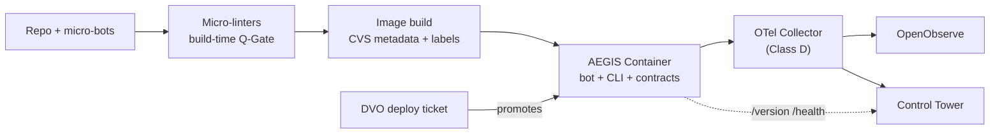

# AEGIS Containerization — Presentation Script
**Title:** Containerization in AEGIS: From Micro-Bot to Deployable Unit
**Audience:** InfraSuite engineering / architecture review
**Duration:** ~20 minutes (12 slides)
**Date:** 2026-09-11
**Source:** AEGIS CLI/Agent + HATHOR Overview architecture documents; InfraOS governance (cr-cvs-001, cr-docker-ports-001, cr-011, cr-aws-gov-001, cr-deploy-gov-001, cr-observability-001, cr-kb-push-001)
**Status:** DRAFT — session knowledge, pending Control Tower KB promotion

---

## SLIDE 1 — Title & Framing
*(Visual: AEGIS shield + container icon side by side)*

> "Today we're answering one question: when AEGIS meets containers, who owns what?
> We've spent months defining the Micro-Bot — the smallest unit of capability. Now we define its shell: the AEGIS Container — the smallest unit of deployment. And we'll define *our* role in that story, because based on everything we've learned from InfraOS, it's narrower and more powerful than 'we run containers.'"

**Transition:** "Let's start with the core distinction."

---

## SLIDE 2 — Two Different Quanta
*(Visual: two boxes — "Capability Quantum: Micro-Bot" / "Deployment Quantum: Container")*

> "A Micro-Bot is the capability quantum: one role, one contract, stateless between calls.
> An AEGIS Container is the deployment quantum: the shell that gives one or more bots a runtime identity, a network address, and a promotion path.
> The container is to infrastructure what the bot is to capability — the smallest independently versioned, schedulable, governable unit.
> And here's the rule that keeps the whole model honest: **the container never becomes the interface.** The CLI remains the single point of contact. The container is just where the executor happens to live."

**Transition:** "So if the container isn't the interface, what's our job?"

---

## SLIDE 3 — Our Role: Builder and Verifier, Never Operator
*(Visual: pipeline arrow — Agent builds → DVO promotes → Tower governs)*

> "InfraOS governance already answered this for us, and AEGIS inherits it.
> One: we design, build, lint, and validate images in **local and development only**. Promotion beyond development is a DVO, human-operator concern. There is no agent deploy path — full stop.
> Two: we are the **provenance authors**. Version metadata, labels, manifests, observability contracts — all generated at build time, in development. The container carries our attestation forward so operators never have to trust an unlabeled image.
> Three: we enforce **registry-first identity**. Ports, names, groups come from the canonical port registry. Nobody invents a port in a README.
> Four: AWS runtime is **EKS-only**. Locally, it's Compose with canonical project naming.
> In AEGIS terms: the agent is a Process-level actor for containers. We compose and validate. The Tower and DVO own promotion and fleet state."

**Transition:** "With the role defined, here's the taxonomy."

---

## SLIDE 4 — Container Taxonomy: Four Classes
*(Visual: four-quadrant diagram, Classes A–D)*

> "Containers mirror the bot families. Four classes:
> **Class A — Control-Plane Containers.** They host the CLI-facing services and orchestration-tier bots — Process, Proctor, Operator surfaces — plus the MCP servers, InfraMCP and KnowMCP. These are the only containers that terminate agent traffic.
> **Class B — Knowledge Containers.** VectorDB, embeddings, Ollama, knowledgebase APIs. The persistent substrate that the Information Hierarchy bots read and write — always through the CLI. Stateful, backup-governed, never directly addressed by worker bots.
> **Class C — Worker / Bot-Host Containers.** One micro-bot — preferred — or one tightly-cohesive bot family behind a single manifest. Stateless, horizontally scalable, disposable.
> **Class D — Observation Containers.** The OpenTelemetry Collector and observation-tier consumers. And note: the Collector is the only place where backend routing and ingestion credentials exist."

**Transition:** "Class D is worth pausing on, because it reveals a pattern."

---

## SLIDE 5 — The Symmetry Principle
*(Visual: Operator-Bot ⇄ Connection Pool mirrored against Collector ⇄ OpenObserve)*

> "At the capability layer, Operator-Bot centralizes external connections so worker bots hold zero credentials.
> At the deployment layer, the Collector centralizes telemetry egress so worker containers hold zero backend credentials.
> Same principle, two altitudes: **N workers, zero secrets, one broker.**
> When you see this symmetry, the architecture stops being a pile of rules and becomes one idea applied consistently."

**Transition:** "Now let's open a container up. What's inside?"

---

## SLIDE 6 — Anatomy, Part 1: Identity, Manifest, Contract
*(Visual: exploded container diagram, blocks 1–3 highlighted)*

> "The anatomy is deliberately isomorphic to the seven-block bot anatomy. A container is bot anatomy at deployment scale.
> **Block one, Identity.** Canonical name and group from the port registry. CVS version metadata generated pre-build from the AWS_PUSH increment path. Digest-pinned image. OCI labels carrying provenance — who built it, from what source, when.
> **Block two, Manifest.** The Compose or Kubernetes spec: registry-assigned port, resource envelope, env-injected CVS metadata, and required connection *names* — never credentials.
> **Block three, Contract surface.** Mandatory `/version` with content negotiation — JSON for machines, branded HTML for operators — security-scoped fields behind OpenFeature flags. Plus `/health`, plus standardized exit codes. And the bot rule applies at the boundary: contract mismatch means refuse and report, never guess."

**Transition:** "Blocks four through seven are about behavior."

---

## SLIDE 7 — Anatomy, Part 2: Executor, Knowledge, Connections, Telemetry
*(Visual: same exploded diagram, blocks 4–7 highlighted)*

> "**Block four, Executor payload.** The bot or bots, plus the CLI runtime. One responsibility per container. Composition across containers happens at the orchestration level — Compose or EKS — exactly as bot composition happens at the Proctor and Process level. Never inside.
> **Block five, Knowledge interface.** Knowledge microbursts flow out through the CLI to Development MCP destinations only. No container writes to a knowledge store directly.
> **Block six, Connection surface.** Zero baked secrets. Credentials arrive at runtime — `secrets exec` locally, IRSA or secret mounts on EKS. Egress is brokered, not embedded.
> **Block seven, Telemetry surface.** OTel SDK inside, Collector in the middle, OpenObserve at the end. Resource attributes — service name, version from CVS, deployment environment — make every container a first-class observation subject. Export is asynchronous and never fails a business request."

**Transition:** "So how do bots and containers actually relate, day to day?"

---

## SLIDE 8 — Micro-Bot ⇄ Container Relationship Rules
*(Visual: cardinality diagram — 1 bot : 1 container default)*

> "Four rules.
> **Cardinality:** one bot to one container is the default. A bot *family* may share a container only when it shares a contract version and a failure domain — the Observation children are the canonical example. Never mix families in one image.
> **The CLI crosses the boundary; bots don't.** An agent never addresses a container. It addresses the CLI, which resolves the bot, which happens to be containerized. The container's IP and port are infrastructure details owned by the registry.
> **The broker symmetry** we covered — Operator-Bot for connections, Collector for telemetry.
> **Degradation is layered:** bot-level, a structured error with remediation. Container-level, a failed health check and the scheduler replaces it. Fleet-level, the Tower sees the telemetry gap. Same philosophy, three altitudes."

**Transition:** "One actor is still missing: the linter."

---

## SLIDE 9 — Micro-Linters: The Build-Time Immune System
*(Visual: repo → linter gate → image, with a red 'no un-linted code' barrier)*

> "Micro-linters live in the repo, **not** in the image. They're small, single-error-class detectors that run at validation moments — pre-commit, `make pr-ai`, image build. They are the static mirror of single-role bots.
> The operating rule: **nothing un-linted gets containerized.** The image build is a Q-Gate boundary. Micro-linters gate what enters the image — naming, ports against the registry, line-ending policy, secrets-in-layer detection, CVS label presence, observability contract validity.
> Once the image is built, responsibility hands off: health and version contracts plus the Observation bots take over at runtime.
> Anatomically, a micro-linter is a bot minus the runtime surfaces: identity, manifest, contract, executor — but no connection surface, no telemetry surface. It emits findings to the build report and the Tower instead.
> Build-time immune system; runtime immune system. Two halves of the same defense."

**Transition:** "Put it all together and the lifecycle looks like this."

---

## SLIDE 10 — The Full Lifecycle
*(Visual: Mermaid flow)*

> "Left to right: code and bots in the repo, linted into an image, the image becomes a container with contracts, telemetry flows through the Collector to OpenObserve, health and version report to the Tower — and the only arrow into promotion comes from a DVO ticket, not from us.
> Every arrow in this diagram is either a Q-Gate, a contract, or a human decision. There are no informal paths."

**Transition:** "Which brings us to the definition."

---

## SLIDE 11 — The One-Line Definition
*(Visual: single sentence, full screen)*

> "An AEGIS Container is a **registry-named, provenance-labeled, secret-free shell** that promotes a validated micro-bot from capability to deployable unit — **linted into existence, observed for its whole life, and moved between environments only by humans.**
> If a container in our fleet can't satisfy every clause of that sentence, it isn't an AEGIS Container yet — it's a remediation item."

**Transition:** "Last slide — what happens next."

---

## SLIDE 12 — Next Steps & Call to Action
*(Visual: checklist)*

> "Three asks coming out of this session:
> One — ratify this as a canonical rule, working title `cr-aegis-container-001`, and promote this document to the Control Tower knowledgebase.
> Two — audit existing Class A through D containers against the seven-block anatomy; every gap becomes a ticketed remediation item on the board.
> Three — stand up the micro-linter set for the image Q-Gate: registry-port check, CVS label check, secrets-in-layer scan, observability contract validation.
> The Micro-Bot gave us a unit of capability we can trust. The AEGIS Container gives us a unit of deployment we can trust. The linters and the Tower make sure we never have to take either on faith. Thank you — questions?"

---

## Appendix — Q&A Preparation

**Q: Why 1 bot per container instead of packing a family per image?**
A: Failure-domain isolation and independent versioning. The exception (shared contract version + shared failure domain, e.g. Observation children) is deliberate and narrow.

**Q: Why can't the agent deploy to testing if all gates are green?**
A: cr-deploy-gov-001 is non-overridable — development-only access is a hard security boundary. Green gates trigger a DVO deploy ticket, not an agent action.

**Q: Where do container ports come from?**
A: `InfraControl/cfg/gen3-port-registry.yaml` exclusively (InfraOS org-central path; in AEGIS projects the canonical file is `cfg/port-registry.yaml` per ADR-004 §2.1). Running-container reality is ground truth for diagnosis; registry drift is fixed in the repo, never worked around locally.

**Q: What replaces Datadog in the container telemetry path?**
A: OpenTelemetry SDK → Collector → OpenObserve (cr-observability-001). Direct backend URLs or credentials in application containers are forbidden paths.

**Q: Are micro-linters bots?**
A: Anatomically they're bots minus runtime surfaces (no connection/telemetry blocks). Operationally they're static-time: they gate images rather than serve requests.
