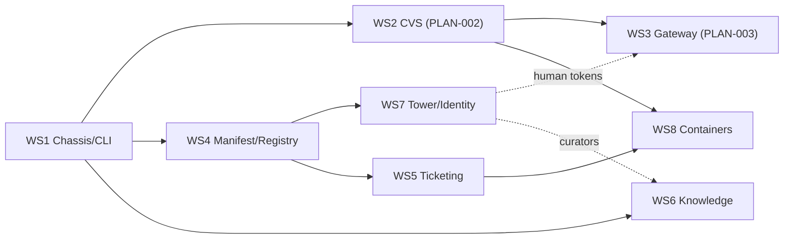

# AEGIS-PLAN-001 — Platform Roadmap (v1)

- **Document ID:** AEGIS-PLAN-001
- **Status:** APPROVED — operator sign-off 2026-09-13 (PENDING-EDITS D6); fills the slot previously "reserved" (CORE-001/ARCH-001 headers now resolve)
- **Date:** 2026-09-13
- **Author:** Oz (Agent), commissioned by Raymond Bayly (BaylyAI)
- **Subordinate plans:** AEGIS-PLAN-002 (CVS P0–P2, detailed), AEGIS-PLAN-003 (gateway + validators + skill pack)
- **Traces to:** AEGIS-REQ-CORE-001 §16 (v1 acceptance), ADR-003/004, RP-010..013
- **Scope rule:** planning artifact only. Execution requires authorizing epics/tickets (AEG-REQ-TKT-004/005/007). No code authorized.

---

## 1. Goal

Sequence the entire v1 platform (not just CVS) so every CORE §16 acceptance criterion has an owning workstream, and the two detailed plans (PLAN-002/003) slot into a whole. Estimates are planning-grade; re-baseline at each milestone.

## 2. Workstreams

| WS | Scope | Defining docs | Depends on |
|---|---|---|---|
| **WS1 Chassis & CLI core** | `aegis` binary, cobra tree (9 domains, ADR-003), exit/envelope contract, UPL tooling (`repo init|validate`), schema introspection | CORE §3/§4/§7, TS-001 §2–§3 | — |
| **WS2 CVS** | change-time immune system P0–P2 (+P3–P5 interfaces) | RP-007, TS-001, **PLAN-002** | WS1 (shares repo/foundations) |
| **WS3 Orchestration Gateway** | run log, conductor, Sequence/Barrier Gate, reconciler | RP-009, TS-002, **PLAN-003** | WS2 M1 (linter runtime), WS1 |
| **WS4 Manifest & Registry** | manifest v1 + JCS/DSSE signing (RP-013 §6), MBI, handshake, registration enforcement | RP-001, RP-002, RP-013 | WS1 |
| **WS5 Ticketing Plane** | Ticket Contract v1, Operator brokering (RP-011), Jira/ADO/GitHub adapters, Backup TS (ADR-005), gates G04–G09 wiring | RP-006, RP-011, ADR-005 | WS1, WS4 (identity), Operator core |
| **WS6 Knowledge Plane** | record store + retrieval (RP-012), promotion flow (RP-004), project/org MCP read surfaces | RP-004, RP-012 | WS1 |
| **WS7 Tower & Identity** | Tower v1 five facets (RP-010), TUF distribution, human identity tokens (THR-002), ingest/query | RP-010, RP-013 | WS4 (signing), WS1 |
| **WS8 Containers & Deploy** | Class A–D reference images, micro-linter Q-gate in build, CVS labels, DVO workflow | Containerization article, CNT-001..008 | WS2 (linters), WS5 (deploy ticket) |

## 3. Sequencing & milestones

| Milestone | Contents | Acceptance ties (CORE §16) |
|---|---|---|
| **M-A Foundations** | WS1 done; WS2 M0–M1 (contracts frozen, `validate change` L1) | §16.1, §16.2 (partial), §16.13 |
| **M-B Enforcement** | WS2 M2–M3 (assumptions, claims, gates); WS3 P0–P1 (run log, barrier gate, resume) | §16.12 (partial) |
| **M-C Identity & Registry** | WS4 (manifest/MBI/handshake, JCS+DSSE); WS7 facets 1–2 (TBR, distribution via TUF) | §16.3–§16.5 |
| **M-D Planes** | WS5 (contract + Jira adapter + Backup TS + gates), WS6 (store + retrieval + promotion) | §16.7, §16.8 (Jira + Backup first; ADO/GitHub adapters follow) |
| **M-E Conducted delivery** | WS3 P2–P3 (reconciler, graphs); WS7 facets 3–5 (curators, ingest, query); human tokens live (THR-002) | §16.6, §16.9, §16.12 (full) |
| **M-F Containers & dogfood** | WS8 reference images + build gate; AEGIS self-hosted in strict mode | §16.10, §16.11 |

**Critical path:** WS1 → WS2(M1) → WS3(P0–P2) → M-E; WS4 → WS7 gates M-C and unblocks the human-identity dependency of M-E. WS5/WS6 parallelize against WS3 after M-B.

## 4. Estimation (planning-grade, pre-governance base hours)

| WS | Base hours | Notes |
|---|---|---|
| WS1 | 120–160 | overlaps PLAN-002 CVS-P0-E1/E6 |
| WS2 | 550–700 | as PLAN-002 §6 |
| WS3 | 380–480 | as PLAN-003 §3 |
| WS4 | 260–340 | signing via TUF/DSSE libraries, not bespoke |
| WS5 | 320–420 | one provider adapter first (Jira), Backup TS minimal |
| WS6 | 260–340 | FTS5-first; embeddings optional |
| WS7 | 300–400 | five REST facets + TUF repo + tokens |
| WS8 | 180–240 | four reference images + gate wiring |
| **Total** | **≈ 2,370–3,080** | ≈ 1,185–1,540 reduced @ `jira-standards@50pct` |

Two engineers ≈ 20–26 weeks post-M0; four engineers with the §3 parallelization ≈ 12–16 weeks. Re-baseline at M-A.

## 5. Standing rules

1. Every epic maps to a Ticketing Plane epic; stories split at ≤ 40h reduced (AEG-REQ-TKT-007).
2. Interface-freeze discipline (PLAN-002 §3) extends to: graph schema (TS2-I-001), Tower API (RP-010 §3), pool schema (RP-011 §3), knowledge record (RP-012 §2) — freeze before dependent fan-out.
3. Any scope addition touching CANON-001 registries amends CANON-001 in the same change.
4. Dogfood order: AEGIS repo → InfraAPI wrap (PLAN-002 X2-S3) → one Communications workflow under a conducted run.

## 6. Immediate next actions

1. Cut the authorizing WS1/WS2 epics and tickets (PLAN-002 §10 lists the first candidates).
2. Complete the interface-freeze deliverables before dependent fan-out (standing rule 2).
3. Cut the WS4 authorizing epic/tickets against the accepted RP-013 trust/signing stack and the applied RP-001/RP-002 amendments.

---

*APPROVED 2026-09-13 — platform roadmap. No code authorized without an authorizing epic/ticket.*
