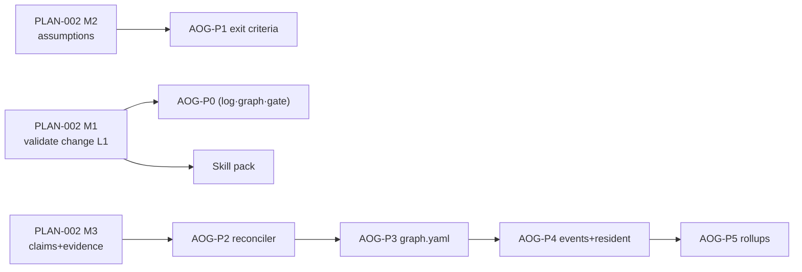

# AEGIS-PLAN-003 — Orchestration Gateway, Remaining Validators & Agent Skill Pack

- **Document ID:** AEGIS-PLAN-003
- **Status:** APPROVED — operator sign-off 2026-09-13 (PENDING-EDITS D6)
- **Date:** 2026-09-13
- **Author:** Oz (Agent), commissioned by Raymond Bayly (BaylyAI)
- **Implements planning for:** AEGIS-TS-002 (gateway P0–P5, per ADR-002 §10 follow-on), RP-008 §7 Q3 (four unscheduled validators), and the agent skill pack repeatedly identified as highest-ROI (reports 01/02/05, CLI Research §5-D) but never scheduled
- **Relationship:** subordinate to AEGIS-PLAN-001 (WS3); sibling of AEGIS-PLAN-002 (CVS)
- **Scope rule:** planning artifact only. No code authorized without a ticket.

---

## 1. Gateway epics (TS-002 P0–P5)

Sizing: S ≤ 1.5d, M ≈ 2–3d, L ≈ 4–5d. Prereq: PLAN-002 M1 (linter runtime + suite runner exist).

**Epic AOG-P0-E1 — Run event log + fold** *(TS-002 §5)* — event types, append protocol (reuses TS-001 §8.2), `Fold→State`, torn-line/dedupe tests. Size L.
**Epic AOG-P0-E2 — Graph model + derivation** *(TS-002 §4.2/§4.3)* — Go model, `Derive` from hierarchy chain, digesting. Size M.
**Epic AOG-P0-E3 — Sequence/Barrier Gate + `Admit`** *(TS-002 §7)* — admission algorithm, refusal envelopes with `next_required`, `run open/status`, task-node `enter`, auto `on_change`. Size L. Exit: out-of-order dispatch refused on fixture graph.
**Epic AOG-P1-E1 — Exit criteria + `node complete` + resume** *(TS-002 §6)* — suites+evidence+assumptions atomically; `run resume` lossless. Size L. Exit: false `step.done` refused; kill-mid-run resumes.
**Epic AOG-P2-E1 — `val-completeness-Bot` + finalize reconciler** *(TS-002 §9.1)* — required-set vs executed-set vs telemetry; façade wiring. Size M. Exit: deleted `node.completed` → `COMPLETENESS_GAP` naming the gap.
**Epic AOG-P3-E1 — `graph.yaml` + `ml-graph-integrity` + XOR/AND** *(TS-002 §4.1/§4.4/§6.4)* — schema freeze, linter goldens, gateway semantics. Size L. Exit: invalid graph refused at `run open`.
**Epic AOG-P4-E1 — `gateway.event` + resident `conduct`** *(TS-002 §14.1)* — timeouts, `assumption.tick`, drain|stop. Size L.
**Epic AOG-P5-E1 — Tower rollups** *(TS-002 §14.2)* — `orchestration.*` drain, gap/refusal/waiver queries (pairs with RP-010 §3.5). Size M.

Estimate: **380–480 base hours** (190–240 reduced) — the WS3 line in PLAN-001 §4.

## 2. The four unscheduled validators (RP-008 §7 Q3 resolved)

| Validator | Placed at | Rationale | Size |
|---|---|---|---|
| `val-ticket-Bot` | with WS5 Ticketing (after Jira adapter) | its predicates need the live plane; until then `ml-ticket-bind` covers naming statically (PLAN-002 §7) | M |
| `val-hierarchy-Bot` | with AOG-P3-E1 | chain/link integrity pairs naturally with graph validation | M |
| `val-knowledge-Bot` | with WS6 Knowledge (store + redaction live) | draft/TTL/redaction preflight needs RP-012 store semantics | M |
| `val-drift-Bot` | after M-A dogfood begins | drift detection is valuable once a real repo lives under AEGIS rules | S/M |

Each lands as an in-proc capability behind `proctor.Dispatch` (TS-001 §9), with CANON-001 §6 already listing all eleven.

## 3. Agent skill pack (the unscheduled highest-ROI item)

**Deliverable:** `aegis-agent-skill.md` (~800 tokens), versioned with the CLI, generated-and-verified against `aegis schema` in CI so it cannot drift.

Contents (fixed budget): orientation pack commands (NFR-002 set); the nine domains, one line each; exit-code + envelope contract in four lines; the five commands never to run by default (inventory/full dumps — report 05 §6); conducted-run loop (`run open → work → node complete → run finalize`); where refusals point next (`proctor gateway explain`).

**Stories:** SKL-S1 author pack (S); SKL-S2 CI check — pack claims validate against `aegis schema` output (S); SKL-S3 token-budget bench ≤ 800 tokens (S). Schedule: with PLAN-002 M1 (the commands it documents must exist).

## 4. Sequencing against PLAN-002

## 5. Risks

| Risk | Mitigation |
|---|---|
| Gateway blocks day-to-day work during dogfood | non-enforced dev profile first (`reconcile_on_finalize` degraded mode, TS-002 §12); flip enforced per repo |
| Graph derivation fidelity too coarse (TS2-D-004) | linear default + explicit `graph.yaml` escape hatch from P0; fidelity feedback via `orchestration.barrier.refused` rates |
| Human-token dependency (THR-002) arrives late | waivers remain TTY-gated **only in dev profile** until WS7 tokens land; enforced profiles require tokens (M-E gate) |
| Skill pack drifts from CLI | SKL-S2 CI check is mandatory, not advisory |

---

*APPROVED 2026-09-13 — delivery roadmap for TS-002 + validator completion + skill pack. No code authorized without an authorizing ticket.*
