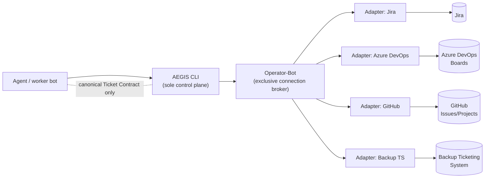
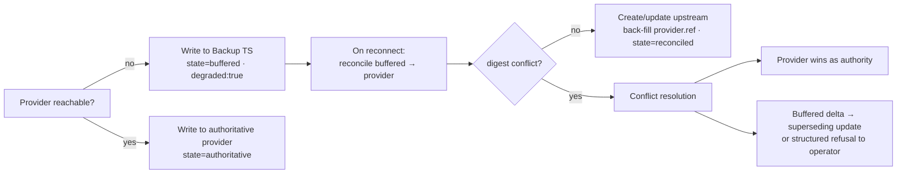

# AEGIS Research Paper 006 — The Ticketing Plane: Work as a Source of Truth

- **Document ID:** AEGIS-RP-006
- **Status:** DRAFT (research output — pending operator review) — session knowledge, pending Control Tower KB promotion
- **Date:** 2026-09-11
- **Parent:** AEGIS-REQ-BOT-001 (governance: the ticket-based economy)
- **Related:** AEGIS-RP-002 (hybrid authority + bounded offline trust), AEGIS-RP-003 (spool-and-drain transport), AEGIS-RP-004 (status-on-record, queue-as-view), `aegis-containerization-article-20260911.md` (the DVO promotion arrow)
- **Amended by:** AEGIS-ADR-003 §2.3 (degraded exit-2 phrasing reads as envelope `degraded:true`); AEGIS-ADR-005 (Backup TS implementation decision)
- **Author:** Oz (Agent), commissioned by Raymond Bayly
- **Sources:** AEGIS "CLI" and "Overview" boards; InfraOS governance (cr-jira-ticket-001/002/003, cr-deploy-gov-001, cr-bug-intake-001, cr-branch-gov-001, cr-003/cr-004 connection-first, cr-005/cr-auth-token-001 secrets order, `jira-standards.md` estimation)

---

## 1. Problem Statement

The bot taxonomy settled where **capability** lives (the micro-bot) and the containerization article settled where **deployment** lives (the container). Neither settled where **work** lives. Across the boards and the governance rules, one assumption is made everywhere and defined nowhere: that a durable, external, human-visible ticket — not agent memory, not a chat message, not a branch name — is the authority for *what should be done, why, in what order, and who authorized it*.

This paper names that authority the **Ticketing Plane** and specifies it. Three questions must be answered together:

1. **Authority.** In what sense is the Ticketing Plane a "source of truth," and how does it relate to the CLI control plane, the Knowledge Plane, and the Tower registry — each of which already claims to be authoritative over *something*?
2. **Integration.** The fleet does not use one tracker. Work is tracked in **Jira**, **Azure DevOps**, and **GitHub**. How does one canonical work model span three provider surfaces without the abstraction leaking into every bot?
3. **Continuity.** Enterprise trackers go down, rate-limit, or are simply absent in an isolated environment. What is the **backup** — a small, network-reachable ticketing system — and how does it provide continuity without quietly becoming a second, competing source of truth?

Design constraints inherited from the corpus:

- **CLI is the sole control plane (TAX-006).** The Ticketing Plane must be reachable *through* the CLI, never as a second control surface bots call directly.
- **Operator-Bot is the exclusive external-connection broker (TAX-003, ANA-006, SEC-002).** No worker bot links a Jira/ADO/GitHub SDK.
- **Refuse-never-guess (ANA-003)** and **graceful degradation with bounded offline trust (RUN-003, AEGIS-RP-002).**
- **No secrets in bots or records (KNO-006, SEC-001).**

## 2. The Ticketing Plane

### 2.1 A plane of authority, not a control plane

AEGIS already has one control plane and it is the CLI. The Ticketing Plane is **not** a second one. It is a *source-of-truth plane*: a durable, auditable record of work that agents read from and write to **only through the CLI**, which brokers all provider I/O through Operator-Bot. Agents never hold a Jira URL and a token; they ask the CLI about *work*, and the CLI resolves that to whichever provider backs the current project.

This distinction is the whole safety argument. If a bot could call Jira directly, the Ticketing Plane would become a control surface, TAX-006 would be violated, and credentials would scatter across the fleet exactly as they do in the pre-AEGIS world. Keeping it a data-authority plane behind the one control plane is what makes it governable.

### 2.2 Three planes, one control plane

The corpus now has three things that each claim authority over one domain, unified by the single control plane:

| Plane | Source of truth for | Authority artifact | Governing paper |
|---|---|---|---|
| **Tower registry** | which **bots** may run | signed manifest digest (TBR) | AEGIS-RP-001/002 |
| **Knowledge Plane** | what we **know** (verified) | status-on-record knowledge | AEGIS-RP-004 |
| **Ticketing Plane** | what **work** exists, its state, and its authorization | the canonical ticket | **this paper** |

The symmetry is the point, in the same voice as the containerization article's "N workers, zero secrets, one broker": **three planes of truth, one plane of control.** An engineer who understands why knowledge writes land as `draft` pending human promotion already understands why *work* lands as a ticket pending human authorization — it is the same discipline applied to a different noun.

### 2.3 What "source of truth" means operationally

The Ticketing Plane is authoritative for facts that must outlive a session and a conversation:

- **Existence & intent** — a unit of substantive work exists iff a ticket exists for it (the No-Ticket Gate, §7).
- **State** — `backlog → ready → in_progress → in_review → blocked → done → archived` is read from the ticket, never inferred from git or chat.
- **Linkage** — every ticket links up to an **epic** and out to its **PR, branch, commit, telemetry `run_id`, and hierarchy chain**.
- **Estimation** — hours (base and governance-reduced), recorded on the ticket (§7.4).
- **Authorization** — most sharply, *promotion/deploy authority*. Per cr-deploy-gov-001, "chat-level permission does not authorize" a deploy; a **DVO ticket** does. The Ticketing Plane is where that authorization is durable and auditable, and it is the origin of the containerization article's single lawful arrow into promotion.

Corollary: agent memory and chat are explicitly **not** sources of truth for any of the above. They are inputs that must be committed to the plane to count.

### 2.4 Ticket vs. hierarchy chain — the human face vs. the executional spine

AEGIS already decomposes execution into a hierarchy chain (Procedure → … → Checklist, RUN-001). The ticket does not replace that chain; it *binds* to it:

- The **ticket** is the source of truth for **whether and why** work happens, and its human-facing identity and state.
- The **hierarchy chain** is the source of truth for **how** the work is executed.

One ticket references one or more execution chains; every completed run reports its `ticket_ref` alongside its hierarchy chain and telemetry (extends RUN-001's Tower report). This lets the Tower correlate ticket links, authoritative run ledgers, provider receipts, and telemetry to answer "show me every run, PR, and knowledge microburst produced under AMD-1234."

## 3. Canonical Ticket Contract

Following the manifest/contract vocabulary of AEGIS-RP-001, the plane is defined by a single provider-agnostic schema. Every provider adapter maps into and out of this shape; every bot and agent sees only this shape.

### 3.1 Structure (v1)

```json
{
  "ticket_contract_version": "1.0.0",
  "canonical_id": "AEGIS-WORK-8f2c9e1a",
  "provider": { "kind": "jira", "ref": "AMD-1234", "url": "https://…/browse/AMD-1234", "project": "AMD" },
  "type": "task",
  "title": "…",
  "description": "…",
  "status": "in_progress",
  "epic": { "canonical_id": "AEGIS-WORK-1a7b…", "provider_ref": "AMD-340", "required": true },
  "estimate": { "base_hours": 8, "reduced_hours": 4, "unit": "hours", "policy": "jira-standards@50pct" },
  "priority": "critical",
  "assignee": null,
  "links": {
    "pr": ["https://github.com/…/pull/97"],
    "branch": "feature/AMD-1234-rwb-ticketing-plane",
    "commit": ["a1b2c3d"],
    "run_id": ["…"],
    "hierarchy_chain": ["procedure:…/checklist:…"],
    "supersedes": null
  },
  "provenance": { "author": "<caller-bot-or-agent>", "session": "…", "source_run": "…", "created_at": "2026-09-11T13:00:00Z" },
  "sync": { "state": "authoritative", "origin": "jira", "last_reconciled": "…", "ttl": "72h", "digest": "sha256:…" }
}
```

- **`canonical_id`** is AEGIS-owned and stable across providers; **`provider.ref`** is the provider-native key (may be absent while a ticket is *buffered* in the backup plane, §5).
- **`type` ∈** `epic | story | task | bug | deploy`.
- **`provider.kind` ∈** `jira | azure-devops | github | backup`.
- **`status`** is the canonical lifecycle (§4.2), not the provider's raw string.
- **`estimate`** records **both** the base and the governance-reduced hours (`jira-standards.md`, mandatory 50% reduction). The plane stores facts; the reduction policy is named, not hidden.
- **`sync`** carries the RP-002-style trust fields: `state ∈ {authoritative, buffered, reconciled}`, `origin` provider, `ttl`, and a canonicalized `digest` used for conflict detection on reconcile (§6). No credentials ever appear — connection *names* only, resolved by Operator-Bot at call time (mirrors RP-001 §2.7).

### 3.2 Why a canonical contract (and not "just use Jira")

A canonical contract is the same move manifest v1 made for bots: it makes the executor **code-agnostic** (ANA-004) and the caller **provider-agnostic**. A bot that files a bug does not know or care whether the fleet is on Jira today and Azure DevOps tomorrow; it emits a canonical ticket, and the adapter beneath Operator-Bot resolves it. Replacing or adding a provider requires zero changes above the adapter — the ticketing analogue of AEG-MAN-003 (capability-based routing).

## 4. Provider Integration — Jira, Azure DevOps, GitHub

### 4.1 Adapter model (all brokered by Operator-Bot)

Each provider is a thin **adapter** that translates the canonical Ticket Contract to/from a provider API. Adapters have no autonomy of their own: they are invoked only by Operator-Bot, which owns the connection pool and resolves credentials in the canonical order (secrets manager → project env → credentials file; the Infra paths `.env` / `.infra/.tth/.credentials` in cr-005/cr-auth-token-001 are legacy examples, not AEGIS doctrine — SEC-001). This is the direct application of cr-003/cr-004 "connection-first, CLI-first" to work tracking.

Ticketing introduces **no new bot and no new family.** Per TAX-002/TAX-003, work tracking is an external-connection domain, and external connections are already the exclusive province of **Operator-Bot**. The plane therefore exposes a `work.ticket.*` capability family — `work.ticket.read@1`, `work.ticket.write@1`, `work.ticket.reconcile@1` (the `<domain>.<noun>.<verb>@<major>` vocabulary of RP-001 §2.5) — that any orchestration- or hierarchy-tier bot may address through the CLI. Provider adapters are translation shims, not bots: they carry no manifest, no telemetry surface, and no autonomy, and are invoked only by Operator-Bot.



**Project → provider routing.** A project declares its **authoritative provider** in project config (part of the Universal Project Layout's `.aegis/`). One project has exactly one authoritative provider at a time; the fleet may span all three. Default doctrine, consistent with the governance rules, is **Jira as the primary/enterprise authority** (the DVO/AMD boards), with Azure DevOps and GitHub as authorities for the projects that natively live there. Within a single provider, governance routes further by type: **bugs and deploy tickets are filed on the DVO project** (cr-bug-intake-001, cr-deploy-gov-001), while change work is filed on its product board — e.g. **AMD** (cr-jira-ticket-003). *(AMD/DVO are InfraOS example board names: the type-routing rule is doctrine; the concrete project keys are per-org configuration.)*

### 4.2 Canonical mappings

**Type mapping**

| Canonical | Jira | Azure DevOps (Boards) | GitHub |
|---|---|---|---|
| `epic` | Epic | Epic | Issue (`type:epic`) or Project |
| `story` | Story | User Story | Issue |
| `task` | Task | Task | Issue |
| `bug` | Bug | Bug | Issue (`label:bug`) |
| `deploy` | Task on **DVO** (deploy ticket) | Deployment Task | Issue (`label:deploy`) |

**Status mapping** (canonical → provider states; the canonical value is what bots see)

| Canonical | Jira | Azure DevOps | GitHub |
|---|---|---|---|
| `backlog` | Backlog / To Do | New | open (no project column) |
| `ready` | Selected for Development | Approved / Committed | open (Ready) |
| `in_progress` | In Progress | Active | open (In Progress) |
| `in_review` | In Review | Code Review / Resolved | open (In Review) + PR |
| `blocked` | Blocked (flag) | Blocked (tag) | open (`label:blocked`) |
| `done` | Done | Closed / Done | closed (completed) |
| `archived` | Archived / Won't Do | Removed | closed (not planned) |

**Linkage mapping** — the PR-Ticket binding (§7.3) is native everywhere and the adapters lean on it:

- **Jira** — Smart Commits / development panel; PR references `AMD-1234` in title and body.
- **Azure DevOps** — `AB#1234` mention links a PR/commit to a Work Item.
- **GitHub** — `Closes #1234` / cross-repo `owner/repo#1234`; Projects v2 field for epic rollup.

### 4.3 Epic linkage across providers

The Epic-Linkage Gate (cr-jira-ticket-002) is provider-agnostic in the canonical model via `epic.required = true`:

- **Jira** — `parent` field to an Epic.
- **Azure DevOps** — parent link (Epic → Feature → Story/Task).
- **GitHub** — issue assigned to an Epic issue / Project, or tracked-by relationship.

A ticket whose provider record has no epic is surfaced as **non-compliant** by the plane regardless of provider (§7.2).

## 5. The Backup Ticketing System (the degraded plane)

### 5.1 Purpose and doctrine

The backup is a **small, self-hostable, network-reachable ticketing service** that implements the *same canonical Ticket Contract read/write API* as any other adapter. Its job is continuity in two situations:

1. **Provider outage / rate-limit / auth failure** on Jira, ADO, or GitHub.
2. **Provider absence** — an isolated development environment with no entitled enterprise tracker.

Its governing doctrine is a direct lift of AEGIS-RP-002's registry model and AEGIS-RP-003's transport: **the enterprise provider is the authority; the backup is a buffer and read-cache, never a competing source of truth.** It is the concrete, *shared* form of the `degraded_fallback: "queue-local"` hint in RP-001 §2.7 and the spool-and-drain of RP-003 — elevated from a per-machine spool to a network service so that a multi-agent fleet stays *coordinated* during a provider outage instead of each machine spooling in isolation.

### 5.2 Why "small internet ticketing system" and not just a local spool

A local spool (RP-003) is correct for telemetry, which is single-writer and drains upward. Work is different: during a Jira outage, **multiple agents and humans** must still see the same in-flight tickets, avoid duplicating them, and hand off. A tiny shared service — reachable over the network, minimal schema, no workflow engine — provides that shared view without pulling in a second heavyweight tracker. It is deliberately *small*: it stores canonical tickets, assigns temporary `canonical_id`s, exposes list/get/create/update/link, and does nothing else. All richness (sprints, boards, automation) stays in the enterprise providers.

### 5.3 Backup record states

Every backup record carries `sync.state`:

- **`buffered`** — created/updated while the authoritative provider was unreachable; **not yet** reflected upstream. Carries no `provider.ref` yet (or a stale one). Runs touching it carry `degraded:true`; bot `status` may return bot-boundary 2, but the CLI does not reuse exit 2 for the data state (ADR-003 §2.3).
- **`reconciled`** — successfully pushed to the authoritative provider; `provider.ref` back-filled; the backup copy becomes a read-cache.
- **`authoritative`** — only in provider-absent environments where the backup *is* the declared authority for that project (an explicit ADR/config choice, not a default).

### 5.4 Bounded trust (no indefinite drift)

Exactly as RP-002 bounds `verified-local` routing by a **trust TTL** (default 72h), buffered work is bounded: if the authoritative provider is unreachable beyond the TTL, `status --group work` reports the condition as **degraded**, and the plane refuses to *originate* new promotion/deploy authority from buffered-only state (a deploy ticket must be reconciled to DVO before it can authorize anything). Bounded offline autonomy, never silent divergence.

## 6. Reconciliation & Conflict Resolution

On reconnect, the CLI runs a reconciliation loop — the `work.ticket.reconcile@1` capability, using Operator-Bot for all brokered provider I/O — that is the work-domain twin of RP-002 §3.4 and RP-004's supersede-or-reject:



Rules:

1. **Authority wins.** Where the authoritative provider and a buffered record disagree, the provider is authoritative for the base record; the buffered *delta* is replayed as an update on top, or — if it cannot be applied cleanly — raised to the operator as a structured refusal (`TICKET_RECONCILE_CONFLICT`, envelope per CMD-003), never silently dropped or silently overwritten.
2. **No duplicates.** Reconciliation matches on `canonical_id` first, then on a content digest, to avoid creating a second provider ticket for work that already exists upstream.
3. **Idempotent replay.** Buffered updates carry the pre-image digest so replay is deterministic and re-runnable (a partially-failed reconcile can resume).
4. **Everything is telemetry.** Every buffer, reconcile, and conflict emits a `work.ticket.status_change` / `work.ticket.reconcile` event (extends the RP-003 vocabulary) so backlog depth, buffered-count, and reconcile latency are Tower-visible metrics.

## 7. Work Lifecycle & Governance Gates

The plane is where the ticket-based-economy rules stop being prose and become mechanical gates. These are AEGIS-native restatements of cr-jira-ticket-001/002/003 and cr-deploy-gov-001.

### 7.1 No-Ticket Gate
Substantive work (implementation, refactor, config/rule change, commit, branch, PR) requires a ticket **before** work starts. Read-only Q&A, orientation, and research (this paper included) are exempt. If none exists, the CLI offers to create one; it never silently proceeds or retroactively invents a reference.

### 7.2 Epic-Linkage Gate
Every ticket must link to an epic (`epic.required = true`). A ticket with no epic — on any provider — is non-compliant and cannot advance past `ready`; the CLI prompts to find or create-and-link an epic first.

### 7.3 PR-Ticket Binding
Every PR and branch references its ticket (canonical `feature/AMD-1234-<initials>-<slug>` per cr-branch-gov-001; PR title + body reference the key). The plane rejects a PR link whose ticket cannot be resolved.

### 7.4 Estimation discipline
Estimates are recorded in **hours**, storing both `base_hours` and `reduced_hours` under the named `jira-standards@50pct` policy (mandatory 50% reduction). Reduced estimates over 40h must be split before implementation.

### 7.5 Deploy authority is a ticket, executed by humans
Promotion beyond development is authored by agents as a **DVO deploy ticket** (Backlog, unassigned, Critical, linked to the Product Epic, hour-estimated, carrying a deployment checklist, and announced in the Teams Engineering channel tagging the named operators) and executed only by a DVO human operator (cr-deploy-gov-001). The Ticketing Plane holds this authorization; the agent's role remains **builder and verifier, never operator** — the same boundary the containerization article draws, now with its origin made explicit: *the lawful arrow into promotion starts as a row in the Ticketing Plane.*

## 8. Requirements (AEG-TKT)

### AEG-TKT-001 — Ticketing Plane as the source of truth for work
Work existence, state, linkage, estimation, and authorization are read from and written to the Ticketing Plane, never inferred from agent memory, chat, or git alone.
**AC:** For any unit of substantive work, the CLI can produce its ticket, status, epic, and PR/branch/run linkage; no workflow step depends on chat or memory as the authority.

### AEG-TKT-002 — Canonical Ticket Contract
All bots and agents interact with work through the provider-agnostic Ticket Contract v1; provider-native fields are confined to adapters.
**AC:** A bot filing/reading a ticket contains no provider name or endpoint; switching a project's provider requires zero changes above the adapter.

### AEG-TKT-003 — Brokered provider access only
Jira, Azure DevOps, GitHub, and the backup are reached exclusively via Operator-Bot; no worker bot links a provider SDK or holds provider credentials.
**AC:** Static + runtime checks confirm zero direct provider SDK linkage in worker bots; secrets never appear in any ticket record, log, or knowledge write.

### AEG-TKT-004 — No-Ticket Gate
Substantive work is blocked until a ticket exists; research/read-only is exempt.
**AC:** Attempting a gated action with no resolvable ticket yields a structured refusal offering ticket creation; no gated action proceeds ticket-less.

### AEG-TKT-005 — Epic-Linkage Gate
Every ticket links to an epic on its provider; epic-less tickets cannot advance past `ready`.
**AC:** The plane flags any epic-less ticket as non-compliant across all three providers; advancement is refused until linked.

### AEG-TKT-006 — PR/Branch binding
Every PR and branch references its ticket using canonical naming; unlinkable references are rejected.
**AC:** A PR link whose ticket cannot be resolved is refused; branch names validate against cr-branch-gov-001 patterns.

### AEG-TKT-007 — Estimation on record
Tickets store base and governance-reduced hours under a named policy.
**AC:** Every actionable ticket carries `estimate.base_hours` and `estimate.reduced_hours`; reduced > 40h triggers a split prompt before `in_progress`.

### AEG-TKT-008 — Backup ticketing system as a Contract-conformant target
The backup implements the same Ticket Contract read/write surface as any provider adapter.
**AC:** A ticket created against the backup validates against Contract v1 and reconciles to an enterprise provider with no schema translation beyond the adapter.

### AEG-TKT-009 — Degraded write with bounded reconciliation
On provider unavailability, work is written to the backup as `buffered`, runs carry `degraded:true` (bot-boundary `status` may return 2; CLI degraded remains envelope state), and buffering is bounded by a trust TTL.
**AC:** Provider outage never blocks ticket capture; buffered-beyond-TTL surfaces as degraded in `status --group work` and cannot originate deploy authority.

### AEG-TKT-010 — Authority reconciliation & conflict resolution
On reconnect, buffered work reconciles to the authoritative provider; conflicts resolve by provider-wins with delta replay or structured refusal; matching prevents duplicates.
**AC:** No buffered record is silently dropped or silently overwritten; reconciliation is idempotent and produces at most one upstream ticket per `canonical_id`.

### AEG-TKT-011 — Deploy authority via ticket only
Promotion/deploy authority originates solely from a human-executed DVO deploy ticket; agents author, never execute.
**AC:** No promotion path exists that is not backed by a reconciled (non-buffered) DVO deploy ticket; agent-initiated deploy is impossible by construction.

### AEG-TKT-012 — Ticket ↔ hierarchy/telemetry linkage
Every run reports its `ticket_ref` alongside its hierarchy chain and telemetry.
**AC:** The Tower can enumerate all runs, PRs, and knowledge microbursts for a given ticket by correlating Ticketing Plane links, authoritative run ledgers, provider receipts, and telemetry.

### AEG-TKT-013 — Honest work-state reporting
`status --group work` reports authoritative vs. buffered counts, epic-compliance, and reconcile health.
**AC:** Text and JSON outputs carry identical data; degraded conditions (buffered-beyond-TTL, unreconciled conflicts) are never hidden.

### AEG-TKT-014 — Work introspection
`aegis work list|show` exposes canonical tickets (identity, provider ref, status, epic, links, sync state) in JSON and human form.
**AC:** Output is sufficient to diagnose any gate refusal or reconcile conflict without direct provider access.

## 9. Infra Adoption Decision Log

| Source | Decision | Rationale |
|---|---|---|
| cr-jira-ticket-001/002/003 (ticket economy, epic gate, PR binding) | **Adopt (native)** | These *are* the plane's governance; restated as mechanical gates AEG-TKT-004/005/006. |
| cr-deploy-gov-001 / DVO deploy ticket | **Adopt** | Deploy authority as a human-executed ticket is the origin of the containerization "promotion arrow"; AEG-TKT-011. |
| `jira-standards.md` estimation (hours, 50% reduction) | **Adopt** | Stored as base + reduced under a named policy; AEG-TKT-007. |
| cr-003/cr-004 connection-first + cr-005/cr-auth-token-001 secret order | **Adopt via Operator-Bot** | Provider access inherits the exclusive-broker model (SEC-001/002); AEG-TKT-003. |
| AEGIS-RP-002 hybrid authority + bounded offline trust | **Adopt** | Provider = authority (TBR analogue); backup = degraded buffer (MBI analogue) with trust TTL; AEG-TKT-009/010. |
| AEGIS-RP-003 spool-and-drain | **Adopt (shaped)** | Degraded writes buffer and drain on reconnect; elevated from local spool to a shared service for multi-agent coordination. |
| AEGIS-RP-004 "reject Jira-style engine for the knowledge queue" | **Reconcile, not contradict** | RP-004 rejected external ticketing for *knowledge review* (would add a second store to a queue-as-view). This paper affirms external ticketing for *work* — a different domain whose truth is inherently external and human-owned. |
| Single-provider assumption (Jira-only, no abstraction) | **Reject** | The fleet spans Jira + ADO + GitHub; a canonical contract is required (AEG-TKT-002). |
| Backup as a co-equal / competing source of truth | **Reject** | Backup is buffer + read-cache; authority always reconciles to the enterprise provider (AEG-TKT-010). |

## 10. Open Questions

1. **Canonical work-id scheme** — opaque UUID (`AEGIS-WORK-<uuid>`) vs. provider-key-prefixed. UUID decouples from providers but costs human readability during a buffered outage.
2. **Multi-provider projects** — is one-authoritative-provider-per-project sufficient, or is a per-work-item provider override ever needed (e.g., code in GitHub, governance in Jira)?
3. **Backup implementation** — pick the "small internet ticketing system" (minimal self-hosted service implementing Contract v1) via ADR; define its own auth, retention, and multi-tenant scoping.
4. **Estimation ownership** — does the plane *enforce* the 50% reduction, or only *record* base + reduced and let governance own the arithmetic? (Interaction with `infraos-os estimate`.)
5. **Sync trigger** — webhook-driven (provider → plane) vs. poll-on-reconnect vs. both; and reconcile cadence for the buffered→authoritative drain.
6. **GitHub canonical surface** — Issues vs. Projects v2 for epic rollup and status columns.
7. **Four-eyes for deploy tickets** — should DVO deploy tickets require two human approvals before they can authorize promotion (parallels RP-004 Q4)?

---

*Research output only. No implementation authorized. Review and amend before promotion to verified status.*
