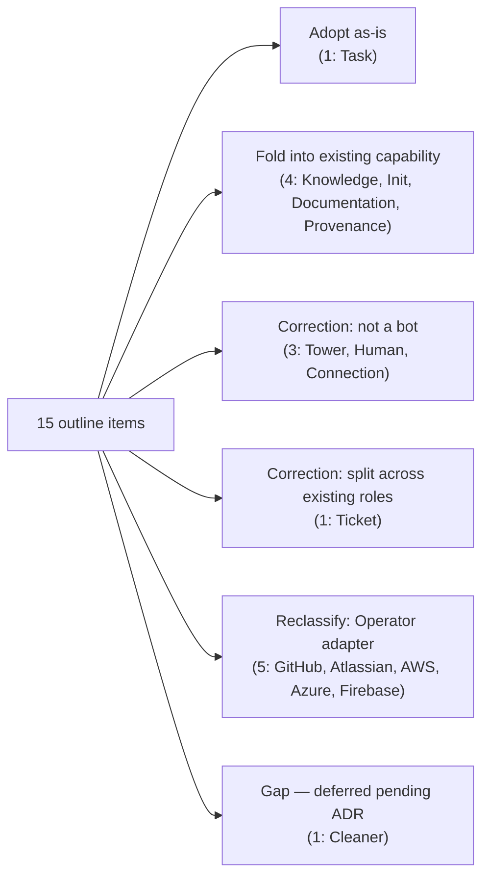

# AEGIS-RP-008 — Micro-Bot Launch Roster
## Reconciling the Outline Micro-Bot Architecture Against Canonical Taxonomy; Initial Launch List

- **Document ID:** AEGIS-RP-008
- **Status:** DRAFT v0 — research output, pending operator review
- **Date:** 2026-09-12
- **Author:** Oz (Agent), commissioned by Raymond Bayly (BaylyAI)
- **Companion to:** AEGIS-REQ-BOT-001 (taxonomy/anatomy), AEGIS-REQ-CORE-001 §5 (bot integration), AEGIS-ARCH-001 §4 (bot family diagram), AEGIS-RP-007 (validator roster + naming note), `01-Invocation-Inventory-Top30-2026-09-11.md` (usage evidence), `images/03-outline-micro-bot-architecture.png` (source outline reconciled here)
- **Amended by:** AEGIS-RP-009 / AEGIS-TS-002 (2026-09-13): the Validator-Bot roster gains `val-completeness-Bot` (P2, TS-002 §9.1) — the canonical roster is now **26** bots; see AEGIS-CANON-001 §6.
- **Scope rule:** research and roster/sequencing design only. No implementation authorized.

RFC 2119 keywords apply. Requirements in this paper use prefix `AEG-MBL-###` (Micro-Bot Launch).

---

## 0. Purpose

The submitted outline (`images/03-outline-micro-bot-architecture.png`) proposes fifteen "services" as the Micro-Bot roster: Knowledge, Cleaner, Tower, Init, Human, Connection, Documentation, Ticket, GitHub, Atlassian, AWS, Azure, Firebase, Provenance, Task.

That list predates the ratified taxonomy. AEGIS-REQ-BOT-001 subsequently fixed **three canonical families with enumerated rosters**, and AEGIS-RP-007 added the **only sanctioned extension** (a Proctor-owned Validator-Bot roster, deliberately kept out of a fourth family — RP-007 §1.3). This paper does two things:

1. **Reconciles** every outline item against that ratified structure (§3) — adopting, correcting, reclassifying, or deferring each one, the same way BOT-001 §9 and RP-007 §11 logged Infra-adoption decisions.
2. **Produces the initial launch roster** (§4) in the same table shape as the Micro-Linter catalog (`aegis-rp-007` §4.1): **Group · Name · What it does · Drift it stops** — with a **Launch** column added, since this is a phased launch list rather than an always-on set.

**One-line definition**

> The Micro-Bot launch roster is the canonical registry's 26 bots, sequenced into launch phases, plus an explicit reconciliation of every outline-proposed item that is *not* one of those 26 — so the launch list reflects doctrine, not the raw outline.

---

## 1. Inputs

| Input | What it fixes |
|---|---|
| AEGIS-REQ-BOT-001 §2 (`AEG-BOT-TAX-001..006`) | Three canonical families, each with an enumerated, fixed roster |
| AEGIS-REQ-CORE-001 §5 (`AEG-REQ-BOT-001..010`) | Restates rosters at platform level; seven-block anatomy; default command contract |
| AEGIS-ARCH-001 §4 | Visual roster (Orchestration / Hierarchy / Observation) + "Tower is not a bot" |
| AEGIS-RP-007 §1.3, §5 | Validator-Bots as Orchestration-adjacent, Proctor-owned; naming note on `val-<x>-Bot` to avoid collisions |
| `aegis-ts-001` / `aegis-plan-002` / `aegis-plan-003` | Where validator phases and the remaining-validator placements are already scheduled; everything else here is this paper's own proposal |
| `01-Invocation-Inventory-Top30` | Real usage weighting for adapter/P0 sequencing (Jira/GitHub dominate history) |
| `images/03-outline-micro-bot-architecture.png` | The fifteen-item outline being reconciled |

---

## 2. Canonical constraints (recap, load-bearing for §3–§4)

1. **Exactly three families, each fixed.** Orchestration = {Proctor-Bot, Process-Bot, Operator-Bot}. Hierarchy = {Procedure, Strategy, Playbook, Runbook, Workflow, Checklist}-Bot. Observation = {Observation-Bot (parent), task-Bot, benchmark-Bot, success-rate-Bot, retry-Bot, token-Bot}. `[AEG-BOT-TAX-002..005]`
2. **One sanctioned extension.** Validator-Bots are Proctor-owned, `role=validator`, Orchestration-adjacent — not a fourth family, not Observation. `[RP-007 §1.3, AEG-VAL-003]`
3. **The Control Tower is never a bot.** It is the authenticated asynchronous platform-authority surface, not the terminus of every request. `[AEG-REQ-BOT-006, RP-010 §2]`
4. **Connections are brokered, never peer bots.** Only Operator-Bot holds connection-pool access; external systems register as connection-pool entries, not as independently manifested bots. `[AEG-BOT-TAX-003, AEG-BOT-ANA-006, AEG-BOT-SEC-002]`
5. **Knowledge query/push is a default command, not a bot.** Every bot implements `knowledge query|push` (`AEG-BOT-CMD-017`); this is chassis behavior, not a standalone "Knowledge Service."
6. **No silent roster expansion.** A new permanent member of a fixed family roster requires an ADR (canonical rule 1, "no secondary control surface without ADR"); this paper does not grant that authorization by itself.

---

## 3. Outline reconciliation log

Same pattern as the Infra adoption logs (`aegis-bot-taxonomy-requirements` §9, `aegis-rp-007` §11), applied to the outline image instead of Infra.

| # | Outline item | Disposition | Rationale |
|---|---|---|---|
| 1 | Knowledge Service | **Fold into existing capability** | `knowledge query\|push` is a default command on every bot (`AEG-BOT-CMD-017`); active-side validation is `val-knowledge-Bot`. No new peer bot. |
| 2 | Cleaner Service | **Gap — deferred pending ADR** | No canonical owner for `.aegis/state/` retention/purge (run dirs, spool quota, expired drafts). Candidate homes: a Process-Bot subcommand, or a new Proctor-owned maintenance-Bot justified the same way RP-007 justified Validator-Bots. Not decided here. |
| 3 | Tower Service | **Correction — not a bot** | Control Tower is the authenticated platform authority, explicitly excluded from the bot roster and not a universal terminal hop. `[AEG-REQ-BOT-006, RP-010 §2]` Reached directly via authenticated `aegis tower …` commands. |
| 4 | Init Service | **Fold into existing capability** | `aegis repo init\|validate` (UPL bootstrap) is a Process-Bot-mediated CLI capability, not a standalone bot. |
| 5 | Human Service | **Correction — not a bot** | Maps to the Human operator actor/persona (`AEGIS-REQ-CORE-001` §2); authority-bearing actions require Tower-issued short-lived human tokens, while TTY is a UX hint only (`AEG-THR-002`). |
| 6 | Connection Service | **Correction — is Operator-Bot** | This is Operator-Bot's defining responsibility (`AEG-BOT-TAX-003`), not a separate bot. |
| 7 | Documentation Service | **Fold into existing capability** | Link/metadata integrity already owned by `val-hierarchy-Bot` (chain/link sync) and `val-knowledge-Bot` (mandatory metadata). No new bot justified yet. |
| 8 | Ticket Service | **Correction — split across existing roles** | Active side is Operator-Bot's ticketing adapters (`AEG-REQ-TKT-003`); validation side is `val-ticket-Bot`. Not a new peer bot. |
| 9 | GitHub Service | **Reclassify — Operator adapter** | Operator-brokered connection-pool entry, not a bot. See §5. |
| 10 | Atlassian Service | **Reclassify — Operator adapter** | Same as above. See §5. |
| 11 | AWS Service | **Reclassify — Operator adapter** | Same as above. See §5. |
| 12 | Azure Service | **Reclassify — Operator adapter** | Same as above. See §5. |
| 13 | Firebase Service | **Reclassify — Operator adapter** | Same as above. See §5. |
| 14 | Provenance Service | **Fold into existing capability / open question** | Signature/digest/CRL checks are Proctor registration-time enforcement (`AEG-REQ-MAN-005/006`) plus `val-registry-Bot` digest-freshness checks. Split into a dedicated validator only if evidence later shows `val-registry-Bot` is overloaded (§7). |
| 15 | Task Service | **Adopt as-is** | Maps directly onto `task-Bot`, Observation family. `[AEG-REQ-BOT-005]` |

Net result: **0 of the 15 outline items becomes a new bot.** One (Task) already existed in the canonical roster; five are corrected to "not a bot"; five are reclassified as Operator adapters; three fold into existing capabilities; one (Cleaner) is a genuine, unresolved gap.

---

## 4. Micro-Bot launch roster (v1)

Twenty-six canonical bots, grouped by roster group, in the same column shape as the Micro-Linter catalog plus a **Launch** column.

**Phase sourcing legend:** *Sourced* = placement is fixed by `aegis-ts-001`/`aegis-ts-002` or `aegis-plan-002`/`aegis-plan-003`; *Proposed* = this paper's own recommended sequencing where no approved roadmap covers base-chassis rollout.

### 4.1 Orchestration — core roster (fixed, `AEG-REQ-BOT-003`) — *Proposed*

| Group | Micro-Bot | What it does | Drift it stops | Launch |
|---|---|---|---|---|
| Orchestration · Core | `proctor-Bot` | Contract validation, capability routing, gate evaluation (HELLO/OFFER/BIND/VERIFY) | Ungated dispatch; bots addressed by name instead of capability | P0 |
| Orchestration · Core | `process-Bot` | Run lifecycle, hierarchy-chain attachment, step-boundary orchestration | Work with no attached hierarchy chain or run record | P0 |
| Orchestration · Core | `operator-Bot` | Exclusive external-connection broker; session-pool management | Worker bots holding credentials or linking provider SDKs directly | P0 |

### 4.2 Orchestration-adjacent — Validator-Bot roster (Proctor-owned, `RP-007 §5`)

Named per RP-007's own collision-avoidance note: `val-<x>-Bot` short form, since plane-facing capabilities of the same root name exist (e.g. knowledge, ticket). `[AEG-MBL-006]`

| Group | Micro-Bot | What it does | Drift it stops | Launch |
|---|---|---|---|---|
| Validation · Proctor-owned | `val-diff-Bot` | Computes change set; maps to linter scope; flags unscoped writes | Whole-repo lint cost on a one-file change; writes outside declared scope | P0 mechanism (gitutil/runner) → *Sourced*; P1 capability wrapper → *Sourced* |
| Validation · Proctor-owned | `val-contract-Bot` | Args/output schema checks; claim-tier sufficiency; stream-discipline sampling | Non-canonical exits; stdout/stderr pollution; under-tier claims | Spans P0 envelope → P2 claim engine — *Sourced* (mechanism only; not wrapped as a named capability in P0–P2) |
| Validation · Proctor-owned | `val-assumption-Bot` | Ledger CRUD, TTL tracking, recheck scheduling, human-only waive | Undeclared load-bearing assumptions acted on as fact | P1 — *Sourced* (`aegis-plan-002` CVS-P1-E2) |
| Validation · Proctor-owned | `val-registry-Bot` | Port ownership, bot routability, digest freshness (read-only over MBI) | Invented ports/names; stale or tampered manifests still routed | P1 minimal (`port_owns@1` only) — *Sourced*; full scope — *unscheduled* |
| Validation · Proctor-owned | `val-ticket-Bot` | Mid-run re-check of no-ticket / epic / estimation / PR-bind / deploy prechecks | Ticket losing its epic mid-run without breaking dependent claims | With WS5 Ticketing after the Jira adapter — *Sourced* (`aegis-plan-003` §2) |
| Validation · Proctor-owned | `val-hierarchy-Bot` | Chain completeness; checklist↔runbook sync; stale chain digest | Orphaned checklists; broken runbook/workflow/checklist links | With AOG P3 graph validation — *Sourced* (`aegis-plan-003` §2) |
| Validation · Proctor-owned | `val-knowledge-Bot` | Draft/verified honesty; TTL flags; redaction preflight | Secrets/PII reaching a knowledge microburst | With WS6 Knowledge — *Sourced* (`aegis-plan-003` §2) |
| Validation · Proctor-owned | `val-claim-Bot` | Maps claim type → required suite tier; verifies evidence exists | `pr.ready`-class claims asserted after only L1 (`CLAIM_TIER_INSUFFICIENT`) | P2 — *Sourced* (`aegis-plan-002` CVS-P2-E2) |
| Validation · Proctor-owned | `val-drift-Bot` | Repo layout drift; Makefile façade violations; legacy path usage | Parallel control plane growing in `bin/` unnoticed | After M-A dogfood begins — *Sourced* (`aegis-plan-003` §2) |
| Validation · Proctor-owned | `val-evidence-Bot` | Attests cited commands actually ran (exit codes, report digests in ledger) | Completion narrative with no recorded command evidence | P2 — *Sourced* (`aegis-plan-002` CVS-P2-E1) |
| Validation · Proctor-owned | `val-completeness-Bot` | Reconciles graph-derived required units against the authoritative run/evidence ledgers with telemetry correlation at finalize | Mandatory nodes or suites omitted from a conducted run | AOG P2 — *Sourced* (`aegis-plan-003` AOG-P2-E1; TS-002 §9.1) |

### 4.3 Information Hierarchy — six-tier chassis (fixed, `AEG-BOT-TAX-004`) — *Proposed*

| Group | Micro-Bot | What it does | Drift it stops | Launch |
|---|---|---|---|---|
| Hierarchy · Chassis | `procedure-Bot` | Roots a unit of work in a stated business problem + required outcome | Work starting mid-stack with no procedure of record | P0 (stub — only the DVO chain needs to resolve end to end) |
| Hierarchy · Chassis | `runbook-Bot` | Resolves the concrete task set that is the execution entry point | Runbooks used as read-only catalog instead of an execution entry | P0 |
| Hierarchy · Chassis | `workflow-Bot` | Resolves scripts/tools that progress a runbook to completion | Workflows run detached from their owning runbook | P0 |
| Hierarchy · Chassis | `checklist-Bot` | Tracks step completion until the runbook succeeds | "Done" claimed with no step-level completion record | P0 |
| Hierarchy · Chassis | `strategy-Bot` | Resolves direction options under a procedure (one procedure, many strategies) | Implicit strategy choices agents invent mid-run | P1 |
| Hierarchy · Chassis | `playbook-Bot` | Resolves guidelines implementing a chosen strategy | Guidelines applied ad hoc, untraceable to a strategy | P1 |

P0 deliberately covers only the chain already observed live in production evidence — Playbook→Runbook→Checklist / Workflow for the DVO deploy path (`01-Invocation-Inventory-Top30` §"Observed hierarchy chain") — plus a `procedure-Bot` stub so no chain is rootless. Strategy/Playbook get full treatment in P1.

### 4.4 Observation — parent + children (fixed, `AEG-BOT-TAX-005`) — *Proposed*

| Group | Micro-Bot | What it does | Drift it stops | Launch |
|---|---|---|---|---|
| Observation · Core | `observation-Bot` | Resident spool drain; fans telemetry out to children; rolls up to Tower | Telemetry that never leaves the local spool | P1 |
| Observation · Child | `task-Bot` | Per-run task-lifecycle accounting from the spool | Runs with no task-level record | P1 |
| Observation · Child | `retry-Bot` | Records retry counts/outcomes per run | Silent retry beyond the 5-attempt cap | P1 (`AEG-BOT-RUN-004`) |
| Observation · Child | `benchmark-Bot` | Measures suite/run latency against tier budgets | Budget breaches (L0–L4) that stay invisible | P2 |
| Observation · Child | `success-rate-Bot` | Tracks pass/fail rates by class and capability | No quality-trend signal for drift over time | P2 |
| Observation · Child | `token-Bot` | Per-run token/cost accounting | Unbounded agent spend with no ledger | P2 |

---

## 5. Operator connection adapters (non-bot, phased)

Per §2 rule 4 and reconciliation rows 9–13, these are **connection-pool entries under `operator-Bot`**, not bots. Listed separately, in the same table shape, so the distinction is explicit rather than implied.

| Group | Adapter (not a bot) | What it does | Drift it stops | Launch |
|---|---|---|---|---|
| Operator · Adapter | `connections.atlassian.*` | Brokered session for Jira ticket operations | Ambient Jira tokens in agent/bot config | P1 — highest human-history usage (`01-Invocation-Inventory` #3, #18–21) |
| Operator · Adapter | `connections.github.*` | Brokered session for repo/PR/issue operations | Worker bots linking a GitHub SDK/token directly | P1 — required by PR/branch flows in the same inventory |
| Operator · Adapter | `connections.aws.*` | Brokered session for AWS API operations | Long-lived AWS keys held outside Operator-Bot | P2 |
| Operator · Adapter | `connections.azure.*` | Brokered session for Azure API operations | Long-lived Azure credentials held outside Operator-Bot | P2 |
| Operator · Adapter | `connections.firebase.*` | Brokered session for Firebase operations | Firebase service-account keys held outside Operator-Bot | P2 |

---

## 6. Recommended P0 launch slice

The minimum dispatchable set — every "what it does" cell in this slice is satisfiable using only other P0 rows (`AEG-MBL-005`).

| # | Unit | Why first |
|---|---|---|
| 1 | `proctor-Bot` | Every other bot is unreachable without routing/gates |
| 2 | `process-Bot` | Run lifecycle + hierarchy attachment |
| 3 | `operator-Bot` | Connection exclusivity; unblocks the Jira/GitHub paths that dominate real usage |
| 4 | `procedure-Bot` (stub), `runbook-Bot`, `workflow-Bot`, `checklist-Bot` | Only chain with live evidence today is the DVO deploy path; a procedure stub keeps it non-rootless |
| 5 | `val-diff-Bot`, `val-contract-Bot` (mechanism only) | CVS P0 change-time path (`aegis-ts-001` §5, §9) |
| 6 | UPL init/validate capability (Process-Bot-mediated, §3 row 4) | Universal Project Layout is a precondition for every other bot's `.aegis/` state |
| 7 | Registration-time provenance checks (Proctor + `val-registry-Bot` minimal, §3 row 14) | Refuse-never-guess at registration |

**Explicitly deferred from P0:** `strategy-Bot`/`playbook-Bot`, full Observation family, all validators beyond diff/contract mechanism, all Operator adapters, and every item in §3 marked "deferred" or "unscheduled."

---

## 7. Decisions and open questions

1. **Cleaner/maintenance ownership** (§3 row 2). Does `.aegis/state/` retention become a `process-Bot` subcommand, or a new Proctor-owned maintenance-Bot roster member (RP-007-style justification)? Lean: subcommand first; promote to a roster member only if it needs its own failure domain. Not decided here.
2. **Provenance split** (§3 row 14). Does signature/CRL verification stay folded into Proctor + `val-registry-Bot`, or earn a dedicated `val-provenance-Bot`? Lean: keep folded until `val-registry-Bot` shows scope strain.
3. **Remaining-validator placement — resolved by approved PLAN-003 §2.** `val-ticket-Bot` lands with WS5 Ticketing, `val-hierarchy-Bot` with AOG P3, `val-knowledge-Bot` with WS6 Knowledge, and `val-drift-Bot` after M-A dogfood begins. Their detailed tickets remain to be cut; this roster does not invent earlier phases.
4. **Documentation coverage** (§3 row 7). Confirm `val-hierarchy-Bot` + `val-knowledge-Bot` are sufficient, or whether a documentation-specific check class is missing once P2 validators actually ship.
5. **Adapter cardinality.** One Operator connection-pool entry per provider (as listed in §5) vs. grouping by protocol family — deferred to whoever implements Operator-Bot's pool schema.

---

## 8. Requirements (normative extract)

### AEG-MBL-001 — Launch list reconciled, not copied
Any bot proposed for launch MUST be classified into exactly one of the three canonical families or the Proctor-owned Validator-Bot roster before it is scheduled.
**AC:** No roster row omits a Group/family column; the reconciliation log (§3) accounts for every outline-proposed item.

### AEG-MBL-002 — No silent roster expansion
Extending a fixed family roster beyond BOT-001's enumerated members requires a follow-on ADR; this paper MUST NOT be cited as sole authorization.
**AC:** §7 lists every roster-expansion candidate as undecided, not adopted.

### AEG-MBL-003 — Adapters are never bots
External-system integrations MUST register as Operator-Bot connection-pool entries, never as independently manifested bots.
**AC:** MBI shows zero entries with a `family` field for adapter names; they appear only under Operator-Bot's connection registry.

### AEG-MBL-004 — Phase sourcing is honest
Where an implementation phase is already fixed by `aegis-ts-001`/`aegis-plan-002`, this paper MUST cite it; where none exists, the row MUST be marked "unscheduled" or "proposed," never given an invented number.
**AC:** every validator row's Launch column names its source or states it is proposed by this paper.

### AEG-MBL-005 — P0 slice is independently launchable
The recommended P0 slice (§6) MUST be dispatchable without any bot outside that slice existing yet.
**AC:** no P0 row's "what it does" depends on a P1/P2/P3-only capability.

### AEG-MBL-006 — Naming avoids validator/plane collision
Validator-Bot names MUST use the `val-<x>-Bot` short form wherever a plane-facing capability of the same root name exists.
**AC:** `val-knowledge-Bot` and `val-ticket-Bot` are never referred to as bare `knowledge-Bot`/`ticket-Bot` in CLI help or MBI listings.

---

## 9. Traceability

| This paper | Folds into / extends |
|---|---|
| §2 canonical constraints | BOT-001 §2 (`AEG-BOT-TAX-001..006`); CORE-001 §5 |
| §3 reconciliation log | `images/03-outline-micro-bot-architecture.png` — corrects/supersedes the raw outline as a roster source |
| §4 launch roster | BOT-001 §2 rosters; RP-007 §5 validator roster; `aegis-plan-002` §4 for sourced phases |
| §5 adapters | CORE-001 §9 (`AEG-REQ-TKT-003`); `AEG-BOT-ANA-006`; `01-Invocation-Inventory-Top30` §"Implications" |
| §6 P0 slice | RP-007 §12 phased-delivery pattern, applied to the base bot chassis |
| §8 requirements | New prefix `AEG-MBL-001..006` |

---

## 10. Acceptance criteria for promoting this paper

Operator review signs off when:

1. The reconciliation log (§3) is accepted as authoritative for all fifteen outline items — none remains ambiguous.
2. The 26-bot canonical roster (§4) is accepted as v1 launch scope; no row conflicts with CANON-001 §6 or BOT-001's fixed family membership.
3. Validator phase citations (§4.2) are verified against `aegis-plan-002`, `aegis-plan-003`, `aegis-ts-001`, and `aegis-ts-002`; any still-unscheduled scope is explicit rather than silently dropped.
4. §7's unresolved questions (cleaner/maintenance gap, provenance split, documentation coverage, adapter cardinality) are accepted as follow-on decisions rather than resolved by this paper; PLAN-003's validator placements are acknowledged.
5. §6's P0 slice is accepted as the first dispatchable ticket set.
6. `INDEX.md` lists this paper.

---

*Research output only. No implementation authorized. Amend before promotion to verified.*
