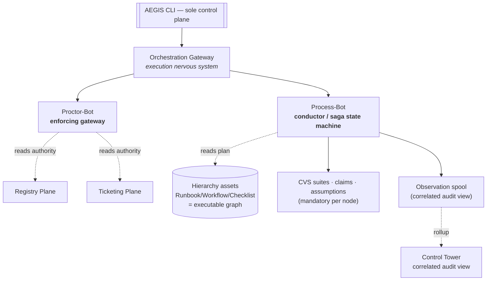
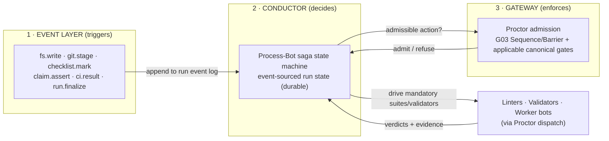
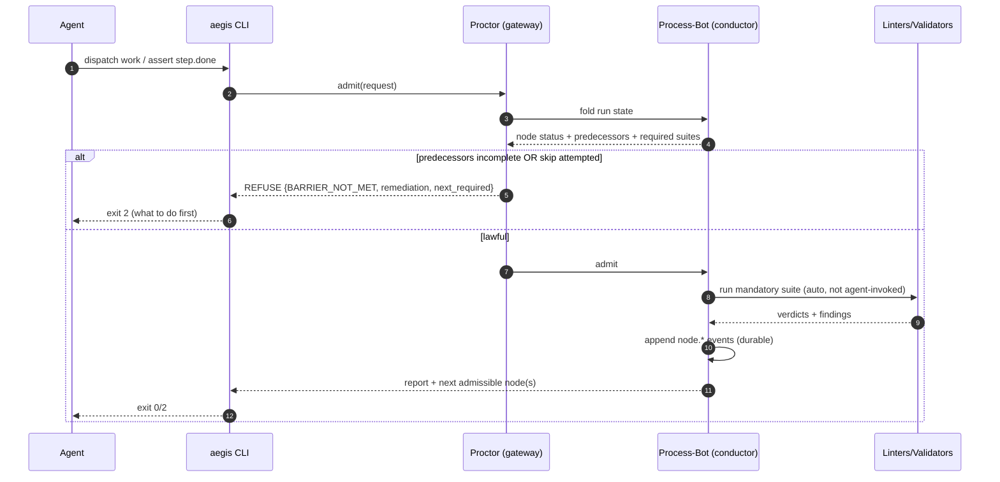
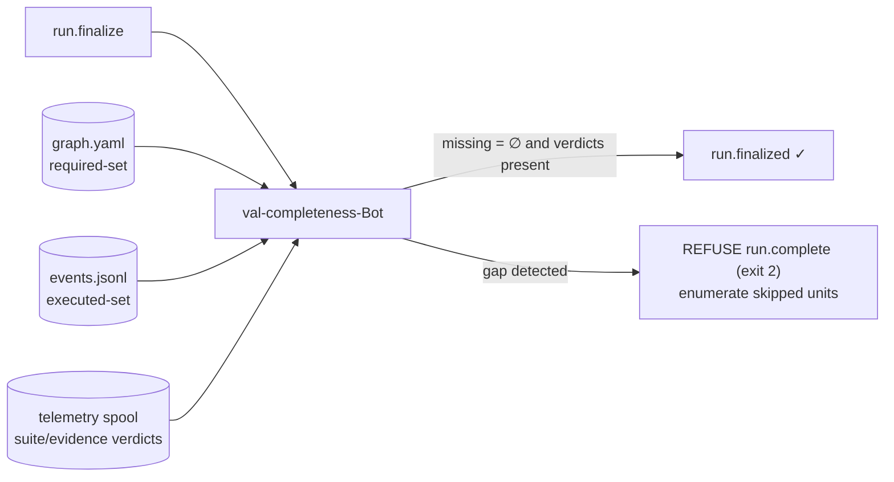

# AEGIS-RP-009 — Orchestration Gateway
## Event-Driven, System-Native Enforcement of Mandatory Bot & Linter Execution

- **Document ID:** AEGIS-RP-009
- **Status:** DRAFT v0 — research/design output, pending operator review
- **Date:** 2026-09-12
- **Author:** Oz (Agent), commissioned by Raymond Bayly (BaylyAI)
- **Companion to:** AEGIS-REQ-CORE-001 (PLAT/CLI/BOT/TEL/SEC + §14 gates), AEGIS-REQ-BOT-001 (taxonomy/anatomy), AEGIS-ARCH-001 (§4 families, §5 lifecycle, §15 gates), AEGIS-RP-007 (Continuous Validation System), AEGIS-TS-001 (CVS implementation), AEGIS-RP-008 (launch roster), AEGIS-ADR-002 (coordination-model decision record — the *why* behind this design)
- **Supersedes / extends:** RP-007 §6.1 (agent-driven validation contract → system-driven); elevates `AEG-VAL-015` (runbook-declared validation) from *opt-in / P4* to a **mandatory default**
- **Scope rule:** research and design only. No implementation authorized by this document.

RFC 2119 keywords apply. Requirements in this paper use prefix `AEG-GW-###` (Gateway).

---

## 0. Problem statement & design goal

### 0.1 The gap

AEGIS already has a superb *detection* fabric (RP-007 CVS) and a *guard* fabric (CORE §14, ten mechanical gates). What it does **not** have is a **conductor**: a system-native owner of control flow that guarantees, for any unit of work, that the full required set of bots, linters, and validators executes — in order, with no skips — regardless of what the agent chooses to do.

Two doctrine statements expose the gap:

- **RP-007 §6.1** makes validation the *agent's* responsibility ("Agents MUST … run `aegis validate change` … run `aegis validate claim` …"). This is **voluntary compliance**.
- **ARCH-001 §15**: "the gate applies only when its precondition is present." Gates are **reactive guards** (refuse *if* reached), not a **proactive conductor** (guarantee the sequence runs).

Result: an agent that reorders its work, never reaches a boundary, or simply forgets a step, silently skips mandatory execution. Control-flow authority lives in the agent. This paper moves it into the system.

### 0.2 Design goal

Define the **Orchestration Gateway (AOG)**: an **event-triggered, orchestration-executed, gate-enforced** execution layer that:

- treats the plan (which bots/linters/validators run, and in what order) as **data**, resolved by the system — never as agent intent;
- makes the agent a **worker that fills step content**, never the orchestrator;
- guarantees **mandatory execution** (no omission, no order violation, no false completion) mechanically within the RP-013 cooperative-but-fallible trust model;
- is **event-driven** (events *trigger* the conductor) without introducing a second control plane or a machine-tier event bus (honors `AEG-REQ-PLAT-001`, `RP-003`);
- reuses existing AEGIS components (Proctor, Process-Bot, hierarchy assets, CVS suites/claims/assumptions, spool-and-drain telemetry, Checklist, Tower) rather than inventing parallel machinery.

**One-line definition**

> The Orchestration Gateway is the **execution nervous system**: events wake a durable **conductor** (Process-Bot saga state machine) that drives a **declarative process graph**; every dispatch and every step transition passes through an **enforcing gateway** (Proctor) that refuses any action which would skip, reorder, or falsely complete mandatory bot/linter execution.

---

## 1. Placement in the architecture

### 1.1 Not a fourth authority plane

Registry / Knowledge / Ticketing remain the only source-of-truth planes (`AEG-REQ-PLAT-003`). The AOG is an **execution and enforcement layer** *over* the existing Orchestration family — it owns no authoritative work/knowledge/registry state. This mirrors RP-007's careful placement of the Validation Fabric as an enforcement fabric, not a plane.



### 1.2 Where it sits in request-class routing

There is no universal linear request order. Bot dispatch enters through `CLI → Proctor`; conducted runs then use Process, third-party effects branch through Operator, and Tower reconciliation/query is a separate authenticated CLI-to-platform-authority path (RP-010 §2). The AOG **thickens two existing nodes**:

- **Proctor-Bot** gains an *orchestration-aware admission* role: on every dispatch it consults live run state and refuses skip/out-of-order actions through the **Sequence/Barrier Gate (G03)** in CANON-001's fifteen-gate registry.
- **Process-Bot** becomes a **durable, event-sourced saga state machine** — the intent already recorded in CORE §12 ("Orchestration lifecycle, persisted state → feeds Process-Bot state machine").

### 1.3 Relationship to prior decisions (consistency ledger)

| Prior decision | AOG stance |
|---|---|
| `PLAT-001` single control plane, no secondary surface | AOG adds **no** new control surface; reached via `aegis process`/`aegis proctor`. Events enter through CLI-mediated hooks/façades only. |
| `RP-003` event bus rejected at machine tier | AOG uses an **event-sourced run log** (append-only JSONL) drained by the conductor — spool-and-drain discipline, **not** a broker/pub-sub bus. |
| `BOT-TAX-006` bots never invoked directly; all traffic via Proctor | AOG **strengthens** this: Proctor is now the mandatory *orchestration* chokepoint, not just a router. |
| `AEG-VAL-015` runbook-declared validation (MAY, P4) | **Elevated** to mandatory default: every node carries default suites; Process-Bot enforces at every boundary. |
| RP-007 §1.3 validators are Proctor-owned, `role=validator` | The new `val-completeness-Bot` (reconciler) is placed there — no new family. |
| TS-001 §2.1 no daemon in P0–P2 | AOG runs as **short-lived CLI invocations over durable state** by default; a resident conductor is an optional P4 optimization with identical semantics. |

---

## 2. Core model: event-triggered orchestration (three layers)

The AOG has three cleanly separated layers. The discriminating principle: **events trigger, the conductor decides, the gateway enforces.**



### 2.1 Why not choreography (recap, load-bearing)

Pure event-driven **choreography** (bots reacting to each other's events with no central authority) is rejected as the *authority* model — it cannot guarantee no-skip (completeness is emergent, not provable), and it would require both a machine-tier bus (contra `RP-003`) and a secondary control surface (contra `PLAT-001`). Events are adopted as **triggers**; a central conductor is adopted as the **authority**. (Full options analysis in **AEGIS-ADR-002 §3**; summarized here for self-containment.)

### 2.2 The two things the gateway guards

Every action the gateway admits is one of exactly two classes; nothing else may mutate a run:

| Class | Examples | Guarded by |
|---|---|---|
| **Work dispatch** | edit-batch validation, worker-bot capability, Operator brokered call | Must map to an *active, admissible* node; predecessors complete; entry suites green |
| **State transition** | `node.enter`, `node.complete`, `gateway.branch.select`, `run.finalize` | Only Process-Bot may emit; each requires its transition predicate to hold |

---

## 3. Event model

### 3.1 Trigger taxonomy

The AOG adopts RP-007 §3.1 triggers verbatim and adds orchestration-level triggers. Each trigger is an **input** that may cause the conductor to compute a next action; it is never itself an authoritative decision.

| Trigger | Source | Conductor reaction |
|---|---|---|
| `run.open` | `aegis process run open` / façade | Instantiate run from graph; mark entry nodes admissible |
| `fs.write` / `git.stage` | CLI hook, `validate watch` | Bind to active node; run node's `on_change` suite (L0/L1) |
| `claim.step.done` | agent / `aegis process node complete` | Evaluate node exit criteria (suites + evidence + assumptions) |
| `gateway.event.*` | external (e.g. `ci.passed`, `ci.failed`), timer | Resolve an **event-based gateway** node branch (§6.2) |
| `assumption.tick` | interval / watch | Re-check held assumptions for the run |
| `run.finalize` | `aegis process run finalize` / delivery façade | Invoke completeness reconciler (§7.4) |
| `dispatch.request` | any capability call via Proctor | Admission decision (§4.3) |

### 3.2 Event intake — event-sourced, no bus

Triggers append to a **run-scoped, append-only event log** (`TS-D-003` pattern, reused):

```text
<project>/.aegis/state/runs/<run_id>/
  run.json            # header: graph_ref, ticket_ref, hierarchy_chain, started_at
  events.jsonl        # ordered event log (run state = fold of events)  ← NEW
  assumptions.jsonl   # RP-007 §8 (unchanged)
  evidence.jsonl      # TS-001 §10 (unchanged)
  findings.jsonl      # RP-007 §2.2 (unchanged)
```

- **No pub/sub, no broker.** Triggers are CLI-mediated appends; the conductor folds the log to obtain current state. This is spool-and-drain applied to control flow (`AEG-REQ-TEL-001` discipline).
- **At-least-once + idempotent** (`AEG-REQ-TEL-003`): every event carries `event_id` (UUIDv7); folds dedupe on it. Torn trailing lines are tolerated (fold ignores + warns), exactly as TS-001 §8.2 specifies for the assumption ledger.
- **Two execution modes, identical semantics** (because state is durable):
  - *Invocation mode* (default, P0–P3): each trigger is a short-lived CLI call that folds → decides → enforces → appends. No daemon (honors TS-001 §2.1).
  - *Resident mode* (P4 opt-in): a drain loop (`aegis process conduct --run <id>`) tails the log; `drain|stop` supported like Observation-Bot.

### 3.3 Run event envelope (normative)

Extends the CORE §10.1 event envelope with an orchestration payload:

```json
{
  "event_id": "01a0d1aa-…-uuidv7",
  "schema_version": "1.0.0",
  "event": "node.completed",
  "occurred_at": "2026-09-12T12:40:00.101Z",
  "emitter": { "name": "process-Bot", "family": "orchestration", "manifest_digest": "sha256:…" },
  "run": {
    "run_id": "…",
    "graph_ref": "runbook:dvo-deploy-ticket@3#graph",
    "hierarchy_chain": "procedure:…/…/checklist:…",
    "ticket_ref": "AMD-1234"
  },
  "orchestration": {
    "node_id": "validate.change",
    "from_status": "active",
    "to_status": "completed",
    "required_suites": ["suite.change.default"],
    "suite_verdicts": [{ "suite": "suite.change.default", "verdict": "pass", "tier": "L2" }],
    "evidence_refs": ["evidence:…"],
    "actor": { "kind": "system" }
  }
}
```

---

## 4. The Gateway (Proctor as enforcing policy gateway)

### 4.1 Principle

Proctor is *already* the single mandatory chokepoint for all bot-to-bot traffic (`BOT-TAX-006`). The AOG makes it **orchestration-aware**: before admitting any action it folds the run event log and evaluates whether the action is *lawful given the plan and current state*. Within RP-013's cooperative-but-fallible interface model, this makes skipping structurally impossible rather than merely discouraged; it is not a prevention claim against arbitrary local file writes.

### 4.2 The Sequence/Barrier Gate (G03 in the 15-gate registry)

Registered as G03 in CANON-001 §2; CORE §14 points to that authoritative registry:

| Gate | Refuses when | Bot | Exit |
|---|---|---|---|
| **Sequence/Barrier Gate** | Action targets a node whose predecessors are not `completed`, or advances past a phase barrier with mandatory nodes still open, or dispatches work not bound to an active admissible node | Proctor | 2 |

It composes with the other applicable canonical gates. Order: provenance/contract first (is the caller legitimate?), then Sequence/Barrier (is this action lawful *now*?), then the domain gates; change-time, build-time, and promotion gates fire at their registry-defined triggers.

### 4.3 Admission decision algorithm

```text
admit(request{capability C, args, run_id, node_id N}) -> Verdict:
  state := fold(events.jsonl)                       # durable run state
  1. run gates: Provenance, Contract               # existing; refuse → structured envelope
  2. classify C:
       work-dispatch  → require N is ACTIVE and ADMISSIBLE in state
       transition     → require emitter == process-Bot and predicate(N) holds
     else → refuse SEQUENCE_VIOLATION (exit 2)
  3. predecessors(N) all COMPLETED?                 # DAG edges from graph
       no → refuse BARRIER_NOT_MET (exit 2, lists blocking predecessors)
  4. mandatory ENTRY suites for N have passing verdict in this run?
       no → run them now (conductor) ; still failing → refuse CHANGE_VALIDATION (exit 2)
  5. run applicable domain gates (No-Ticket, Dev-Only, Deploy-Ticket, …)
  6. admit: emit node.entered / allow dispatch ; else refuse with remediation
```

Every refusal is the CORE-standard envelope `{code, message, remediation, provenance, ttl}` and enumerates *exactly what must happen first* — so the agent is steered, not merely blocked.



---

## 5. The Conductor (Process-Bot saga state machine)

### 5.1 Event-sourced run state

Run state is the **fold** of `events.jsonl` (no separate mutable store — "status-on-record, queue-as-view", `AEG-REQ-KNO-007` doctrine applied to runs). This is crash-safe and auditable, identical to the assumption ledger (`TS-D-003`).

### 5.2 Node lifecycle

```mermaid
stateDiagram-v2
  [*] --> pending
  pending --> admissible: predecessors completed
  admissible --> active: node.entered (gateway-admitted)
  active --> awaiting_evidence: claim.step.done
  awaiting_evidence --> active: exit criteria unmet (refused)
  awaiting_evidence --> completed: suites pass + evidence + assumptions held
  active --> blocked: dependency unhealthy / broken assumption
  blocked --> active: remediated
  admissible --> skipped: XOR branch not selected OR optional:true
  completed --> [*]
  note right of skipped: the ONLY lawful non-execution;<br/>recorded explicitly, never silent
  note right of awaiting_evidence: agent "done" is a REQUEST,<br/>evaluated here — never a declaration
```



`skipped` is the single lawful way a node does not execute, and it is **explicit and recorded** — a node is skippable only if the graph marks it `optional: true` or it sits on an unselected XOR branch (§6.2). Everything else is mandatory.

### 5.3 Transition rules (normative core)

- **Only Process-Bot** may append `node.*` / `run.*` transition events. Agents and worker bots cannot advance state (they emit *requests*, e.g. `claim.step.done`).
- `node.completed` requires, atomically: all mandatory exit suites `pass` at the node's required tier **and** `val-evidence-Bot` confirms required command evidence **and** no `broken|expired` assumptions bound to the node.
- On `node.completed`, the conductor recomputes admissibility of successors per gateway node type (§6.2).
- `run.finalize` is refused unless the completeness reconciler passes (§7.4).

### 5.4 Idempotency & crash-safe resume

- A killed run **resumes from the folded state**: `aegis process run resume <id>` recomputes admissible nodes and continues. Incomplete nodes re-run; `completed` nodes do not.
- Node execution is keyed by `(run_id, node_id, attempt)`; external side-effects use Operator-Bot idempotency keys (ARCH-001 §17), so replay never double-commits.
- This makes **no-skip and crash-safety the same property**: durable state cannot "forget" a mandatory node.

---

## 6. Process definition — the executable graph

### 6.1 Graph model

The plan is a **DAG of nodes** layered onto the existing hierarchy assets (decision: extend Runbook/Workflow/Checklist rather than add a parallel plan layer — keeps the hierarchy chain the single source of the plan). A Runbook resolves to a graph; Workflow steps are task nodes; the Checklist is the completion ledger of those nodes.

### 6.2 Node types (BPMN-mapped gateways)

This is where the user's "event-driven gateway" maps precisely — as **branch primitives inside the graph**, not as the top-level model:

| Node type | Semantics | No-skip meaning |
|---|---|---|
| **task** | Unit of work; agent fills content; carries mandatory suites/validators + exit criteria | Must reach `completed` unless `optional` |
| **gateway.xor** (exclusive) | Select exactly one outgoing branch by condition | Unselected branches → `skipped` (lawful); selecting none → refusal |
| **gateway.and** (parallel fork/join) | Fork to all branches; **join requires all** | The join is a **barrier**: cannot pass until every parallel node `completed` |
| **gateway.event** (event-based) | Wait for one of N events (`ci.passed` \| `ci.failed` \| `timeout`) | Exactly one event resolves the branch; a `timeout` branch is mandatory so the run can never hang silently |

### 6.3 Node schema (`graph.yaml`, extends hierarchy assets)

```yaml
graph: runbook:dvo-deploy-ticket@3
nodes:
  - id: open.run
    type: task
    entry: true
    mandatory_suites: []
  - id: implement.change
    type: task
    requires: [open.run]
    on_change: suite.change.fast          # auto-run on fs.write/stage (L0/L1)
    mandatory_suites: [suite.change.default]
    exit:
      require_evidence: [lint]
      require_no_broken_assumptions: true
  - id: tests.gate
    type: gateway.event                    # event-based gateway
    requires: [implement.change]
    await:
      - on: ci.passed  -> ready.pr
      - on: ci.failed  -> implement.change # loop back (no skip: must re-satisfy)
      - on: timeout(PT30M) -> blocked.human
  - id: ready.pr
    type: task
    mandatory_claim: pr.ready              # binds claim→tier (AEG-VAL-006)
    exit:
      require_evidence: [tests, typecheck, lint]
  - id: deliver.pr
    type: task
    requires: [ready.pr]
    gates: [PR-Ticket-Bind, Estimation]    # existing §14 gates bound to node
```

- **`mandatory_suites` / `mandatory_claim`** cannot be waived except by a human presenting the Tower-issued short-lived identity token required by RP-013 `AEG-THR-002`; TTY inference is only a UX hint. Agent or unauthenticated waiver attempts refuse with exit 4.
- Absence of a suite binding does **not** mean "no validation" — the platform applies a **default profile** per node kind, and `ml-langpack-present` still forces language packs to exist (`AEG-VAL-010`).

### 6.4 Graph validation (build-time)

A new micro-linter `ml-graph-integrity` (native, L1) refuses a graph that: has an unreachable mandatory node, a cycle without an event-gateway loop guard, an event-gateway lacking a `timeout` branch, or a node whose `requires` names a non-existent node. This makes the plan itself subject to the immune system before it can drive a run.

---

## 7. Mandatory execution enforcement — the no-skip guarantee

> **Trust model (`AEG-THR-001`, added 2026-09-13):** the no-skip guarantee is provable against a *cooperative-but-fallible* agent (drift, reordering, overclaiming); a fully adversarial local process is addressed by detection + phased hardening per RP-013 §2/§4.1.

### 7.1 Three skip modes → three mechanisms

| Skip mode | Mechanism | Where |
|---|---|---|
| **Omission** (required unit never runs) | Declarative required-set resolved by conductor + finalize reconciler over run/evidence ledgers with telemetry correlation | §7.2, §7.4 |
| **Order violation** (runs before prerequisite) | Sequence/Barrier Gate on every dispatch; AND-join barriers | §4.2, §6.2 |
| **False completion** (claim done without running) | Evidence-gated `node.completed` (`val-evidence-Bot` + claim→tier) | §5.3, §7.5 |

### 7.2 Required-set derivation

`required(run) := { n ∈ graph.nodes : n.mandatory ∧ n reachable given selected branches }`. Computed by the **system** from the graph — never a list the agent maintains. XOR-unselected and `optional` nodes are excluded; AND-parallel nodes are all included.

### 7.3 Barrier / join semantics

- **Phase barrier:** the conductor groups nodes into phases (topological levels). Proctor refuses any node in phase *k+1* until every mandatory node in phase *k* is `completed`.
- **AND-join:** a `gateway.and` join node becomes admissible only when *all* inbound branches are `completed` — a true join, not a race.

### 7.4 Completeness reconciler (`val-completeness-Bot`)

At `run.finalize`, a Proctor-owned validator (RP-007 §5 roster placement) proves no mandatory unit was skipped:

```text
reconcile(run):
  required := required-set(graph, selected_branches)      # from the plan (data)
  executed := { n : node.completed ∈ events.jsonl }       # from the run event log
  missing  := required \ executed
  # correlate against the evidence ledger and telemetry view (TEL-007):
  for n in executed:
      assert every n.mandatory_suite has a passing validation.suite.end event
      assert every n.require_evidence class has an evidence record (exit 0)
  if missing ≠ ∅ OR any assertion fails:
      REFUSE run.complete (exit 2) ; enumerate gaps + remediation
  else: emit run.finalized
```

The append-only run ledger is authoritative for the executed set; evidence records and at-least-once, deduplicated telemetry provide correlated checks, while provider receipts/idempotency records establish third-party effects. Under RP-013's cooperative-but-fallible model this defeats a doctored narrative claim, but two agent-writable local files are not independent proof against an adversarial local process; hash-chain anchoring and Tower/CI attestation are phased hardening.



### 7.5 Evidence-gated completion

Unchanged from CVS but now *enforced by the conductor at every node* rather than only at façades: `node.completed` runs the mandatory exit suite and calls `val-evidence-Bot` (`validation.evidence.verify@1`). The agent's `claim.step.done` is a **request**; the verdict is the system's.

---

## 8. Linter orchestration specifics

Linters are the leaf executors; their orchestration concern is *automatic, mandatory invocation at the right tier* — not ordering (they are pure, independent, fanned out in parallel by the TS-001 §5.5 runner).

- **Automatic, not agent-invoked.** The conductor runs a node's `on_change` suite on `fs.write`/`git.stage` triggers and the `mandatory_suites` at node completion. The agent never has to remember to lint; the system lints on the event.
- **Tier escalation is enforced.** `mandatory_claim` binds claim→tier (`AEG-VAL-006`); claiming a higher node (e.g. `pr.ready`) after only L1 fails `CLAIM_TIER_INSUFFICIENT`. The gateway will not admit the transition.
- **Diff-scoped by default** (`AEG-VAL-007`): the runner scopes to `val-diff-Bot`'s change set — mandatory ≠ whole-repo cost.
- **Language packs are mandatory-present** (`ml-langpack-present`, `AEG-VAL-010`): a repo with code but no bound pack fails `suite.health.project` and the graph's entry node cannot complete.
- **Result cache** (TS-001 §5.5) keeps mandatory re-runs near-instant, so enforcement stays within tier budgets (`AEG-VAL-012`).

Net: a linter cannot be skipped because its invocation is a **system reaction to an event**, gated by a barrier, and re-proven by the finalize reconciler.

---

## 9. CLI surface

Additive to ADR-001; folds under existing `process` (conductor) and `proctor` (gateway) domains — **no new top-level domain** (honors `AEG-REQ-PLAT-008`, ≤ 9 domains as revised by ADR-003 §2.2).

```text
aegis process
├── run open --graph <ref> --ticket <KEY> [--dry-run]
├── run status [--run id]            # folded state: nodes, phase, next-required
├── run resume <id>                  # crash-safe continue
├── run finalize [--run id]          # triggers completeness reconciler
├── node list [--run id] [--status admissible|active|…]
├── node enter <node_id>             # request (gateway-admitted)
├── node complete <node_id>          # request; evaluated against exit criteria
├── graph show <ref> | validate <ref>   # ml-graph-integrity
└── conduct --run <id>               # P4 resident drain (drain|stop)

aegis proctor
├── gateway explain [--run id] [--node id]   # WHY refused / WHAT is required next
└── gateway admit <request.json>             # internal; used by façades
```

`gateway explain` is the agent's orientation primitive: given a refusal, it returns the exact next-required units — steering, not just blocking. Fits the NFR-002 token budget (bounded, `--fields`).

Façade wiring (extends TS-001 §11.2): `aegis delivery commit|pr prepare`, `knowledge push`, container build, and `process run finalize` all call `proctor.Guard` → which now includes the Sequence/Barrier Gate + reconciler where applicable.

---

## 10. Failure, degradation & security

- **Enforcement fails closed; observation fails open.** The gateway/admission path is refuse-never-guess (CORE §0.3 Canonical Rule 2; cf. `AEG-REQ-PLAT-004`): if run state cannot be read, mandatory dispatch is refused (exit 2), never guessed. Telemetry remains never-fatal (`AEG-REQ-TEL-002`) — spool write failure degrades `status`, it does not fail the business path (except validate/gated commands, which legitimately exit non-zero on *findings*).
- **Bounded offline trust** (`AEG-REQ-PLAT-007`): if a mandatory suite depends on an unreachable authority (e.g. Registry for `port_owns`), the assumption goes `inconclusive→degraded` within trust TTL; past TTL the node cannot complete (refuse). No silent pass.
- **Human-only waiver** (TS-001 §8.6 / `AEG-VAL-005` / `AEG-THR-002`): a mandatory node/suite may be waived only with a verified, Tower-issued short-lived human token plus reason and expiry; TTY detection alone is insufficient. An agent or invalid-token waiver is refused (exit 4). Waivers are events in the run log and roll up to Tower.
- **Provenance before orchestration** (`AEG-REQ-SEC-003`): the graph asset itself is provenance-verified (signed like manifests/suites, RP-007 §7) before it may drive a run; `ml-graph-integrity` + digest check gate it.
- **Audit of intent** (`AEG-REQ-SEC-006`): every admission/refusal records capability, node, run, ticket, and hierarchy chain; the authoritative run ledger plus evidence and provider receipts reconstructs the run, while telemetry exports a correlated audit view (`AEG-REQ-TEL-007`).

---

## 11. Requirements (normative)

### AEG-GW-001 — System-native control flow
Control flow for a unit of work MUST be resolved and driven by the conductor from the process graph, not by agent intent.
**AC:** With an agent that issues out-of-order dispatches, the run still executes in graph order; negative test proves reordering is refused.

### AEG-GW-002 — Events trigger, never authorize
Triggers MUST enter as CLI-mediated appends to a run-scoped event log; no machine-tier pub/sub bus or secondary control surface may be introduced.
**AC:** Architecture review confirms no broker; `PLAT-001`/`RP-003` conformance test passes.

### AEG-GW-003 — Enforcing gateway on every action
Every work dispatch and state transition MUST pass Proctor admission, including the Sequence/Barrier Gate.
**AC:** No code path mutates a run without an admission record; static + runtime checks confirm.

### AEG-GW-004 — Durable, event-sourced run state
Run state MUST be the fold of an append-only event log; killing and resuming a run MUST lose no committed progress and MUST NOT re-execute completed nodes.
**AC:** Kill-mid-run test resumes and completes with no double side-effects (idempotency-keyed).

### AEG-GW-005 — Mandatory execution / no-skip
For every run, the executed-set of mandatory nodes and their bound suites/validators MUST equal the required-set derived from the graph; `run.finalize` MUST refuse on any gap.
**AC:** Reconciler negative test (delete one node.completed) refuses finalize and names the missing unit.

### AEG-GW-006 — Lawful non-execution only
A mandatory node MUST NOT be skipped except via an unselected XOR branch or explicit `optional:true`; all non-execution is recorded as an explicit `skipped` event.
**AC:** No `completed` gap exists without a corresponding `skipped` or unselected-branch record.

### AEG-GW-007 — Evidence-gated completion
`node.completed` MUST require passing mandatory exit suites, verified command evidence, and no broken/expired bound assumptions.
**AC:** Asserting `step.done` with no recorded evidence is refused.

### AEG-GW-008 — Barrier/join integrity
Proctor MUST refuse admission to a node whose predecessors are incomplete, and an AND-join MUST require all inbound branches complete.
**AC:** Parallel-branch test cannot pass the join until every branch completes.

### AEG-GW-009 — Event-based gateway liveness
Every `gateway.event` node MUST declare a `timeout` branch; a run MUST NOT hang waiting on an external event indefinitely.
**AC:** `ml-graph-integrity` fails a graph with an event gateway lacking a timeout.

### AEG-GW-010 — Automatic, mandatory linting
Node-bound suites MUST be invoked by the conductor on their triggers (change/completion), not depend on agent invocation.
**AC:** With no explicit `validate` call, editing a file still produces the node's `on_change` findings.

### AEG-GW-011 — Graph provenance & integrity
A process graph MUST be provenance-verified and pass `ml-graph-integrity` before it may drive a run.
**AC:** Unsigned or structurally invalid graph is refused at `run open`.

### AEG-GW-012 — Human-only waiver of mandatory units
A mandatory node/suite MUST be waivable only by a human identity with reason + expiry; agent waivers are refused.
**AC:** Agent-context waive returns exit 4; waiver appears as an event and Tower rollup.

### AEG-GW-013 — Fail-closed enforcement, fail-open observation
Inability to read run state MUST refuse mandatory dispatch; telemetry failure MUST NOT block business work.
**AC:** Corrupt event log → mandatory dispatch refused; spool-full → command still succeeds with `degraded`.

### AEG-GW-014 — Steering refusals
Every gateway refusal MUST return the next-required unit(s) via the standard envelope + `aegis proctor gateway explain`.
**AC:** Refusal envelope enumerates blocking predecessors / missing suites with remediation.

### AEG-GW-015 — No new top-level domain
The gateway MUST be reachable through existing `process`/`proctor` domains; the root tree MUST remain ≤ 9 domains (`AEG-REQ-PLAT-008` as revised by ADR-003 §2.2).
**AC:** `aegis --help` renders one screen; new commands nest under `process`/`proctor`.

---

## 12. What changes vs. today (delta from the corpus)

1. **RP-007 §6.1 inverted:** validation shifts from "agent MUST call" to "system calls on event." The agent contract becomes: *open a run, do the work content, request completion* — the rest is system-driven.
2. **`AEG-VAL-015` promoted:** runbook-declared validation goes from opt-in/P4 to a **mandatory default** per node (`AEG-GW-010`).
3. **Process-Bot becomes a durable saga state machine** (CORE §12 intent, now specified): event-sourced run log, resume, barriers.
4. **Proctor gains the Sequence/Barrier Gate** (G03 in the fifteen-gate registry, CANON-001 §2) and consults run state on every dispatch.
5. **New validator `val-completeness-Bot`** (Proctor-owned) + new native linter `ml-graph-integrity`.
6. **Hierarchy assets gain an executable `graph.yaml`** binding suites/claims/validators/gates to nodes.

None of these adds an authority plane or a control surface; all reuse existing families, discipline, and schemas.

---

## 13. Phased delivery (research recommendation only)

| Phase | Deliverable | Exit criteria |
|---|---|---|
| **P0** | Run event log + fold; `run open/status`; Sequence/Barrier Gate; task-node execution; auto `on_change` suite | Out-of-order dispatch refused on a fixture graph |
| **P1** | Node exit criteria (suites + assumptions); `node complete` as request; resume | Kill-mid-run resumes; false `step.done` refused |
| **P2** | `val-completeness-Bot` + `run.finalize` reconciler; evidence gating; façade wiring | Deleting one `node.completed` refuses finalize with named gap |
| **P3** | `graph.yaml` schema + `ml-graph-integrity`; XOR/AND gateways | Invalid graph refused at `run open` |
| **P4** | `gateway.event` (event-based) + timeouts; resident `conduct` drain + `assumption.tick` | Event-gateway loop + timeout demo |
| **P5** | Tower rollups: skipped-unit MTTR, barrier-refusal rates, waiver audit | Org dashboard queryable |

Ordering aligns with the RP-008 roster (proctor/process/checklist are P0) and the CVS phases (TS-001), so the gateway rides on components already scheduled.

---

## 14. Open questions

1. **Graph authoring source.** Hand-authored `graph.yaml` vs derived from existing Workflow/Checklist assets vs both (lean: derive a default graph from the hierarchy chain, allow explicit override).
2. **Phase granularity.** Topological-level phases vs explicit phase labels in the graph (lean: topological default, explicit override for coarse barriers).
3. **Resident conductor timing.** Does `gateway.event` (external CI) force the resident drain earlier than P4? Ties to CORE §17 Q4 (CLI daemon) — track jointly, as RP-007 Q6 already flagged.
4. **Cross-run / cross-repo graphs.** Monorepo with multiple `.aegis/` — one run per repo vs per package (ties to CORE §17 Q5, TS-001 Q6).
5. **Waiver blast radius.** Does a human waiver of a mandatory node require four-eyes for deploy-path graphs? (ties to CORE §17 Q9).
6. **Reconciler cost.** Finalize reconciliation over long runs — bound by cursoring telemetry vs folding once (lean: single fold + telemetry index).

---

## 15. Traceability

| This paper | Folds into / extends |
|---|---|
| §1 placement | ARCH-001 §1 (planes), §4 (families); not a fourth plane (cf. RP-007 §1.1) |
| §3 event model | RP-003 (spool-and-drain, no bus); RP-007 §3.1 triggers |
| §4 gateway | CANON-001 §2 gate registry (G03); BOT-TAX-006 (Proctor chokepoint) |
| §5 conductor | CORE §12 (persisted-state orchestration → Process-Bot); TS-D-003 (event-sourced) |
| §6 graph | RP-005 (hierarchy topology); AEG-VAL-015 (runbook-declared validation, promoted) |
| §7 no-skip | RP-007 (suites/claims/evidence); `AEG-GW-004/005` (authoritative run-ledger executed set); TEL-003/007 (correlated observation view) |
| §8 linters | RP-007 §4, TS-001 §5 (runner, cache, tiers) |
| §11 requirements | New prefix `AEG-GW-001..015`; maps to CORE §14, §16 acceptance |

---

## 16. Acceptance criteria for promoting this paper

Operator review signs off when:

1. Event-triggered orchestration (not choreography) is accepted as the coordination doctrine.
2. Proctor-as-enforcing-gateway (Sequence/Barrier Gate) + Process-Bot-as-durable-conductor are accepted.
3. The no-skip guarantee via required-set + barriers + evidence + finalize reconciler is accepted as mandatory.
4. Promotion of `AEG-VAL-015` to mandatory default and inversion of RP-007 §6.1 are accepted.
5. `graph.yaml` extending hierarchy assets (vs a parallel plan layer) is accepted.
6. Open questions 1–3 have provisional answers for v1; `INDEX.md` lists this paper; CORE/ARCH/RP-007 get follow-on edit tasks (not done here unless authorized).

---

*Research/design output only. No implementation authorized. Amend before promotion to verified.*
