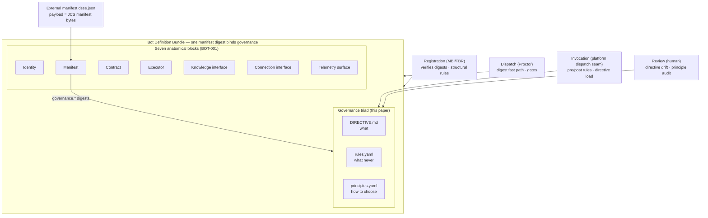
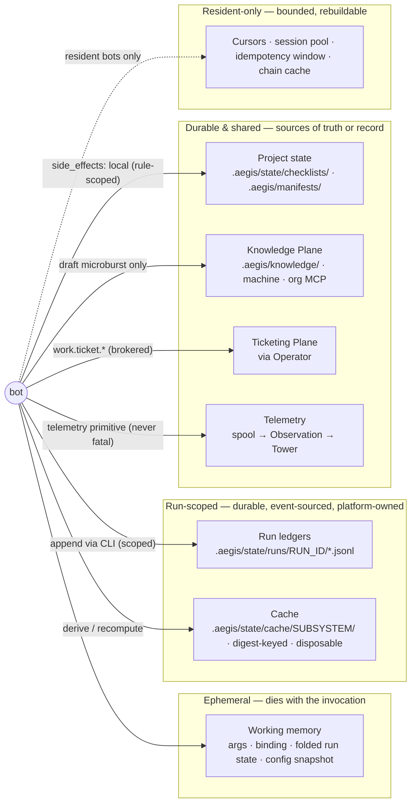
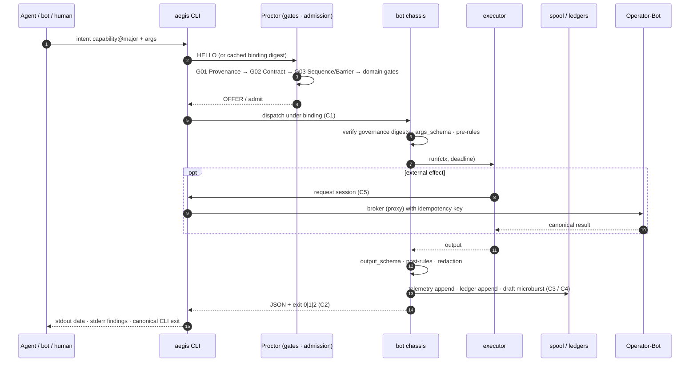
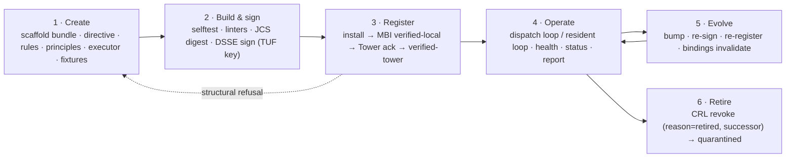

# AEGIS-RP-014 — The Bot Unit: Creating & Operating a HATHOR Micro-Bot
## Directive · Rules · Principles · State & Memory · Communication · Lifecycle

- **Document ID:** AEGIS-RP-014
- **Status:** ACCEPTED — operator sign-off 2026-09-13 (PENDING-EDITS D8); §13 open questions resolved by operator
- **Date:** 2026-09-13
- **Author:** Oz (Agent), commissioned by Raymond Bayly (BaylyAI)
- **Parent:** AEGIS-REQ-BOT-001 (taxonomy, seven-block anatomy, default command contract)
- **Builds on:** RP-001 (manifest v1 + handshake), RP-002 (MBI/TBR), RP-003 (spool-and-drain), RP-005 (six identities, one chassis), RP-007/TS-001 (validators, ledgers, config precedence), RP-009/TS-002 (conducted runs, run log), RP-011 (brokering), RP-012 (knowledge store), RP-013 (trust model, signing), ADR-002/003/004, CANON-001
- **Amendments (ratified + applied 2026-09-13):** RP-001 §2 (manifest 1.1.0 `governance` triad + `runtime.requires_capabilities`/`config_schema`/`executor_kind`); BOT-001 `AEG-BOT-CMD-011/013/018`; CANON-001 §4/§5/§8; ADR-003 §2.2 surface note (`aegis tower bots init`); RP-007 §4.1; TS-001 §2.3/§13 — see §11 and `PENDING-EDITS.md` §2 (D8).
- **Consistency reconciliation (2026-09-14, pending operator review):** applies already-accepted RP-011 Class-1/Class-2 brokering, ADR-003/CANON-001 capability-exit semantics, and RP-013's external DSSE representation; records the unresolved executable-artifact binding as R10 rather than claiming coverage the schema does not provide. Tracked in `PENDING-EDITS.md` §7–§8.
- **Scope rule:** research and interface design only. No implementation authorized.

RFC 2119 keywords apply. Requirements in this paper extend the BOT-001 family with three sub-prefixes: `AEG-BOT-GOV-###` (governance: directive, rules, principles), `AEG-BOT-MEM-###` (state & memory), `AEG-BOT-LIF-###` (lifecycle).

---

## 0. Purpose

### 0.1 Why this paper

The bot is the atomic unit of HATHOR. Everything above it composes bots — families (BOT-001), the hierarchy chassis (RP-005), the validation fabric (RP-007), the Orchestration Gateway (RP-009), the three planes (CORE §3) — and nothing below it is addressable. The corpus specifies the bot's *skeleton* thoroughly: identity, manifest, contract, executor, knowledge interface, connection interface, telemetry surface (`AEG-REQ-BOT-007`), plus the default command set and runtime rules. Four things a bot needs in order to be authored and operated as a **self-contained unit** have no home yet:

1. **Directive** — the bot's base instructions for its overall job (its charter).
2. **Rules** — constraints the bot abides by *in addition to* platform and project rules.
3. **Principles** — the compass a bot uses where rules are silent.
4. **A memory/state model** — what a bot may remember, where, and for how long — reconciled with v1 statelessness (`AEG-REQ-BOT-009`).

This paper specifies all four, fixes the bot's communication model in one place, and walks the bot lifecycle end to end: **create → sign → register → operate → evolve → retire**.

### 0.2 One-line definition

> A HATHOR bot is a **signed-manifest bundle design** of *identity + directive + contract + rules + principles + executor* that is **stateless between invocations**, **externalizes every durable memory** to a sanctioned store, **speaks only versioned JSON through the CLI**, and can be **built, tested, registered, run, and retired without any other bot existing**. Manifest 1.1.0 cryptographically binds the manifest and governance triad; executor-byte binding remains R10.

### 0.3 The four words, one mnemonic

| Artifact | Answers | Nature | Enforced by |
|---|---|---|---|
| **Directive** | *what* the bot is for, and what it is not for | prose charter (bounded) | review; `selftest` conformance; loaded as base instruction for agent-backed executors |
| **Rules** | *what never* — invariants on the bot's own behaviour | mechanical predicates | chassis pre/post-conditions; `selftest` fixtures; refusal `BOT_RULE_REFUSED` |
| **Principles** | *how to choose* when rules are silent | unranked bot-carried canon plus ranked bot-specific heuristics | not mechanically enforceable; made **observable** via `report.decisions[]` |
| **Config** | *how much / where* — tunables | data, schema-validated | `config validate`; cannot relax a rule |

**Directive says what. Rules say what never. Principles say how to choose. Config says how much.**

---

## 1. Independence, precisely

"Each bot operates independently of any other" is load-bearing, so it is defined here as five testable properties — and bounded by what it does **not** mean.

| # | Independence | Meaning | Test |
|---|---|---|---|
| I1 | **Definition** | Own manifest, own governance bundle, own UUID, own semver — even when six identities share one chassis (`AEG-HIE-001..003`) | `aegis tower bots show <name>` resolves a complete bundle with no reference to a sibling |
| I2 | **Build & test** | `selftest` passes on a machine whose MBI contains only this bot | Independence test (`AEG-BOT-LIF-004`) |
| I3 | **Runtime** | No shared mutable memory with any other bot; no direct peer calls; every collaboration is a **capability request through Proctor** | `ml-no-listener`, `ml-broker-symmetry`; trace shows Proctor on every hop |
| I4 | **Failure** | A failed/quarantined bot degrades only itself (and, for hierarchy, its tier and below — `AEG-HIE-005`); callers receive a structured refusal or `degraded:true`, never a crash | Quarantine one bot; siblings' `selftest` and dispatch unaffected |
| I5 | **Evolution** | Version, re-sign, and re-register without touching any other bot's manifest | `AEG-HIE-003` AC generalized to all families |

**What independence does not mean.** It does not permit a bot to (a) bypass the CLI or Proctor (`AEG-BOT-TAX-006`), (b) keep a private durable store (§4), (c) resolve or persist long-lived provider credentials (`AEG-BOT-ANA-006`; RP-011's Class-2 in-memory token is the bounded exception), or (d) advance run state (`AEG-GW-001`). A bot with collaborators is still independent when those collaborators are declared as **capabilities** (never names) and resolved late. Their unresolved presence degrades readiness/status without failing registration; an attempted dispatch to an absent capability refuses `CAPABILITY_UNKNOWN` with CLI exit 3. Independence is a **contract property, not a process-boundary property**: in-process colocation of validators behind `proctor.Dispatch` (TS-001 §2.1/§14) does not violate it.

---

## 2. Anatomy revisited — seven blocks and a governance triad

The seven blocks (`AEG-BOT-ANA-001..007`) stand unchanged. This paper adds a **governance triad** that is digest-referenced by the signed manifest and verified at the same moments the manifest is.



Where each governance artifact is enforced:

| Moment | Directive | Rules | Principles |
|---|---|---|---|
| **Registration** | present; required sections; ≤ budget; digest matches | schema-valid; constraint-only vocabulary; references declared commands; fixtures present; digest matches | bot-carried `aegis-principles` set referenced in full; bot principles ≤ 5, each traces to a carried principle; digest matches |
| **Dispatch** | (digest covered by manifest fast path) | (as above) | (as above) |
| **Invocation** | loaded as base instruction when the executor is agent-backed; otherwise not read | **pre-rules** evaluated by the platform before dispatch; **post-rules** on declared output/effects after the bot returns | cited in `report.decisions[]` for discretionary choices |
| **Review / Tower** | drift review on version bump | violation rates by rule id (`success-rate-Bot`) | which principle governed which decision (audit) |

---

## 3. The Bot Definition Bundle (what you author)

### 3.1 Layout

A bot's source of truth is one directory. In a standalone bot repo it is the repo root; in a shared chassis it is `bots/<name>/` (RP-005 Option C).

```text
<bot-root>/
  manifest.json          # RP-001 schema 1.1.0 (D8; adds `governance`, `runtime.requires_capabilities`, `runtime.config_schema`)
  manifest.dsse.json     # external DSSE envelope; payload = JCS-canonical manifest.json bytes
  DIRECTIVE.md           # charter (frontmatter + seven required sections)
  rules.yaml             # bot-local rules (constraint-only; narrowing)
  principles.yaml        # bot-carried aegis-principles ref + ≤ 5 bot principles
  executor/              # role logic — any language (ANA-004)
  fixtures/
    commands/<cmd>/      # golden I/O for selftest (help / dry-run paths)
    rules/<rule-id>/     # ≥ 1 passing and ≥ 1 violating case per rule
  AGENTS.md              # optional; for agent-backed executors: points at DIRECTIVE.md, never duplicates it
```

At install, the CLI copies the verified bundle to `<project>/.aegis/manifests/<name>/` (UPL) and indexes it into the MBI (`AEG-REQ-REG-002`).

### 3.2 Manifest `governance` block (schema 1.1.0, ratified and applied by D8)

```json
{
  "manifest_version": "1.1.0",
  "identity":     { "...": "unchanged (RP-001 §2.2)" },
  "contract":     { "...": "unchanged" },
  "commands":     [ "...unchanged" ],
  "capabilities": [ "..." ],
  "knowledge":    { "...": "unchanged" },
  "connections":  [ "..." ],
  "telemetry":    { "...": "unchanged" },
  "runtime": {
    "resident": false,
    "health_budget_ms": 250,
    "stateless": true,
    "executor_kind": "mechanical",                     # mechanical | agent-backed (agent-backed = exception, §13 Q6)
    "requires_capabilities": [ "validation.evidence.verify@1" ],
    "config_schema": { "$schema": "https://json-schema.org/draft/2020-12/schema", "...": "..." }
  },
  "governance": {
    "directive":  { "path": "DIRECTIVE.md",    "digest": "sha256:…", "version": 1, "budget_tokens": 1000 },
    "rules":      { "path": "rules.yaml",      "digest": "sha256:…", "count": 4 },
    "principles": { "path": "principles.yaml", "digest": "sha256:…", "platform_set": "aegis-principles@1" }
  }
}
```

A sibling external `manifest.dsse.json` carries the DSSE envelope over the exact JCS-canonical bytes of this manifest; no signature field appears in `identity.provenance`.

Design consequences, all deliberate:

- **One manifest digest binds the governance triad.** The governance file digests are fields of the JCS-canonical manifest. An external `manifest.dsse.json` envelope signs those canonical manifest bytes, so the signature transitively covers directive, rules, and principles without embedding a signature in its own payload. Editing a directive changes the manifest digest → re-sign → re-register → existing bindings invalidate with `MANIFEST_DIGEST_STALE` (`AEG-MAN-005`). A behaviour change *is* a contract change, and the platform treats it as one.
- **Executable binding is not yet frozen.** Manifest 1.1.0 carries source provenance but no executor/image/artifact digest, so the external envelope does not by itself cover executor bytes. The accepted signed-bundle intent remains, but implementation MUST first resolve `PENDING-EDITS.md` R10; until then, “signed bundle” claims refer only to the manifest and digest-referenced governance triad.
- **Mandatory, no transition.** `governance` is required. 1.0.0 manifests remain schema-valid against RP-001's unchanged top level, but a manifest without `governance` is refused at registration with **no transition profile** (§13 Q5 resolved: Instant). The greenfield has no legacy bot population to migrate.
- **`requires_capabilities`** declares collaborators by capability, never by bot name (`AEG-MAN-003`). Registration does **not** require them to resolve (I2); `status --group contract` reports unresolved dependencies as `degraded`; dispatch yields `CAPABILITY_UNKNOWN` when absent. It is a distinct axis from `requires_connections` (command-level, RP-001 §2.4): the latter names *external systems* brokered by Operator-Bot, the former names *other bots' capabilities* routed by Proctor; both resolve late and never by hard reference.
- **`config_schema`** gives `config show|validate` (`AEG-BOT-CMD-015`) a declared schema to validate against. Config lives outside the bundle (§3.6) and can never relax a rule.
- **`executor_kind`** ∈ `mechanical | agent-backed`, default `mechanical`. Agent-backed is the exception and is gated (§3.3 rule 3, §13 Q6); it changes only how the directive is consumed, never who owns control flow (ADR-002).

### 3.3 Directive (`DIRECTIVE.md`)

The directive is the bot's charter: the human- and agent-readable statement of its job. It is the bot-scoped analogue of a project's scoped `AGENTS.md` (`AEG-REQ-UPL-002`) and is deliberately **bounded** — ≤ 1000 tokens of body by default (operator-resolved, §13 Q3), measured with the same bench as the agent skill pack (SKL-S3) — so it never dominates any context it is loaded into.

```markdown
---
directive_version: 1
bot: checklist-Bot
emphasis: [P01, P06, P08, P09]      # bot-carried principles this role leans on hardest (all twelve still apply)
bot_principles: [cl-p-001, cl-p-002] # ids declared in principles.yaml (registration checks they exist)
---
# Directive — checklist-Bot
## Purpose          — one sentence.
## Scope            — Does: … / Does not: …
## Inputs & outputs — capabilities served; what one invocation returns.
## Success          — what "done" means for one invocation (never for a run: the conductor owns that).
## Refusal & degradation — when to refuse (never guess); when to return degraded; the cases that must never be guessed.
## Memory           — what it reads (tiers); what it may write (scopes); what it never persists.
## Escalation       — what it reports (report/telemetry), to whom (Observation → Tower), and when a human is required.
```

Rules for directives:

1. **Required sections** (all seven) are checked at registration via the frontmatter + heading set; a missing section is a structural refusal (`AEG-MAN-007` extension).
2. **A directive may not instruct a rule violation.** Rules outrank the directive at every level (platform, project, bot). If a directive sentence and a rule conflict, the rule wins and the directive is a defect.
3. **How it is consumed.**
   - *Mechanical executors* (every v1 roster bot — none is specified as agent-backed): the directive is the conformance target. Authors derive `selftest` fixtures from its Scope / Success / Refusal sections, and reviewers diff directive against behaviour at each version bump. The executor does not read it at runtime.
   - *Agent-backed executors* — **the exception, not the rule.** The default is mechanical; every v1 roster bot is mechanical. A bot MAY be agent-backed (`runtime.executor_kind: "agent-backed"`, §3.2) only by explicit recorded authorization (an ADR or a Ticketing Plane ticket with a named owner — §13 Q6), and even then control flow stays with the platform (ADR-002: the model fills step content, never the orchestration). The platform loads the directive **after verifying its digest** and injects it as the base instruction; the agent's ambient prompt never substitutes for it. Instruction precedence is fixed: **platform rules → project rules → bot rules → directive (role) → project `AGENTS.md` chain (conventions, context only) → task content from the run/node.**
4. **Directive drift is a version event.** Any edit bumps `identity.version` (at least patch) and re-signs; there is no "hot edit" of a directive.

### 3.4 Rules (`rules.yaml`)

A **rule** is a mechanically checkable predicate over the invocation context with a fixed enforcement point. Rules exist at three levels, evaluated in this order on every invocation:

1. **Platform canonical rules** (CORE §0.3) — realized by gates, linters, and chassis invariants; not restated per bot.
2. **Project rules** (`.aegis/rules/*.yaml`) — validation profiles, linter packs, claims, suites, graphs, knowledge thresholds.
3. **Bot rules** (this file) — the bot's own invariants.

**Narrowing-only, by construction.** The bot rule vocabulary has exactly two effects — `refuse` and `degrade` — and no grant form (`allow`, `skip`, `waive`, `disable` do not exist in the schema). A bot rule can therefore only *add* a constraint; it can never widen what a platform or project rule refuses. This makes "rules aside from project rules" safe without a reconciliation engine: precedence is evaluation order, and the outer levels refuse first.

```yaml
version: 1
bot: checklist-Bot
rules:
  - id: cl-r-001
    class: state.write_scope                 # dot-namespaced lowercase (CANON-001 §7.4)
    when: post                               # pre | post | always
    applies_to: [mark, unmark]               # command names (omit = all); must exist in manifest.commands
    predicate:                               # kind: schema (JSON Schema 2020-12) over the rule context (§3.4.1); cel is the opt-in alternative
      kind: schema
      schema:
        properties:
          effects:
            properties:
              paths_written:
                items: { pattern: "^\\.aegis/state/checklists/" }
    on_violation: refuse                     # refuse | degrade  (no grant vocabulary exists)
    message: "checklist-Bot wrote outside .aegis/state/checklists/"
    remediation: "Confine writes to the checklist ledger; other state belongs to its owning bot."
    fixtures: fixtures/rules/cl-r-001/       # ≥ 1 passing and ≥ 1 violating case; exercised by selftest
  - id: cl-r-002
    class: run.binding_required
    when: pre
    predicate:
      kind: schema
      schema: { required: [run], properties: { run: { required: [run_id, hierarchy_chain] } } }
    on_violation: refuse
    message: "A checklist item can only be marked inside a run with a resolved hierarchy chain."
    remediation: "Open a run (aegis process run open) or dispatch through the conductor."
```

#### 3.4.1 Rule context (what predicates see)

The platform assembles one context object per invocation; `pre` rules see it without `output`/`effects`, `post` rules see it complete. `effects` is the executor's own structured declaration of what it wrote, emitted, and brokered — the platform evaluates predicates over this declaration; it does not infer effects by scanning the filesystem.

```json
{
  "bot":     { "name": "checklist-Bot", "family": "hierarchy", "tier": "checklist", "version": "1.2.0" },
  "command": "mark",
  "args":    { "...": "already validated against args_schema" },
  "actor":   { "kind": "human|agent|system", "id": "…" },
  "run":     { "run_id": "…", "node_id": "…", "ticket_ref": "…", "hierarchy_chain": "…", "binding_id": "…" },
  "env":     { "profile": "enforced|dev", "environment": "development", "tty": false },
  "output":  { "...": "post only — already validated against output_schema" },
  "effects": {
    "paths_written": [], "events_emitted": [], "knowledge_writes": [], "external_sessions": [], "retries": 0
  }
}
```

#### 3.4.2 Enforcement semantics

> **Where rules run: the platform, not the executor.** Rules are declarative predicates, evaluated by the CLI/Proctor dispatch seam — the same layer that already validates `args_schema`/`output_schema` both directions (`AEG-MAN-002`, RP-001 §2.4). This preserves code-agnosticism (`AEG-BOT-ANA-004`): a Python or Rust bot enforces its rules by *declaring* them and *declaring its effects*, never by re-implementing a rule engine. The executor owns honest declaration; the platform owns evaluation.

> **Trust model (`AEG-THR-001`):** rule evaluation holds against a *cooperative-but-fallible* executor that declares its effects truthfully. A subverted executor that misdeclares effects is out of scope for v1 enforcement and in scope for detection (bundle digest mismatch → quarantine; Tower cross-checks per RP-013 §4.1).

- **Pre-rules** run during admission, after the Proctor gates and args-schema validation, before the executor is invoked. The platform builds the context without `output`/`effects`. Violation ⇒ refusal `code=BOT_RULE_REFUSED` (CLI exit 2, precondition unmet), `remediation` from the rule, and a `contract.refused` event carrying `payload.rule_id`. The bot never runs.
- **Post-rules** run after the bot returns, against its declared `output` and self-declared `effects`. Violation ⇒ output withheld, surfaced as `CONTRACT_OUTPUT_INVALID` (CLI exit 1) with the offending `rule_id` in the envelope — a post-rule is an extension of the output contract. If a bot declares post-rules but omits the `effects` block, evaluation fails **closed** (same refusal). Post-rules are **detect-and-flag, not rollback**: local ledger appends are append-only, knowledge writes are already `draft` (archivable), and external effects are idempotency-keyed through Operator (RP-011 §4). Authors SHOULD express write-scope constraints as `pre` rules on *intent* wherever the command's args make the target knowable, and use `post` as the verifier. **Compensation doctrine (§13 Q2, resolved):** post-rules never auto-compensate. A post-rule violation on `side_effects: external` returns the refusal plus the idempotency key (for reconciliation) and, if the author declared an optional `compensate` hint, that hint is **human-executed only** — the chassis surfaces it, never runs it (`builder + verifier, never operator`, CORE §0.3 r5).
- **`degrade`** never blocks: it sets `degraded:true`, emits the finding, and lets the response through — for rules that are advisory to the caller but material to the Tower.
- **Predicate kinds.** `kind: schema` (JSON Schema 2020-12) is the default; `kind: cel` is an opt-in, sandboxed, non-Turing-complete alternative for cross-field/arithmetical checks (§13 Q1, resolved). Both are **pure**: a predicate may not perform I/O; the platform evaluates it against the context object only (mirrors micro-linter purity, `AEG-VAL-002`).
- **Family defaults.** The scaffold (§6.1) ships a default rule set per family; authors add, never remove (removal of a family default is a registration refusal).

| Family | Default bot rules shipped by the scaffold |
|---|---|
| Orchestration | `proctor-Bot`: no durable writes except telemetry; `process-Bot`: sole appender of `node.*` / `run.*` / `gateway.*`; `operator-Bot`: sole holder of the connection pool and resolver of long-lived provider credentials — workers receive Class-1 proxy sessions by default and a declared Class-2 scoped, short-lived, memory-only token only by exception (`AEG-BOT-SEC-002`, `AEG-OPB-001/002`) |
| Validation (`val-*`) | read-only over the planes; writes confined to run ledgers + draft finding summaries (RP-007 §1.3) |
| Hierarchy | writes confined to the bot's own tier records; `hierarchy_chain` required on every write |
| Observation | zero mutation of work products, knowledge, or connections; consumes the spool only via cursor |

### 3.5 Principles (`principles.yaml`)

A **principle** is a decision heuristic for situations rules do not decide. Principles cannot be mechanically enforced — that is precisely why rules exist — but they can be made **observable**: every discretionary decision a bot takes is recorded in its `report` with the principle that governed it (§3.5.3), so Observation and reviewers can see a bot's judgement, not just its outputs.

#### 3.5.1 The bot-carried principle set (`aegis-principles@1`, inherited, non-removable)

Every principle below restates a ratified decision; none is new doctrine. They are the corpus's canon compressed to twelve sentences a bot can carry.

| ID | Principle | Source |
|---|---|---|
| **P01** | **Refuse, never guess.** A structural, contract, provenance, or authority failure produces a structured refusal with a remediation hint; silent fallback is a defect. | CORE §0.3 r2, `AEG-REQ-PLAT-004` |
| **P02** | **One role, whole role.** Do exactly the declared role and all of it; composition happens above the bot, never inside it. | `AEG-BOT-TAX-001` |
| **P03** | **The CLI is the only doorway, in both directions.** No listeners, no direct peers, no direct stores. | `AEG-BOT-TAX-006`, `AEG-THR-007` |
| **P04** | **Hold nothing worth stealing.** Never resolve or persist long-lived provider credentials; use brokered Class-1 sessions, with scoped, short-lived, memory-only Class-2 tokens only by declared exception; keep identity scoped. | `AEG-BOT-ANA-006`, `AEG-OPB-001/002` |
| **P05** | **Provenance over recency.** Verified provenance and quality outrank freshness in every retrieval, routing, or promotion choice. | CORE §0.3 r3 |
| **P06** | **Evidence before narrative.** A claim is a request until recorded evidence exists; "done" is decided by the system. | `AEG-VAL-008`, `AEG-GW-007` |
| **P07** | **Degrade honestly.** Continue within bounded trust when an authority is unreachable, report `degraded`, and refuse authority-originating actions past TTL. | `AEG-BOT-RUN-003`, `AEG-REQ-PLAT-007` |
| **P08** | **Externalize memory.** Nothing durable lives in the bot; everything durable lives in a sanctioned store reachable through the CLI. | `AEG-REQ-BOT-009` |
| **P09** | **Steer, don't just block.** Every refusal names what must happen next. | `AEG-GW-014` |
| **P10** | **Small, attributable increments.** Microburst writes, diff-scoped work, one run per attribution. | `AEG-BOT-KNO-003`, `AEG-VAL-007` |
| **P11** | **Build and verify; never operate.** Humans authorize promotion; deploy authority originates only from a ticket. | CORE §0.3 r5, `AEG-REQ-TKT-011` |
| **P12** | **Enforcement fails closed; observation fails open.** Unreadable state refuses mandatory action; telemetry failure never blocks business work. | `AEG-GW-013`, `AEG-REQ-TEL-002` |

The bot-carried principles are **not ranked against each other**. A genuine conflict between two carried principles is a specification defect: the bot applies P01 (refuse, with remediation naming both principles) and the conflict surfaces as a finding — a bot never arbitrates canon.

#### 3.5.2 Bot principles

```yaml
version: 1
bot: checklist-Bot
platform_set: aegis-principles@1        # schema field naming retained; bot-carried set inherited in full
bot_principles:                          # ≤ 5, ranked by list order, always below the carried set
  - id: cl-p-001
    statement: "A checklist item is marked only from an admitted node completion, never from narrative."
    supports: [P06]                      # MUST trace to ≥ 1 carried principle
    rationale: "The checklist is the completion ledger of the graph; a mark without a node.completed is a false completion."
  - id: cl-p-002
    statement: "When a checklist and its runbook disagree, report the drift; never reconcile silently."
    supports: [P01, P07]
```

Constraints: at most five bot principles; each MUST cite at least one bot-carried principle it specializes (this is how contradiction is prevented by construction rather than adjudicated); they rank in list order and always below the carried set; like the other governance artifacts, they are covered transitively by their manifest digest reference.

#### 3.5.3 Making principles observable — `report.decisions[]`

The standardized run report (`AEG-BOT-CMD-018`) gains a bounded `decisions[]` array (≤ 10 entries) in its payload. No new telemetry event is introduced.

```json
"payload": {
  "outcome": "success",
  "decisions": [
    { "kind": "discretionary", "principle": "P07", "rule": null,
      "choice": "served stale knowledge record with per-record staleness flag",
      "alternatives": ["NO_CONFIDENT_MATCH"],
      "rationale": "no in-TTL verified record; caller opted --include-stale" }
  ]
}
```

`decisions[]` travels in the `report` payload (CMD-018), consumed by Observation and rolled up to the Tower, where the decision-by-principle distribution is queryable via the read surface (`/v1/query/validation`, RP-010 §3.5). No new telemetry event type is introduced. Reviewers use that distribution to detect judgement drift the same way rule-violation rates detect contract drift. **Audit cadence (§13 Q4, resolved):** continuous + threshold-triggered, never calendar-sampled. A bot citing an undeclared `principle` id, or a distribution shift beyond a configured tolerance, raises a finding and **auto-opens a dispute-style review item** (the `AEG-KPW-006` dispute path). Governance-class bots (Proctor/Process/Operator, deploy-path) carry a stricter tolerance than leaf hierarchy bots. Humans resolve; nothing auto-closes.

### 3.6 Config (not in the bundle)

Config tunes; it never governs. It resolves nearest-first exactly as TS-001 §13: `--flag` → project `.aegis/rules/bots/<name>.yaml` → machine `${XDG_CONFIG_HOME}/aegis/bots/<name>.yaml` → embedded defaults. It is validated against `runtime.config_schema`, contains connection *names* only (never credentials), and is excluded from the bundle digest by design — an operator may retune a bot without re-signing it, and cannot loosen a rule by doing so.

---

## 4. State & memory model

### 4.1 The invariant

`AEG-REQ-BOT-009` stands: a bot is stateless between invocations. This paper states the consequence as a positive model rather than a prohibition:

> **A bot owns no store.** It holds *working memory* for the life of one invocation; every other memory is an append or a read against a **platform-owned store**, through the CLI, within scopes the bot's manifest and rules declare. Killing a bot at any instant loses at most the current invocation's working memory.

Bots therefore **do not learn privately.** The only cross-invocation "learning" a bot has is a draft knowledge microburst that a human may later verify (`AEG-REQ-KNO-009`). This is a feature: a bot's judgement is reviewable because none of it is hidden.

### 4.2 Memory tiers



| Tier | Scope | Location | Owner | Bot may write | Rebuild / loss rule |
|---|---|---|---|---|---|
| **Working** | one invocation | process memory | bot | yes — discarded at exit | n/a; lost on kill, by design |
| **Run ledgers** | one run | `.aegis/state/runs/<run_id>/{events,findings,evidence,assumptions}.jsonl` | Process-Bot (`events.jsonl` transitions); the emitting bot for findings / evidence / assumptions | append-only, via CLI, `flock` + `O_APPEND` (TS-001 §8.2) | state = fold; dedupe on `event_id`; torn trailing line tolerated |
| **Cache** | project or machine | `.aegis/state/cache/<subsystem>/`, `${XDG_DATA_HOME:-~/.local/share}/aegis/` | bot / chassis | yes | digest-keyed; delete and recompute; **never authoritative** |
| **Project state** | project | `.aegis/state/checklists/`, `.aegis/manifests/` (UPL) | platform | only with `side_effects: local` and a scoping rule | git; re-derive from ledgers |
| **Knowledge** | cross-run, cross-bot | project files / machine dir / org MCP (RP-012 §3) | Knowledge Plane; humans promote | **draft microbursts only**, mandatory metadata, redaction pre-commit | files are truth; index rebuilds |
| **Work** | cross-run | Ticketing Plane | provider (via Operator) | via `work.ticket.*` capabilities only | provider wins; reconcile |
| **Telemetry** | append-only | project spool (ADR-004 §2.2) → Tower | Observation-Bot drains | append via CLI primitive; never fatal | replay is safe (at-least-once, deduped) |
| **Resident** | one resident process | spool cursors, Operator pool + idempotency store (≥ trust TTL), MBI index, chain cache | resident bot | yes, bounded | reconstructible from spool / ledgers / Tower; loss ⇒ replay, never data loss |

### 4.3 Who owns run state (and who merely reads it)

In a conducted run (RP-009), run state is the fold of `events.jsonl`, and **only Process-Bot appends transitions** (`AEG-GW-001`). Every other bot:

- **reads** state by folding (or via `aegis process run status -o json`) into working memory,
- **appends** only its own emitter-scoped records (findings, evidence, assumptions, telemetry) through the CLI,
- **requests** transitions (`node enter`, `node complete`, `claim.step.done`) — requests are evaluated by the gateway; a bot never declares progress.

This is what lets a worker bot be killed mid-step and re-dispatched: the next attempt is keyed `(run_id, node_id, attempt)` (TS-002 §5.3), external effects carry Operator idempotency keys, and nothing the bot "remembered" is required to resume.

### 4.4 The invocation state machine (non-resident bot)

```mermaid
stateDiagram-v2
  [*] --> intake: CLI parsed; binding digest fast path
  intake --> verify: governance digests when loaded; args_schema
  verify --> pre_rules: platform, project, then bot rules
  pre_rules --> execute: executor with ctx and deadline (timeout_ms)
  execute --> execute: transient failure; retry up to 5 with backoff
  execute --> post_rules: output_schema, then bot post-rules
  post_rules --> emit: telemetry append; draft microburst; report
  emit --> [*]: exit 0 success or 2 degraded
  verify --> refuse: digest mismatch or invalid args
  pre_rules --> refuse: BOT_RULE_REFUSED
  post_rules --> refuse: CONTRACT_OUTPUT_INVALID (carries rule_id)
  execute --> refuse: retries exhausted; dependency unhealthy past TTL
  refuse --> emit: contract.refused event; structured envelope
  emit --> [*]: CLI exit per refusal code (pre=2, post=1)
```



Two boundaries, never mixed (ADR-003 §2.3). The bot-boundary codes `0|1|2` describe the **executor's own** behaviour — its health/status/self-checks and internal failures (a bot-boundary `2` translates to `{degraded:true}`, never an uncontexted CLI exit 2). Rule enforcement is **platform-side** and independent of the executor's exit: a pre-rule refusal is CLI exit 2 (`BOT_RULE_REFUSED`); a post-rule / output violation is CLI exit 1 (`CONTRACT_OUTPUT_INVALID`).

### 4.5 Resident bots (Operator-Bot, Observation-Bot; P4 `process conduct`, `validate watch`)

```mermaid
stateDiagram-v2
  [*] --> starting: load config; verify bundle digests; open cursors and pool
  starting --> ready: health returns 0
  ready --> ready: serve (drain segment, broker session, tick)
  ready --> degraded: dependency unreachable within TTL (status 2)
  degraded --> ready: remediated
  ready --> draining: drain — finish in-flight, refuse new
  draining --> stopped: stop — persist cursors, close sessions
  stopped --> [*]
```



Resident state is **bounded and rebuildable** (§4.2, last row). A resident bot that loses its state directory replays from the spool/ledger and re-establishes sessions; it never loses a business fact, because it never held one. Resident bots are single-instance per machine (RP-011 §7 Q2 lean), guarded by a lock file under their state directory.

### 4.6 Concurrency

Statelessness makes N parallel invocations of the same bot safe by construction. Shared surfaces are already serialized: ledger appends take the advisory `flock` (TS-001 §8.2); cache entries are content-addressed and written by atomic rename; external side effects are idempotency-keyed (RP-011 §4); same-run concurrent transitions fold deterministically and surface `degraded` on conflict (`AEG-THR-008`).

### 4.7 What a bot may never remember

- Credentials or tokens — including Class 2 short-lived tokens beyond their in-memory life (RP-011 §2.2) — or any redacted secret material.
- Another bot's state, cursors, or cache (I3).
- A `verified` knowledge record it minted itself (`AEG-KST-008`).
- Run progress outside the run ledger (a bot-local "done list" is a private store and is refused by family default rules).

---

## 5. Communication model

A bot has exactly six channels. Each is versioned, structured, and CLI-mediated; there is no seventh.

| # | Channel | Direction | Transport | Contract | On failure |
|---|---|---|---|---|---|
| C1 | **Dispatch** | in | CLI → Proctor → bot (`HELLO/OFFER/BIND/VERIFY`, digest fast path) | capability `<domain>.<noun>.<verb>@<major>`; `args_schema` | gate refusal envelope (G01 → G02 → G03 first) |
| C2 | **Response** | out | stdout (data) · stderr (progress/findings) · exit `0\|1\|2` | `output_schema`; envelope `{code,message,remediation,provenance,ttl}`; JSON default, `--human` for text | `CONTRACT_OUTPUT_INVALID`; never partial JSON on stdout |
| C3 | **Telemetry** | out | CLI telemetry primitive → project spool append | event envelope v1; events ⊆ `telemetry.events_emitted` | never fatal; `status --group telemetry` → 2; undeclared event → dead-letter |
| C4 | **Knowledge** | in / out | CLI tiered search (Project → Machine → Org → Public) / microburst push | record v1 (RP-012 §2); `NO_CONFIDENT_MATCH` handled explicitly | a miss is a result, not an error; write refused on missing metadata / secrets |
| C5 | **External** | out | Operator-Bot session (Class 1 proxy default; Class 2 token by exception) | canonical request → canonical result; idempotency key | exit 6 breaker / `degraded_fallback`; buffered write (RP-006 §5) |
| C6 | **Peer capability** | out | CLI → Proctor → other bot (never direct) | `requires_capabilities[]`; in a conducted run subject to the Sequence/Barrier Gate | attempted unresolved dispatch refuses `CAPABILITY_UNKNOWN` with CLI exit 3; optional dependency may degrade readiness |

Rules that hold across all six:

1. **Versioned JSON by default** (`AEG-BOT-CMD-001`); contract major must match; minor/patch negotiate down; no overlap → `CONTRACT_NO_OVERLAP`, never a best-effort guess.
2. **Stream discipline** (`AEG-REQ-CLI-004`): data on stdout, everything else on stderr; interactive prompts only when the CLI (not the bot) detects a TTY.
3. **No inbound listener, ever** (`AEG-THR-007`). When a bot leaves the single binary, its transport is authenticated UDS or mTLS inside the Class A boundary; the caller still only ever sees the CLI.
4. **Requests, not declarations** toward the conductor (`AEG-GW-001`): `claim.step.done`, `node complete`, `assumption.open` are inputs the system evaluates.
5. **Every outbound message carries the run reference** (`run_id`, `binding_id`, `hierarchy_chain`, `ticket_ref`) so telemetry/Tower views correlate with the authoritative run ledger and provider receipts (`AEG-REQ-TEL-007`).



---

## 6. Lifecycle: create → sign → register → operate → evolve → retire



### 6.1 Create

1. **Place the bot in doctrine first.** It MUST be one of the 26 roster members (CANON-001 §6) or be authorized by an ADR (`AEG-MBL-002`). Adapters are pool entries, not bots (`AEG-MBL-003`).
2. **Scaffold:** `aegis tower bots init <role>-Bot --family <orchestration|hierarchy|observation> [--tier <t>] [--role validator]` (proposed, §9) writes the bundle from the family template: manifest skeleton (UUID minted, name normalized per CANON-001 §7.3), directive skeleton with the seven sections, family default rules with fixtures, `principles.yaml` referencing `aegis-principles@1`, and default-command stubs.
3. **Write the directive** within budget; derive `selftest` fixtures from its Scope / Success / Refusal sections.
4. **Declare the contract:** capabilities, commands with embedded `args_schema` / `output_schema`, `side_effects`, `timeout_ms`, `dry_run`, `requires_connections` (names), `requires_capabilities`.
5. **Add rules** (never remove family defaults), each with positive and negative fixtures.
6. **Add ≤ 5 bot principles**, each tracing to a bot-carried principle.
7. **Implement the executor** in any language against the default command contract (`AEG-REQ-BOT-008`) — on the shared chassis (hierarchy, validators) or standalone. The executor receives a context, a deadline, and a CLI handle; it never resolves or persists long-lived provider credentials; a declared Class-2 flow may provide only a scoped, short-lived token held in memory. It never opens a listener or writes outside declared scopes.
8. **Run `selftest` locally** until green: every command's help / dry-run path, every rule fixture (predicates evaluated platform-side against those fixtures), output-schema validation on goldens, governance digests, exit paths `0|1|2`, and the independence run (MBI = this bot only).

### 6.2 Build & sign

- Micro-linters at build (`AEG-REQ-CNT-006`): `ml-manifest-schema` (covering the 1.1.0 bundle), `ml-manifest-digest`, `ml-exit-codes`, `ml-no-listener`, `ml-broker-symmetry`, `ml-secrets-layer`, `ml-cvs-labels`, `ml-otel-contract`.
- Canonicalize the manifest with RFC 8785 (JCS); compute `sha256`; emit a sibling external `manifest.dsse.json` envelope whose payload is those canonical bytes and whose signature uses an Ed25519 key distributed via the Tower's TUF roles (RP-013 §6). The manifest digest is the registration unit of trust; policy requires executor changes to update manifest provenance and produce a new digest, but mechanical executable-byte binding remains the R10 interface freeze.
- Containerize per class (A for orchestration, C for hierarchy / validators / workers, D for observation); one bot per image by default — a family may share one image only with a shared contract version and failure domain (containerization article).

### 6.3 Register

Install → CLI verifies the signature against cached TUF keys, re-derives every governance digest from the files on disk, applies structural rules (`AEG-MAN-007` + §11 additions) → MBI entry `verified-local` → registration queued to `POST /v1/registrations` → Tower ack → `verified-tower` (RP-002 §3.2, RP-010 §3.1). Rejection (unknown key, family conflict, revoked, structural violation) ⇒ `quarantined`, `PROVENANCE_UNVERIFIED`, operator alerted. A `verified-local` bot routes within the trust TTL (default 72 h, Tower-configurable — RP-002 §3.4) with runs flagged `degraded`.

### 6.4 Operate

| Concern | Non-resident bot | Resident bot |
|---|---|---|
| Entry | Proctor dispatch under binding | started by supervisor; `health` polled |
| Liveness | `health` < 250 ms, no network | same; reports `draining` as 2 |
| Deep checks | `status --group identity\|config\|contract\|knowledge\|connections\|telemetry\|governance` | same, plus cursor lag / pool health |
| Degradation | dependency unreachable → consult `degraded_fallback` → `degraded:true` within TTL → refuse past TTL | same; never drops events (spool retains) |
| Retry | ≤ 5 with backoff, recorded by `retry-Bot`; exhaustion ⇒ failure report with full context | same |
| Reporting | `report` at end of invocation (chain ref, telemetry summary, `decisions[]`) | periodic rollups |
| Shutdown | process exit | `drain` → `stop`, no in-flight loss |

Operational surface for humans and agents: `aegis tower bots list|show <name> [--governance]|selftest <name>`, `aegis proctor gateway explain` for refusals, `aegis doctor` for fabric health.

### 6.5 Evolve

| Change | Version effect | Registration effect |
|---|---|---|
| Executor fix, no contract change | `identity.version` patch | new digest → re-sign → re-register → bindings `MANIFEST_DIGEST_STALE` → callers re-HELLO (cheap fast path) |
| Directive, rules, or principles edit | at least patch (behaviour changed) | same as above — a governance edit is a contract event |
| Additive command / capability | `contract.version` minor | callers unaffected; negotiation picks the highest overlap |
| Breaking contract | `contract.version` major; offer both `…@1` and `…@2` capabilities during transition | callers migrate at their pace; `CONTRACT_MAJOR_MISMATCH` steers stragglers |
| Chassis bump only | provenance changes (`source_commit`, `built_at`) | new digest; identity semver may be unchanged |

Config changes (§3.6) require no re-sign.

### 6.6 Retire

Retirement is a registry act, not a manifest edit: `POST /v1/revocations` with `reason=retired` and an optional `successor` digest. On the next reconciliation the MBI quarantines the digest before any further dispatch (`AEG-REG-005`); callers receive `PROVENANCE_UNVERIFIED` with remediation pointing at the successor capability. Knowledge records and telemetry the bot authored are retained with their provenance intact.

---

## 7. Family operating profiles

The unit model is one; families specialize it along four axes.

| Family | Resident | Memory tiers actually used | Distinctive rules | Directive emphasis |
|---|---|---|---|---|
| **Orchestration — Proctor** | no | working; reads run ledger (fold); telemetry | no durable writes except telemetry; evaluates gates in canonical order G01 → G02 → G03 → domain | P01, P09, P12 |
| **Orchestration — Process** | no (P4 resident optional) | run ledger (sole transition appender); chain cache; telemetry | sole appender of `node.*` / `run.*` / `gateway.*`; `hierarchy.resolve.chain@1` batch only | P06, P08, P12 |
| **Orchestration — Operator** | yes | resident (pool, idempotency window ≥ TTL); telemetry | sole holder of the connection pool; Class 1 proxy default; tokens never persisted | P04, P07 |
| **Validation (`val-*`)** | no | run ledgers (findings / evidence / assumptions); draft finding summaries | read-only over the planes; verdict vocabulary `pass\|fail\|degraded\|inconclusive` | P01, P06, P10 |
| **Hierarchy (six, one chassis)** | no | knowledge reads; own-tier records; `checklist-Bot` writes `.aegis/state/checklists/` | writes confined to own tier; `hierarchy_chain` on every write; partial-chain honesty | P02, P05, P08 |
| **Observation** | parent yes; children share one Class D image | resident cursors; Tower rollups | zero mutation of work / knowledge / connections; consume spool only | P12, P07 |

---

## 8. Worked example — the `checklist-Bot` bundle (excerpt)

Chosen because it is P0, write-heavy, and the completion ledger of a conducted run — the most demanding memory profile in the roster.

**`manifest.json` (excerpt)**

```json
{
  "manifest_version": "1.1.0",
  "identity": { "uuid": "…", "name": "checklist-Bot", "family": "hierarchy", "tier": "checklist", "version": "1.0.0", "owner": "aegis-core",
    "provenance": { "builder": "aegis-forge", "source_repo": "aegis/hierarchy-chassis", "source_commit": "…", "built_at": "…" } },
  "contract": { "version": "1.0.0", "min_compatible": "1.0.0", "encoding": "json", "error_envelope_version": "1.0.0" },
  "capabilities": [ "hierarchy.resolve.checklist@1", "hierarchy.checklist.mark@1", "knowledge.microburst.write@1" ],
  "commands": [
    { "name": "mark", "summary": "Record a checklist item as satisfied for an admitted node",
      "args_schema":   { "...": "checklist_ref, item_id, run_id, node_id, evidence_ids[]" },
      "output_schema": { "...": "item state, remaining count, degraded" },
      "exit_codes": [0, 1, 2], "side_effects": "local", "requires_connections": [], "timeout_ms": 2000, "dry_run": true }
  ],
  "knowledge":   { "reads": ["project", "machine", "organization"], "writes": ["project"], "microburst_only": true },
  "connections": [],
  "telemetry":   { "events_emitted": ["task.start", "task.end", "retry", "contract.refused", "knowledge.microburst"], "schema_version": "1.0.0" },
  "runtime": { "resident": false, "health_budget_ms": 250, "stateless": true,
    "requires_capabilities": ["validation.evidence.verify@1"], "config_schema": { "...": "…" } },
  "governance": {
    "directive":  { "path": "DIRECTIVE.md",    "digest": "sha256:…", "version": 1, "budget_tokens": 800 },
    "rules":      { "path": "rules.yaml",      "digest": "sha256:…", "count": 4 },
    "principles": { "path": "principles.yaml", "digest": "sha256:…", "platform_set": "aegis-principles@1" }
  }
}
```

**`DIRECTIVE.md` (body, abridged)**

> **Purpose.** Keep the completion ledger of a runbook run truthful: a checklist item is satisfied only when the system says the corresponding node is.
> **Scope.** Does: resolve a checklist for a runbook; mark/unmark items against admitted node completions; report remaining items and drift between checklist and runbook. Does not: decide node completion (Process-Bot does); run suites (validators do); touch tickets or external systems.
> **Inputs & outputs.** `hierarchy.resolve.checklist@1` → checklist record with items and links; `hierarchy.checklist.mark@1` → item state + remaining count.
> **Success.** One invocation succeeds when the ledger reflects exactly the node states the run log proves, and the write landed under `.aegis/state/checklists/`.
> **Refusal & degradation.** Refuse `mark` without `run_id` + `node_id` + evidence ids; refuse when the run log cannot be read (fail closed); degrade (never refuse) when telemetry cannot be appended; never infer completion from narrative.
> **Memory.** Reads: hierarchy assets; project/machine/org knowledge for checklist templates. Writes: its own checklist records; draft microbursts summarizing checklist drift. Never persists: run progress outside the ledger.
> **Escalation.** Report drift as a finding and in `report.decisions[]`; a checklist that cannot be reconciled with its runbook is a human review item, surfaced via Tower.

**`rules.yaml`** — the two rules in §3.4 plus the two hierarchy family defaults (own-tier write scope; `hierarchy_chain` required) = 4. **`principles.yaml`** — as in §3.5.2.

---

## 9. CLI surface (additive; no new domain — `AEG-REQ-PLAT-008`, ≤ 9)

```text
aegis tower bots
├── list | show <name> [--governance] | selftest <name> | install <ref>     # ADR-003 §2.2 (existing)
└── init <name> --family <f> [--tier <t>] [--role validator]               # proposed: scaffold a bundle from the family template

per-bot default commands (AEG-BOT-CMD-010..019) — the set is unchanged; one flag and one group are added:
  manifest [--with-governance]        # emit manifest + directive / rules / principles bodies
  status --group governance           # digests match · rule fixture health · principle set version  (seventh slim group)
```

`init` is the only new verb. Governance introspection folds into existing commands so the default command set does not grow.

---

## 10. Requirements (normative)

### AEG-BOT-GOV-001 — Governance triad is mandatory and signed
Every bot MUST ship `DIRECTIVE.md`, `rules.yaml`, and `principles.yaml`, referenced by path + sha256 in `manifest.governance`, and therefore covered by the external DSSE envelope over the JCS-canonical manifest.
**AC:** Editing any governance file without re-signing yields a digest mismatch detected at install and by `status --group governance`; the bot is not routable until re-registered.

### AEG-BOT-GOV-002 — Directive shape and budget
A directive MUST contain the seven required sections and MUST NOT exceed its declared `budget_tokens` (default 1000).
**AC:** Registration refuses a directive missing a section or over budget; `selftest` measures the budget.

### AEG-BOT-GOV-003 — Rules are constraint-only and narrowing
Bot rules MUST use only `refuse|degrade` effects; the schema MUST have no grant vocabulary; rules MUST reference only manifest-declared commands.
**AC:** Schema negative tests reject `allow/skip/waive/disable`; an unknown `applies_to` command fails registration; no bot rule can make a project-refused action succeed (integration test).

### AEG-BOT-GOV-004 — Rule enforcement points and exits
The platform (the CLI/Proctor dispatch seam, never the executor) MUST evaluate `pre` rules during admission, before the executor runs, and `post` rules after the bot returns, against its declared output and `effects`. A pre-rule violation MUST yield `BOT_RULE_REFUSED` (CLI exit 2) with remediation and a `contract.refused` event carrying `rule_id`; a post-rule violation MUST surface as `CONTRACT_OUTPUT_INVALID` (CLI exit 1) carrying `rule_id`. Declared post-rules with an omitted `effects` block MUST fail closed.
**AC:** Every rule fixture's violating case yields the envelope; the passing case does not; a Python bot and a Go bot with the same declared rule set are refused identically (code-agnosticism, `AEG-BOT-ANA-004`).

### AEG-BOT-GOV-005 — Rules are pure
Rule predicates MUST NOT perform I/O; the platform evaluates them against the platform-built context only.
**AC:** `kind: schema` is the default and always valid; `kind: cel` is valid only when the opt-in is enabled and the predicate compiles in the sandbox; any other kind fails registration.

### AEG-BOT-GOV-006 — Bot-carried principles inherited, bot-specific principles bounded
Every bot MUST reference `aegis-principles@1` in full; bot-specific principles MUST number ≤ 5, MUST each cite ≥ 1 carried principle, and rank below the carried set.
**AC:** Registration refuses a subsetted carried set, a sixth bot-specific principle, or an un-traced one.

### AEG-BOT-GOV-007 — Principles are observable
`report` MUST carry `decisions[]` (≤ 10) citing the governing principle for each discretionary choice.
**AC:** `success-rate-Bot` aggregates decisions by principle id with zero bot-specific adapters.

### AEG-BOT-GOV-008 — Precedence
Evaluation order MUST be platform rules → project rules → bot rules → directive; for agent-backed executors the instruction context MUST follow §3.3 rule 3.
**AC:** Conflict fixtures show the outer level winning; a directive instructing a rule violation is refused by the rule and logged as a directive defect.

### AEG-BOT-MEM-001 — No private durable store
A bot MUST NOT own a store; all durable writes MUST target a sanctioned tier (§4.2) through the CLI within declared scopes.
**AC:** Static check finds no bot-owned path outside `.aegis/state/cache/<…>` and declared scopes; kill-at-any-instant test loses only working memory.

### AEG-BOT-MEM-002 — Caches are disposable and digest-keyed
Any bot cache MUST be rebuildable from sanctioned stores and keyed by content / manifest digests; it MUST never be read as authority.
**AC:** Deleting the cache directory changes no outcome, only latency.

### AEG-BOT-MEM-003 — Resident state is bounded and rebuildable
Resident bots MUST persist only cursors, pools, idempotency windows (≥ trust TTL), and caches, all reconstructible from spool / ledgers / Tower.
**AC:** Deleting a resident's state directory and restarting replays without event loss or duplicate external effects.

### AEG-BOT-MEM-004 — Read-fold, request-transition
Non-conductor bots MUST obtain run state by folding the run log and MUST NOT append transition events; progress is submitted as requests.
**AC:** An attempted `node.*` append by a non-Process emitter is refused `SEQUENCE_VIOLATION`.

### AEG-BOT-MEM-005 — No private learning
Cross-invocation learning MUST occur only via draft knowledge microbursts subject to human promotion.
**AC:** Zero `verified` records authored by a bot identity; no bot-local model or state files.

### AEG-BOT-LIF-001 — Bundle scaffold and template parity
`aegis tower bots init` MUST produce a bundle that passes `selftest` unmodified (with the stub executor) and includes the family default rules.
**AC:** `init && selftest` is green for every family template.

### AEG-BOT-LIF-002 — Governance edits are version events
Any change to directive / rules / principles MUST bump `identity.version` and produce a new signed digest; bindings MUST invalidate.
**AC:** Post-edit dispatch under the old binding returns `MANIFEST_DIGEST_STALE`.

### AEG-BOT-LIF-003 — Registration-time governance enforcement
Registration MUST refuse: missing governance block / files, digest mismatch, directive shape / budget violations, rule schema violations, removed family default rules, principle constraints (GOV-006), invalid `config_schema`, malformed `requires_capabilities`.
**AC:** One failing registration test per class, failing closed.

### AEG-BOT-LIF-004 — Independence test
`selftest` MUST pass with an MBI containing only the bot under test; unresolved `requires_capabilities` MUST surface as `degraded`, not failure.
**AC:** CI runs every roster bot's selftest in isolation.

### AEG-BOT-LIF-005 — Retirement by revocation with successor
Retirement MUST be a CRL entry (`reason=retired`, optional `successor`); the MBI MUST quarantine before the next dispatch and refusals MUST name the successor capability.
**AC:** Post-reconcile dispatch to a retired bot returns `PROVENANCE_UNVERIFIED` with successor remediation.

---

## 11. Registry & schema deltas ratified and applied (D8)

| Target | Delta | Status |
|---|---|---|
| RP-001 §2 (manifest) | schema **1.1.0**: `governance{directive,rules,principles}`, `runtime.requires_capabilities[]`, `runtime.config_schema`, `runtime.executor_kind` (mechanical\|agent-backed); `AEG-MAN-007` gains the LIF-003 refusal classes; `governance` is mandatory with **no transition profile** (1.0.0 manifests without it refused immediately) | applied 2026-09-13 (D8) |
| BOT-001 `AEG-BOT-CMD-011` | `status` slim six → **seven** groups (`governance`) | applied 2026-09-13 (D8) |
| BOT-001 `AEG-BOT-CMD-013` / `-018` | `manifest --with-governance`; `report.payload.decisions[]` | applied 2026-09-13 (D8) |
| CANON-001 §4 | refusal code **`BOT_RULE_REFUSED`** (pre-rule refusal; envelope carries `rule_id`; CLI exit 2). Post-rule violations reuse `CONTRACT_OUTPUT_INVALID` (exit 1) with `rule_id` in `details`; source RP-014 §3.4 | applied 2026-09-13 (D8) |
| CANON-001 §5 / RP-007 §4.1 | `ml-manifest-schema` scope note: validates the 1.1.0 bundle incl. governance files (no new linter) | applied 2026-09-13 (D8) |
| CANON-001 §8 | rows: `AEG-BOT-GOV/MEM/LIF-###` → AEGIS-RP-014 | applied 2026-09-13 (D8) |
| ADR-003 §2.2 (surface note) | `aegis tower bots init` — additive verb under `tower`; domain count unchanged; no decision change | applied 2026-09-13 (D8) |
| TS-001 §2.3 / §13 | per-bot config paths `.aegis/rules/bots/<name>.yaml` and `${XDG_CONFIG_HOME}/aegis/bots/<name>.yaml` | applied 2026-09-13 (D8) |

No new gate, event, family, or bot is introduced. No new top-level domain.

---

## 12. Infra adoption decision log (Canonical Rule 4)

| Source | Decision | Rationale |
|---|---|---|
| Scoped `AGENTS.md` chain (InfraOS / outline UPL) | **Adopt the pattern as `DIRECTIVE.md`** — one bounded, nearest-scope instruction per unit | Proven for agents; applied to the bot unit it gives every bot a charter without a monolithic prompt |
| Monolithic system-prompt-as-bot-definition | **Reject** | Unsigned, unversioned, unbounded; cannot be digested or reviewed as a contract |
| InfraOS canonical rules (`cr-*`) as per-bot rules | **Reject as bot rules; adopt as project / linter packs** (RP-007 §4.2 doctrine) | Org rules belong at platform / project level; bot rules are narrowing-only |
| CR-017 grouped `status` | **Adopt** (already) + one group | Governance is a first-class check surface |
| Kubernetes-style admission "policy as data" (CEL) | **Adopt as opt-in `kind: cel`** (sandboxed, non-Turing-complete) | JSON Schema remains the default; CEL is the gated alternative for cross-field/arithmetical checks (resolved §13 Q1) |
| Agent "memory" products (private vector memory per agent) | **Reject** | Violates `AEG-REQ-BOT-009`; hides judgement from review; the Knowledge Plane with human promotion is the sanctioned memory |

---

## 13. Open questions — RESOLVED (operator, 2026-09-13)

1. **Predicate language →** JSON Schema (`kind: schema`) is the default; `kind: cel` is an opt-in, sandboxed, non-Turing-complete alternative. Landed in §3.4.2, `AEG-BOT-GOV-005`.
2. **Post-rule compensation →** detect-and-flag only; the chassis never auto-compensates. A violation returns the refusal + idempotency key (for reconciliation) and, if declared, a `compensate` hint that is **human-executed only**. Landed in §3.4.2.
3. **Directive budget →** **1000 tokens** default (was 800). Measured with the SKL-S3 bench; remains a manifest `budget_tokens` field. Landed in §3.2/§3.3, `AEG-BOT-GOV-002`.
4. **Principle audit cadence →** continuous + threshold-triggered, never calendar-sampled. Drift or an undeclared `principle` id auto-opens a dispute-style review item; governance-class bots get a stricter tolerance. Landed in §3.5.3.
5. **Transition profile →** **Instant.** No transition period: a manifest without `governance` is refused at registration. There is no legacy bot population to migrate. Landed in §3.2, §11.
6. **Agent-backed executor →** **Yes, by exception.** Default is mechanical; agent-backed requires explicit recorded authorization (ADR or a ticketed owner) plus `runtime.executor_kind: "agent-backed"`. Control flow stays with the platform regardless. Landed in §3.2/§3.3.

---

## 14. Traceability

| This paper | Folds into / extends |
|---|---|
| §1 independence | `AEG-BOT-TAX-001/006`, `AEG-HIE-001..005`, `AEG-MBL-005`, TS-001 §14 |
| §2 anatomy + triad | `AEG-REQ-BOT-007`, `AEG-BOT-ANA-001..007` |
| §3.2 manifest 1.1.0 | RP-001 §2, `AEG-MAN-001/005/007`; RP-013 §6 (JCS / DSSE / TUF) |
| §3.3 directive | `AEG-REQ-UPL-002` (scoped instructions), PLAN-003 §3 (budget), `AEG-BOT-ANA-004` |
| §3.4 rules | CORE §0.3, TS-001 §13 (precedence), `AEG-VAL-002` (purity), `AEG-BOT-CMD-003/016`, `AEG-THR-001` |
| §3.5 principles | CORE §0.3 r1–r6, `AEG-GW-013/014`, `AEG-VAL-008`, `AEG-BOT-CMD-018` |
| §4 memory | `AEG-REQ-BOT-009`, `AEG-BOT-RUN-002`, ADR-004, TS-001 §2.3/§8.2, TS-002 §5, RP-011 §4, RP-012 §3, RP-004, `AEG-THR-008` |
| §5 communication | RP-001 §3, `AEG-REQ-CLI-004`, ADR-003 §2.3, RP-003, RP-011, `AEG-THR-007`, `AEG-GW-001` |
| §6 lifecycle | RP-002 §3.2, RP-010 §3.1, `AEG-REG-005`, `AEG-REQ-CNT-006`, containerization article |
| §7 profiles | RP-008 §4, RP-007 §1.3, RP-005, `AEG-BOT-TAX-005` |
| §10 requirements | new sub-prefixes under the BOT-001 family (CANON-001 §8 amendment) |

---

## 15. Acceptance record

Operator sign-off on 2026-09-13 covered:

1. The five-property definition of bot independence (§1) is accepted as doctrine.
2. The governance triad (directive / rules / principles) bound through the signed manifest, and the "directive says what · rules say what never · principles say how to choose · config says how much" split.
3. Narrowing-only bot rules with the three-level precedence (platform → project → bot) are accepted.
4. The twelve bot-carried principles (`aegis-principles@1`) are accepted as the canonical set and `report.decisions[]` as their observability mechanism.
5. The memory model (§4) — no private store, sanctioned tiers, read-fold / request-transition, no private learning — is accepted as the normative reading of `AEG-REQ-BOT-009`.
6. The §11 deltas, approved and applied to RP-001, BOT-001, CANON-001, ADR-003, RP-007, and TS-001 (tracked in `PENDING-EDITS.md` §5); `INDEX.md` lists this paper.

The 2026-09-14 audit does not reopen D8. It records R10 as an implementation blocker because manifest 1.1.0 does not yet mechanically bind executor bytes, even though the accepted bundle lifecycle requires executor changes to re-version and re-sign.

---

*ACCEPTED 2026-09-13 — the bot-unit design and governance model. No implementation authorized by this document; implementation requires a ticket (AEGIS-TS-003 + CORE `AEG-REQ-TKT-004`).*
