# AEGIS — Architecture & Mermaid Reference

- **Document ID:** AEGIS-ARCH-001
- **Status:** DRAFT v0 — visual companion to AEGIS-REQ-CORE-001
- **Date:** 2026-09-11
- **Author:** Oz (Agent), commissioned by Raymond Bayly (BaylyAI)
- **Companion to:** `AEGIS-REQ-CORE-001-initial-requirements-20260911.md`, plan `AEGIS-PLAN-001` (`aegis-plan-001-platform-roadmap-20260913.md`)
- **Amended by (2026-09-13):** AEGIS-ADR-002/RP-009 (Orchestration Gateway — new §20; §15 grows to fifteen gates); AEGIS-ADR-003 (exit-code boundaries; Epic gate exit); AEGIS-ADR-004 (spool residency, environment naming); AEGIS-RP-007 (validation fabric — new §19); AEGIS-CANON-001 (canonical registries)
- **Purpose:** Provide a single visual reference for the AEGIS core platform — planes, bot families, container taxonomy, request flow, hierarchy chain resolution, knowledge and ticketing lifecycles, universal project layout, validation fabric, orchestration gateway, and deployment topology.

Diagrams are Mermaid so they render in Warp, GitHub, and most Markdown surfaces. Every diagram carries a legend and points back to the requirement(s) it illustrates.

---

## 1. Reading guide

| Diagram | Illustrates | Primary requirements |
|---|---|---|
| §2 System context | Actors, planes, tower | PLAT-001..003 |
| §3 Three-plane model | Registry / Knowledge / Ticketing over one CLI | PLAT-003 |
| §4 Bot families | Orchestration / Hierarchy / Observation rosters | BOT-002..006 |
| §5 Request-class routing | CLI/Proctor dispatch with optional Process, Hierarchy, Operator, and asynchronous Tower branches | BOT-003, RUN-001, RP-010 |
| §6 Hierarchy chain | Fan-out resolution across six tiers | HIE-001..006 |
| §7 Container taxonomy | Class A/B/C/D + broker symmetry | CNT-001..008 |
| §8 Universal Project Layout | `.aegis/` shape + AGENTS.md chain | UPL-001..005 |
| §9 Manifest handshake | HELLO / OFFER / BIND / VERIFY (+ fast path) | MAN-004 |
| §10 Registry states | MBI / TBR + verification states | REG-001..005 |
| §11 Telemetry spool-and-drain | Emit → spool → drain → children → Tower | TEL-001..007 |
| §12 Knowledge lifecycle | Draft → Verified → Disputed → Archived; tiered search | KNO-001..012 |
| §13 Ticketing plane | Contract, adapters, backup, reconciliation | TKT-001..013 |
| §14 Container lifecycle | Repo → lint → build → run → observe → DVO promote | CNT-001..007 |
| §15 Governance gates | The fifteen mechanical refusal points (registry: CANON-001 §2) | §14 gates |
| §16 Deployment topology | Local / dev / EKS / Tower | CNT-007, SEC-004 |
| §19 Validation fabric | Four immune altitudes (RP-007) | AEG-VAL-001..015 |
| §20 Orchestration Gateway | Events trigger · conductor decides · gateway enforces (RP-009) | AEG-GW-001..015 |

---

## 2. System context

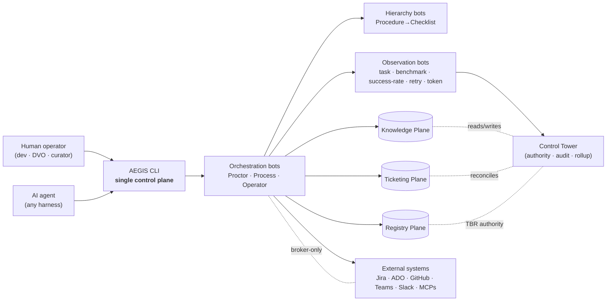

*Legend.* Solid arrows = active call path. Dotted = authority relationship. Everything crossing the boundary between actors and bots crosses the CLI.

---

## 3. Three-plane authority model (one control plane)

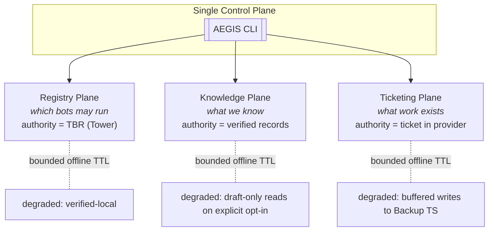

Every plane is authoritative over one domain, reached through the one CLI, and gracefully degradable within a bounded TTL. Past TTL, authority-originating actions refuse. [PLAT-003, PLAT-007]

---

## 4. Bot families

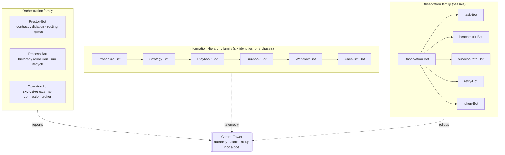

Only Operator-Bot holds connection-pool access; only Proctor-Bot performs routing/gating; Process-Bot walks the hierarchy. Observation bots are strictly read-only. [BOT-002..006, HIE-001..003]

---

## 5. Request-class routing (not one universal chain)

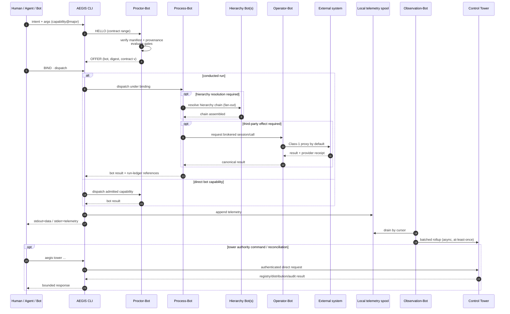

Bot dispatch always enters through CLI/Proctor. Process is present for conducted runs, Hierarchy only when chain work is needed, Operator only for third-party effects, and Tower calls are direct authenticated platform-authority operations rather than an Operator-brokered or universal terminal hop. Every refusal uses the structured error envelope; degradation follows command-specific CLI exit policy. [RUN-001, RP-010 §2, ADR-003 §2.3]

---

## 6. Hierarchy chain resolution (fan-out, not sequential)

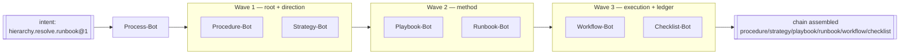

*Wave model (normative basis for NFR-004; corrected 2026-09-13).* Chains are **pre-linked assets**: each tier record stores its child links (ADR-001 object model), so steady-state resolution is parallel fetches of linked records batched into ≤ 3 dependency waves — wave 1 fetches the procedure and its linked strategy, wave 2 the playbook and runbook, wave 3 the workflow set and checklist. Each wave is a **batched fan-out**: one CLI round trip carrying that wave's sub-requests (RP-005 §4, `AEG-HIE-007`: `hierarchy.resolve.chain@1`) — a batch-dispatch primitive owned by the Process-Bot contract. Only *dynamic selection* (an unlinked tier requiring a runtime choice) forces an extra sequential hop, and each such hop is recorded on the run. Waves collapse to a digest comparison on the fast path. Cache is keyed on the participating manifests' digests; any tier redeploy invalidates affected chains. [HIE-004..007]

---

## 7. Container taxonomy + broker symmetry

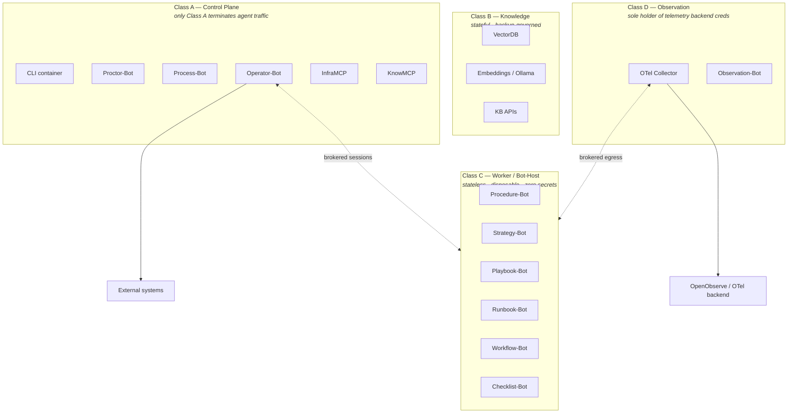

Two altitudes of the same principle: **N workers, zero secrets, one broker** — Operator-Bot brokers external connections, the Collector brokers telemetry egress. [CNT-001..008]

---

## 8. Universal Project Layout

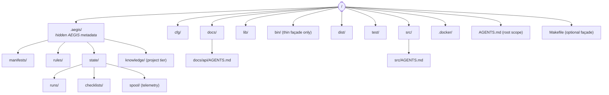

AGENTS.md resolves nearest-first as the CLI walks up from the working directory. `aegis repo validate` enforces the shape; `aegis repo init --from-infraos` converts legacy `.infraOS/` trees. [UPL-001..005]

---

## 9. Manifest handshake (HELLO / OFFER / BIND / VERIFY)

```mermaid
sequenceDiagram
  autonumber
  participant Caller
  participant CLI
  participant Proctor
  participant Registry as MBI (local index)
  participant Bot
  Caller->>CLI: HELLO {contract_range, intent=capability@major}
  CLI->>Proctor: resolve capability
  Proctor->>Registry: lookup capability → bot_uuid, manifest_digest, state
  alt state=quarantined OR expired
    Proctor-->>CLI: refusal PROVENANCE_UNVERIFIED (exit 4)
    CLI-->>Caller: structured error envelope
  else routable
    Proctor->>Proctor: version negotiation (major=match; pick highest overlap)
    Proctor-->>CLI: OFFER {bot, bot_uuid, manifest_digest, contract_version, args_schema_ref}
    CLI-->>Caller: OFFER (or cached digest match — fast path)
    Caller->>CLI: BIND (accept offer)
    CLI-->>Caller: binding_id + TTL
    opt VERIFY (optional, side-effect-free)
      Caller->>CLI: contract validate <payload>
      CLI->>Bot: args_schema check
      Bot-->>Caller: pass/fail (no side effects)
    end
    Caller->>CLI: dispatch under binding
    CLI->>Bot: execute
  end
```

Fast-path steady state is one digest comparison. Any manifest digest change invalidates the binding (`MANIFEST_DIGEST_STALE`). [MAN-004, RP-001 §3]

---

## 10. Registry (MBI + TBR) with verification states

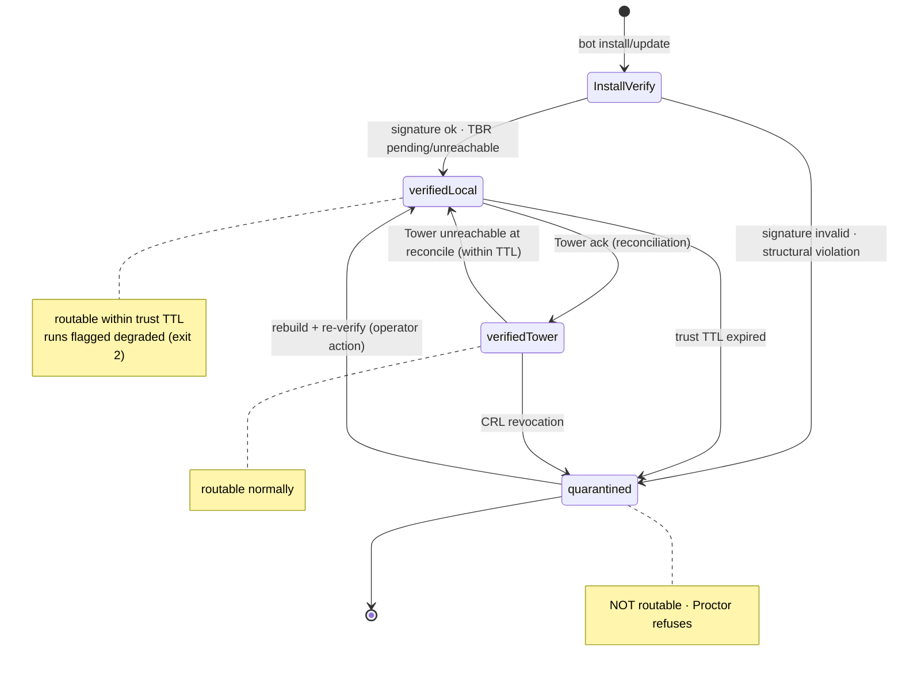

Runtime resolution is always MBI-only; TBR governs registration, keys, revocation. [REG-001..005]

---

## 11. Telemetry: spool-and-drain

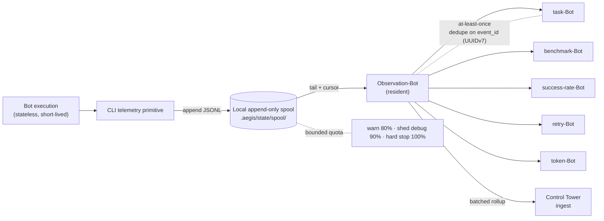

Emit path is a local file append — no network I/O, no Observation-Bot dependency, never fatal. [TEL-001..007]

---

## 12. Knowledge lifecycle & tiered search

### 12.1 Tiered retrieval order

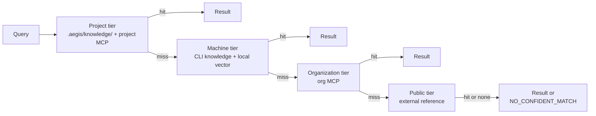

Retrieval honesty: expired TTL is flagged per record, never silently served. [KNO-001, KNO-005]

### 12.2 Draft → Verified lifecycle

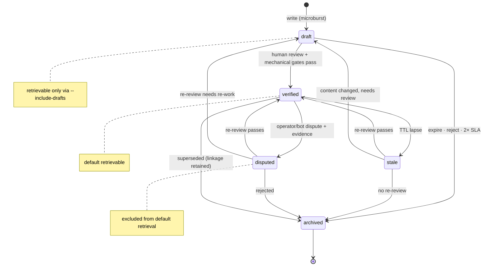

No auto-promotion, ever. [KNO-007..012]

---

## 13. Ticketing Plane — canonical contract, adapters, reconciliation

### 13.1 Overview

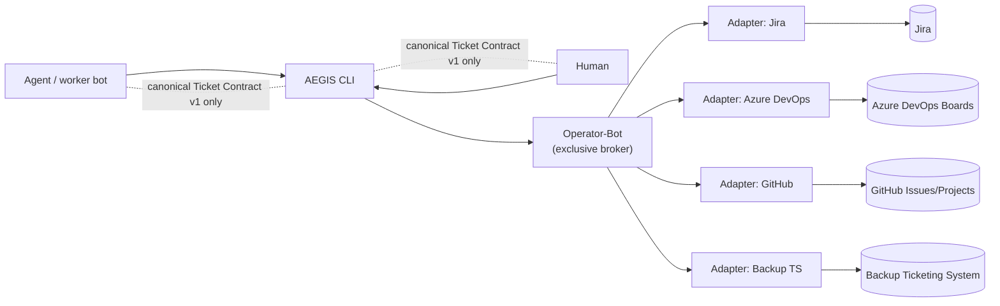

### 13.2 Reconciliation

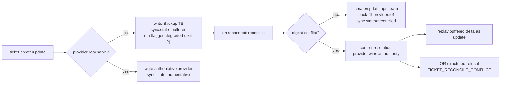

Buffered-beyond-TTL surfaces as degraded and cannot originate deploy authority. [TKT-008..011]

### 13.3 Work + hierarchy + telemetry linkage

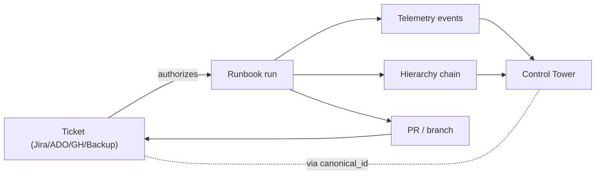

Every run reports `ticket_ref` alongside chain + telemetry — the Tower can enumerate every artifact for a given ticket. [TKT-012]

---

## 14. Container lifecycle

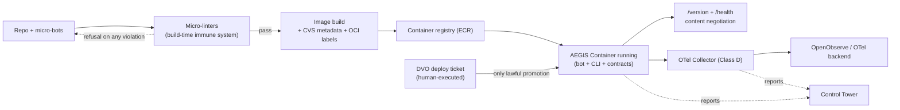

**Nothing un-linted gets containerized.** The DVO ticket is the sole lawful arrow into promotion. [CNT-001..007, TKT-011]

---

## 15. Governance gates — the fifteen refusal points

> **Registry note (2026-09-13):** the canonical registry is **AEGIS-CANON-001 §2** (G01–G15): the ten below plus the four validation gates (RP-007 §5.2) and the Sequence/Barrier Gate (RP-009 §4.2). Canonical dispatch-path order is **Provenance → Contract → Sequence/Barrier → domain gates** — the traversal drawn below is illustrative, not an ordering contract.

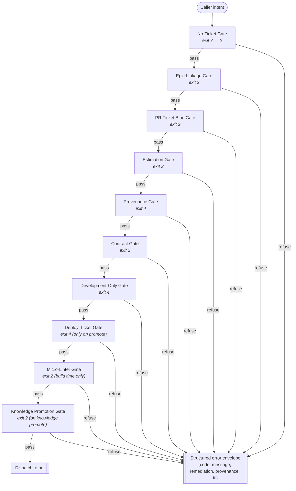

Not every command traverses every gate; the gate applies only when its precondition is present (e.g. Deploy-Ticket Gate only on promotion). Gates are *reactive guards*; the guarantee that every mandatory unit actually runs is owned by the Orchestration Gateway's conductor (§20, ADR-002). [Requirements §14, CANON-001 §2]

---

## 16. Deployment topology

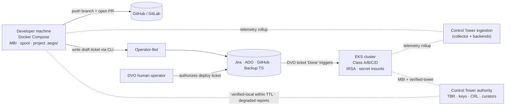

Local + development are agent-writable; testing/staging/production run in EKS and are DVO-only. `verified-local` bots continue during a Tower outage within trust TTL, honestly reporting the degradation. [CNT-007, SEC-004, PLAT-007]

---

## 17. End-to-end run trace (worked example: DVO deploy request)

```mermaid
sequenceDiagram
  autonumber
  participant Dev as Developer / Agent
  participant CLI as aegis CLI
  participant Proctor as Proctor-Bot
  participant Work as Work (Ticketing)
  participant Process as Process-Bot
  participant Hier as Hierarchy chain
  participant Op as Operator-Bot
  participant Ext as Jira (DVO project) + Teams
  participant Obs as Observation-Bot
  participant Tower as Control Tower
  Dev->>CLI: aegis process runbook run dvo-deploy-ticket --context pr_url=… --dry-run
  CLI->>Proctor: gates (No-Ticket, Provenance, Dev-Only, Contract)
  Proctor-->>CLI: OK (dry-run bypasses live mutation)
  CLI->>Process: dispatch
  Process->>Hier: resolve chain (Playbook dvo-deploy-handoff → Runbook dvo-deploy-ticket → Workflow devops/dvo-deploy-request → Checklist)
  Hier-->>Process: chain assembled
  Process-->>CLI: dry_run=true JSON plan (exit 0)
  Note over Dev,CLI: developer reviews plan, drops --dry-run
  Dev->>CLI: aegis process runbook run dvo-deploy-ticket … --yes
  CLI->>Proctor: gates + Estimation + Epic + PR-Ticket-Bind
  Proctor-->>CLI: OK
  CLI->>Process: dispatch live
  Process->>Op: Jira create + Teams announce (brokered, idempotency-keyed)
  Op->>Ext: side effects
  Ext-->>Op: results
  Op-->>Process: results
  Process->>CLI: checklist updates + result envelope (exit 0)
  Process->>Obs: telemetry (task.end · tokens · retries · work.ticket.status_change)
  Obs->>Tower: rollup (batched)
  Note over Tower: Deploy-Ticket Gate closed — human DVO operator now executes; agent never deploys.
```

This is the concrete "Ticketing Plane → Container promotion" arrow enforced by AEGIS: builder + verifier (agent), operator (human). [TKT-011, CNT-007]

---

## 18. Cross-cutting invariants (one-page summary)

| Invariant | Enforced by | Requirement |
|---|---|---|
| Only the CLI terminates agent traffic | Container Class A design; static analysis | PLAT-001, CNT-001 |
| Refuse-never-guess on any contract mismatch | Proctor gates + manifest validation | PLAT-004, MAN-002 |
| Provenance verified before dispatch | Proctor + MBI verification states | SEC-003, REG-003 |
| Zero baked secrets | Operator-Bot broker + Collector broker | SEC-002, CNT-004, CNT-008 |
| No auto-promotion (knowledge or work) | Knowledge Promotion Gate + Deploy-Ticket Gate | KNO-009, TKT-011 |
| Bounded offline trust | Trust TTL on MBI, spool, backup TS | PLAT-007, REG-004, TEL-005, TKT-009 |
| Telemetry never fatal | Spool-and-drain never blocks emitters | TEL-002 |
| Hierarchy chain traceable end-to-end | `hierarchy_chain` on every event, ticket link | TEL-007, TKT-012 |
| Universal project shape | `.aegis/` + AGENTS.md chain + `aegis repo validate` | UPL-001..004 |
| Nothing un-linted gets containerized | Micro-Linter Gate at build time | CNT-006 |

---

## 19. Validation fabric — four immune altitudes (RP-007)

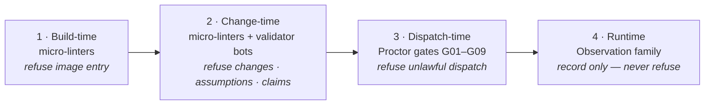

Build-time and change-time share the same micro-linter binaries; only the trigger scope differs. Change-time units: micro-linters (pure, exit 0|2), validator bots (`val-*`, Proctor-owned), suites, and the run-scoped assumption ledger. Enforcement fails closed; observation fails open. [AEG-VAL-001..015, RP-007 §1–§5]

---

## 20. Orchestration Gateway — three layers (RP-009, per ADR-002)

```mermaid
flowchart LR
  E["EVENTS trigger<br/>fs.write · git.stage · claim.step.done<br/>ci.* · run.finalize"] -->|append to events.jsonl| CD["CONDUCTOR decides<br/>Process-Bot saga state machine<br/><i>state = fold of run log</i>"]
  CD -->|admissible?| GW["GATEWAY enforces<br/>Proctor · Sequence/Barrier Gate (G03)<br/>+ existing gates"]
  GW -->|admit / refuse| CD
  CD --> WK["Linters · validators · worker bots<br/><i>auto-invoked on events</i>"]
  WK -->|verdicts + evidence| CD
  CD -->|run.finalize| RC["val-completeness-Bot<br/>required-set vs executed-set"]
  RC -->|gap| REF[["REFUSE run.complete<br/>COMPLETENESS_GAP"]]
  RC -->|clean| FIN(["run.finalized ✓"])
```

**Events trigger, the conductor decides, the gateway enforces.** The plan is data (a graph over Runbook/Workflow/Checklist assets); the agent fills step content and *requests* completion—only Process-Bot advances run state. Within RP-013's cooperative-but-fallible trust model, finalize checks the graph-derived required set against the authoritative run/evidence ledgers with telemetry correlation; adversarial-local integrity requires the phased hash-chain/Tower hardening. No bus, no new plane, no new top-level domain. [AEG-GW-001..015, ADR-002, TS-002, AEG-THR-001]

---

*Draft v0 — visual companion to AEGIS-REQ-CORE-001 (amended 2026-09-13 per ADR-002/003/004, RP-007/009, CANON-001). Diagrams are non-normative; the numbered requirements are authoritative. Amend as designs evolve.*
