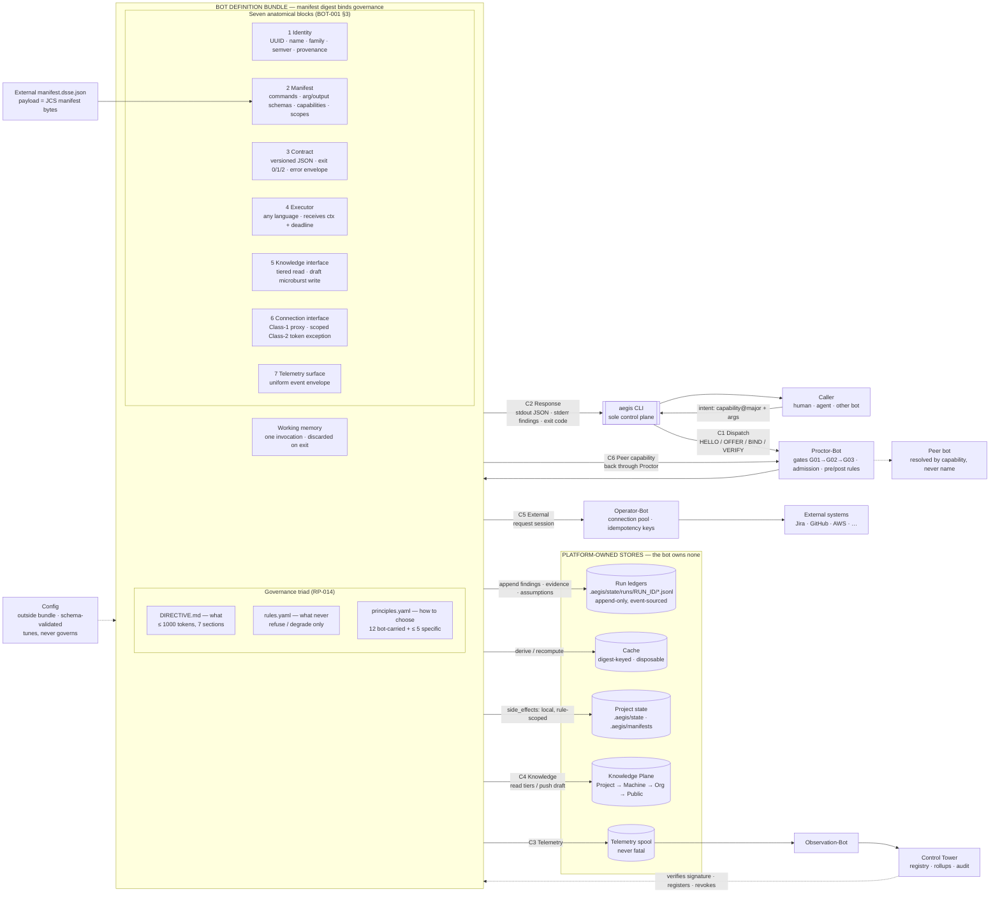
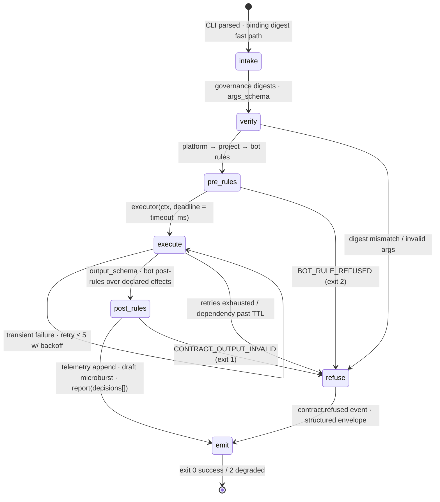

# AEGIS-ARCH-002 — Bot Unit Compendium
## Taxonomy · Family Profiles · Anatomy · Operating Characteristics · Executive Summary (Stakeholder Companion)

- **Document ID:** AEGIS-ARCH-002
- **Status:** DRAFT — synthesis pending operator review (PENDING-EDITS §6, D9)
- **Date:** 2026-09-14
- **Author:** Oz (Agent), commissioned by Raymond Bayly (BaylyAI)
- **Synthesizes:** AEGIS-REQ-BOT-001 (taxonomy, seven-block anatomy, command contract); AEGIS-RP-005 (hierarchy chassis); AEGIS-RP-007 (validators, cost ladder); AEGIS-RP-008 (launch roster); AEGIS-RP-009 / TS-002 (conducted runs, `val-completeness-Bot`); AEGIS-RP-011 (Operator pool); AEGIS-RP-014 (governance triad, memory model, six channels, lifecycle); AEGIS-CANON-001 §6 (26-bot roster)
- **Companion to:** AEGIS-ARCH-001 (platform diagrams); proposed AEGIS-CANON-002 (HATHOR platform principles)
- **Scope rule:** synthesis and stakeholder communication only. This document introduces **no new doctrine**; where it appears to disagree with a source paper or CANON-001, the source wins and this document owes an amendment.

RFC 2119 keywords are quoted from source papers, not minted here.

---

## 0. Purpose & how to read

The corpus specifies the bot unit across a dozen papers. Stakeholders asked for one place that answers, in order: *what bots exist*, *what each family is for*, *how a bot is built and operated*, *how the families differ operationally*, and *why it matters to the business*. This document is that place.

- **§1** is the executive summary — read this alone if you have five minutes.
- **§2–§3** are the taxonomy and family profiles.
- **§4–§5** are the anatomy, first technically, then in business terms.
- **§6** compares the families on memory, performance, and state management.
- **§7–§9** carry traceability, open items, and promotion criteria.

---

## 1. Executive summary

### 1.1 What it is
HATHOR is the broader agentic-application framework; AEGIS is its concrete governance and control-plane realization, exposed publicly through the `aegis` CLI. AEGIS delivers automation as a fleet of **26 small, single-purpose "microbots"** governed through that one public ingress while Registry, Knowledge, and Ticketing remain authoritative for their own domains. The Control Tower is the asynchronous registry, distribution, audit, and rollup authority — not the terminal hop of every request. Each bot does exactly one job; combining jobs happens only at the orchestration layer, never inside a bot. The design goal is automation that is **cryptographically attributable, auditable by default, and incapable of declaring its own success** within the v1 trust boundary.

### 1.2 The roster at a glance
- **Orchestration (3)** — the control spine. *Proctor* admits and gates bot dispatch; *Process* conducts each run and is the only actor allowed to advance its state; *Operator* is the sole broker for third-party connections and the only resolver of long-lived provider credentials. Explicit Class-2 flows may give a worker a scoped, short-lived, memory-only token.
- **Validation (11, Proctor-owned)** — the "change-time immune system." Single-responsibility validators check diffs, contracts, assumptions, registry state, tickets, hierarchy integrity, knowledge hygiene, claims, drift, command evidence, and end-of-run completeness. They can refuse; they can never write authoritative state.
- **Information Hierarchy (6)** — traceability from intent to execution: Procedure → Strategy → Playbook → Runbook → Workflow → Checklist. Every conducted unit of work must resolve to its required complete chain; the checklist is the completion ledger.
- **Observation (6)** — the passive nervous system. A resident drain plus five children track tasks, latency, success rates, retries, and token spend, rolling everything up to the Tower. They only record; they never refuse or mutate.

External systems (Jira, GitHub, AWS, Azure, Firebase) are **connection adapters under Operator, not bots**. Roster expansion requires an ADR (`AEG-MBL-002`).

### 1.3 How a bot is built
A bot is a **signed bundle design**, not a running service: identity, machine-readable manifest, versioned contract, executor (any language), knowledge and connection interfaces, telemetry surface, plus a **governance triad**—a bounded *directive* (what it is for), mechanically enforced *rules* (what it must never do; they can only tighten platform policy, never loosen it), and *principles* (how it chooses when rules are silent, made visible in every run report). The signed manifest digest binds the interface and governance triad, so a governance behaviour change requires re-signing, re-registration, and caller rebinding. Manifest 1.1.0 does not yet bind executor bytes; that interface blocker is recorded as PENDING-EDITS R10 rather than hidden by an “all of it” claim. Configuration sits outside the seal and can tune but never override.

### 1.4 How a bot operates
- **Stateless and event-sourced.** A bot holds working memory for one invocation only. Run state is the fold of an append-only log owned by Process; every other bot reads it and *requests* progress. Executions and external effects are idempotency-keyed, so a bot killed at any instant loses nothing and re-dispatch never double-commits.
- **Externalised memory.** No private stores, no private learning. Durable memory lives in sanctioned tiers — run ledgers, disposable caches, the Knowledge Plane, the Ticketing Plane, the telemetry spool. The only cross-run learning is a draft knowledge record a human may promote. Operator alone resolves long-lived provider credentials; a Class-2 token is an audited, scoped, short-lived exception that a worker holds only in memory. Platform identity and signing keys are governed separately from provider credentials.
- **Bounded performance.** Liveness under 250 ms, per-command timeouts, retries capped at five, a validation cost ladder from 50 ms to 10 minutes that is diff-scoped by default, and per-run token accounting.
- **Honest failure.** Bot executors have the `0|1|2` contract; the CLI has a wider, command-specific exit taxonomy. Both use the standard error envelope, and every refusal names the remediation. Bots degrade within a bounded trust window and refuse authority-originating actions past it. **Enforcement fails closed; observation fails open** — unreadable state blocks mandatory work, but telemetry trouble never does.
- **Six bot communication channels, one doorway.** Dispatch, response, telemetry, knowledge, brokered external, and peer-by-capability are versioned JSON and CLI-mediated. Run, ticket, binding, and hierarchy references correlate the authoritative run ledger, provider receipts, and telemetry/Tower views; telemetry is not the sole reconstruction source.

### 1.5 Lifecycle and governance controls
Create from a family template → self-test in isolation → sign → register locally, then with the Tower → operate → evolve by semver with side-by-side contract versions during breaking changes → retire by revocation naming a successor. Provenance is verified before bot dispatch; unregistered or tampered bundles are quarantined. Fifteen mechanical gates, twenty structural linters, and a fixed refusal-code registry (CANON-001) enforce the doctrine against cooperative-but-fallible actors without relying on them to remember each step.

**Trust boundary.** Per RP-013, v1 mechanical guarantees hold against a cooperative-but-fallible agent using platform interfaces. A fully adversarial local process with arbitrary workspace-file access is outside v1 prevention guarantees and is instead a detection and hardening concern. Claims such as "no skip," "only Process appends transitions," and "human-only" must be read inside that boundary.

### 1.6 Why it matters
- **Risk:** no shadow integrations, no secret sprawl, no untraceable actions; every mutation ties to a ticket and a hierarchy chain.
- **Assurance:** completion is proven by recorded evidence and a finalize-time reconciler, not by an agent's narrative.
- **Cost:** bounded latency, diff-scoped validation, and ledgered token spend keep automation predictable.
- **Agility:** any bot can be rebuilt, replaced, or retired independently in any language, with callers steered automatically to the successor.
- **Auditability:** bot judgement is observable — rule-violation and principle-usage rates surface drift before it becomes incident.

### 1.7 Current status (as of 2026-09-14)
The corpus contains several accepted design decisions, including the bot-unit specification (RP-014, 2026-09-13), while CORE, RP-009, TS-001–003, this synthesis (D9), and the platform-principles set (D10) remain draft or proposed. PLAN-001 sequences delivery, with the P0 slice being Proctor, Process, Operator, the DVO hierarchy chain (`procedure` stub, `runbook`, `workflow`, `checklist`), and the diff/contract validator mechanisms (RP-008 §6). Open interface and phasing decisions remain recorded in the source papers and `PENDING-EDITS.md`, including ownership of `.aegis/state/` retention/cleanup (RP-008 §7 Q1).

---

## 2. Taxonomy — the canonical 26-bot roster

Authority for membership: CANON-001 §6. Definitions: BOT-001 §2, RP-007 §5, RP-008 §4, RP-009 §7.4. Every bot is a single-role microbot (`AEG-BOT-TAX-001`) reachable publicly only through the `aegis` CLI (`AEG-BOT-TAX-006`). Bot dispatch enters through CLI/Proctor; Process participates for conducted runs, Operator only for third-party effects, and Tower interactions are separate asynchronous platform-authority operations.

### 2.1 Orchestration family (3) — fixed, `AEG-REQ-BOT-003`

| Bot | Definition | Drift it stops |
|---|---|---|
| `proctor-Bot` | Contract validation, capability routing, and gate evaluation (HELLO/OFFER/BIND/VERIFY handshake). Every dispatch passes through it. | Ungated dispatch; bots addressed by name instead of capability |
| `process-Bot` | Run lifecycle, hierarchy-chain attachment, step-boundary orchestration (the "conductor"). Sole appender of `node.*` / `run.*` / `gateway.*` transitions. | Work with no attached hierarchy chain or run record |
| `operator-Bot` | Exclusive third-party connection broker and session-pool manager; the only bot that touches the Connection Pool or resolves long-lived provider credentials. | Worker bots persisting provider credentials or linking provider SDKs directly |

The **Control Tower is not a bot** (`AEG-REQ-BOT-006`); it is the authenticated asynchronous authority surface reached directly by the CLI via `aegis tower …`, never through Operator and never as a mandatory request-path hop (RP-010 §2).

### 2.2 Validation roster (11) — Proctor-owned extension, `role=validator` (RP-007 §1.3, §5; RP-009 §7.4)

Not a fourth family: validators sit inside the Orchestration family (`family=orchestration`, `role=validator`, `parent=proctor-Bot`) because Observation bots may never refuse and validation must. Named `val-<x>-Bot` wherever a plane-facing capability shares the root (`AEG-MBL-006`).

| Bot | Definition |
|---|---|
| `val-diff-Bot` | Computes the change set, maps it to linter scope, flags unscoped writes |
| `val-contract-Bot` | Args/output JSON-schema checks, claim-tier sufficiency, stdout/stderr stream discipline |
| `val-assumption-Bot` | Assumption-ledger CRUD, TTL tracking, recheck scheduling, human-only waive |
| `val-registry-Bot` | Port ownership, bot routability, manifest digest freshness (read-only over the MBI) |
| `val-ticket-Bot` | Mid-run re-check of no-ticket / epic-linkage / estimation / PR-bind / deploy preconditions |
| `val-hierarchy-Bot` | Chain completeness, checklist↔runbook sync, stale chain digests |
| `val-knowledge-Bot` | Draft/verified honesty, TTL flags, secret/PII redaction preflight on microbursts |
| `val-claim-Bot` | Maps claim type → required suite tier; verifies evidence exists (`CLAIM_TIER_INSUFFICIENT`) |
| `val-drift-Bot` | Repo layout drift, Makefile façade violations, legacy path usage |
| `val-evidence-Bot` | Attests that cited commands actually ran (exit codes, report digests in the ledger) |
| `val-completeness-Bot` | Finalize-time reconciler: within the RP-013 trust boundary, checks the graph-derived required set against authoritative run/evidence ledgers with telemetry correlation (`COMPLETENESS_GAP`) |

### 2.3 Information Hierarchy family (6) — fixed, `AEG-BOT-TAX-004`

Six tier bots, one shared chassis (RP-005: consolidation rejected), each resolving only its own tier and delegating downward: `Procedure → Strategy → Playbook → Runbook → Workflow → Checklist`.

| Bot | Definition | Drift it stops |
|---|---|---|
| `procedure-Bot` | Roots a unit of work in a stated business problem and required outcome | Work starting mid-stack with no procedure of record |
| `strategy-Bot` | Resolves direction options under a procedure (one procedure, many strategies) | Implicit strategy choices agents invent mid-run |
| `playbook-Bot` | Resolves the guidelines that implement a chosen strategy | Guidelines applied ad hoc, untraceable to a strategy |
| `runbook-Bot` | Resolves the concrete task set that is the execution entry point; under the Orchestration Gateway its assets derive the process graph the conductor drives | Runbooks used as a read-only catalog instead of an execution entry |
| `workflow-Bot` | Resolves the scripts/tools that progress a runbook to completion | Workflows run detached from their owning runbook |
| `checklist-Bot` | Tracks step completion until the runbook succeeds (the completion ledger) | "Done" claimed with no step-level completion record |

### 2.4 Observation family (6) — fixed, `AEG-BOT-TAX-005`

Strictly passive: read/record only; never mutates work products, knowledge tiers, or connections; never refuses. All telemetry rolls up to the Tower.

| Bot | Definition | Drift it stops |
|---|---|---|
| `observation-Bot` (parent) | Resident spool drain; fans telemetry out to children; rolls up to the Tower. Implements `drain\|stop` (`AEG-BOT-CMD-019`) | Telemetry that never leaves the local spool |
| `task-Bot` | Per-run task-lifecycle accounting from the spool; holds the ephemeral run ledger view | Runs with no task-level record |
| `benchmark-Bot` | Measures suite/run latency against L0–L4 tier budgets | Invisible budget breaches |
| `success-rate-Bot` | Tracks pass/fail rates by class and capability (incl. validation pass rates, principle-usage distributions) | No quality-trend signal over time |
| `retry-Bot` | Records retry counts/outcomes per run; makes the 5-attempt cap auditable; spots recheck storms | Silent retry beyond the cap |
| `token-Bot` | Per-run token/cost accounting | Unbounded agent spend with no ledger |

### 2.5 Explicitly not bots (RP-008 §3)
Control Tower (authority surface); connection adapters (Atlassian/GitHub/AWS/Azure/Firebase — Operator pool entries, `AEG-MBL-003`); Knowledge, Init, Human, Documentation, Ticket, and Provenance "services" from the original outline (folded into existing capabilities or corrected). The **Cleaner/maintenance** candidate is an open gap deferred to an ADR.

---

## 3. Family profiles

**Orchestration family (3 bots).** The Orchestration family is the control spine of AEGIS and consists of `proctor-Bot`, `process-Bot`, and `operator-Bot`; the Control Tower is a separate non-bot authority for registry, distribution, audit, and rollups. Proctor-Bot is the bot-dispatch front door: it runs the HELLO/OFFER/BIND/VERIFY handshake, validates the JSON contract, routes by capability rather than by bot name, and evaluates applicable mechanical gates. Process-Bot is the conductor for conducted runs: it opens and folds the run, attaches the hierarchy chain, drives the process graph, and is the only platform actor allowed to append `node.*`/`run.*` state transitions — agents merely submit requests. Operator-Bot is the exclusive third-party connection broker; it alone touches the Connection Pool and resolves long-lived provider credentials, using Class-1 proxy sessions by default and declared Class-2 scoped tokens only by exception. Tower reconciliation and query calls go directly from the authenticated CLI, because brokering the platform authority through Operator would invert the trust relationship (RP-010 §2).

**Validation roster (11 bots, Proctor-owned extension).** The Validator-Bots form the active half of the Continuous Validation System — the "change-time immune system" that fills the gap between build-time micro-linters and dispatch-time gates. Because Observation bots are forbidden from refusing anything and validation must refuse, RP-007 placed these bots inside the Orchestration family as a Proctor-owned roster rather than creating a fourth family; this remains the only sanctioned extension of the fixed rosters, and any further growth requires an ADR. Each validator owns one responsibility and is reachable only through Proctor as a `validation.*` capability. They return structured verdicts (`pass | fail | degraded | inconclusive`) in a shared Finding envelope, write no authoritative state (`AEG-VAL-011`), and back gates G10–G13 and the finalize reconciler — so an agent's work is mechanically admitted or refused rather than taken on faith.

**Information Hierarchy family (6 bots).** The Information Hierarchy family gives every conducted unit of work a traceable lineage from business intent to executed step through six tier bots that chain strictly downward. Procedure roots the work in a stated business problem and required outcome; Strategy resolves the direction options under that procedure; Playbook supplies the guidelines that implement the chosen strategy; Runbook resolves the concrete task set that is the execution entry point and, under the Orchestration Gateway, supplies assets from which the conductor derives its process graph; Workflow resolves the scripts and tools that progress the runbook; and Checklist is the completion ledger that tracks step-level progress until the runbook succeeds. RP-005 settled that these are six distinct identities on one shared chassis—consolidation was rejected—with fan-out chain resolution (batched via `hierarchy.resolve.chain@1`, `AEG-HIE-007`) so that each bot resolves only its own tier and delegates the rest. The drift this family stops is work that starts mid-stack with no procedure of record, guidelines applied ad hoc, and "done" claimed without a step-level completion record.

**Observation family (6 bots).** The Observation family is the platform's passive nervous system: `observation-Bot` as the resident parent plus five children. Its defining rule is that it only reads and records; it never mutates work products, knowledge tiers, or connections, and it never refuses. Telemetry moves by spool-and-drain (RP-003): the CLI appends uniform events to a local spool, Observation-Bot drains it, fans the events out to its children, and rolls everything up to the Control Tower so per-bot, per-project, and per-machine operational views can be derived consistently (`AEG-BOT-OBS-002`). Observation is engineered to be never-fatal (`AEG-REQ-TEL-002`) — a full or failed spool degrades `status` to exit 2 but never blocks the business path — which is exactly why it cannot be the home for anything that needs to say no.

---

## 4. Anatomy of the bot unit

Sources: BOT-001 §3 (seven blocks) and §6 (command contract); RP-014 §2–§6 (governance triad, memory tiers, six channels, lifecycle); RP-007 §3.2 (cost ladder).

### 4.1 Structural diagram — the bot unit and everything it touches

### 4.2 Invocation state machine (non-resident bot; RP-014 §4.4)

### 4.3 Structure — a bot is a signed contract artifact, not a process
A HATHOR bot is a **Bot Definition Bundle**: one directory containing `manifest.json`, external `manifest.dsse.json`, `DIRECTIVE.md`, `rules.yaml`, `principles.yaml`, an `executor/` in any language, and `fixtures/` for self-test. The DSSE payload is the RFC 8785 JCS-canonical manifest bytes; governance-file digests inside the manifest make that signature cover the interface and governance triad without circular representation. A governance change is therefore a contract change: editing a directive produces a new digest, forces re-sign and re-register, and invalidates every live binding (`MANIFEST_DIGEST_STALE`). The current schema has no executor/image/artifact digest, so executor-byte coverage remains the explicit R10 interface blocker; this synthesis does not claim otherwise.

The seven anatomical blocks (BOT-001 §3) are the fixed skeleton: **Identity** (who it is and where it came from), **Manifest** (what it offers — any undeclared command is refused by the CLI, `AEG-BOT-CMD-004`), **Contract** (how it speaks — versioned JSON, canonical exit codes, standard error envelope), **Executor** (the role logic, code-agnostic; conformance is proven by `selftest`, not code inspection, `AEG-BOT-ANA-004`), **Knowledge interface**, **Connection interface**, and **Telemetry surface**.

### 4.4 Governance — directive says *what*, rules say *what never*, principles say *how to choose*, config says *how much*
- **Directive** is the bot's charter: seven required sections (Purpose, Scope, Inputs & outputs, Success, Refusal & degradation, Memory, Escalation), capped at 1,000 tokens (`AEG-BOT-GOV-002`). For mechanical executors (all 26 v1 bots) it is the conformance target that fixtures are derived from; for the exceptional agent-backed executor it is injected as the base instruction *after* digest verification.
- **Rules** are pure, platform-evaluated predicates (JSON Schema by default, sandboxed CEL opt-in) with exactly two effects — `refuse` or `degrade`. There is no `allow`/`skip`/`waive` vocabulary, so a bot rule can only *narrow* what platform and project rules already permit; precedence is evaluation order (platform → project → bot → directive, `AEG-BOT-GOV-008`). **The platform evaluates rules, not the executor** (`AEG-BOT-GOV-004`): a Python bot and a Go bot with the same rules are refused identically. Pre-rules run before the executor (`BOT_RULE_REFUSED`, exit 2); post-rules run over the bot's self-declared `effects` (`CONTRACT_OUTPUT_INVALID`, exit 1; output withheld; never auto-compensated).
- **Principles** are decision heuristics for where rules are silent — twelve non-removable, mutually unranked bot-carried principles (`aegis-principles@1`, RP-014 §3.5.1) plus at most five bot-specific principles, ranked by list order, that must each trace to the carried set. They are not enforceable, so they are made **observable**: every discretionary choice lands in `report.decisions[]` with the governing principle (`AEG-BOT-GOV-007`), and the Tower tracks decision-by-principle distribution to detect judgement drift.
- **Config** lives *outside* the bundle (`--flag` → project → machine → defaults), is validated against `runtime.config_schema`, holds connection *names* only, and cannot relax a rule — operators can retune without re-signing.

### 4.5 Identity, provenance and trust
Identity is UUID + canonical `<role>-Bot` name + family/tier + semver + provenance (builder, source commit, build time); the signature lives only in the external DSSE envelope. Registration verifies that envelope against cached TUF keys, re-derives every governance digest from disk, applies structural rules, and moves the bot `verified-local` → Tower ack → `verified-tower` (RP-002 §3.2, RP-010 §3.1). Failure means `quarantined` and `PROVENANCE_UNVERIFIED`; the Provenance Gate (G01) refuses to route to anything unverified. A `verified-local` bot may run within a bounded trust TTL (72 h default) with runs flagged `degraded`. Independence is five testable properties (RP-014 §1): own definition, builds/tests alone, no shared mutable memory, fails alone, evolves alone—collaborators are declared as *capabilities* and resolved late. An unresolved optional dependency degrades readiness/status; attempted dispatch of an absent capability refuses with `CAPABILITY_UNKNOWN` and CLI exit 3.

### 4.6 Communication — exactly six channels, all versioned JSON, all CLI-mediated (RP-014 §5)

| # | Channel | Direction | Transport / contract | On failure |
|---|---|---|---|---|
| C1 | Dispatch | in | CLI → Proctor → bot via HELLO/OFFER/BIND/VERIFY; capability `<domain>.<noun>.<verb>@<major>`; `args_schema` | gate refusal envelope (G01 → G02 → G03 first) |
| C2 | Response | out | stdout data · stderr progress/findings · exit `0\|1\|2`; `output_schema`; JSON default, `--human` for text | `CONTRACT_OUTPUT_INVALID`; never partial JSON |
| C3 | Telemetry | out | CLI primitive → project spool append; event envelope v1 | never fatal; `status --group telemetry` → 2; undeclared event → dead-letter |
| C4 | Knowledge | in / out | tiered search Project → Machine → Org → Public; draft microburst push; record v1 | miss is a result (`NO_CONFIDENT_MATCH`), not an error; write refused on missing metadata / secrets |
| C5 | External | out | Operator-Bot session (proxy default; scoped token by exception); idempotency key | CLI exit 6 on dependency/breaker refusal; otherwise declared `degraded_fallback` / buffered write |
| C6 | Peer capability | out | CLI → Proctor → other bot (never direct); `requires_capabilities[]`; subject to Sequence/Barrier Gate in a run | attempted unresolved dispatch refuses `CAPABILITY_UNKNOWN` with CLI exit 3; optional dependency may degrade readiness |

Cross-cutting: contract major must match (`CONTRACT_NO_OVERLAP` rather than best-effort); stream discipline (data on stdout, everything else on stderr); no inbound listener ever (`AEG-THR-007`); transitions are *requests* the conductor evaluates (`AEG-GW-001`); every outbound message carries `run_id`, `binding_id`, `hierarchy_chain`, and `ticket_ref` so telemetry can be correlated with the authoritative run ledger and provider receipts (`AEG-REQ-TEL-007`).

### 4.7 State management — stateless, event-sourced, request-not-declare
A bot is **stateless between invocations** (`AEG-REQ-BOT-009`, `AEG-BOT-RUN-002`). Run state is the fold of `events.jsonl`; **only Process-Bot appends transitions**. Every other bot reads state by folding into working memory, appends only its own emitter-scoped records (findings, evidence, assumptions, telemetry), and *requests* transitions (`node complete`, `claim.step.done`) that the gateway evaluates (`AEG-BOT-MEM-004`). Execution is keyed `(run_id, node_id, attempt)` and external effects carry Operator idempotency keys (RP-011 §4), so a worker killed mid-step is simply re-dispatched with no double-commit. Concurrency is safe by construction: ledger appends use `flock` + `O_APPEND` (TS-001 §8.2), caches are content-addressed with atomic rename, and conflicting same-run transitions fold deterministically and surface `degraded` (`AEG-THR-008`).

### 4.8 Memory — the bot owns no store (RP-014 §4.2)

| Tier | Scope | Location | Bot may write | Loss / rebuild rule |
|---|---|---|---|---|
| Working | one invocation | process memory | yes — discarded at exit | lost on kill, by design |
| Run ledgers | one run | `.aegis/state/runs/<run_id>/{events,findings,evidence,assumptions}.jsonl` | append-only via CLI (transitions: Process-Bot only) | state = fold; dedupe on `event_id` |
| Cache | project / machine | `.aegis/state/cache/<subsystem>/` | yes | digest-keyed; delete and recompute; never authoritative (`AEG-BOT-MEM-002`) |
| Project state | project | `.aegis/state/checklists/`, `.aegis/manifests/` | only with `side_effects: local` + scoping rule | git; re-derive from ledgers |
| Knowledge | cross-run, cross-bot | project files / machine dir / org MCP (RP-012 §3) | **draft microbursts only**, mandatory metadata, redaction pre-commit | files are truth; index rebuilds |
| Work | cross-run | Ticketing Plane via Operator | via `work.ticket.*` only | provider wins; reconcile |
| Telemetry | append-only | project spool → Tower | append via CLI primitive; never fatal | replay safe (at-least-once, deduped) |
| Resident | one resident process | cursors, Operator pool + idempotency window (≥ trust TTL), MBI index, chain cache | yes, bounded | reconstructible from spool / ledgers / Tower (`AEG-BOT-MEM-003`) |

A bot **does not learn privately** (`AEG-BOT-MEM-005`): its only cross-invocation learning is a draft knowledge record a human may verify. It may never persist a provider credential or token (including a Class-2 token beyond its in-memory lifetime), another bot's state, a `verified` record it minted itself, or run progress outside the ledger (RP-014 §4.7).

### 4.9 Performance — bounded budgets at every layer
- `health` < 250 ms, no network calls, safe to poll (`AEG-BOT-CMD-010`); `status` deep checks in seven slim groups (`AEG-BOT-CMD-011`).
- Every command declares `timeout_ms`; the executor receives a deadline.
- Transient failures retry ≤ 5 with backoff, recorded by `retry-Bot`; exhaustion yields a failure report with full context (`AEG-BOT-RUN-004`).
- Validation cost ladder (RP-007 §3.2): L0 ≤ 50 ms (single file), L1 ≤ 2 s (changed paths), L2 ≤ 30 s, L3 ≤ 10 min, L4 async — diff-scoped by default (`AEG-VAL-007`); `benchmark-Bot` measures breaches (`AEG-VAL-012`).
- Directives ≤ 1,000 tokens; caches digest-keyed; binding-digest fast path skips the full handshake on repeat dispatch; `token-Bot` keeps a per-run cost ledger.

### 4.10 Reliability and degradation — refuse, never guess; degrade honestly
Bot-boundary exits are `0` success, `1` failure, and `2` degraded/warning (`AEG-BOT-CMD-002`); the CLI maps envelopes to its wider canonical exit taxonomy, including 3 for capability, 4 for policy/provenance, and 6 for dependency failures. Every failure emits `{code, message, remediation, provenance, ttl}` (`AEG-BOT-CMD-003`); every refusal names what must happen next (`AEG-GW-014`, `aegis proctor gateway explain`). On dependency loss a bot consults its declared `degraded_fallback`, continues within trust TTL with `degraded:true` only where policy permits, and refuses authority-originating actions past TTL (`AEG-BOT-RUN-003`, `AEG-REQ-PLAT-007`). **Enforcement fails closed, observation fails open** (`AEG-GW-013`, `AEG-REQ-TEL-002`). Resident bots implement `drain` → `stop` with no in-flight loss, are single-instance per machine, and rebuild operational state from authoritative ledgers, provider receipts, and replayable spools.

### 4.11 Security posture
No long-lived provider credential appears in a worker bot's config, logs, knowledge writes, or durable memory (`AEG-BOT-ANA-006`). Sessions are brokered by Operator-Bot, which alone touches the pool and resolves provider secrets (secrets manager → project env → credentials file, fallbacks flagged degraded, `AEG-BOT-SEC-001/002`); a declared Class-2 worker may hold a scoped token in memory only for its short TTL. Tower-issued human identity tokens and machine/signing keys follow RP-010/RP-013 rather than the Operator provider-credential path. No public listeners; when a bot leaves the single binary its transport is authenticated UDS or mTLS inside the Class A boundary (`AEG-THR-007`). Build-time micro-linters enforce the structural portions (`ml-no-listener`, `ml-broker-symmetry`, `ml-secrets-layer`, `ml-secrets-diff`), and every microburst passes a layered redaction scan before commit (`AEG-BOT-KNO-006`, `AEG-THR-005`).

### 4.12 Observability
Every bot emits the same event envelope (`AEG-BOT-OBS-001`), so Observation children consume any bot with zero adapters. `report` carries the hierarchy chain reference, telemetry summary, and `decisions[]` (`AEG-BOT-CMD-018`). `status --group governance` verifies digests, rule-fixture health, and principle-set version. The Tower derives per-bot, per-project, and per-machine operational views from deduplicated telemetry and correlates them with authoritative run/evidence ledgers and provider receipts; telemetry alone is not run-state authority.

### 4.13 Lifecycle (RP-014 §6)
**Create** (`aegis tower bots init`; must be a roster member or ADR-authorized) → **Build & sign** (linters, `selftest`, JCS manifest digest, external DSSE; executable binding pending R10; container class A for orchestration, C for hierarchy/validators, D for observation) → **Register** (MBI `verified-local` → Tower `verified-tower`) → **Operate** (dispatch or resident loop) → **Evolve** (any governance or executor change bumps version, re-signs, invalidates bindings; breaking contracts offer `@1` and `@2` side by side) → **Retire** (CRL revocation with `reason=retired` and a successor; the MBI quarantines before the next dispatch; refusals point callers to the successor capability, `AEG-BOT-LIF-005`). Knowledge and telemetry the bot authored survive with provenance intact.

---

## 5. The anatomy in business terms

A HATHOR bot is best understood as a **certified, single-purpose component** rather than a piece of software you run. Its signed manifest binds identity, contract, and the digest-referenced governance triad; any change to those artifacts is treated as a contract change and forces re-signing, re-registration, and caller rebinding. Binding executor bytes or an OCI/SLSA attestation to that manifest remains an explicit pre-implementation decision (R10), so the business claim is conditional on closing that gap rather than assuming code is already sealed.

**Governance is policy-as-data, not prose.** The directive states what the bot is for in a bounded charter; rules are machine-checked constraints that can only ever *narrow* what the platform and project already allow; principles guide judgement where rules are silent and are made visible by recording every discretionary decision in the bot's report. Rules are enforced by the platform, not by the bot's own code, so a bot written in Python and one written in Go are held to identical standards. Configuration sits outside the sealed bundle and can tune but never loosen a rule.

**Bot communication is through one door, in one language.** Six channels — dispatch in, response out, telemetry out, knowledge read/write, external systems via a broker, and peer requests — are mediated by the `aegis` CLI, versioned JSON, and correlated by run, ticket, binding, and hierarchy references. No side integrations, direct bot-to-bot calls, or public listeners. Reconstruction uses the authoritative run ledger plus provider receipts; telemetry and Tower rollups provide replayable audit and operational views.

**State is externalised and event-sourced.** A bot is stateless between invocations; everything durable lives in platform-owned stores. Only the conductor may advance run state; every other bot *requests* progress and the system decides. Executions are idempotency-keyed, so a bot killed at any instant loses nothing that matters. Operationally: horizontal scale without coordination, safe restarts, no work that exists only inside a process.

**Memory is an organisational asset, not a private one.** Bots do not learn privately. The only cross-invocation learning is a draft knowledge record a human may verify and promote. Knowledge accumulates in a shared, provenance-stamped, TTL-governed store rather than in opaque per-agent memories — reviewable, portable, and free of secret sprawl.

**Performance and cost are bounded at every layer.** Liveness under 250 ms; every command carries a timeout; retries capped at five and recorded; validation runs on a fixed cost ladder and is diff-scoped so small changes never pay whole-repository cost; directives capped in size; token spend ledgered per run. Budget breaches surface as degraded status rather than disappearing.

**Failure is structured and honest.** The bot contract has three exits; the CLI has a wider command-specific taxonomy. Both use one standard error envelope, and every refusal names the remediation. Bots continue within a bounded trust window when a dependency is unavailable only where declared policy permits, flag themselves degraded, and refuse authority-originating actions once that window expires. Enforcement fails closed; observation fails open. Resident bots drain cleanly and rebuild from authoritative records and replayable spools on restart.

**Security is structural within the stated trust model.** Operator is the sole resolver of long-lived third-party credentials and proxies Class-1 calls; declared Class-2 flows may expose only a scoped, short-lived, memory-only token. Platform identity/signing keys are separate. Build-time linters refuse any bot that opens a listener, bypasses brokering, persists credentials, or bakes a secret into an image; every knowledge write passes a layered redaction scan.

**Lifecycle is a registry act.** Bots are scaffolded from a family template, self-tested in isolation, signed, registered locally and then with the Tower, operated, evolved through semver, and retired by revocation with a named successor. What a bot authored outlives it with provenance intact.

The net business proposition: every unit of automation is small, single-role, cryptographically attributable, cheaply replaceable, constrained from hiding durable state or long-lived provider secrets through supported interfaces, and incapable of declaring its own success — so trust rests on verifiable mechanics within the stated v1 boundary rather than on an individual agent remembering process.

---

## 6. Family comparison — memory, performance, state management

Sources: RP-014 §4.2–4.6 and §7 (family operating profiles); RP-003; RP-005 (`AEG-HIE-005/007`); RP-011; TS-002 §5–7; RP-007 §3.2; RP-008 §4 (phasing).

**Common baseline (all families):** stateless between invocations; no private durable store; `health` < 250 ms with no network; per-command `timeout_ms`; retries ≤ 5 with backoff recorded by `retry-Bot`; bot-boundary exit `0|1|2`; N parallel invocations safe by construction under the RP-013 cooperative-but-fallible trust model; enforcement fails closed, observation fails open.

### 6.1 Memory

| Characteristic | Orchestration (Proctor · Process · Operator) | Information Hierarchy (six tier bots) | Observation (parent + five children) |
|---|---|---|---|
| Residency | Proctor: no · Process: no (P4 resident conductor optional) · **Operator: yes** | No — six identities on one shared chassis (Class C image) | **Parent: yes** (resident spool drain) · children share one Class D image |
| Memory tiers actually used | Proctor: working + telemetry; folds run ledger read-only · Process: **run ledger** (sole transition appender) + chain cache + telemetry · Operator: **resident** (session pool, idempotency window ≥ trust TTL) + telemetry | Knowledge reads (Project → Machine → Org → Public); **own-tier records** only; `checklist-Bot` writes `.aegis/state/checklists/`; draft microbursts (e.g., checklist drift summaries) | **Resident cursors** (spool position) + Tower rollups; reads the spool only via cursor |
| Durable writes permitted | Proctor: telemetry only · Process: `node.*`/`run.*`/`gateway.*` events to `events.jsonl` · Operator: pool + idempotency store (bounded, rebuildable); ticket writes only via `work.ticket.*` | Confined to the bot's own tier; `hierarchy_chain` required on every write; knowledge writes are draft microbursts only | **Zero** mutation of work products, knowledge, or connections; rollups to Tower only |
| Must never remember | Credentials/tokens beyond in-memory life (Operator: tokens never persisted); Proctor holds nothing durable | Run progress outside the run ledger; another tier's records; a self-minted `verified` record | Anything business-authoritative — only cursors, which are replayable |

### 6.2 Performance

| Characteristic | Orchestration (Proctor · Process · Operator) | Information Hierarchy (six tier bots) | Observation (parent + five children) |
|---|---|---|---|
| Position on the hot path | Proctor admits every bot dispatch; Process folds state for conducted-run transitions; Operator participates only in third-party calls. Tower reconciliation/query is a separate direct CLI path | On conducted work at chain-resolution time and at applicable step boundaries (`checklist-Bot` on each admitted `node.completed`) | **Off the business path.** CLI appends to a local spool; Observation drains asynchronously |
| Latency controls | Binding-digest fast path skips full HELLO/OFFER/BIND on repeat calls; gates evaluated in fixed order G01 → G02 → G03 → domain; Operator validates/reuses pooled sessions before creating new ones | Batch chain resolution (`hierarchy.resolve.chain@1`, `AEG-HIE-007`) instead of six sequential hops; tight per-command `timeout_ms` (e.g. `mark` = 2 000 ms); Project-tier knowledge hits short-circuit lower tiers | Spool append is a local file write; drain batched by segment; at-least-once with dedupe on `event_id`; L4 soak analysis runs async post-merge |
| Cost / budget model | Retry ≤ 5 with backoff; circuit breaker on external dependencies (exit 6); secrets-manager-first credential path (fallbacks flagged degraded) | Diff-scoped validation at step boundaries (L0 ≤ 50 ms → L3 ≤ 10 min); retrieval returns `NO_CONFIDENT_MATCH` rather than paying for low-quality batches; directive ≤ 1 000 tokens | Mechanical, near-zero LLM tokens; spool quota hard stop (`TELEMETRY_SPOOL_FULL`) degrades status instead of consuming unbounded disk |
| Scaling model | Proctor/Process: N parallel stateless invocations · Operator: **single instance per machine** (lock file), scales via connection pooling | N parallel invocations on one shared chassis; each tier independently versioned/re-registrable | **One resident drain per machine**; five children are passive consumers of the same stream; scales by spool segmentation, never by fan-in listeners |
| Who measures it | `benchmark-Bot` (tier budgets), `retry-Bot` (retry cap), Tower rollups of barrier-refusal rates and gateway-branch distributions | `benchmark-Bot` (suite latency at step boundaries); `val-hierarchy-Bot` (stale chain digests) | Self-reporting: cursor lag and spool health in `status --group telemetry` |
| Launch phasing (RP-008) | All three at **P0** | `procedure` (stub), `runbook`, `workflow`, `checklist` at **P0**; `strategy`, `playbook` at P1 | `observation`, `task`, `retry` at **P1**; `benchmark`, `success-rate`, `token` at P2 |

### 6.3 State management

| Characteristic | Orchestration (Proctor · Process · Operator) | Information Hierarchy (six tier bots) | Observation (parent + five children) |
|---|---|---|---|
| Role in run state | Proctor evaluates and records admission or refusal, never advances state. Process is the **sole platform owner**: only appender of node, run and gateway transition events. Operator owns no run state; owns the idempotency window for external effects | **Read-fold, request-transition:** folds the run log into working memory and submits `node complete` or `claim.step.done` as requests; `checklist-Bot` is the completion ledger but marks only from an admitted `node.completed`, never from narrative | **None.** Pure consumer; telemetry supplies correlated audit and operational views, while the authoritative run ledger reconstructs state (`AEG-REQ-TEL-007`); `task-Bot` holds only the ephemeral task-lifecycle view |
| Durable state owned | Process: run log `events.jsonl` under `.aegis/state/runs/<run_id>/` · Operator: session pool plus idempotency store (retained ≥ trust TTL) · Proctor: none beyond telemetry | Own-tier records only; `checklist-Bot` writes `.aegis/state/checklists/` (git-tracked project state); `hierarchy_chain` mandatory on every write | Spool cursors only; aggregated rollups delivered to the Tower |
| Source of truth | Fold of the durable run log (never an in-memory copy) | Run ledgers for progress; Knowledge Plane for hierarchy assets | The telemetry spool is authoritative only for the observation stream/cursor; it is never business or run-state authority |
| Loss and rebuild rule | Resume from folded state after a crash; completed nodes never re-run. Operator pool rebuildable; idempotency keys prevent double-commit on replay | Checklist state re-derivable from run ledgers; a failed tier degrades **that tier and below only** (`AEG-HIE-005`), siblings unaffected | Lose the state directory, restart, replay from spool: no event loss, no duplicate rollups |
| Concurrency and idempotency | Execution keyed by run id, node id and attempt; conflicting same-run transitions fold deterministically and surface degraded (`AEG-THR-008`); external effects idempotency-keyed through Operator | Ledger appends serialized with `flock` and `O_APPEND`; own-tier write scope prevents cross-tier races; caches content-addressed with atomic rename | Append-only spool; consumers dedupe on `event_id`; cursors advance monotonically |
| Degradation behaviour | **Fails closed:** unreadable run state refuses mandatory dispatch with the applicable structured CLI error (sequence/policy/dependency semantics remain distinct), never guesses. Operator flags non-secrets-manager credential paths as degraded; buffered ticket writes reconcile later (`TICKET_RECONCILE_CONFLICT` if replay fails) | Reports checklist-runbook drift as a finding, never reconciles silently; stale knowledge served only with an explicit per-record staleness flag; missing match returns `NO_CONFIDENT_MATCH` | **Fails open:** spool or drain failure degrades bot `status` (bot-boundary exit 2) but never blocks business work; `drain` finishes in-flight work, `stop` persists cursors |
| State machine | Operator (resident): starting → ready → degraded/draining → stopped; single instance per machine via lock file. Process run: opened → … → finalized, gated by `val-completeness-Bot` | Per-invocation: intake → verify → pre-rules → execute → post-rules → emit | Parent follows the resident state machine; children follow the per-invocation state machine |
| Governing principles (RP-014 §7) | Proctor P01, P09, P12 · Process P06, P08, P12 · Operator P04, P07 | P02 one role · P05 provenance over recency · P08 externalize memory | P12 enforcement closed / observation open · P07 degrade honestly |

### 6.4 Validation roster (`val-*`, Proctor-owned extension) — profile note
Non-resident; memory limited to run ledgers (`findings`, `evidence`, `assumptions.jsonl`) plus draft finding summaries; read-only over all three planes (`AEG-VAL-011`); verdict vocabulary `pass | fail | degraded | inconclusive`; performance bound by the L0–L4 cost ladder and diff-scoping; principles P01, P06, P10.

---

## 7. Traceability

| This document | Source of record |
|---|---|
| §1 Executive summary | Synthesis of all rows below; status from INDEX.md, PLAN-001, RP-008 §6/§7 |
| §2 Roster | CANON-001 §6 (membership); BOT-001 §2, RP-007 §5, RP-008 §3–§4, RP-009 §7.4 (definitions) |
| §3 Family profiles | BOT-001 `AEG-BOT-TAX-002..005`; RP-005; RP-007 §1.3; RP-003; `AEG-REQ-TEL-002` |
| §4.1–4.2 Diagrams | RP-014 §2 (bundle), §4.4 (state machine), §5 (channels) |
| §4.3–4.13 Anatomy | BOT-001 §3, §4, §6; RP-014 §1, §3–§6; RP-007 §3.2; RP-013 §6; RP-002 §3.2; RP-010 §3.1 |
| §5 Business terms | Restatement of §4; no independent claims |
| §6 Comparison tables | RP-014 §4.2, §4.5–4.6, §7; RP-008 §4; RP-011; TS-002 §5–§7; RP-005 `AEG-HIE-005/007` |

---

## 8. Open and queued items carried from source papers (not resolved here)

1. **Cleaner/maintenance ownership** of `.aegis/state/` retention — Process-Bot subcommand vs. a new Proctor-owned maintenance bot; ADR required (RP-008 §7 Q1; CANON-001 §6 note).
2. **Provenance split** — whether signature/CRL verification stays folded into Proctor + `val-registry-Bot` or earns a dedicated validator (RP-008 §7 Q2).
3. **Validator implementation tickets beyond CVS P0–P2** — placements are resolved by approved PLAN-003: `val-ticket-Bot` with WS5 Ticketing, `val-hierarchy-Bot` with AOG P3, `val-knowledge-Bot` with WS6 Knowledge, and `val-drift-Bot` after M-A dogfood; detailed authorizing tickets remain to be cut.
4. **`AEGIS.pdf` re-export** — the board export's bottom row (Bot-Orchestration / Bot-Anatomy / Bot-Principles) is clipped; this document's §4 is a textual stand-in until the re-export lands (PENDING-EDITS §4).
5. **Executable-artifact binding** — manifest 1.1.0 has no executor/image/artifact digest, so the accepted signed-bundle intent requires the R10 schema/interface freeze before implementation can claim executor substitution resistance.

---

## 9. Acceptance criteria for promoting this document

Operator review signs off when:

1. Every roster entry and definition in §2 matches CANON-001 §6 and its defining paper; no bot is described with a responsibility its source paper does not grant.
2. §4 is confirmed as a faithful restatement of BOT-001 §3 and RP-014 §2–§6 with no new requirement introduced.
3. The §6 comparison tables are confirmed against RP-014 §7 (family operating profiles) and RP-008 §4 (phasing).
4. §1 is accepted as the stakeholder-facing summary of record and `INDEX.md` lists this paper.

---

*Draft synthesis — awaiting operator review under D9. Introduces no doctrine; defers to source papers and CANON-001 on every conflict. Review and amend before promotion to accepted status.*
