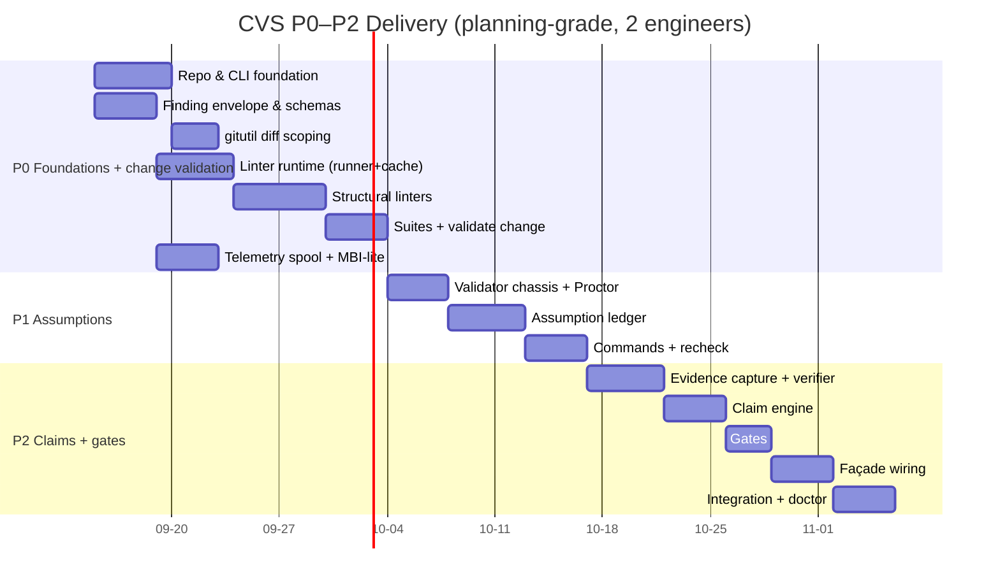
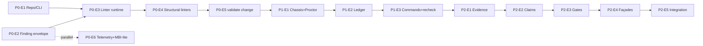

# HATHOR-PLAN-002 — Continuous Validation System: P0–P2 Delivery Roadmap & Task Breakdown

- **Document ID:** HATHOR-PLAN-002
- **Status:** DRAFT v0 — delivery plan, pending operator review
- **Date:** 2026-09-11
- **Author:** Oz (Agent), commissioned by Raymond Bayly (BaylyAI)
- **Implements:** HATHOR-TS-001 (Continuous Validation System technical spec), phases **P0–P2**
- **Traces to:** HATHOR-RP-007 (`AEG-VAL-001..015`), HATHOR-REQ-CORE-001
- **Relationship:** Subordinate work plan feeding the reserved platform-wide **HATHOR-PLAN-001**. Covers only the change-time immune system; P3–P5 are tracked separately.
- **Scope rule:** planning artifact only. Execution requires an authorizing epic/ticket per AEGIS governance (CORE AEG-REQ-TKT-004/005/007). This document does **not** authorize code.

---

## 1. Objectives & definition of done

**Goal:** ship the change-time immune system end-to-end for a single greenfield `aegis` repo, dogfooded on AEGIS itself, such that an agent cannot silently drift: every change is diff-validated, every load-bearing assumption is tracked and re-checked, and no completion/PR claim passes without mechanical evidence.

**P0–P2 done means (from TS-001 §17.2):**
- **P0** — `aegis validate change` runs the native structural linter set + one language pack over a scoped diff at L1; findings conform to the frozen envelope; secrets/UPL/port violations block on a fixture repo.
- **P1** — event-sourced assumption ledger with re-check; broken/expired assumptions block dependent claims; only humans waive.
- **P2** — command-evidence capture + `val-evidence-Bot`; claim engine (`claims.yaml`); the four new gates; façade wiring for commit / PR-prepare / knowledge-push / build / run-finalize; negative-path integration green.

**Explicitly out of scope:** P3 language-pack registry, P4 watch mode + runbook-declared validation, P5 Tower rollups; full Registry (MBI/TBR), Ticketing Plane, and Observation-Bot drain (this plan consumes only their seams — see §7).

---

## 2. Roadmap

### 2.1 Critical path

**Longest chain:** Finding envelope → linter runtime → structural linters → validate change → chassis → ledger → evidence → claims → gates → façades → integration. Envelope and repo/CLI are the two roots; everything downstream waits on the envelope being frozen, so **freeze the Finding schema first (§3, P0-E2) and treat it as an interface contract.**

### 2.2 Parallelization
- Independent early: **P0-E1 (repo/CLI)**, **P0-E2 (envelope)**, **P0-E6 (telemetry + MBI-lite)** can start together.
- **gitutil (P0-E3a)** parallels the runner once the repo exists.
- Within **P0-E4**, native linters are one-file-each and parallelize across engineers.
- If using AEGIS child agents to build this: split by epic on separate git worktrees/branches; the Finding envelope package is the shared contract to land first, then fan out. (See §9.)

---

## 3. Interface-freeze gate (do this before bulk work)

These contracts are consumed everywhere; freeze and version them in week 1 to avoid churn:
1. **Finding envelope v1** (TS-001 §4.2) — `schemas/finding-1.0.0.json`.
2. **Subprocess linter protocol** `aegis.linter.input/1` + exit contract (TS-001 §5.3).
3. **Config schemas** `linters.yaml`, `suite.*.yaml`, `claims.yaml`, `validation.yaml` (TS-001 §5.4/§6.1/§10.3/§13).
4. **Ledger record shapes** `assumptions.jsonl`, `evidence.jsonl` (TS-001 §8.1/§10.1).
5. **Exit-code mapping** (TS-001 §3.2).
6. **Capability interface** `Verdict`/`Capability` + `proctor.Dispatch` (TS-001 §9.1).

Deliverable: a short "contracts frozen" note + embedded schemas merged before P0-E4 starts.

---

## 4. Task breakdown

Sizing: **S ≤ 1.5d**, **M ≈ 2–3d**, **L ≈ 4–5d** engineer-time. Every epic below maps to one Jira epic (AEG-REQ-TKT-005); stories are sized so governance-reduced hours stay **≤ 40h** or they split (AEG-REQ-TKT-007). Base hours shown per epic in §6.

### P0 — Foundations + change validation

**Epic CVS-P0-E1 — Repo & CLI foundation**

| Story | Key tasks | TS-001 ref | Deps | Size |
|---|---|---|---|---|
| E1-S1 Repo bootstrap | `go.mod`, `cmd/aegis`, cobra root, `-o/--profile/--quiet` global flags, version cmd | §2.2, §3.3 | — | M |
| E1-S2 Exit-code + envelope errors | `internal/exit` mapping table; structured error envelope | §3.2 | — | S |
| E1-S3 UPL + run dir mgmt | `.aegis/` resolution, nearest-first config, `run.json`, run id (uuidv7) | §2.3, §13 | E1-S1 | M |
| E1-S4 Config loader | precedence, `validation.yaml` parse + defaults (`go:embed`) | §13 | E1-S3 | S |

**Epic CVS-P0-E2 — Finding envelope & schemas**

| Story | Key tasks | TS-001 ref | Deps | Size |
|---|---|---|---|---|
| E2-S1 Types + schema | Go structs, `finding-1.0.0.json` (2020-12), embed | §4.1/4.2 | — | M |
| E2-S2 Batch validate | validate `Finding[]` against schema; error surfacing | §4.2 | E2-S1 | S |
| E2-S3 Redaction | secret/PII matcher; `snippet_redacted` | §4.3, SEC-005 | E2-S1 | M |

**Epic CVS-P0-E3 — Linter runtime**

| Story | Key tasks | TS-001 ref | Deps | Size |
|---|---|---|---|---|
| E3-S1 gitutil | shell-to-git worktree/staged/range diff, `-z` parse, missing-git→exit6 | §5.6 | E1-S1 | M |
| E3-S2 Native linter iface | `Linter` interface, tier model, registry of native linters | §5.1 | E2-S1 | S |
| E3-S3 Subprocess driver | `aegis.linter.input/1` stdin, exit contract, timeout/cancel | §5.3 | E2-S2 | M |
| E3-S4 Parsers | `eslint-json` (P0), generic `sarif` scaffold | §5.3 | E3-S3 | M |
| E3-S5 Runner + cache | worker pool, per-linter deadline, digest result cache, persist findings.jsonl | §5.5 | E3-S2, E3-S3 | L |

**Epic CVS-P0-E4 — Structural linters** (each = golden fixtures + impl)

| Story | Key tasks | TS-001 ref | Deps | Size |
|---|---|---|---|---|
| E4-S1 Secrets/diff + layer | `ml-secrets-diff`, `ml-secrets-layer` | §5.2 | E3-S5 | M |
| E4-S2 UPL/layout set | `ml-upl-layout`, `ml-agents-chain`, `ml-langpack-present` | §5.2 | E3-S5 | M |
| E4-S3 Compat set | `ml-line-endings`, `ml-path-case` | §5.2 | E3-S5 | S |
| E4-S4 Container/registry set | `ml-port-registry`, `ml-cvs-labels`, `ml-otel-contract` | §5.2 | E3-S5 | M |
| E4-S5 Governance/link set | `ml-ticket-bind` (naming-pattern only), `ml-hierarchy-link`, `ml-manifest-*`, `ml-exit-codes`, `ml-no-listener`, `ml-broker-symmetry`, `ml-knowledge-meta`, `ml-microburst-size` | §5.2 | E3-S5 | L |

**Epic CVS-P0-E5 — Suites & `validate change`**

| Story | Key tasks | TS-001 ref | Deps | Size |
|---|---|---|---|---|
| E5-S1 Suite loader + defaults | `suite.*.yaml` parse; bundled `change.fast/default`, `health.project` | §6.1 | E1-S4 | M |
| E5-S2 Suite runner | wrap linter runner; aggregate Report | §6.2 | E5-S1, E3-S5 | M |
| E5-S3 `validate change` cmd | flags, algorithm, `--fix` (mechanical only), JSON/text report | §7 | E5-S2 | M |

**Epic CVS-P0-E6 — Telemetry spool + MBI-lite**

| Story | Key tasks | TS-001 ref | Deps | Size |
|---|---|---|---|---|
| E6-S1 Spool writer | JSONL append, event envelope v1, `validation.finding/suite.*`, never-fatal | §12 | E1-S3 | M |
| E6-S2 MBI-lite index | install/first-use index of native + `linters.yaml`; manifest_digest | §2.3, §5.4 | E1-S3 | M |

### P1 — Assumptions

**Epic CVS-P1-E1 — Validator chassis & Proctor router**

| Story | Key tasks | TS-001 ref | Deps | Size |
|---|---|---|---|---|
| E1-S1 Chassis | `Capability`/`Verdict`, manifest/contract/selftest/version metadata | §9.1/9.3 | P0-E5 | M |
| E1-S2 Proctor router (in-proc) | capability table from MBI-lite; `Dispatch`; telemetry around dispatch; no direct path | §9.2 | E1-S1 | M |
| E1-S3 registry validator (min) | `validation.registry.port_owns@1` read-only over port-registry (for evidence queries) | §5.5, §8.3 | E1-S2 | S |

**Epic CVS-P1-E2 — Assumption ledger**

| Story | Key tasks | TS-001 ref | Deps | Size |
|---|---|---|---|---|
| E2-S1 Event store | append-only JSONL, event types, uuidv7 | §8.1 | P0-E1 | M |
| E2-S2 Fold + views | fold events→State; `list` queue-as-view; torn-line tolerance | §8.1 | E2-S1 | M |
| E2-S3 Concurrency | flock LOCK_EX append; atomic write; contention tests | §8.2 | E2-S1 | M |
| E2-S4 `val-assumption-Bot` | open/recheck/status-change; TTL→expired; evidence dispatch | §8.3, §9 | E1-S2, E2-S2 | L |

**Epic CVS-P1-E3 — Assumption commands & recheck**

| Story | Key tasks | TS-001 ref | Deps | Size |
|---|---|---|---|---|
| E3-S1 CLI verbs | `assumption open/list/recheck/close` | §8.5 | E2-S4 | M |
| E3-S2 Waiver + authz | `waive` human-only (TTY/profile), reason+expiry, agent refusal exit4 | §8.6 | E3-S1 | M |
| E3-S3 Suite integration | `recheck_assumptions` fold into suite runner; `--stale-only` | §8.4, §6.2 | E2-S4, P0-E5 | S |

### P2 — Claims, evidence, gates, façades

**Epic CVS-P2-E1 — Evidence capture & verifier**

| Story | Key tasks | TS-001 ref | Deps | Size |
|---|---|---|---|---|
| E1-S1 `aegis validate record` (renamed per ADR-003 §2.2) | exec wrapper, tee+hash stdout/stderr, evidence.jsonl, class tag | §10.1 | P1-E2 | M |
| E1-S2 `val-evidence-Bot` | verify class/exit0/freshness/report digests → Verdict | §10.2 | E1-S1, P1-E1 | M |

**Epic CVS-P2-E2 — Claim engine**

| Story | Key tasks | TS-001 ref | Deps | Size |
|---|---|---|---|---|
| E2-S1 `claims.yaml` + resolver | schema, min-tier, required evidence, no-broken-assumptions | §10.3 | E1-S4 | S |
| E2-S2 `val-claim-Bot` + `validate claim` | tier check (`CLAIM_TIER_INSUFFICIENT`), run suite, recheck, verify evidence | §10.4 | E2-S1, P2-E1, P1-E3 | L |

**Epic CVS-P2-E3 — Gates**

| Story | Key tasks | TS-001 ref | Deps | Size |
|---|---|---|---|---|
| E3-S1 Gate predicates | Change-Validation, Assumption, Claim-Evidence gates + envelopes | §11.1 | P2-E2 | M |
| E3-S2 Strict mode | `UndeclaredAssumptionGate`; class→assumption map; default off | §11.3 | E3-S1 | S |

**Epic CVS-P2-E4 — Façade wiring**

| Story | Key tasks | TS-001 ref | Deps | Size |
|---|---|---|---|---|
| E4-S1 `proctor.Guard` API | single guard entrypoint façades call; refusal contract | §11.2 | P2-E3 | S |
| E4-S2 Delivery façades | minimal `delivery commit` + `delivery pr prepare` wired to change/claim | §11.2 | E4-S1 | M |
| E4-S3 Other seams | `knowledge push`, container `build`, `process … run` finalize hooks (stub domains if absent) | §11.2 | E4-S1 | M |

**Epic CVS-P2-E5 — Integration & doctor**

| Story | Key tasks | TS-001 ref | Deps | Size |
|---|---|---|---|---|
| E5-S1 `aegis doctor validation` | pack presence, budgets, ledger path, watch status (n/a P2) | §6/§17 | P2-E4 | S |
| E5-S2 Integration suite | negative+positive per façade; worked-example scenario (TS-001 §10 RP-007) | §17.1 | P2-E4 | M |

### Cross-cutting (runs alongside all phases)

**Epic CVS-X-E1 — CI/CD & conformance**

| Story | Key tasks | TS-001 ref | Deps | Size |
|---|---|---|---|---|
| X1-S1 CI pipeline | build, unit, lint of the repo itself, cross-platform (mac/linux) | §17 | P0-E1 | M |
| X1-S2 Golden harness | `selftest` diff-compare framework for linters | §17.1 | P0-E4 | S |
| X1-S3 Budget benches | L0 ≤50ms, L1 ≤2s warm-cache assertions | §17.1, AEG-VAL-012 | P0-E5 | S |
| X1-S4 Non-Go conformance | dummy linter in Python/Node proving protocol neutrality | §17.1, PLAT-002 | P0-E3 | S |

**Epic CVS-X-E2 — Docs & dogfood**

| Story | Key tasks | TS-001 ref | Deps | Size |
|---|---|---|---|---|
| X2-S1 Agent contract docs | AGENTS.md rules: declare assumptions, validate change, claim before done | RP-007 §6.1 | P2-E2 | S |
| X2-S2 Dogfood AEGIS repo | `.aegis/rules/*` for this repo; strict mode on for self | §11.3 | P2-E4 | S |
| X2-S3 InfraAPI L3 backend | wrap `make q-gates` as an L3 subprocess linter/evidence source | TS-001 §11, RP-007 §11 | P2-E1 | M |

---

## 5. Milestones & exit criteria

| Milestone | Gate to pass | Ties to |
|---|---|---|
| **M0 Contracts frozen** | §3 schemas embedded + versioned | interface-freeze |
| **M1 P0 complete** | `validate change` L1 blocks secrets/UPL/port on fixture repo; goldens + budget benches green; non-Go conformance passes | AEG-VAL-001/002/004/007 |
| **M2 P1 complete** | broken/expired assumption blocks a dependent `validate claim`; agent waive refused; flock contention test green | AEG-VAL-005 |
| **M3 P2 complete** | `pr.ready` fails at L1 (`CLAIM_TIER_INSUFFICIENT`) and without evidence; passes with tests recorded; all four gates + façade negative paths green | AEG-VAL-006/008/009/014 |
| **M4 Dogfood** | AEGIS repo self-validates in strict mode; InfraAPI q-gates wired as L3 | RP-007 §12 dogfood |

---

## 6. Estimation summary (planning-grade)

Base hours are pre-governance; **reduced = 50%** per `jira-standards@50pct` (AEG-REQ-TKT-007). Any story whose reduced estimate would exceed 40h must split before ticketing.

| Phase | Epics | Base hours (range) | Reduced (50%) |
|---|---|---|---|
| P0 | E1–E6 | 210–260 | 105–130 |
| P1 | E1–E3 | 120–150 | 60–75 |
| P2 | E1–E5 | 150–190 | 75–95 |
| Cross-cutting | X1–X2 | 70–100 | 35–50 |
| **Total** | | **550–700** | **275–350** |

**Timeline assumptions:** 2 engineers, ~30 productive h/wk each after governance reduction ⇒ **≈ 5–6 calendar weeks** for P0–P2 with the sequencing in §2. One engineer ≈ 9–11 weeks. These are estimates for planning, not commitments; re-baseline after M0.

---

## 7. Assumed seams / dependencies on other planes

These are **not built here**; the plan consumes minimal seams and stubs the rest (documented so tickets carry the dependency):

| Dependency | P0–P2 treatment |
|---|---|
| Registry (MBI/TBR) | Build **MBI-lite** local index only; full registry deferred. |
| Ticketing Plane | `ml-ticket-bind` does **naming-pattern** checks statically; ticket *existence/epic* validator is deferred/flagged (needs the plane). |
| Knowledge Plane | `knowledge push` gate wires to secrets/meta/microburst linters; store itself out of scope. |
| Observation-Bot / Tower | Emit `validation.*` to spool only; drain/rollup is P5. |
| Container build façade | Wire `suite.build.container`; actual image build pipeline out of scope. |
| Human identity / provenance | Enforced profiles require a Tower-issued short-lived human token (RP-013 `AEG-THR-002`); local profile + TTY is a dev-profile-only bridge until WS7 lands and is never proof of human identity. |

---

## 8. Risks & mitigations

| Risk | Impact | Mitigation |
|---|---|---|
| Finding schema churn after downstream build | High rework | **M0 freeze**; version schema; treat as contract |
| Subprocess linter latency blows L1 budget | Agents disable validation | per-linter deadlines + digest cache; native for hot paths |
| Façade domains (`delivery/process/knowledge`) don't exist yet in greenfield | P2 wiring blocked | `proctor.Guard` API first; minimal façade stubs; adapters documented |
| Assumption ledger contention (CLI + future watch) | Corruption | flock + atomic append + torn-line tolerance; tests in E2-S3 |
| Agent bypasses via unrecorded commands | Evidence gate hollow | `val-evidence-Bot` requires recorded digests; strict mode for self-dogfood |
| Over-blocking frustrates devs | Adoption risk | severity tiers (block/warn/info); `--fix`; warn-only ramp before block |

---

## 9. Orchestration option (if parallelizing the build)

This work parallelizes cleanly across AEGIS child agents once **M0** lands:
- **Lead** owns the `finding` + `config` + `proctor` contracts and integration branch.
- **Agent A** — P0-E3/E4 (runtime + native linters) on `feat/cvs-linters`.
- **Agent B** — P0-E5/E6 (suites, validate change, telemetry, MBI-lite) on `feat/cvs-runtime`.
- **Agent C** — P1 (chassis, ledger, assumptions) on `feat/cvs-assumptions` (starts after M1 tag).
- **Agent D** — P2 (evidence, claims, gates, façades) on `feat/cvs-claims` (starts after M2 tag).
- Cross-cutting X-epics owned by whoever lands the dependency; merge point = lead's integration branch, one PR per epic.

Sequencing constraint: A/B parallel in P0; C after M1; D after M2. Each child works in its own git worktree/branch to avoid collisions.

---

## 10. Immediate next actions

1. Operator review + approve this plan and the language decision (TS-D-001, Go).
2. Cut the platform epics in the Ticketing Plane: one epic per §4 epic, stories split to ≤40h reduced.
3. Execute **M0 interface-freeze** (§3) as the first ticket; nothing downstream starts until schemas are embedded.
4. Stand up the greenfield `aegis` repo skeleton (CVS-P0-E1) + CI (CVS-X-E1).

---

*Draft v0 — delivery roadmap for HATHOR-TS-001 P0–P2. No code authorized without a ticket. Amend before promotion to verified.*
