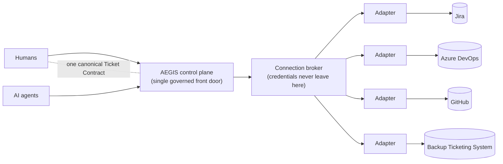

# The Ticketing Economy
## Making Every Unit of Work — Human or AI — Accountable, Portable, and Governed

- **Product:** AEGIS — the agentic governance framework by BaylyAI
- **Document:** Whitepaper (business value, technical-decision-maker facing)
- **Audience:** CTOs, VPs of Engineering, Heads of Platform / Developer Experience, Security & Compliance leaders
- **Date:** 2026-09-11
- **Status:** DRAFT for review — describes the AEGIS Ticketing Economy architecture at design stage; see the RP-006 specification for technical detail and open questions
- **Technical companion:** `HATHOR-RP-006 — The Ticketing Plane: Work as a Source of Truth`

---

## Executive Summary

Software organizations have never been better at *doing* work. With AI agents now writing code, filing changes, and operating pipelines alongside human engineers, the constraint has shifted. The hard problem is no longer output — it is **trusting, tracking, and governing** that output at machine speed.

Most teams still run on an informal economy of work: intent lives in chat, decisions live in someone's memory, status is inferred from a branch, and the "source of truth" is whichever tracker the last person happened to open. That was survivable when humans set the pace. It is not survivable when autonomous agents generate work faster than anyone can reconcile it.

AEGIS closes this gap with a **Ticketing Economy**: a simple, enforced principle that **no substantive work happens without a ticket**, backed by a **Ticketing Plane** — a single, provider-agnostic system of record for all work, spanning Jira, Azure DevOps, and GitHub, with a built-in backup so work never stops.

The result is governance as a *structural property* of the system rather than a manual review burden: every change is traceable to an authorized ticket and a strategic epic; every deployment requires a human's explicit sign-off; and every AI agent operates under the same ledger as every human. Portability, resilience, and auditability come as consequences of the design, not as add-ons.

## The Problem: Work Without a Ledger

Ask three engineers where the truth about a piece of work lives and you will often get three answers: the PR, the Slack thread, the Jira board — or "let me check with someone." That ambiguity has real cost:

- **Untracked and chat-driven work.** Decisions and approvals made in conversation leave no durable, auditable record. When something breaks, the "why" is gone.
- **Tool sprawl and silos.** Real organizations run **Jira and Azure DevOps and GitHub** simultaneously — across teams, acquisitions, and product lines. Each is a partial truth; none is the whole.
- **Governance and compliance exposure.** Who authorized this change? Which strategic initiative did it serve? Was it estimated, reviewed, and approved? If the answer requires archaeology, it is an audit finding waiting to happen.
- **AI agents amplify everything.** An autonomous agent can open a dozen changes before lunch. Without a ledger, that is a dozen unaccountable actions — velocity without a paper trail.

The compounding effects are familiar to every engineering leader: rework, onboarding drag, deployment incidents, unreliable estimates, and a persistent inability to answer simple governance questions with confidence.

## The Idea: An Economy for Work

Economies work because every transaction has a unit of account and a ledger. AEGIS applies the same discipline to engineering work.

- **The ticket is the currency.** Work is a transaction that must be "paid for" with a ticket. No ticket, no work. This is not bureaucracy — it is the receipt that makes the work real, attributable, and reviewable.
- **The epic is the mandate.** Every ticket links to a strategic epic, so there is a continuous line of sight from company intent down to the individual commit. Work that cannot name the initiative it serves does not proceed.
- **The Ticketing Plane is the ledger.** One authoritative record of what work exists, what state it is in, what authorized it, and what it produced — durable, queryable, and independent of any single tool or conversation.

The shift is subtle but decisive: governance stops being something people *remember to do* and becomes something the system *enforces by construction*. The economy's rules are the guardrails.

## The Architecture: The Ticketing Plane

Behind the business model is a deliberately simple architecture built for control and auditability.

**One front door.** Humans and AI agents never reach trackers directly. They interact through a single control interface, which brokers every request. That means one place to apply policy, one place credentials live (and are never scattered across agents), and one consistent behavior across every provider.

**A canonical record, not a vendor's record.** Work is expressed in a provider-agnostic **Ticket Contract** — a standard shape for a unit of work (identity, type, status, epic, estimate, links to PRs/branches/commits, provenance). Jira, Azure DevOps, and GitHub each sit behind a thin **adapter** that translates to and from this canonical form. Your teams keep their tools; the truth is unified above them.

**Three records of truth, one plane of control.** AEGIS keeps three authoritative records — one for what *can run* (its agents), one for what the organization *knows* (verified knowledge), and one for what *work* exists (the Ticketing Plane) — all reached through the same governed front door. For buyers, the takeaway is consistency: the same accountability model everywhere.

## Integration Without Lock-In: Jira, Azure DevOps, GitHub

Multi-tracker reality is not a temporary state to be migrated away from — it is a permanent condition of any organization that grows, acquires, or lets teams choose their tools. AEGIS treats it as a first-class requirement.

Because every provider maps to the same canonical contract, an AI agent or a policy never needs to know which tracker a project uses. Filing a bug, linking an epic, or binding a PR to a ticket works identically whether the truth ultimately lives in Jira, Azure DevOps, or GitHub.

| Unit of work | Jira | Azure DevOps | GitHub |
|---|---|---|---|
| Epic (mandate) | Epic | Epic | Issue / Project |
| Story / Task | Story / Task | User Story / Task | Issue |
| Bug | Bug | Bug | Labeled Issue |
| Deployment request | Deploy ticket | Deployment task | Labeled Issue |

The business value is threefold: **no rip-and-replace** (adopt AEGIS without forcing teams off their tools), **migration insurance** (switch or consolidate providers later without rewriting how work is governed), and **M&A readiness** (absorb an acquired team's tracker under the same ledger on day one).

## Resilience: Work That Never Stops

Enterprise trackers go down, throttle under load, or are simply unavailable in isolated and regulated environments. In an informal economy, an outage means work stalls or — worse — proceeds untracked.

AEGIS's target design includes a small, self-hostable **Backup Ticketing System** that speaks the same canonical contract (implementation decision: HATHOR-ADR-005). When a primary provider is unreachable, work continues against the backup and is transparently marked as pending reconciliation. When the provider returns, buffered work is **automatically reconciled upstream**, with the enterprise provider always retained as the ultimate authority — no duplicates, no silent overwrites, no lost tickets.

Crucially, degradation is **bounded and honest**: the system tells you it is running on backup, and it refuses to let an outage become a loophole (for example, it will not let a deployment be authorized from unreconciled backup-only state). Continuity without compromising the chain of authority.

## Governance by Construction

For technical leaders in regulated or security-conscious organizations, this is where the Ticketing Economy pays for itself. The economy's rules are enforced mechanically, not left to good intentions:

- **No-Ticket gate** — substantive work is blocked until an authorizing ticket exists.
- **Epic-linkage gate** — every ticket ties to a strategic mandate, giving end-to-end traceability.
- **PR / branch binding** — every code change references its ticket, so the audit trail assembles itself.
- **Estimation discipline** — work is estimated consistently, recorded on the ticket, and oversized work is split before it starts.
- **Human-only deployment authority** — this is the keystone. **Agents build and verify; they never deploy.** Promotion to shared and production environments requires a human-authorized deployment ticket, complete with checklist, owner, and sign-off. Chat-level "go ahead" does not authorize a release; an authorized ticket does.

Together these map cleanly onto audit, separation-of-duties, and change-management requirements — and they provide the accountability layer that autonomous AI work demands. Every agent action is attributable to an authorized unit of work, and the highest-risk action in the lifecycle — shipping to production — remains firmly in human hands.

## Why It Matters Now: AI-Native Accountability

The move to agentic engineering is not incremental; it is a step-change in the *volume and speed* of work that must be governed. Organizations adopting AI agents quickly discover that productivity is the easy part. The board-level question is: *can you prove what your agents did, why, and on whose authority?*

The Ticketing Economy answers that by design. It is a single accountability model that applies identically to humans and machines, so scaling up autonomous work does not mean scaling up ungoverned risk. Governance is structural, provider-agnostic, resilient to outages, and enforced at machine speed — which is exactly the speed at which the work now happens.

## Business Outcomes

| Outcome | What it means for the business | How AEGIS delivers it |
|---|---|---|
| **Auditability by default** | Answer "who, why, on whose authority" instantly | Every change bound to an authorized, epic-linked ticket |
| **Governance without drag** | Compliance stops being a manual gate | Rules enforced structurally at the front door |
| **No vendor lock-in** | Keep or change trackers freely | Canonical contract + provider adapters |
| **Business continuity** | Work continues through provider outages | Backup ticketing system with automatic reconciliation |
| **AI + human accountability** | Scale agents without scaling risk | One ledger and one authority model for all actors |
| **Safer releases** | Fewer unauthorized/incident-prone deploys | Human-only, ticket-gated deployment authority |
| **Faster onboarding** | Less tribal knowledge, fewer "lost work" gaps | The ledger is the shared, durable context |

## In One Sentence

**AEGIS turns work into a governed economy — where every task is a ticket, the Ticketing Plane is the single portable ledger across Jira, Azure DevOps, and GitHub, outages never stop the work, and the riskiest step of all, shipping, always requires a human's signature.**

## Where to Go Next

The concepts above are specified in full technical detail in the companion research paper, `HATHOR-RP-006 — The Ticketing Plane: Work as a Source of Truth`, including the canonical Ticket Contract, provider mappings, reconciliation model, and governance requirements.

For teams evaluating AEGIS, the natural first step is a scoped pilot: connect one existing tracker, enable the Ticketing Economy gates in report-only mode to establish a baseline, then turn on enforcement and measure the change in traceability, cycle time, and deployment safety.

---

*BaylyAI · AEGIS Whitepaper · Draft for review. Business-facing companion to the HATHOR-RP-006 specification. Capabilities described here reflect the AEGIS target design; see RP-006 for current design status and open questions.*
