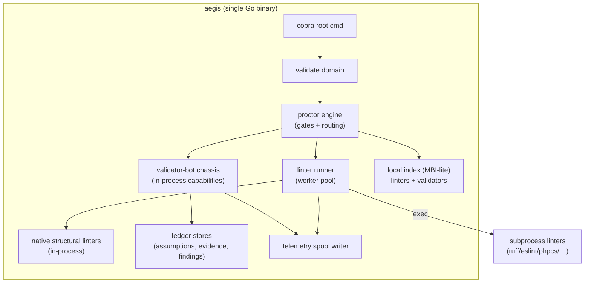

# AEGIS-TS-001 — Continuous Validation System: Technical Specification
## Implementation spec for the change-time immune system (micro-linters + validator micro-bots)

- **Document ID:** AEGIS-TS-001
- **Status:** DRAFT v0 — implementation specification, pending operator review
- **Date:** 2026-09-11
- **Author:** Oz (Agent), commissioned by Raymond Bayly (BaylyAI)
- **Implements:** AEGIS-RP-007 (Continuous Validation System) — requirements `AEG-VAL-001..015`
- **Conforms to:** AEGIS-REQ-CORE-001 (PLAT/CLI/BOT/TEL/SEC/NFR), AEGIS-ARCH-001, AEGIS-REQ-BOT-001, RP-001 (manifest), RP-002 (registry), RP-003 (telemetry)
- **Scope rule:** This specification describes *how* to build the system. It authorizes **no code by itself**; implementation requires an authorizing ticket per AEGIS governance (CORE AEG-REQ-TKT-004).

RFC 2119 keywords apply. New identifiers introduced here: components `TS-C-###`, interfaces `TS-I-###`, decisions `TS-D-###`.

---

## 0. Decisions locked for this spec

| ID | Decision | Rationale | Overridable? |
|---|---|---|---|
| **TS-D-001** | **Chassis + CLI + native linters implemented in Go (1.23+).** | Single static binary satisfies NFR-001 (<250 ms cold command); trivial cross-platform distribution; matches CORE two-language ambition (Go + Python reference bots). *(Resolves CORE §17 Q2 for the chassis; Python remains a valid reference-bot language.)* | Operator may swap; §16 isolates language-specific surface. |
| **TS-D-002** | **Two linter execution modes: native (in-process Go) for the always-on structural set; subprocess for language/product packs.** | Structural checks must be sub-50 ms (L0) with zero fork cost; language packs must wrap existing tools (ruff/eslint/phpcs) in any language. | No — core architectural invariant. |
| **TS-D-003** | **Assumption ledger is event-sourced (append-only JSONL, state = fold of events).** | Matches AEGIS "status-on-record, queue-as-view" (CORE AEG-REQ-KNO-007); crash-safe; auditable. | No. |
| **TS-D-004** | **Diff scoping shells out to `git` behind an interface (`gitutil`).** | Robust, matches real repos, zero heavy deps; interface keeps it swappable to go-git. | Yes (impl detail). |
| **TS-D-005** | **First build + dogfood target is the AEGIS greenfield repo** (new `aegis` CLI). InfraAPI `make q-gates` is wrapped as an L3 subprocess backend, not modified. | User selection. | n/a |
| **TS-D-006** | **CLI framework: `cobra`/`pflag`; JSON Schema: `santhosh-tekuri/jsonschema/v6`; YAML: `sigs.k8s.io/yaml`; UUIDv7: `github.com/google/uuid`.** | Mature, well-maintained, minimal. | Yes (impl detail). |

Working module path in examples: `github.com/baylyai/aegis`. Repository/module ownership MUST be frozen before M0; until then this string is illustrative rather than a canonical public import path, and any change must update TS-001/002/003 and PLAN-002 atomically.

---

## 1. Scope & depth

| Phase (RP-007 §12) | Depth in this spec |
|---|---|
| **P0** Finding envelope + `validate change` L1 + structural linters | **Implementation grade** (§4–§7, §9) |
| **P1** Assumption ledger + `val-assumption-Bot` + recheck | **Implementation grade** (§8) |
| **P2** `val-claim-Bot` + `val-evidence-Bot` + façade wiring + new gates | **Implementation grade** (§10–§11) |
| **P3** Language pack registry + migrate AI Lint Guide rules | **Interface level** (§15.1) |
| **P4** `validate watch` + runbook `validation.suite` | **Interface level** (§15.2) |
| **P5** Tower rollups + success-rate by class | **Interface level** (§15.3) |

---

## 2. System architecture

### 2.1 Process model

The system ships inside the single `aegis` binary. There is no always-on daemon in P0–P2 (watch mode is P4). Everything runs as short-lived CLI invocations, consistent with CORE AEG-REQ-BOT-009 (statelessness) and RP-003 (spool-and-drain, no machine-tier broker).



**Key point:** In P0–P2 the validator-bots and Proctor run *in-process* as Go packages behind capability interfaces. This satisfies RP-007's "validators invoked only through Proctor" (AEG-VAL-003) without prematurely building the full networked bot runtime. §14 defines the seam that lets them become out-of-process Class C containers later with no contract change.

### 2.2 Package layout (greenfield repo)

```text
aegis/
  go.mod                      # working module path github.com/baylyai/aegis; freeze at M0
  cmd/aegis/main.go           # binary entrypoint; wires cobra
  internal/
    cli/                      # cobra command tree (root, validate, doctor, …)
      validate/               # validate change|assumption|claim|suite|report|linters
    proctor/                  # gate engine + capability router (in-proc)
      gates/                  # gate predicates (change, assumption, claim-evidence)
    finding/                  # Finding envelope types + JSON Schema + validate
    linter/
      runner/                 # worker pool, deadlines, result cache
      native/                 # in-proc structural linters (one file per class)
      subprocess/             # subprocess protocol driver + output parsers
      registry/               # linters.yaml load + MBI-lite index
    suite/                    # suite load (suites/*.yaml) + suite runner
    assumption/               # event-sourced ledger + recheck scheduler
    evidence/                 # command evidence capture + verifier
    claim/                    # claim→tier resolution + claim engine
    validators/               # validator-bot chassis + roster (assumption,diff,claim,…)
      chassis/                # shared manifest, default command contract
    telemetry/                # spool writer, event envelopes (RP-003)
    gitutil/                  # git diff/stage/branch interface (shells to git)
    upl/                      # .aegis/ layout resolution, run dir mgmt
    config/                   # validation.yaml, claims.yaml, precedence
    exit/                     # canonical exit-code mapping (CORE §4.5)
  schemas/                    # embedded JSON Schemas (go:embed)
  packs/                      # built-in linter fixture packs (go:embed golden)
  test/
    fixtures/                 # golden repos for linter selftests
    integration/              # façade gate negative/positive paths
```

### 2.3 On-disk state (Universal Project Layout)

All runtime state lives under the project `.aegis/` (CORE §7). No state in the binary, no global mutable state outside `$XDG` machine tier.

```text
<project>/.aegis/
  rules/
    validation.yaml           # fabric config (profiles, strict mode)
    linters.yaml              # language/product linter pack registration
    claims.yaml               # claim → suite/tier/evidence mapping
    suites/                   # suite.*.yaml
    fixtures/<class>/         # linter golden fixtures (selftest)
    bots/<name>.yaml          # per-bot config (RP-014 §3.6), validated against runtime.config_schema
  state/
    runs/<run_id>/
      run.json                # run header (ticket_ref, chain, started_at)
      assumptions.jsonl       # event log (TS-D-003)
      evidence.jsonl          # recorded command evidence
      findings.jsonl          # all findings emitted this run
      validation/             # aggregate reports (JSON + md)
    spool/                    # telemetry JSONL (RP-003)
    cache/validation/         # digest-keyed linter result cache
  manifests/                  # (registry plane; not owned by this spec)
  knowledge/                  # (knowledge plane; not owned by this spec)
```

Machine tier (cross-project): `${XDG_DATA_HOME:-~/.local/share}/aegis/index/` holds the MBI-lite of installed linters/validators (RP-002 install-time indexing, AEG-REQ-REG-002).

---

## 3. Exit codes, streams, output (CLI contract)

### 3.1 Two boundaries, two code sets

| Boundary | Allowed exits | Source |
|---|---|---|
| **Micro-linter process** | `0` (no blocking), `2` (blocking findings) only. Any other code = linter *error*. | AEG-VAL-002 |
| **`aegis` command** | Canonical CORE §4.5 table (`0–7`). | AEG-REQ-PLAT-005 |

### 3.2 `aegis validate *` exit mapping (`internal/exit`)

| Condition | Exit | Envelope field |
|---|---|---|
| No findings, or warn/info only | `0` | `degraded:false` |
| At least one `block` finding / failed verdict | `2` | `blocking:true` |
| Warn-only or inconclusive under lenient policy | `0` | `degraded:true` |
| Unknown suite / linter / assumption id | `3` | — |
| Linter crashed / `git` missing / pack unhealthy | `6` | `dependency:"…"` |
| `waive` attempted in non-TTY without `--yes` | `7` | `confirmation_required:true` |
| Internal error | `1` | error envelope |

Named non-error states (`degraded`, `blocking`) are envelope fields, never reused codes (CORE §4.5).

### 3.3 Streams (AEG-REQ-CLI-004)

- **stdout** = aggregate report (JSON when piped/`-o json`, text on TTY).
- **stderr** = per-finding stream + progress; `--quiet` suppresses to errors only.
- Global flags inherited from CORE AEG-REQ-CLI-001 (`--output/-o`, `--profile`, `--quiet`, `--include-legacy`).

---

## 4. Finding envelope (P0, implementation grade)

### 4.1 Go type (`internal/finding`)

```go
package finding

type Severity string // "block" | "warn" | "info"
type Verdict  string // "pass" | "fail" | "degraded" | "inconclusive"
type SubjectKind string // "path"|"assumption"|"ticket"|"manifest"|"claim"|"run"

type Subject struct {
    Kind   SubjectKind `json:"kind"`
    Ref    string      `json:"ref"`
    Digest string      `json:"digest,omitempty"` // sha256:...
}

type Evidence struct {
    Tool           string `json:"tool"`            // "ml-secrets-diff@1.2.0"
    Rule           string `json:"rule,omitempty"`
    SnippetRedacted bool  `json:"snippet_redacted"`
}

type RunRef struct {
    RunID          string `json:"run_id"`
    TicketRef      string `json:"ticket_ref,omitempty"`
    HierarchyChain string `json:"hierarchy_chain,omitempty"`
    BindingID      string `json:"binding_id,omitempty"`
}

type Provenance struct {
    Emitter        string `json:"emitter"`         // "micro-linter"|"validator-Bot"
    ManifestDigest string `json:"manifest_digest"` // sha256:...
}

type Finding struct {
    FindingID     string     `json:"finding_id"`      // uuidv7
    SchemaVersion string     `json:"schema_version"`  // "1.0.0"
    Class         string     `json:"class"`           // e.g. "sec.secrets_in_diff"
    Severity      Severity   `json:"severity"`
    Verdict       Verdict    `json:"verdict"`
    Message       string     `json:"message"`
    Remediation   string     `json:"remediation"`
    Subject       Subject    `json:"subject"`
    Evidence      Evidence   `json:"evidence"`
    Run           RunRef     `json:"run"`
    Provenance    Provenance `json:"provenance"`
    TTL           string     `json:"ttl,omitempty"`  // ISO-8601 duration
}
```

### 4.2 JSON Schema (`schemas/finding-1.0.0.json`, `go:embed`)

JSON Schema 2020-12; the same document validates subprocess-linter stdout (AEG-VAL-004). Validation runs once per batch, not per finding, for performance. Blocking rule: `severity=="block" && verdict=="fail"` ⇒ blocking.

### 4.3 Redaction (SEC, AEG-REQ-SEC-005)

Before a finding is written to any store or stream, `finding.Redact()` runs the secret/PII matcher over `message` and `evidence`; on match it strips the snippet and sets `snippet_redacted=true`. Linters MUST NOT emit raw secret material; the redactor is defense-in-depth.

---

## 5. Micro-linter subsystem (P0, implementation grade)

### 5.1 Native linter interface (`TS-I-001`)

```go
package linter

type Mode string // "paths" | "diff" | "artifact"

type Input struct {
    Root  string            // project root
    Mode  Mode
    Paths []string          // scoped paths (diff-derived)
    Diff  *gitutil.Diff     // when Mode==diff
    Config map[string]any   // from linters.yaml entry
    Run    finding.RunRef
}

// Native structural linters implement this in-process (TS-D-002).
type Linter interface {
    ID() string                 // "ml-secrets-diff"
    Class() string              // "sec.secrets_in_diff"
    Tier() Tier                 // L0..L3
    ScopeGlobs() []string       // which paths trigger it
    Run(ctx context.Context, in Input) ([]finding.Finding, error) // ctx carries deadline
}
```

`Run` MUST be pure: no network, no writes, no secret access. Returning `error` = linter *malfunction* (→ exit 6 / inconclusive), distinct from returning blocking findings.

### 5.2 Native structural linter set (P0 always-on)

Each is one file in `internal/linter/native/`. Implements AEG-VAL catalog (RP-007 §4.1):

`ml-secrets-diff`, `ml-upl-layout`, `ml-agents-chain`, `ml-line-endings`, `ml-path-case`, `ml-port-registry`, `ml-cvs-labels`, `ml-otel-contract`, `ml-ticket-bind`, `ml-manifest-schema`, `ml-manifest-digest`, `ml-exit-codes`, `ml-no-listener`, `ml-broker-symmetry`, `ml-knowledge-meta`, `ml-microburst-size`, `ml-hierarchy-link`, `ml-secrets-layer` (build-only), `ml-langpack-present`.

Native = fast, zero fork; the P0-critical L0/L1 blockers (secrets, upl, ports, eol, ticket-bind) are all native.

### 5.3 Subprocess linter protocol (`TS-I-002`)

Language/product packs are external processes. AEGIS drives them uniformly:

**Invocation:** `argv` from `linters.yaml` template; a JSON request on **stdin**:

```json
{
  "schema": "aegis.linter.input/1",
  "id": "eslint-northstar",
  "class": "js.sonar",
  "mode": "diff",
  "root": "/abs/project",
  "paths": ["src/a.ts","src/b.ts"],
  "config": { "config_file": "eslint.config.mjs" }
}
```

**Response:** one of
- `Finding[]` JSON on **stdout** (preferred; `output: findings-json`), or
- native tool output on stdout adapted by a named parser (`output: "parser:eslint-sarif"`).

**Exit contract:** `0` no blocking, `2` blocking, other ⇒ linter error. Timeout = context deadline for the tier; killed process ⇒ inconclusive.

**Parsers** (`internal/linter/subprocess/parsers/`): `eslint-json`, `eslint-sarif`, `ruff-json`, `phpcs-json`, `sarif` (generic). Each maps native records → `Finding` with the pack's declared `class`/`severity`.

### 5.4 `linters.yaml` schema (`TS-I-003`)

```yaml
version: 1
linters:
  - id: eslint-northstar
    class: js.sonar
    mode: diff                 # paths|diff|artifact
    tier: L1
    severity: block            # default severity if tool doesn't specify
    scope_globs: ["**/*.ts","**/*.tsx"]
    exec: ["yarn","--silent","lint:report","--stdin-paths"]
    output: "parser:eslint-json"
    fix_exec: ["yarn","lint:fix"]   # optional; used only with --fix at L1+
    timeout: "90s"
    requires: ["node"]         # doctor checks presence
```

Loaded into MBI-lite at install/first-use; each entry gets a `manifest_digest` (sha256 of canonicalized entry) used in `Finding.provenance`.

### 5.5 Runner (`internal/linter/runner`, `TS-C-001`)

Algorithm (`RunSuite`):

```text
1. resolve suite → ordered linter set filtered by tier ≤ requested tier
2. compute scope: diff-derived path set (gitutil) ∩ linter.scope_globs
3. for each linter, compute cache key = sha256(manifest_digest + input_digest)
     input_digest = sha256(sorted paths + their blob hashes + config digest)
   cache hit (state/cache/validation/) → reuse Finding[]
4. fan out cache-miss linters over a worker pool (GOMAXPROCS-bounded)
     each with context deadline = tier budget (§3.2 RP-007)
5. validate every Finding against schema; redact; assign finding_id (uuidv7)
6. persist: append to findings.jsonl; write cache entry; emit telemetry
7. aggregate: blocking = any(block & fail); return Report
```

Concurrency: bounded worker pool; per-linter deadline; a slow subprocess linter cannot exceed the tier budget (it is cancelled and recorded inconclusive). Native linters run in the same pool as trivial goroutines.

Result cache keyed by content digest gives near-instant re-runs when nothing changed (supports L1 ≤ 2 s budget, AEG-VAL-007/012).

### 5.6 Diff scoping (`internal/gitutil`, `TS-I-004`)

```go
type Diff struct {
    Base   string      // ref or "WORKTREE"
    Files  []FileDelta // path, status (A/M/D/R), old/new blob sha
}
type Client interface {
    WorktreeDiff(ctx context.Context) (Diff, error)   // unstaged+staged vs HEAD
    StagedDiff(ctx context.Context) (Diff, error)
    RangeDiff(ctx context.Context, from, to string) (Diff, error)
    Root(ctx context.Context) (string, error)
    Branch(ctx context.Context) (string, error)
}
```

Implemented by shelling to `git` (TS-D-004) with `--no-pager`, porcelain/`-z` parsing. Missing `git` ⇒ exit 6.

---

## 6. Suites (P0, implementation grade)

### 6.1 `suite.*.yaml` schema (`TS-I-005`)

```yaml
id: suite.change.default
tier: L2                      # max tier this suite escalates to
blocking_classes:             # classes that force exit 2 when failed
  - sec.secrets_in_diff
  - compat.eol
  - tkt.pr_branch_bind
includes:                     # linter ids or class globs
  - "ml-*"
  - pack: "js.*"
recheck_assumptions: true     # fold in held-assumption recheck (P1)
on_missing_pack: block        # block|warn for ml-langpack-present
```

Bundled defaults (`packs/suites/`, `go:embed`) mirror RP-007 §7: `suite.change.fast|default`, `suite.claim.step-done|run-complete|pr-ready`, `suite.build.container`, `suite.knowledge.push`, `suite.health.project`. Project `.aegis/rules/suites/` overrides by `id`.

### 6.2 Suite runner (`internal/suite`, `TS-C-002`)

Wraps the linter runner (§5.5) and, from P1, the assumption re-check and, from P2, evidence checks. Returns:

```go
type Report struct {
    SuiteID   string
    Tier      Tier
    Findings  []finding.Finding
    Blocking  bool
    Degraded  bool
    Assumptions []assumption.State // P1
    Evidence  []evidence.Check     // P2
    StartedAt, EndedAt time.Time
}
```

---

## 7. `aegis validate change` (P0, implementation grade)

### 7.1 Command

```text
aegis validate change
  [--paths p1,p2 | --diff worktree|staged|last-commit]   # default: worktree
  [--tier L0|L1|L2|L3]                                    # default: L1
  [--suite <id>]                                          # default by tier
  [--fix]                                                 # apply fix_exec (L1+, mechanical only)
  [--run <run_id>]                                        # default: current/implicit run
```

### 7.2 Algorithm

```text
1. resolve run (create implicit ephemeral run if none; run.json)
2. diff := gitutil per --diff (or explicit --paths)
3. suite := --suite or default-for-tier
4. report := suite.Run(ctx, diff, tier)
5. if --fix: for fixable blocking classes, run fix_exec; re-diff; re-run once
6. print report (stdout) + findings (stderr); persist findings.jsonl
7. exit per §3.2
```

`--fix` restrictions (RP-007 open Q2 lean): only linters that declare `fix_exec` **and** are mechanically safe (eol, import order, formatting). Behavioral classes never auto-fix.

### 7.3 Output (JSON, stdout)

```json
{
  "schema":"aegis.validate.report/1",
  "suite":"suite.change.default","tier":"L1",
  "blocking":true,"degraded":false,
  "counts":{"block":1,"warn":2,"info":0},
  "findings_ref":".aegis/state/runs/<id>/findings.jsonl",
  "run_id":"…"
}
```

---

## 8. Assumption ledger + recheck (P1, implementation grade)

### 8.1 Event-sourced store (TS-D-003, `internal/assumption`)

Records are **events** appended to `assumptions.jsonl`; current state = fold.

```go
type EventType string // "open"|"status_change"|"waive"|"close"|"recheck"

type Event struct {
    EventID    string    `json:"event_id"`     // uuidv7
    Type       EventType `json:"type"`
    AssumptionID string  `json:"assumption_id"`
    At         time.Time `json:"at"`
    Actor      Actor     `json:"actor"`         // identity + kind (human|agent|system)
    // open:
    Statement  string    `json:"statement,omitempty"`
    Class      string    `json:"class,omitempty"`
    TTL        string    `json:"ttl,omitempty"`
    CheckInterval string `json:"check_interval,omitempty"`
    EvidenceQuery *EvidenceQuery `json:"evidence_query,omitempty"`
    // status_change:
    Status     Status    `json:"status,omitempty"` // open|held|broken|expired|waived
    FindingID  string    `json:"finding_id,omitempty"`
    // waive:
    Reason     string    `json:"reason,omitempty"`
    Expiry     *time.Time `json:"expiry,omitempty"`
}
```

**Folding** yields `State{AssumptionID, Statement, Class, Status, MadeAt, LastCheckedAt, TTL, ...}`. `list`/`recheck` operate on folded state (queue-as-view).

### 8.2 Concurrency & atomicity (`TS-I-006`)

Writers: the CLI process and (P4) the watch daemon. Protocol:
- Advisory lock `assumptions.jsonl.lock` via `flock` (LOCK_EX) around append.
- Each event line ≤ 64 KiB and written with a single `O_APPEND` write. Note: POSIX guarantees atomic *offset positioning* for `O_APPEND`, not write atomicity by size on regular files (PIPE_BUF atomicity applies to pipes/FIFOs only) — the advisory lock is therefore load-bearing, not belt-and-braces, and MUST NOT be removed as "redundant."
- Reads are lock-free (append-only ⇒ torn last line tolerated: fold ignores an unparsable trailing line and warns).

### 8.3 Evidence query dispatch

`EvidenceQuery` names a validator capability + args (RP-007 §2.3):

```json
{ "capability":"validation.registry.port_owns@1", "args":{"port":8099,"service":"knowmcp"} }
```

`val-assumption-Bot.recheck(id)`:

```text
load state; if terminal(closed) → noop
verdict := proctor.Dispatch(capability, args)      // read-only validator
map verdict → status: pass→held, fail→broken, inconclusive→keep+degraded
if now-madeAt > TTL → status=expired
append status_change (+ finding if any); emit telemetry
```

### 8.4 Recheck scheduling (P1 without daemon)

No background loop in P1. Rechecks fire at natural CLI moments:
- explicit `aegis validate assumption recheck [--all|<id>]`
- implicitly at `suite.Run` when `recheck_assumptions: true` (step-done, run-complete)
- `--stale-only` rechecks entries whose `now-last_checked > check_interval`

P4 watch mode adds interval-driven `assumption.tick`.

### 8.5 Commands

```text
aegis validate assumption open  --class <c> --statement <s> [--ttl PT30M]
                                [--check-interval PT2M] [--evidence-query <json>] [--run <id>]
aegis validate assumption list  [--status held|broken|expired|…] [-o json]
aegis validate assumption recheck [<id> | --all | --stale-only]
aegis validate assumption waive <id> --reason <r> [--expiry <ts>]   # human only
aegis validate assumption close <id>
```

### 8.6 Waiver authorization (SEC)

`Actor.Kind` is derived from the invocation identity (CORE audit intent, AEG-REQ-SEC-006):
- On a TTY with a resolved human profile ⇒ `human`.
- Non-interactive/agent context ⇒ `agent`; `waive` by an agent ⇒ **refused** (exit 4, `PROVENANCE_UNVERIFIED`-style envelope). Aligns with "no auto-promotion" and RP-007 AEG-VAL-005.
- Waiver requires `--reason`; default `expiry` = TTL of the assumption or 24 h.
- **Amended (2026-09-13, per `AEG-THR-002`):** in **enforced profiles**, `human` requires a Tower-issued short-lived identity token (RP-010 §5) verified offline within TTL; the TTY/profile heuristic above is accepted only in the non-enforced dev profile (PLAN-003 §5). TTY detection is a UX hint, never an authorization basis.

---

## 9. Validator-bot chassis (P0/P1 seam, implementation grade for in-proc)

### 9.1 Capability interface (`TS-I-007`)

All validators (assumption/diff/claim/evidence/registry/ticket/hierarchy/knowledge/drift/contract) implement:

```go
package validators

type Verdict struct {
    Result   string            // "pass"|"fail"|"degraded"|"inconclusive"
    Findings []finding.Finding
    Data     map[string]any
}
type Capability interface {
    Name() string              // "validation.assumption.recheck@1"
    Manifest() chassis.Manifest
    Invoke(ctx context.Context, args map[string]any, run finding.RunRef) (Verdict, error)
}
```

### 9.2 Proctor router (in-proc, `internal/proctor`)

- Maintains a capability table from MBI-lite (`validation.*` → Capability).
- `Dispatch(cap, args, run)` enforces AEG-VAL-003: callers reach validators **only** here; there is no exported direct path. In P0–P2 this is a Go function boundary; §14 shows the out-of-process upgrade.
- Emits `validation.*` telemetry around each dispatch.

### 9.3 Default command contract

Even in-proc, each validator carries chassis metadata so it registers/selftests like any bot (CORE AEG-REQ-BOT-008): `manifest`, `contract`, `selftest`, `version`. `aegis bots selftest` iterates validators + runs native-linter golden fixtures + subprocess-pack `--help/--dry-run` probes.

---

## 10. Evidence + claim engine (P2, implementation grade)

### 10.1 Command evidence capture (`internal/evidence`, `TS-I-008`)

Explicit wrapper (P2; shell hook is P4):

```text
aegis validate record --class tests -- pytest -q   # renamed from `aegis run --record` per ADR-003 §2.2
```

Captures an evidence record:

```go
type Record struct {
    EvidenceID string    `json:"evidence_id"`  // uuidv7
    Class      string    `json:"class"`        // "tests"|"typecheck"|"lint"|"build"|…
    Argv       []string  `json:"argv"`
    ExitCode   int       `json:"exit_code"`
    StdoutSHA  string    `json:"stdout_sha256"`
    StderrSHA  string    `json:"stderr_sha256"`
    ReportRefs []string  `json:"report_refs,omitempty"` // e.g. q-gates report path+digest
    StartedAt, EndedAt time.Time
    RunID      string    `json:"run_id"`
}
```

Appended to `evidence.jsonl`. Output streams are tee'd to the caller and hashed; large outputs are digested, not stored verbatim.

### 10.2 `val-evidence-Bot` (`validation.evidence.verify@1`)

Given required evidence classes for a claim, verifies: a matching record exists, `exit_code==0`, `ended_at` within freshness window (default: since last relevant diff), and any `report_refs` digests resolve. Missing/stale ⇒ `fail` with a finding (AEG-VAL-008). This is the mechanical enforcement of "evidence before narrative."

### 10.3 `claims.yaml` (`TS-I-009`)

```yaml
version: 1
claims:
  pr.ready:
    suite: suite.claim.pr-ready
    min_tier: L3
    require_evidence: ["tests","typecheck","lint"]
    require_no_broken_assumptions: true
  run.complete:
    suite: suite.claim.run-complete
    min_tier: L2
    require_evidence: ["lint"]
  step.done:
    suite: suite.claim.step-done
    min_tier: L2
```

### 10.4 `val-claim-Bot` + `aegis validate claim`

```text
aegis validate claim <claim-type> [--tier <t>] [--run <id>]
```

```text
1. cfg := claims[claim-type]  (unknown → exit 3)
2. if --tier < cfg.min_tier → exit 2 CLAIM_TIER_INSUFFICIENT (AEG-VAL-006)
3. report := suite.Run(cfg.suite, cfg.min_tier)
4. if cfg.require_no_broken_assumptions: recheck --all; any broken/expired → fail
5. ev := evidence.Verify(cfg.require_evidence)
6. blocking := report.Blocking || ev.Failed || assumptions.Broken
7. emit validation.claim.asserted; exit 0/2 accordingly
```

---

## 11. Gates + façade wiring (P2, implementation grade)

### 11.1 New gate predicates (`internal/proctor/gates`)

| Gate | Predicate | Exit | Req |
|---|---|---|---|
| `ChangeValidationGate` | `suite.change.*` has blocking findings on scoped diff | 2 | AEG-VAL-009 |
| `AssumptionGate` | dependent action while assumption `open/broken/expired` | 2 | AEG-VAL-005 |
| `ClaimEvidenceGate` | claim lacks tier or evidence | 2 | AEG-VAL-006/008 |
| `UndeclaredAssumptionGate` (strict) | failure matches known class never declared | 2 | AEG-VAL-014 |

Each returns the CORE-standard error envelope `{code,message,remediation,provenance,ttl}` on refusal.

### 11.2 Façade hooks (`TS-I-010`)

Façade commands call the gate/suite before their effect and refuse on blocking:

| Façade command | Pre-effect suite/claim |
|---|---|
| `aegis delivery commit` | `validate change --diff staged` (suite.change.default) |
| `aegis delivery pr prepare` | `validate claim pr.ready` |
| `aegis knowledge push` | `suite.knowledge.push` (secrets/meta/microburst-size) |
| container build (`aegis delivery build`) | `suite.build.container` |
| `aegis process … run` finalize | `validate claim run.complete`; per-step `validation.suite` (P4) |

Wiring is a single `proctor.Guard(ctx, spec)` call each façade makes; negative-path integration tests assert structured refusal (AEG-VAL-009 AC).

### 11.3 Strict mode (AEG-VAL-014)

`validation.yaml: strict_undeclared: false` default. When true, a blocking finding whose `class` maps to a known assumption class with **no** open assumption in the run adds an `assumption.undeclared` finding and blocks. Default on only for AEGIS self-dogfood.

---

## 12. Telemetry (P0+, RP-003 conformance)

- `internal/telemetry` appends events to `.aegis/state/spool/*.jsonl`; never networked here (Observation-Bot drains — out of scope).
- New event names (RP-007 §8): `validation.finding`, `validation.suite.start|end`, `validation.assumption.status_change`, `validation.claim.asserted`, `validation.waive`.
- Envelope = CORE §10.1 event envelope v1; `event_id` uuidv7; consumers dedupe (AEG-REQ-TEL-003).
- **Never-fatal rule (TEL-002):** spool write failure degrades `status`, never fails the command — *except* that `validate`/gated-façade commands legitimately exit non-zero on **findings** (not on telemetry). Implemented by making telemetry writes best-effort with errors folded into `degraded`.

---

## 13. Configuration & precedence

`internal/config` resolves nearest-first up the tree (mirrors AGENTS.md chain, AEG-REQ-UPL-002):
1. `--flag` explicit
2. project `.aegis/rules/*.yaml`
3. machine `${XDG_CONFIG_HOME}/aegis/*.yaml`
4. embedded defaults (`go:embed`)

Per-bot config (RP-014 §3.6) resolves on its own nearest-first chain: `--flag` → project `.aegis/rules/bots/<name>.yaml` → machine `${XDG_CONFIG_HOME}/aegis/bots/<name>.yaml` → embedded defaults, validated against the bot manifest's `runtime.config_schema`.

`validation.yaml` top keys: `profiles`, `default_tier`, `strict_undeclared`, `fix.allow_classes`, `budgets` (tier→duration override), `evidence.freshness`.

---

## 14. Extensibility seam: in-proc → out-of-proc validators

P0–P2 run validators in-process. To later run them as Class C containers (RP-007 §5 open Q5) **without contract change**:
- `proctor.Dispatch` already speaks `(capability, args)→Verdict` (TS-I-007). Swap the in-proc registry for a transport that HELLO/OFFER/BIND/VERIFYs (RP-001 §3) against MBI/TBR.
- Findings/telemetry are already serialized envelopes.
- Assumption/evidence stores are already file-based under `.aegis/` (a container mounts the run dir or drains via CLI).

No caller changes; only the router implementation swaps. This is why validators are defined behind capability interfaces from day one.

---

## 15. P3–P5 (interface level)

### 15.1 P3 — Language pack registry (`TS-I-011`)
- Pack = a directory or OCI artifact: `pack.yaml` (id, languages, linter entries à la §5.4, fixtures) + optional embedded parser.
- `aegis validate linters install <ref>` indexes into MBI-lite; `ml-langpack-present` fails a repo that contains a language with no bound pack (AEG-VAL-010).
- Migration: the Infra "AI Agent Linting Enforcement Guide" rules (forEach/S7728, `node:`/S7772, no-`any`/S4023, complexity ≤15/S3776, JSDoc/S7780, max-params/S107) ship as a bundled `js.sonar` pack wrapping the project ESLint config; the guide becomes pack data, not an advisory doc.
- **Interface frozen now:** `pack.yaml` schema + parser plugin contract (`parser: name`), so P0 subprocess driver already targets it.

### 15.2 P4 — Watch mode + runbook-declared validation (`TS-I-012`)
- `aegis validate watch --run <id> --tier L0|L1`: ephemeral, per-run (open Q1 lean = ephemeral); `fsnotify` + git-index poll; runs L0/L1; appends findings; drives `assumption.tick`; `drain|stop` supported; no SoT writes.
- Runbook/checklist metadata gains `validation:{suite,tier}` per step; Process-Bot calls `proctor.Guard` at step boundaries (AEG-VAL-015). Schema defined now so hierarchy assets can be authored ahead of the engine.

### 15.3 P5 — Tower rollups (`TS-I-013`)
- Observation-Bot drains `validation.*` events; Tower ingest exposes read APIs: pass-rate by `class`, suite latency vs budget (benchmark-Bot; AEG-VAL-012), broken-assumption MTTR, waiver audit.
- Interface = the event envelopes (already normative) + a Tower query contract stub; no new emitter work beyond §12.

---

## 16. Language-isolation note (per TS-D-001 override path)

Language-specific surface is confined to: `cmd/aegis`, `internal/linter/native`, `internal/linter/runner` concurrency, and the CLI framework glue. Contracts that a re-implementation must preserve are all language-neutral: Finding schema (§4.2), subprocess linter protocol (§5.3), `linters.yaml`/`suites`/`claims.yaml`/`validation.yaml` schemas, ledger JSONL formats (§8.1, §10.1), exit-code mapping (§3.2), telemetry envelopes (§12). Swapping Go for Python/Rust re-implements the runner, not the contracts.

---

## 17. Testing & acceptance

### 17.1 Test layers
- **Linter goldens:** `test/fixtures/<class>/{input, expected-findings.json}`; `selftest` diff-compares (AEG-VAL-002).
- **Ledger unit:** event fold, TTL/expiry, torn-line tolerance, flock contention (two writers).
- **Claim/evidence unit:** tier insufficiency, missing/stale evidence, broken-assumption block.
- **Façade integration:** negative + positive path per §11.2 (AEG-VAL-009 AC).
- **Budget bench:** L0 ≤ 50 ms, L1 ≤ 2 s on a 1-file change with warm cache (AEG-VAL-007/012).
- **Conformance:** subprocess protocol harness with a dummy linter in a non-Go language (proves language-agnosticism, CORE AEG-REQ-PLAT-002).

### 17.2 Phase Definition-of-Done

| Phase | DoD |
|---|---|
| P0 | Finding schema frozen; native structural linters + runner + `validate change` L1; result cache; goldens green; secrets/port/upl block on fixture repo |
| P1 | Assumption ledger (event-sourced, flock-safe); `val-assumption-Bot` recheck; broken/expired blocks dependent claim; human-only waive |
| P2 | `aegis validate record` (ADR-003 §2.2); `val-evidence-Bot`; claim engine + `claims.yaml`; four gates; façade wiring for commit/pr/knowledge/build/run-finalize; negative-path integration green |
| P3–P5 | Interfaces (`pack.yaml`, watch, runbook `validation`, Tower query) published and stubbed; no contract breakage |

---

## 18. Open implementation questions

1. **Git integration depth:** shell-to-git (TS-D-004) vs go-git for the watch poller — decide at P4 (perf under rapid edits).
2. **Evidence freshness definition:** "since last diff to relevant paths" vs wall-clock TTL — pick per evidence class in `claims.yaml`.
3. **Cache invalidation on config change:** include `validation.yaml` digest in cache key? (Lean: yes.)
4. **Actor identity source:** **Resolved (2026-09-13, `AEG-THR-002`):** enforced profiles require Tower-issued human tokens (RP-010 §5); local profile + TTY remains dev-profile-only until WS7 lands.
5. **Subprocess sandboxing:** enforce "no network" for subprocess linters mechanically (seccomp/pledge) or by contract only in v1? (Lean: contract + doctor probe in v1.)
6. **Monorepo run scoping:** one run per repo vs per package when multiple `.aegis/` exist (ties to CORE §17 Q5 MBI scope).

---

## 19. Traceability (spec → RP-007 requirement)

| Spec section | Satisfies |
|---|---|
| §2 architecture, §14 seam | AEG-VAL-001, AEG-VAL-003, AEG-VAL-011 |
| §4 finding | AEG-VAL-004 |
| §5 linters, §5.3 protocol | AEG-VAL-002, AEG-VAL-007, AEG-VAL-010 |
| §6–§7 suites/change | AEG-VAL-001, AEG-VAL-007 |
| §8 assumptions | AEG-VAL-005 |
| §10 claim/evidence | AEG-VAL-006, AEG-VAL-008 |
| §11 gates/façades | AEG-VAL-009, AEG-VAL-014 |
| §12 telemetry | AEG-VAL-004; CORE TEL-001..007 |
| §15.2 runbook validation | AEG-VAL-015 |
| §17 budgets | AEG-VAL-012, AEG-VAL-013 |
| §3 exit/streams | CORE PLAT-005, CLI-004 |

---

*Draft v0 — implementation specification for AEGIS-RP-007. No code authorized without a ticket. Amend before promotion to verified.*
