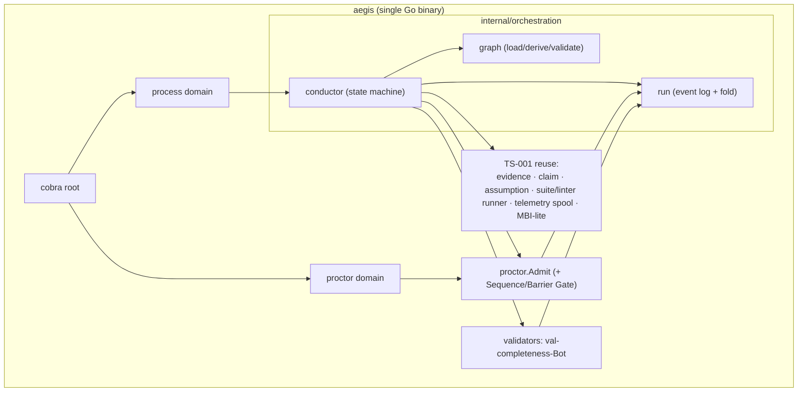
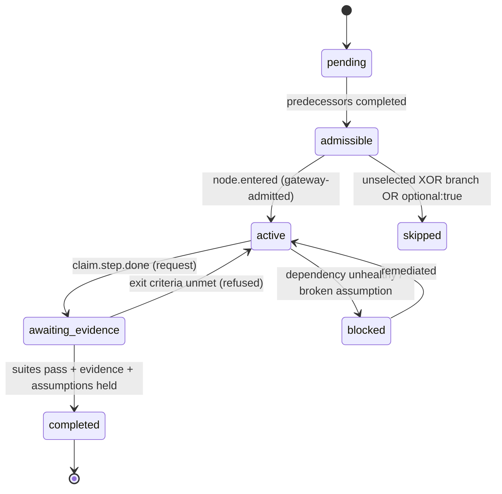

# HATHOR-TS-002 — Orchestration Gateway: Technical Specification
## Implementation spec for the event-driven, system-native bot & linter orchestration gateway

- **Document ID:** HATHOR-TS-002
- **Status:** DRAFT v0 — implementation specification, pending operator review
- **Date:** 2026-09-13
- **Author:** Oz (Agent), commissioned by Raymond Bayly (BaylyAI)
- **Implements:** HATHOR-RP-009 (Orchestration Gateway) — requirements `AEG-GW-001..015`
- **Decision basis:** HATHOR-ADR-002 (event-triggered central orchestration over choreography)
- **Conforms to:** HATHOR-REQ-CORE-001 (PLAT/CLI/BOT/TEL/SEC + §14 gates), HATHOR-ARCH-001, HATHOR-REQ-BOT-001, HATHOR-RP-001 (manifest), HATHOR-RP-002 (registry), HATHOR-RP-003 (telemetry)
- **Extends:** HATHOR-TS-001 (CVS implementation) — reuses its Go chassis, event-sourced ledger primitive, evidence/claim engine, telemetry spool, and Proctor dispatch seam
- **Scope rule:** describes *how* to build the system. Authorizes **no code by itself**; implementation requires an authorizing ticket per CORE `AEG-REQ-TKT-004`.

RFC 2119 keywords apply. New identifiers: decisions `TS2-D-###`, components `TS2-C-###`, interfaces `TS2-I-###` (namespaced to avoid collision with TS-001's `TS-D/TS-C/TS-I`).

---

## 0. Decisions locked for this spec

| ID | Decision | Rationale | Overridable? |
|---|---|---|---|
| **TS2-D-001** | **Built in Go, extending the TS-001 `aegis` binary** (working example module path `github.com/baylyai/aegis`, pending the M0 repository/module freeze). New packages under `internal/orchestration/*`; Proctor extended in `internal/proctor`. | Single static binary; reuses NFR-001 cold-start budget and the existing in-proc Proctor router. | Operator may swap language; §13 isolates the surface. |
| **TS2-D-002** | **Run state is event-sourced JSONL** (`events.jsonl`), state = fold — the **same primitive** as the TS-001 §8 assumption ledger (flock, `O_APPEND`, torn-line tolerance, UUIDv7). | Crash-safe, auditable, "status-on-record" (`AEG-REQ-KNO-007`); zero new storage tech. | No — architectural invariant (`AEG-GW-004`). |
| **TS2-D-003** | **Conductor runs in invocation mode by default** (short-lived CLI calls over durable state; no daemon in P0–P3). **Resident mode** (`aegis process conduct`) is P4 with identical semantics. | Honors TS-001 §2.1 (no daemon P0–P2) and CORE §17 Q4; durability makes both modes equivalent. | Resident mode is additive, not a rewrite. |
| **TS2-D-004** | **Graph is derived-by-default from the hierarchy chain** (Runbook→Workflow→Checklist), with an explicit `graph.yaml` override. | Resolves RP-009 open Q1 (lean: derive + override); keeps the hierarchy chain the single source of the plan (extends assets, not a parallel layer). | Projects may hand-author graphs. |
| **TS2-D-005** | **Gateway admission is a synchronous in-proc predicate** in `internal/proctor`, reusing the TS-001 §14 `proctor.Dispatch`/`Guard` seam; the **Sequence/Barrier Gate is G03** in CANON-001's fifteen-gate registry. | No new transport; every dispatch already funnels through Proctor (`BOT-TAX-006`). | Out-of-proc upgrade via the same seam (§13). |
| **TS2-D-006** | **Timers are deadline-compares at trigger/fold time** (no background scheduler in P0–P3). Resident mode (P4) adds active timers for `gateway.event` timeouts and `assumption.tick`. | Avoids a daemon; a `timeout` branch is still guaranteed by `ml-graph-integrity` (`AEG-GW-009`). | P4 adds active timing only. |
| **TS2-D-007** | **External events enter via `aegis process event emit`** (CLI-mediated append). No inbound listener, no bus. | Honors `AEG-REQ-PLAT-001` + `RP-003`; keeps CLI the sole surface (`AEG-GW-002`). | No. |

Working module path in examples: `github.com/baylyai/aegis` (shared with TS-001). Repository/module ownership MUST be frozen before M0; until then this string is illustrative rather than a canonical public import path, and any change must update TS-001/002/003 and PLAN-002 atomically.

---

## 1. Scope & depth

| Phase (RP-009 §13) | Depth in this spec |
|---|---|
| **P0** Run event log + fold; `run open/status`; Sequence/Barrier Gate; task-node execution; auto `on_change` | **Implementation grade** (§2, §4–§7, §10) |
| **P1** Node exit criteria; `node complete` as request; resume | **Implementation grade** (§5–§6, §9.3) |
| **P2** `val-completeness-Bot` + finalize reconciler; evidence gating; façade wiring | **Implementation grade** (§9) |
| **P3** `graph.yaml` schema + `ml-graph-integrity`; XOR/AND gateways | **Implementation grade for schema/linter** (§4); engine interface-level |
| **P4** `gateway.event` + timeouts; resident `conduct`; `assumption.tick` | **Interface level** (§14.1) |
| **P5** Tower rollups (skip MTTR, barrier-refusal rates, waiver audit) | **Interface level** (§14.2) |

---

## 2. System architecture

### 2.1 Process model

Everything ships inside the single `aegis` binary and runs as short-lived CLI invocations over durable `.aegis/` state (TS2-D-002/003). No daemon in P0–P3.



### 2.2 Package layout (additions to the TS-001 tree)

```text
aegis/internal/
  orchestration/
    graph/        # graph model, YAML loader, hierarchy derivation, digest
    run/          # event types, append log, fold → State, resume
    conductor/    # Process-Bot state machine: admissibility, transitions, timers
  proctor/
    gates/
      sequence.go # Sequence/Barrier Gate (G03)
    admit.go      # orchestration-aware Admit(req) → Verdict
  validators/
    completeness/ # val-completeness-Bot (validation.completeness.verify@1)
  linter/native/
    ml_graph_integrity.go   # native L1 graph linter
schemas/
  graph-1.0.0.json          # go:embed
  run-event-1.0.0.json      # go:embed
packs/graphs/               # go:embed default derived-graph templates
```

Reused unchanged from TS-001: `internal/{finding,evidence,claim,assumption,suite,linter/runner,telemetry,gitutil,upl,config,exit}`.

### 2.3 On-disk state (UPL)

Extends RP-009 §3.2; the only new artifact is `events.jsonl`.

```text
<project>/.aegis/
  rules/
    graphs/<graph-id>.yaml     # optional explicit graph override (else derived)
    validation.yaml            # + orchestration keys (§12)
  state/runs/<run_id>/
    run.json                   # header: graph_ref, graph_digest, ticket_ref, hierarchy_chain, started_at
    events.jsonl               # NEW — orchestration event log (state = fold)
    assumptions.jsonl          # TS-001 §8 (reused)
    evidence.jsonl             # TS-001 §10 (reused)
    findings.jsonl             # RP-007 §2.2 (reused)
    validation/                # aggregate reports (reused)
    cache/graph/<digest>.json  # resolved/validated graph cache
```

---

## 3. Exit codes, streams, output

### 3.1 `aegis process *` / `aegis proctor gateway *` exit mapping (`internal/exit`)

| Condition | Exit | Envelope field |
|---|---|---|
| Admitted / node advanced / finalize clean | `0` | `blocking:false` |
| Sequence violation, barrier not met, blocking findings, claim-tier insufficient, reconciler gap | `2` | `blocking:true` + `refusal.code` |
| Unknown run / node / graph id | `3` | — |
| Agent attempts human-only waiver | `4` | `PROVENANCE_UNVERIFIED`-style |
| Run state unreadable/corrupt on a mandatory action (**fail closed**) | `6` | `dependency:"run-state"` (still refuses) |
| Live finalize with side effects in non-TTY without `--yes` | `7` | `confirmation_required:true` |
| Internal error | `1` | error envelope |

Refusal codes (envelope `code`): `SEQUENCE_VIOLATION`, `BARRIER_NOT_MET`, `CHANGE_VALIDATION`, `CLAIM_TIER_INSUFFICIENT`, `EVIDENCE_MISSING`, `ASSUMPTION_BROKEN`, `COMPLETENESS_GAP`, `GRAPH_INVALID`, `WAIVER_FORBIDDEN`. All carry `{message, remediation, provenance, ttl}` and a `next_required[]` list (`AEG-GW-014`).

### 3.2 Streams (CORE `AEG-REQ-CLI-004`)

- **stdout** = data (folded run state / report JSON when piped; text on TTY).
- **stderr** = findings + progress; `--quiet` → errors only.
- **Fail-closed vs fail-open** (`AEG-GW-013`): admission/enforcement refuses on unreadable state; telemetry spool failure only degrades `status` (never blocks), per `AEG-REQ-TEL-002`.

---

## 4. Process graph subsystem (P0 model; P3 explicit-file + linter)

### 4.1 `graph.yaml` schema (`TS2-I-001`, `schemas/graph-1.0.0.json`)

```yaml
version: 1
graph: runbook:dvo-deploy-ticket@3      # graph id; bound to a hierarchy asset
derived_from: runbook:dvo-deploy-ticket@3   # present when auto-derived (TS2-D-004)
nodes:
  - id: implement.change
    type: task                          # task | gateway.xor | gateway.and | gateway.event
    requires: [open.run]                # DAG predecessors
    optional: false                     # default false → mandatory
    phase: 1                            # optional explicit barrier level
    on_change: suite.change.fast        # suite auto-run on fs.write/git.stage
    mandatory_suites: [suite.change.default]
    mandatory_claim: null               # e.g. pr.ready (binds claim→tier, AEG-VAL-006)
    gates: []                           # existing §14 gate names bound to this node
    exit:
      require_evidence: [lint]
      require_no_broken_assumptions: true
  - id: tests.gate
    type: gateway.event
    requires: [implement.change]
    await:
      - on: ci.passed
        to: ready.pr
      - on: ci.failed
        to: implement.change            # loop-back; must re-satisfy (no skip)
      - on: timeout(PT30M)              # MANDATORY branch (AEG-GW-009)
        to: blocked.human
```

Node-type-specific fields: `gateway.xor` → `branches: [{when: <expr>, to: <id>}]`; `gateway.and` → `fork: [<id>...]` + a join node whose `requires` lists all forked ids.

### 4.2 Go model (`internal/orchestration/graph`, `TS2-C-001`)

```go
package graph

type NodeType string // "task"|"gateway.xor"|"gateway.and"|"gateway.event"

type ExitCriteria struct {
    RequireEvidence          []string `json:"require_evidence,omitempty"`
    RequireNoBrokenAssumptions bool   `json:"require_no_broken_assumptions,omitempty"`
}
type Branch struct { When string `json:"when"`; To string `json:"to"` }
type Await  struct { On string `json:"on"`; To string `json:"to"` } // On = event class or "timeout(<ISO8601>)"

type Node struct {
    ID              string       `json:"id"`
    Type            NodeType     `json:"type"`
    Requires        []string     `json:"requires,omitempty"`
    Optional        bool         `json:"optional,omitempty"`
    Phase           string       `json:"phase,omitempty"`
    OnChange        string       `json:"on_change,omitempty"`
    MandatorySuites []string     `json:"mandatory_suites,omitempty"`
    MandatoryClaim  string       `json:"mandatory_claim,omitempty"`
    Gates           []string     `json:"gates,omitempty"`
    Exit            ExitCriteria `json:"exit,omitempty"`
    Branches        []Branch     `json:"branches,omitempty"`
    Fork            []string     `json:"fork,omitempty"`
    Await           []Await      `json:"await,omitempty"`
}
type Graph struct {
    ID     string           `json:"graph"`
    Digest string           `json:"-"` // sha256 of canonicalized graph
    Nodes  []Node           `json:"nodes"`
    index  map[string]*Node
}

func Load(root, graphRef string) (Graph, error)          // explicit file OR derive
func Derive(chain hierarchy.Chain) (Graph, error)        // TS2-D-004
func (g Graph) Predecessors(id string) []string
func (g Graph) RequiredSet(sel map[string]string) []string
```

### 4.3 Derivation from the hierarchy chain (TS2-D-004)

`Derive` maps the resolved chain to a default graph:
- Each **Workflow** step → a `task` node; `requires` = previous step (linear default).
- **Checklist** items → the node's completion ledger (a node completes when its checklist items are satisfied).
- Default bindings by node kind: change-producing steps get `on_change: suite.change.fast` + `mandatory_suites:[suite.change.default]`; the terminal step gets `mandatory_claim: run.complete`; PR/build steps map to `pr.ready` / `image.buildable`.
- Result is deterministic and digested; an explicit `graph.yaml` with the same `graph` id overrides it wholesale.

### 4.4 `ml-graph-integrity` (native L1 linter, `internal/linter/native`)

Pure detector (exit `0|2`, per `AEG-VAL-002`) run in `suite.change.default` and at `run open`. Blocks (`GRAPH_INVALID`) on: unreachable mandatory node; `requires` naming a non-existent node; a cycle without an event-gateway loop guard; a `gateway.event` node with no `timeout` branch (`AEG-GW-009`); an `and`-join whose `requires` ≠ its fork set; duplicate node ids.

### 4.5 Provenance (`AEG-GW-011`)

The canonicalized graph digest is recorded in `run.json` and every run event. Explicit `graph.yaml` files are signed org-wide like suites/manifests (RP-007 §7). `run open` refuses (`GRAPH_INVALID`/`PROVENANCE_UNVERIFIED`) an unsigned-where-required or lint-failing graph.

---

## 5. Run event log + state fold (P0/P1)

### 5.1 Event types (`internal/orchestration/run`, `TS2-C-002`)

```go
package run

type EventType string
const (
    RunOpened          EventType = "run.opened"
    NodeEntered        EventType = "node.entered"
    NodeSuiteStarted   EventType = "node.suite.started"
    NodeSuiteEnded     EventType = "node.suite.ended"
    NodeEvidenceRec    EventType = "node.evidence.recorded"
    NodeCompleted      EventType = "node.completed"
    NodeBlocked        EventType = "node.blocked"
    NodeSkipped        EventType = "node.skipped"        // lawful non-exec only (AEG-GW-006)
    GatewayBranchSel   EventType = "gateway.branch.selected"
    GatewayEventRecv   EventType = "gateway.event.received"
    ReconcileStarted   EventType = "run.reconcile.started"
    ReconcilePassed    EventType = "run.reconcile.passed"
    ReconcileFailed    EventType = "run.reconcile.failed"
    RunFinalized       EventType = "run.finalized"
    WaiverRecorded     EventType = "waiver.recorded"
)

type Actor struct { Kind string `json:"kind"` /* human|agent|system */; ID string `json:"id,omitempty"` }

type Event struct {
    EventID  string    `json:"event_id"` // uuidv7
    Type     EventType `json:"type"`
    RunID    string    `json:"run_id"`
    NodeID   string    `json:"node_id,omitempty"`
    At       time.Time `json:"at"`
    Actor    Actor     `json:"actor"`
    // typed payload (subset per Type):
    ToStatus     string   `json:"to_status,omitempty"`
    Suite        string   `json:"suite,omitempty"`
    Verdict      string   `json:"verdict,omitempty"`   // pass|fail|degraded|inconclusive
    Tier         string   `json:"tier,omitempty"`
    FindingIDs   []string `json:"finding_ids,omitempty"`
    EvidenceIDs  []string `json:"evidence_ids,omitempty"`
    Branch       string   `json:"branch,omitempty"`
    EventClass   string   `json:"event_class,omitempty"` // ci.passed, timeout, …
    Reason       string   `json:"reason,omitempty"`      // waiver/blocked
    Expiry       *time.Time `json:"expiry,omitempty"`    // waiver
}
```

### 5.2 Fold → `State` (`TS2-C-003`)

```go
type NodeStatus string // pending|admissible|active|awaiting_evidence|completed|blocked|skipped
type NodeState struct {
    ID            string
    Status        NodeStatus
    Attempt       int
    SuiteVerdicts map[string]string // suite → verdict (latest)
    EvidenceIDs   []string
    EnteredAt, CompletedAt time.Time
}
type State struct {
    RunID, GraphRef, GraphDigest string
    Nodes   map[string]NodeState
    Branches map[string]string  // gateway node → selected branch/target
    Terminal bool
}
func Fold(events []Event, g graph.Graph) State
```

### 5.3 Concurrency, atomicity, idempotency (`TS2-I-002`)

Identical protocol to TS-001 §8.2: advisory `flock(LOCK_EX)` on `events.jsonl.lock` around append; single `O_APPEND` write per line (≤64 KiB); lock-free reads with torn-trailing-line tolerance. Consumers dedupe on `event_id` (UUIDv7, at-least-once, `AEG-REQ-TEL-003`). Node work is keyed `(run_id, node_id, attempt)`; Operator side-effects carry idempotency keys (ARCH §17) so replay/resume never double-commits (`AEG-GW-004`).

### 5.4 Resume

`aegis process run resume <id>` re-folds the log, recomputes admissible nodes, and continues; `completed` nodes are never re-executed, incomplete ones re-run. Crash-safety and no-skip are the same property (durable state cannot forget a mandatory node).

---

## 6. Conductor state machine (P0/P1; timers P4)

### 6.1 Interface (`internal/orchestration/conductor`, `TS2-I-003`)

```go
type Conductor interface {
    Open(ctx, graphRef, ticketRef string) (run.State, error)
    Admissible(ctx, runID string) ([]string, error)
    Enter(ctx, runID, nodeID string, a run.Actor) (proctor.Verdict, error)
    Complete(ctx, runID, nodeID string, a run.Actor) (proctor.Verdict, error) // request; evaluated
    SelectBranch(ctx, runID, nodeID, branch string) error                     // gateway.xor
    ReceiveEvent(ctx, runID, nodeID, eventClass string) error                 // gateway.event
    Tick(ctx, runID string) error                                             // timeouts + assumption.tick
    Resume(ctx, runID string) (run.State, error)
    Finalize(ctx, runID string, a run.Actor) (Report, error)                  // triggers reconciler
}
```

### 6.2 Node lifecycle (implements RP-009 §5.2)



### 6.3 Transition rules (normative)

- **Only Process-Bot** appends `node.*`/`run.*`/`gateway.*` events (`AEG-GW-001`). Agents/worker bots emit **requests** (`Enter`, `Complete`, `SelectBranch`) that Proctor admits.
- `Complete` succeeds ⇒ append `node.completed` **iff atomically**: all `mandatory_suites` have a `pass` verdict at the required tier **and** `evidence.Verify(exit.require_evidence)` passes **and** no `broken|expired` assumptions bound to the node (reuses TS-001 §10 `val-evidence-Bot` + §8 assumption recheck).
- On `node.completed`, recompute successor admissibility per node type (§6.4).
- `Finalize` refused unless the completeness reconciler passes (§9.1).

### 6.4 Gateway node semantics

- **task** — normal; must reach `completed` unless `optional`.
- **gateway.xor** — `SelectBranch` records `gateway.branch.selected`; the chosen target becomes admissible; sibling branch roots are marked `skipped` (lawful, recorded — `AEG-GW-006`). Selecting none is not terminal-legal (reconciler fails).
- **gateway.and** — on entry, all `fork` targets become admissible in parallel; the join node (whose `requires` = fork set) becomes admissible only when **all** are `completed` (barrier/join, `AEG-GW-008`).
- **gateway.event** — waits for a `gateway.event.received` matching an `await.on` class, or a `timeout` deadline (TS2-D-006) evaluated at `Tick`/fold; resolves exactly one branch. `ml-graph-integrity` guarantees a `timeout` branch exists (`AEG-GW-009`).

### 6.5 Phase/barrier computation

Nodes are grouped into topological levels (explicit `phase` overrides). The Sequence/Barrier Gate (§7) refuses admission to any node in phase *k+1* while a mandatory phase-*k* node is not `completed`/`skipped` (`AEG-GW-008`).

---

## 7. Gateway admission (P0)

### 7.1 `proctor.Admit` (`internal/proctor/admit.go`, `TS2-I-004`)

```go
package proctor
type Class string // "work" | "transition"
type Request struct {
    Capability string; Args map[string]any
    RunID, NodeID string
    Emitter string // bot/agent/human identity
    Class   Class
}
type Verdict struct {
    Admitted bool
    Refusal  *Refusal // {Code, Message, Remediation, Provenance, TTL, NextRequired []string}
}
func (p *Proctor) Admit(ctx, req Request) (Verdict, error)
```

### 7.2 Sequence/Barrier Gate — algorithm (implements RP-009 §4.3, `internal/proctor/gates/sequence.go`)

```text
Admit(req):
  st := run.Fold(load(req.RunID), graph)          # durable state; unreadable → exit 6, REFUSE (fail closed)
  1. Provenance + Contract gates (existing)        # refuse → envelope
  2. classify:
       work       → require Nodes[req.NodeID].Status == active
       transition → require req.Emitter == process-Bot AND predicate(req.Type) holds
     else → REFUSE SEQUENCE_VIOLATION
  3. for p in graph.Predecessors(req.NodeID):
        if st.Nodes[p].Status not in {completed, skipped}:
            REFUSE BARRIER_NOT_MET (next_required = [p, …])
  4. phase-barrier: if any mandatory node in an earlier phase is open → REFUSE BARRIER_NOT_MET
  5. for s in node.mandatory_suites (entry-scoped):
        if latest verdict != pass: run suite now (conductor); still fail → REFUSE CHANGE_VALIDATION
  6. apply node.gates (existing §14: No-Ticket, Dev-Only, Deploy-Ticket, …)
  7. ADMIT → emit node.entered / allow dispatch
```

Composition order: Provenance/Contract → **Sequence/Barrier** → domain gates. Every refusal envelope enumerates `next_required` (`AEG-GW-014`), surfaced by `aegis proctor gateway explain`.

### 7.3 Façade integration (extends TS-001 §11.2)

`delivery commit|pr prepare`, `knowledge push`, container build, and `process run finalize` call `proctor.Guard(ctx, spec)`, which now also runs the Sequence/Barrier Gate and (for finalize) the reconciler.

---

## 8. Trigger intake (P0; watch P4)

### 8.1 Sources → conductor reactions (implements RP-009 §3.1)

| Trigger | Entry point | Reaction |
|---|---|---|
| `run.open` | `aegis process run open` | `Conductor.Open`; mark entry nodes admissible |
| `fs.write`/`git.stage` | git/editor hook, `validate watch` (P4) | run node `on_change` suite (L0/L1) |
| `claim.step.done` | `aegis process node complete` | `Conductor.Complete` (evaluate exit) |
| `gateway.event.*` | `aegis process event emit --class ci.passed` (TS2-D-007) | `Conductor.ReceiveEvent` |
| `assumption.tick` | `Tick` at CLI moments; timer in P4 | recheck held assumptions |
| `run.finalize` | `aegis process run finalize` / delivery façade | reconciler (§9.1) |
| `dispatch.request` | any capability via Proctor | `Admit` (§7) |

### 8.2 No inbound listener

External systems (CI) do not call in; a human/automation runs `aegis process event emit` (CLI-mediated append). This preserves the single control plane (`AEG-GW-002`).

---

## 9. Mandatory execution enforcement (P2)

> **Trust model (`AEG-THR-001`):** the guarantees in this section hold against a *cooperative-but-fallible* agent; adversarial-local hardening (hash-chained run log, Tower attestation) is phased per RP-013 §4.1.

### 9.1 Completeness reconciler — `val-completeness-Bot` (`validation.completeness.verify@1`)

Proctor-owned validator (RP-007 §5 roster), implementing RP-009 §7.4:

```text
Finalize(runID):
  st       := fold(events)
  required := graph.RequiredSet(st.Branches)          # mandatory ∧ reachable given selected branches
  executed := { n : st.Nodes[n].Status == completed }
  missing  := required \ executed
  for n in executed:                                  # correlate evidence ledger + telemetry (TEL-007)
      assert each n.mandatory_suite has a passing validation.suite.end event
      assert each n.exit.require_evidence has an evidence record (exit 0) — val-evidence-Bot
  if missing ≠ ∅ OR any assertion fails:
      append run.reconcile.failed ; REFUSE COMPLETENESS_GAP (exit 2, enumerate)
  else:
      append run.reconcile.passed ; run.finalized
```

The run ledger is authoritative for the executed set; evidence records and at-least-once, deduplicated telemetry are correlated checks, and provider receipts establish third-party effects. This prevents a cooperative-but-fallible agent from passing a doctored narrative claim. It is not independent proof against an adversarial local process until RP-013's hash-chain/Tower-attestation hardening lands.

### 9.2 Evidence-gated completion

Reuses TS-001 §10 `val-evidence-Bot` and claim→tier (`claims.yaml`); enforced by the conductor at **every** node (not only façades). Agent `claim.step.done` is a request; verdict is the system's (`AEG-GW-007`).

### 9.3 Human-only waiver (`AEG-GW-012`)

Reuses TS-001 §8.6 authz as amended by RP-013 `AEG-THR-002`: verify a Tower-issued short-lived human token; TTY inference is a UX hint only. Agent or invalid-token waiver ⇒ exit 4 `WAIVER_FORBIDDEN`. A waiver appends `waiver.recorded` (token reference, reason, expiry) and rolls up to Tower.

---

## 10. CLI surface (additive; folds under `process`/`proctor`, ≤ 9 domains per ADR-003 §2.2)

```text
aegis process
├── run open --graph <ref> --ticket <KEY> [--dry-run]
├── run status [--run id] [-o json]     # folded state: nodes, phase, next-required
├── run resume <id>
├── run finalize [--run id] [--yes]
├── node list [--run id] [--status admissible|active|…]
├── node enter <node_id> [--run id]
├── node complete <node_id> [--run id]
├── event emit --class <c> [--run id] [--node id]   # external event (TS2-D-007)
├── graph show <ref> | validate <ref>               # ml-graph-integrity
└── conduct --run <id> [drain|stop]                 # P4 resident

aegis proctor
├── gateway explain [--run id] [--node id]          # WHY refused / WHAT next
└── gateway admit <request.json>                    # internal (façades)
```

`gateway explain` returns `next_required` within the NFR-002 token budget (`--fields`, bounded).

---

## 11. Telemetry (RP-003 conformance)

`internal/telemetry` appends new orchestration events to the spool (networked drain out of scope): `orchestration.run.opened`, `orchestration.node.status_change`, `orchestration.gateway.branch`, `orchestration.barrier.refused`, `orchestration.reconcile`, `orchestration.waiver`. Envelope = CORE §10.1 v1; `event_id` uuidv7; consumers dedupe. **Never-fatal** (`AEG-REQ-TEL-002`): spool failure degrades `status`; enforcement refusals (exit 2) are driven by *state/findings*, not telemetry.

---

## 12. Configuration & precedence

`internal/config` (nearest-first, mirrors TS-001 §13). `validation.yaml` gains an `orchestration` block:

```yaml
orchestration:
  graph_source: derive|file|auto     # default auto (TS2-D-004)
  default_suites:                    # applied when a node omits bindings
    task_change: suite.change.default
    terminal:    suite.claim.run-complete
  strict_undeclared: false           # inherit RP-007 AEG-VAL-014
  reconcile_on_finalize: true        # AEG-GW-005 (must stay true in enforced profiles)
  timeouts: { default_event: PT30M }
```

`reconcile_on_finalize:false` is permitted only in a non-enforced dev profile and surfaces `degraded`.

---

## 13. Extensibility seam (in-proc → out-of-proc)

Reuses TS-001 §14: `proctor.Admit`/`Dispatch` already speak `(capability, args)→Verdict`; run events, findings, and evidence are serialized envelopes; `.aegis/state/runs/<id>/` is file-based. Moving the conductor or `val-completeness-Bot` to a Class C container swaps only the router/transport — no caller or schema change.

---

## 14. P4–P5 (interface level)

### 14.1 P4 — resident conductor + active timers (`TS2-I-005`)
`aegis process conduct --run <id>`: ephemeral per-run drain (open Q1 lean = per-run), `fsnotify` + git-index poll drives `on_change`; active timers fire `gateway.event` timeouts and `assumption.tick`; `drain|stop` like Observation-Bot; no SoT writes beyond the run log. Interface frozen now so graphs authored with `gateway.event`/timeouts run unchanged.

### 14.2 P5 — Tower rollups (`TS2-I-006`)
Observation-Bot drains `orchestration.*`; Tower exposes: skipped-unit / completeness-gap MTTR, barrier-refusal rates by node, gateway-branch distributions, waiver audit. Interface = the event envelopes (already normative) + a Tower query stub; no new emitter work.

---

## 15. Testing & acceptance

### 15.1 Test layers
- **Graph goldens:** `test/fixtures/graph/<case>/{graph.yaml, expected-findings.json}` for `ml-graph-integrity` (`AEG-VAL-002`).
- **Fold unit:** event fold determinism, torn-line tolerance, dedupe, resume idempotence.
- **Gateway unit:** sequence violation, barrier-not-met, AND-join wait, XOR skip legality, claim-tier insufficiency.
- **Reconciler unit:** delete one `node.completed` → `COMPLETENESS_GAP`; telemetry-vs-log mismatch → fail.
- **Integration (negative + positive):** out-of-order dispatch refused; false `step.done` refused; kill-mid-run resumes with no double side-effects; agent waiver refused (exit 4).
- **Conformance:** a graph driven end-to-end using only public CLI contracts (CORE `AEG-REQ-PLAT-002`).

### 15.2 Phase Definition-of-Done

| Phase | DoD |
|---|---|
| **P0** | `run open/status`; event log + fold; Sequence/Barrier Gate; task-node `enter`; auto `on_change`; out-of-order dispatch refused on a fixture graph |
| **P1** | `node complete` as request with exit criteria (suites+assumptions); `run resume` lossless; false `step.done` refused |
| **P2** | `val-completeness-Bot` + `run finalize` reconciler; evidence gating; façade wiring; deleting one `node.completed` refuses finalize naming the gap |
| **P3** | `graph.yaml` schema + `ml-graph-integrity`; XOR/AND gateways; invalid graph refused at `run open` |
| **P4–P5** | Resident `conduct` + `gateway.event`/timeouts; Tower rollups — interfaces published + stubbed, no contract breakage |

---

## 16. Open implementation questions

1. **Graph derivation fidelity** (TS2-D-004): how richly Workflow/Checklist metadata maps to nodes before an explicit `graph.yaml` is needed. Lean: linear default + per-step suite defaults; escalate to explicit graph for fan-out/gateways.
2. **Timer accuracy without daemon** (TS2-D-006): deadline-at-fold may fire late if no CLI activity occurs; acceptable in P0–P3, resolved by P4 resident timers. Confirm max acceptable lateness per graph.
3. **Concurrent conductors on one run:** flock serializes appends, but two agents driving one run could interleave requests — decide single-writer lease vs. optimistic append + fold-reconcile (lean: optimistic; fold is authoritative).
4. **Reconciler cost on long runs:** single fold + telemetry index vs. cursor (lean: single fold; index the spool by `run_id`). Ties to RP-009 §14 Q6.
5. **Cross-repo / monorepo runs:** one run per `.aegis/` vs per package (ties to CORE §17 Q5, TS-001 Q6).
6. **Actor identity source** for waiver authz: **resolved 2026-09-13 per `AEG-THR-002`** — enforced profiles require Tower-issued human tokens (RP-010 §5); the TS-001 §8.6 local-profile+TTY stance is dev-profile-only until WS7 lands.

---

## 17. Traceability (spec → RP-009 requirement)

| Spec section | Satisfies |
|---|---|
| §2 architecture, §13 seam | `AEG-GW-001`, `AEG-GW-003` |
| §4 graph + `ml-graph-integrity` | `AEG-GW-011`, `AEG-GW-009` (timeout), `AEG-GW-006` (optional/skip) |
| §5 event log + fold, §5.4 resume | `AEG-GW-002`, `AEG-GW-004` |
| §6 conductor, §6.4 gateways, §6.5 phases | `AEG-GW-001`, `AEG-GW-006`, `AEG-GW-008`, `AEG-GW-009` |
| §7 admission (Sequence/Barrier Gate) | `AEG-GW-003`, `AEG-GW-008`, `AEG-GW-014` |
| §8 triggers | `AEG-GW-002`, `AEG-GW-010` |
| §9 reconciler + evidence + waiver | `AEG-GW-005`, `AEG-GW-007`, `AEG-GW-012` |
| §10 CLI | `AEG-GW-014`, `AEG-GW-015` |
| §11 telemetry, §3 fail-closed/open | `AEG-GW-013`; CORE `TEL-001..007` |
| §4.3/§12 derivation & defaults | `AEG-GW-010`; RP-009 §6 |

---

*Draft v0 — implementation specification for HATHOR-RP-009 (per ADR-002). No code authorized without a ticket. Amend before promotion to verified.*
