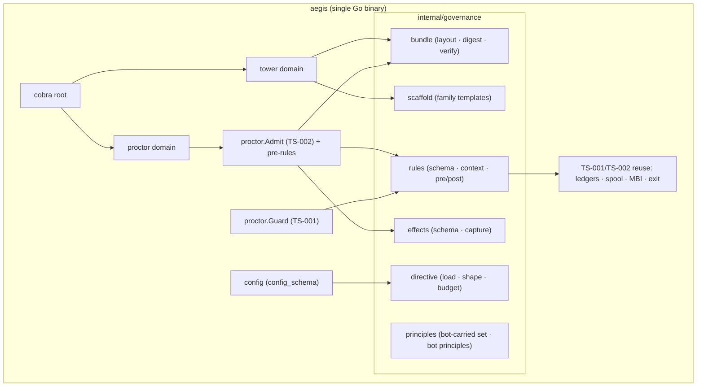

# AEGIS-TS-003 — Bot Unit Architecture: Implementation Specification
## Build, enforce, and operate a HATHOR micro-bot (directive · rules · principles · memory · lifecycle)

- **Document ID:** AEGIS-TS-003
- **Status:** DRAFT v0 — implementation specification, pending operator review
- **Date:** 2026-09-13
- **Author:** Oz (Agent), commissioned by Raymond Bayly (BaylyAI)
- **Implements:** AEGIS-RP-014 (The Bot Unit) — requirements `AEG-BOT-GOV-001..008`, `AEG-BOT-MEM-001..005`, `AEG-BOT-LIF-001..005`
- **Decision basis:** RP-014 §1 (independence), §3 (governance triad), §4 (memory model), §5 (communication), §6 (lifecycle)
- **Conforms to:** AEGIS-REQ-CORE-001 (PLAT/CLI/BOT/TEL/SEC/NFR), AEGIS-REQ-BOT-001, AEGIS-RP-001 (manifest v1 + handshake), AEGIS-RP-002 (MBI/TBR), AEGIS-RP-013 (JCS/DSSE/TUF, `AEG-THR-001`), AEGIS-ADR-003 (exit-code boundaries), AEGIS-RP-007/TS-001 (ledgers, config precedence, dispatch seam), AEGIS-RP-009/TS-002 (run log, admission)
- **Extends:** AEGIS-TS-001 (proctor dispatch seam, result cache, config), AEGIS-TS-002 (admission, run log)
- **Gating note:** RP-014 is **ACCEPTED** (2026-09-13); its §11 identifier changes are now ratified and applied to RP-001/BOT-001/CANON-001/ADR-003/RP-007/TS-001. This spec remains **DRAFT** and is **not authorized for build** until a Ticketing Plane epic/ticket exists (CORE `AEG-REQ-TKT-004`).

RFC 2119 keywords apply. New identifiers: decisions `TS3-D-###`, components `TS3-C-###`, interfaces `TS3-I-###` (namespaced to avoid collision with TS-001/TS-002).

---

## 0. Decisions locked for this spec

| ID | Decision | Rationale | Overridable? |
|---|---|---|---|
| **TS3-D-001** | **Built in Go, extending the `aegis` binary** (working example module path `github.com/baylyai/aegis`; repository/module ownership freezes before M0 per TS-001). New packages under `internal/governance/*`; rule evaluation lives in the existing Proctor dispatch seam (`internal/proctor`), reusing TS-002 `Admit` and TS-001 `Guard`. | Single static binary; reuses the one authoritative enforcement chokepoint instead of inventing a second engine. | Operator may swap language; §13 isolates the surfaces. |
| **TS3-D-002** | **Rules are data, never code.** Predicates are `kind: schema` (JSON Schema 2020-12) by default, with `kind: cel` as a gated, sandboxed, non-Turing-complete alternative; both are evaluated by the platform against a declared context. | Code-agnostic (`AEG-BOT-ANA-004`); pure (`AEG-VAL-002`); same vocabulary as contract validation (RP-001 §2.4). | No. |
| **TS3-D-003** | **`effects` is self-declared.** In-proc capabilities have effects instrumented by the dispatcher; out-of-proc executors return a bot-response envelope `{output, effects, degraded}`. Post-rules evaluate the declaration; declared post-rules with an absent `effects` block fail closed. | Honest envelope (`AEG-REQ-PLAT-004`); cooperative-but-fallible trust (`AEG-THR-001`); preserves stdout discipline (`AEG-REQ-CLI-004`). | No (`AEG-BOT-GOV-004`). |
| **TS3-D-004** | **Governance digests are manifest fields**; a sibling external DSSE envelope signs the JCS-canonical manifest bytes (RP-013 §6), transitively covering directive, rules, and principles without circular representation. Editing any governance file changes the manifest digest. | Behaviour is contract (`AEG-BOT-GOV-001/002`, LIF-002). | No. |
| **TS3-D-005** | **`aegis tower bots init` scaffolds from family templates shipped as `go:embed` assets**; the scaffold (with stub executor) passes `selftest` unmodified and includes family default rules. | `AEG-BOT-LIF-001`; deterministic authoring surface. | Template content is project-extensible. |
| **TS3-D-006** | **Directive budget ≤ 1000 tokens by default**, measured by the same tokenization bench as the agent skill pack (SKL-S3); the budget is a manifest field, not a hard constant. | `AEG-BOT-GOV-002`; operator-resolved (RP-014 §13 Q3). | Budget value is configurable. |
| **TS3-D-007** | **No new top-level domain.** Everything nests under `aegis tower bots …` and the existing per-bot commands (`status`, `manifest`, `report`, `config`, `selftest`). | `AEG-REQ-PLAT-008` (≤ 9), ADR-003 §2.2. | No. |
| **TS3-D-008** | **Refusal exit mapping:** pre-rule → `BOT_RULE_REFUSED` (CLI exit 2); post-rule → `CONTRACT_OUTPUT_INVALID` (CLI exit 1) with `rule_id`. The bot-boundary `0|1|2` codes are untouched. | RP-014 §3.4.2; precedent `SEQUENCE_VIOLATION`(2) / `CONTRACT_OUTPUT_INVALID`(1). | No (recorded in CANON-001 §4 on approval). |

---

## 1. Scope & depth

| Phase | Depth in this spec |
|---|---|
| **P0** — Bundle + directive + scaffold + registration enforcement + introspection | **Implementation grade** (§4, §5.1, §7, §9) |
| **P1** — Rule engine (pre/post), effects declaration, exit mapping, `selftest` rules | **Implementation grade** (§5.2–§5.4, §6) |
| **P2** — Memory enforcement (rules-as-data + effects), independence, principles observability | **Implementation grade** (§8, §9.4) |
| **P3** — CEL predicate kind, post-rule compensation, `gateway.event`-resident rule re-check | **Interface level** (§14) |

---

## 2. System architecture

### 2.1 Process model

Everything ships inside the single `aegis` binary and runs as short-lived CLI invocations over durable `.aegis/` state (TS-001 §2.1). The governance engine runs **in-process** at the dispatch seam — no daemon, no separate evaluator.



**Key point:** P0–P2 run the governance engine in-process behind the same capability/dispatch interfaces already used by validators (TS-001 §9). A code-agnostic bot never implements the engine; it only *declares* governance and *returns* effects (§6). The in-proc → out-of-proc seam is identical to TS-001 §14.

### 2.2 Package layout (additions to the TS-001/TS-002 tree)

```text
aegis/internal/
  governance/
    bundle/        # bundle layout, digest computation, verification (TS3-C-001)
    directive/     # DIRECTIVE.md loader + section/budget validation (TS3-C-002)
    rules/         # rules.yaml schema, predicate compilation, context assembly, evaluate (TS3-C-003)
    principles/    # principles.yaml schema, bot-carried set, tracing validation (TS3-C-004)
    effects/       # effects declaration schema + in-proc instrumentation (TS3-C-006)
    scaffold/      # family templates for `aegis tower bots init` (TS3-C-005)
  proctor/
    admit.go       # (TS-002) — insert pre-rule evaluation between gate pass and dispatch
  cli/
    tower/         # `aegis tower bots init|show --governance|install`
  schemas/
    governance-1.1.0.json   # go:embed — governance block of manifest schema
    directive-1.0.0.json    # go:embed
    rules-1.0.0.json        # go:embed
    principles-1.0.0.json   # go:embed
    effects-1.0.0.json      # go:embed
  packs/bots/               # go:embed — one template tree per family (orchestration|hierarchy|observation|validator)
```

Reused unchanged from TS-001/TS-002: `internal/{finding,evidence,claim,assumption,config,exit,telemetry,proctor,orchestration/*}`.

### 2.3 On-disk state (UPL)

Additions only; the only new author-side artifacts are the governance files.

```text
<project>/.aegis/
  manifests/<name>/            # verified bundle copy at install (TS-001 §2.3)
    manifest.json
    manifest.dsse.json         # external DSSE envelope over JCS-canonical manifest bytes
    DIRECTIVE.md
    rules.yaml
    principles.yaml
    fixtures/commands/<cmd>/   # golden I/O
    fixtures/rules/<rule-id>/  # ≥ 1 passing + ≥ 1 violating case per rule
  rules/bots/<name>.yaml       # per-bot config, validated against runtime.config_schema
  state/cache/<subsystem>/     # existing digest-keyed cache convention (MEM-002)
```

Machine tier (unchanged): `MBI-lite` under `${XDG_DATA_HOME:-~/.local/share}/aegis/index/` (TS-001 §2.3); per-bot config `${XDG_CONFIG_HOME}/aegis/bots/<name>.yaml`.

---

## 3. Exit codes, streams, output

### 3.1 Rule-refusal exit mapping (`internal/exit`)

| Condition | Exit | Envelope field | Refusal code |
|---|---|---|---|
| Pre-rule violation (admission, bot never runs) | `2` | `blocking:true` + `rule_id` | `BOT_RULE_REFUSED` |
| Post-rule violation (declared output/effects fail a `refuse` rule) | `1` | `blocking:true` + `rule_id` | `CONTRACT_OUTPUT_INVALID` |
| Post-rule `degrade` (advisory) | `0` | `degraded:true` | — (finding emitted) |
| Declared post-rules, absent `effects` block | `1` | `blocking:true` | `CONTRACT_OUTPUT_INVALID` |
| Governance digest mismatch at install/`status` | `2` / `0(degraded)` | per surface | `MANIFEST_DIGEST_STALE` |

These extend, never replace, the canonical table (CORE §4.5). The bot-boundary `0|1|2` codes (CR-017) describe the executor's own behaviour only (ADR-003 §2.3).

### 3.2 Streams (`AEG-REQ-CLI-004`)

- **stdout** = data. For out-of-proc bots that declare post-rules (or `side_effects ≠ none`), the executor emits the `aegis.bot-response/1` wrapper on stdout; the CLI **unwraps** it: `output` is validated against `output_schema` and emitted as the command's data, `effects` feeds post-rules then folds into `report`/telemetry, `degraded` maps to the response envelope. Bots with `side_effects=none` and no post-rules are unaffected (no wrapper).
- **stderr** = findings + progress; `--quiet` → errors only.

---

## 4. Bundle subsystem (P0)

### 4.1 Schema — manifest `governance` block (TS3-I-001, `schemas/governance-1.1.0.json`)

The governance block is a JSON Schema 2020-12 fragment of manifest schema 1.1.0 (ratified and applied by D8; RP-014 §11). Fields:

```json
"governance": {
  "directive":  { "path": "DIRECTIVE.md",    "digest": "sha256:…", "version": 1, "budget_tokens": 1000 },
  "rules":      { "path": "rules.yaml",      "digest": "sha256:…", "count": 4 },
  "principles": { "path": "principles.yaml", "digest": "sha256:…", "platform_set": "aegis-principles@1" }
}
```

Constraints: `directive.digest/rules.digest/principles.digest` MUST be the sha256 of the referenced file's raw bytes; `rules.count` MUST equal the number of root entries in `rules.yaml`; `platform_set` MUST be `aegis-principles@1`; `runtime.executor_kind` MUST be `mechanical` or `agent-backed` (mechanical is the default; agent-backed is gated — RP-014 §13 Q6).

### 4.2 Go model (TS3-C-001, `internal/governance/bundle`)

```go
package bundle

type Ref struct {           // one governance file reference
    Path       string `json:"path"`
    Digest     string `json:"digest"`         // "sha256:…"
    Version    int    `json:"version,omitempty"`
    BudgetTokens int  `json:"budget_tokens,omitempty"`   // directive only
    Count      int    `json:"count,omitempty"`           // rules only
    PlatformSet string `json:"platform_set,omitempty"`   // principles only
}

type Bundle struct {
    Root       string      // absolute bundle root
    Manifest   []byte      // canonicalized manifest with embedded governance.
    Envelope   []byte      // external DSSE envelope; payload must equal Manifest
    Directive  *directive.Directive
    Rules      []rules.Rule
    Principles principles.Set
}

// Verify re-derives each governance digest from disk and compares to the manifest.
// It also validates each file against its schema and the directive's sections/budget.
func Verify(root string, m manifest.Manifest) (Bundle, error)
```

### 4.3 Bundling + signing

- Author produces `manifest.json` + the three governance files + fixtures under one root (RP-014 §3.1).
- The CLI canonicalizes the manifest with **RFC 8785 (JCS)**; the governance digests are manifest fields. It writes a sibling external `manifest.dsse.json` **DSSE** envelope (Ed25519, TUF-distributed key — RP-013 §6) whose payload must byte-match the canonical manifest, so one fingerprint binds the governance triad without a signature field inside the signed payload.
- **P0 interface blocker:** manifest 1.1.0 has no executor/image/artifact digest. Before implementation, R10 in `PENDING-EDITS.md` must freeze how executable bytes or an OCI/SLSA attestation are bound to the signed manifest; this spec does not silently invent that field.
- `aegis tower bots install` verifies the signature offline, re-derives all three digests, then applies §7's registration-time enforcement before writing the MBI entry.

---

## 5. Governance engine

### 5.1 Directive loader (TS3-C-002, `internal/governance/directive`)

`DIRECTIVE.md` = YAML frontmatter + markdown body.

```go
package directive

type Directive struct {
    Version       int               `yaml:"directive_version"`
    Bot           string            `yaml:"bot"`
    Emphasis      []string          `yaml:"emphasis"`        // bot-carried principle ids, informational
    BotPrinciples []string          `yaml:"bot_principles"`  // must resolve in principles.yaml
    Sections      map[string]string // heading → body, lowercased heading keys
}

func Load(path string, budget int) (Directive, error)  // parses, checks all seven sections, measures tokens
```

**Seven required sections** (exact heading keys, case-insensitive): `Purpose`, `Scope`, `Inputs & outputs`, `Success`, `Refusal & degradation`, `Memory`, `Escalation`. Registration refuses a missing section (`AEG-BOT-GOV-002`).

**Budget** (`TS3-D-006`): body token count via the SKL-S3 bench kernel ≤ `budget_tokens` (default 1000). Directive loading for agent-backed executors (`runtime.executor_kind: agent-backed`, gated per RP-014 §13 Q6) verifies the digest before injection (RP-014 §3.3); mechanical executors never read the directive at runtime.

### 5.2 Rule engine (TS3-C-003, `internal/governance/rules`)

```go
package rules

type When string            // "pre" | "post"
type Effect string          // "refuse" | "degrade"

type Predicate struct {
    Kind   string         `json:"kind"`          // "schema" (default) | "cel" (gated opt-in)
    Schema json.RawMessage `json:"schema"`       // JSON Schema 2020-12 over RuleContext
}

type Rule struct {
    ID          string     `json:"id"`           // bot-scoped, e.g. "cl-r-001"
    Class       string     `json:"class"`        // dot-namespaced lowercase
    When        When       `json:"when"`
    AppliesTo   []string   `json:"applies_to,omitempty"` // commands; empty = all
    Predicate   Predicate  `json:"predicate"`
    OnViolation Effect     `json:"on_violation"`
    Message     string     `json:"message"`
    Remediation string     `json:"remediation"`
    Fixtures    string     `json:"fixtures"`     // fixtures/rules/<id>/
}

// Compile validates AppliesTo ⊆ manifest.commands, Effect ∈ {refuse,degrade},
// Kind ∈ {"schema","cel"}, and pre-compiles the predicate. Purity: no I/O in evaluation.
func Compile(rs []Rule, declared []string) ([]Rule, error)
```

**Evaluation (`TS3-I-005`):**

```go
type Verdict struct {
    Passed  bool
    RuleID  string
    Degrade bool   // true when a degrade-rule matched (advisory)
    Finding finding.Finding
}
// Evaluate runs pre-rules (no output/effects) or post-rules (full context).
func Evaluate(rs []Rule, when When, ctx RuleContext) (Verdict, error)
```

### 5.3 Rule context (TS3-I-004)

The platform assembles one context per invocation (RP-014 §3.4.1):

```json
{
  "bot":     { "name": "…", "family": "…", "tier": "…", "version": "…" },
  "command": "mark",
  "args":    { "…": "— validated against args_schema —" },
  "actor":   { "kind": "human|agent|system", "id": "…" },
  "run":     { "run_id": "…", "node_id": "…", "ticket_ref": "…", "hierarchy_chain": "…", "binding_id": "…" },
  "env":     { "profile": "enforced|dev", "environment": "development", "tty": false },
  "output":  { "…": "— post only —" },
  "effects": { "paths_written": [], "events_emitted": [], "knowledge_writes": [], "external_sessions": [], "retries": 0 }
}
```

`pre` sees the context with `output`/`effects` omitted; `post` sees it complete.

### 5.4 Principles (TS3-C-004, `internal/governance/principles`)

```go
package principles

type BotPrinciple struct {
    ID        string   `json:"id"`
    Statement string   `json:"statement"`
    Supports  []string `json:"supports"`   // ≥ 1 bot-carried principle id
    Rationale string   `json:"rationale"`
}
type Set struct {
    PlatformSet   string         `json:"platform_set"`   // "aegis-principles@1"
    BotPrinciples []BotPrinciple `json:"bot_principles"` // ≤ 5
}
```

`Validate`: the schema's `platform_set` field MUST name `aegis-principles@1` (the full bot-carried set, non-subsettable); ≤ 5 bot principles; each `supports` resolves into the carried set; directive's `bot_principles` ids MUST resolve here. The bot-carried principle table (P01–P12) is a compiled-in constant keyed by id; the source of truth is RP-014 §3.5.1.

---

## 6. Effects declaration (TS3-C-006, `internal/governance/effects`)

### 6.1 Schema (TS3-I-002)

```json
{
  "schema": "aegis.bot-response/1",
  "output":  { "…": "command output, validated against output_schema" },
  "effects": {
    "paths_written":     ["..."],
    "events_emitted":    ["task.end"],
    "knowledge_writes":  [{ "record_id": "kno-…" }],
    "external_sessions": [{ "connection": "jira", "idempotency_key": "…" }],
    "retries": 0
  },
  "degraded": false
}
```

### 6.2 Two capture modes, one schema

- **In-proc (validators, native, hierarchy chassis):** the dispatcher instruments the capability and materializes `effects` from the Go side — no wrapper crosses a process boundary. The listener/no-network invariants are already linter-guarded (`ml-no-listener`).
- **Out-of-proc (code-agnostic executors):** the executor returns the wrapper on stdout. `side_effects` (manifest, RP-001 §2.4) is the *routing category*; `effects` is the *runtime declaration* they are consistent with — a post-rule may assert a declared effect stays within the manifest's `side_effects` set.

### 6.3 Trust + fail-closed

The declaration is honest only under `AEG-THR-001`; a bot that misdeclares effects is detected, not prevented, in v1 (bundle digest → quarantine; Tower cross-check per RP-013 §4.1). A bot that declares post-rules and omits `effects` fails closed (`CONTRACT_OUTPUT_INVALID`). **Compensation (RP-014 §13 Q2, resolved):** the chassis never auto-compensates. A post-rule violation on `side_effects: external` returns the refusal + idempotency key (for reconciliation) and, if the author declared an optional `compensate` hint, that hint is surfaced for **human execution only** — never auto-run.

---

## 7. Scaffold + registration enforcement

### 7.1 `aegis tower bots init` (TS3-C-005)

```text
aegis tower bots init <role>-Bot --family <orchestration|hierarchy|observation> [--tier <t>] [--role validator]
```

Writes, from the family template (`packs/bots/<family>[/validator]`):

- `manifest.json` — identity (UUID minted, name normalized per CANON-001 §7.3), empty `commands[]`, `capabilities[]`, `knowledge`, empty `connections[]`, `telemetry`, the `governance` block with placeholder digests, `runtime{stateless:true, executor_kind:mechanical, resident:<by family>, requires_capabilities:[], config_schema:{}}`.
- `DIRECTIVE.md` — seven empty sections + frontmatter.
- `rules.yaml` — **family default rules** (RP-014 §3.4.2 table), with stub fixtures.
- `principles.yaml` — `platform_set: aegis-principles@1`, empty `bot_principles`.
- `fixtures/commands/*`, `fixtures/rules/*` — skeletons.
- stub executor for the default command set.

**Invariant (`AEG-BOT-LIF-001`):** `init && aegis tower bots selftest <name>` passes unmodified. Verifying this in CI for all four templates is a P0 DoD.

### 7.2 Registration-time enforcement (LIF-003)

`aegis tower bots install <ref>` refuses, in order, when any of these fail closed (each is a distinct test class):

1. missing `governance` block or any referenced file (`AEG-BOT-GOV-001`);
2. digest mismatch for any of the three files (`AEG-BOT-GOV-001`);
3. directive missing a required section, or over budget (`AEG-BOT-GOV-002`);
4. rule schema violation, unknown `applies_to` command, or a `kind` other than `schema`/`cel` (`AEG-BOT-GOV-003/005`);
5. a family default rule removed (`AEG-BOT-GOV-003`, "narrowing-only, add-never-remove");
6. principle constraints: the bot-carried set is subsetted, > 5 bot principles, an untraced principle, or a directive `bot_principles` id that does not resolve (`AEG-BOT-GOV-006`);
7. invalid `runtime.config_schema` (does not compile as JSON Schema 2020-12) or malformed `requires_capabilities` (not `<domain>.<noun>.<verb>@<major>`);
8. malformed `runtime.executor_kind` (not `mechanical`/`agent-backed`), or an agent-backed executor lacking recorded authorization (ADR or a ticketed owner — RP-014 §13 Q6).

These extend the existing `AEG-MAN-007` enforcement at the same registration moment (RP-002 §3.2). There is **no transition profile**: `governance` is mandatory (RP-014 §13 Q5 resolved: Instant).

---

## 8. Memory model enforcement

Memory (`AEG-BOT-MEM-001..005`) is enforced by **composition of already-specified mechanisms**, not a new engine; this section maps each requirement to its enforcement point.

| Requirement | Enforced by | Spec |
|---|---|---|
| **MEM-001** no private store | family-default write-scope rules (§5.2, pre on intent + post on `effects`) + existing `ml-broker-symmetry` / `ml-secrets-layer` | §6 |
| **MEM-002** caches disposable + digest-keyed | cache convention (`.aegis/state/cache/<subsystem>/`, digest key, atomic-rename writes); chain cache (RP-005 §4, item 3), result cache (TS-001 §5.5) already conform | §2.3 |
| **MEM-003** resident state bounded + rebuildable | resident state = cursors + pool + idempotency window + caches only; recreation from spool/ledgers/Tower (RP-011 §4, TS-002 §5.4) | (reference) |
| **MEM-004** read-fold, request-transition | TS-002 §5.3 (only Process-Bot appends `node.*`); a non-conductor `node.*` append is refused `SEQUENCE_VIOLATION` | (reference) |
| **MEM-005** no private learning | knowledge writes land `draft` only (RP-012 `AEG-KST-008`); zero `verified` records with bot identity | (reference) |

**Note:** no new linter is introduced (RP-014 §11). The "static check" in `AEG-BOT-MEM-001` AC is realized as the declared write-scope rule + its fixture, not a new `ml-*` rule.

---

## 9. CLI surface

### 9.1 `aegis tower bots` (ADR-003 §2.2, extended)

```text
aegis tower bots
├── list | show <name> [--governance] | selftest <name> | install <ref>   # existing
└── init <name> --family <f> [--tier <t>] [--role validator]             # proposed (this spec)
```

`show --governance` renders the parsed directive (sections + budget), the compiled rules (id, when, effect, applies_to), and the principle set — redact nothing (governance contains no secrets; `ml-secrets-diff` guards the bundle at build).

### 9.2 Default-command additive changes

- `manifest [--with-governance]` — emit the manifest, and when flagged, the directive body, rules, and principles (`AEG-BOT-CMD-013`).
- `status --group governance` — seventh slim group: digests match on disk, rule-fixture health, principle-set version (`AEG-BOT-CMD-011`).
- `config show|validate` — validates per-bot config against `runtime.config_schema` (`AEG-BOT-CMD-015`, §11).
- `report` — payload carries `decisions[]` (§9.4).

### 9.3 Rule-eligibility in `report`

Post-rules report the `rule_id` and `class` in the `report` payload (no separate channel).

### 9.4 Principles observability — `report.decisions[]`

```json
"payload": {
  "outcome": "success",
  "decisions": [
    { "kind": "discretionary", "principle": "P07", "rule": null,
      "choice": "served stale record with staleness flag",
      "alternatives": ["NO_CONFIDENT_MATCH"], "rationale": "…" }
  ]
}
```

The executor appends ≤ 10 decisions; the `report` payload travels Observation → Tower, queryable at `/v1/query/validation` (RP-010 §3.5). No new telemetry event type (CANON-001 §3 membership unchanged).

---

## 10. Telemetry

- **No new event types.** `contract.refused` (existing) gains `payload.rule_id` when a bot rule is the refusing surface; `decisions[]` rides `report` (§9.4).
- Envelope = CORE §10.1 v1; `event_id` UUIDv7; consumers dedupe. **Never-fatal** (`AEG-REQ-TEL-002`): rule refusals are driven by state/declaration, not telemetry availability.

---

## 11. Configuration & precedence

`internal/config` (TS-001 §13, nearest-first) gains per-bot resolution: `--flag` → project `.aegis/rules/bots/<name>.yaml` → machine `${XDG_CONFIG_HOME}/aegis/bots/<name>.yaml` → embedded defaults. Config is validated against `runtime.config_schema`; it contains connection *names* only and is excluded from the bundle digest (RP-014 §3.6). `status --group contract` reports unresolved `requires_capabilities` as `degraded`.

---

## 12. Testing & acceptance

### 12.1 Test layers

- **Bundle goldens:** `test/fixtures/governance/<case>/{manifest.json, DIRECTIVE.md, rules.yaml, principles.yaml, expected-…}` for digest and schema verification.
- **Directive unit:** seven-section detection, budget meter, digest-check-before-inject.
- **Rule engine unit:** pre/post separation, JSON Schema predicates, purity (no I/O path), `degrade` vs `refuse`, fail-closed on absent `effects`.
- **Effects unit:** in-proc instrumentation parity with the out-of-proc wrapper schema.
- **Registration integration:** one refusing test per LIF-003 class (§7.2).
- **Scaffold parity:** `init && selftest` green for all four family templates.
- **Independence:** `selftest` passes with a single-bot MBI (§13).
- **Code-agnosticism:** a Python bot and a Go bot with the same declared rule set are refused identically (`AEG-BOT-ANA-004`).
- **Memory:** cache-delete-changes-no-outcome; write-scope rule refuses an out-of-scope `effects` declaration.

### 12.2 Phase Definition-of-Done

| Phase | DoD |
|---|---|
| **P0** | `governance` schema frozen; `Verify` re-derives digests; `tower bots init` passes `selftest` for all templates; `manifest --with-governance` + `status --group governance` render; all LIF-003 refusal classes covered |
| **P1** | Pre/post rule evaluation at the dispatch seam; effects declaration + wrapper; exit mapping (`BOT_RULE_REFUSED`/`CONTRACT_OUTPUT_INVALID`); rule fixtures pass both ways; code-agnostic refusal proven |
| **P2** | Write-scope rules enforce no-private-store via `effects`; independence selftest in CI; `decisions[]` flows report → Tower; cache-rebuild + read-fold-guard cross-checks green |
| **P3** | `kind: cel` + post-rule compensation interfaces published and stubbed (no contract break) |

---

## 13. Extensibility seam + independence

Reuses TS-001 §14 / TS-002 §13 unchanged: governance evaluation speaks `(capability, args, ctx) → Verdict`; `effects` and findings are serialized envelopes; bundle files are on-disk. Moving a bot out-of-proc swaps only the transport; the rule engine stays in the platform.

**Independence (`AEG-BOT-LIF-004`):** CI runs each roster bot's `selftest` in a sandbox whose MBI contains only that bot; unresolved `requires_capabilities` MUST surface as `degraded`, never failure.

---

## 14. P3 (interface level)

- **`kind: cel` predicate** (RP-014 §13 Q1, resolved): a gated opt-in; `Compile` already targets it — runtime sandboxing lands with the CEL dependency, not as a separate phase.
- **Post-rule `compensate`** (RP-014 §13 Q2, resolved): a declarative remediation hint surfaced on violation, **human-executed and never auto-run**. No automatic compensator exists.
- **Agent-backed executor** (RP-014 §13 Q6, resolved): gated + exception-only; no new machinery beyond `runtime.executor_kind` and directive-injection (§5.1).
- **Resident rule re-check:** with TS-002 P4 `conduct`, re-evaluate `pre` rules on `assumption.tick` where a rule depends on run state.

---

## 15. Open implementation questions

1. **Effects transport** — in-proc instrumentation vs a uniform wrapper; lean: two modes, one schema (§6.2).
2. **Report schema ownership** — no prior TS defines the `report` response schema; TS-003 owns `decisions[]` placement. Confirm or point at the owning spec.
3. **Registration enforcement location** — installer vs a `proctor`-gated path; lean: installer for structural, `status` for drift.
4. **Rule context size** — bound `effects` + `output` re-serialization cost on hot paths; lean: only commands declaring post-rules serialize the wrapper.
5. **CEL sandbox tier** — seccomp/sandbox-exec once `kind: cel` is exercised (ties to RP-013 §7 Q4).

---

## 16. Traceability (spec → RP-014 requirement)

| Spec section | Satisfies |
|---|---|
| §4 bundle, §7.2 registration | `AEG-BOT-GOV-001/002`, `AEG-BOT-LIF-003` |
| §5.1 directive | `AEG-BOT-GOV-002`, `AEG-BOT-LIF-002` |
| §5.2–§5.3 rules | `AEG-BOT-GOV-003/004/005`, `AEG-BOT-MEM-001` |
| §5.4 principles | `AEG-BOT-GOV-006/007/008` |
| §6 effects, §9.3 | `AEG-BOT-GOV-004`, `AEG-BOT-MEM-001` |
| §7.1 scaffold | `AEG-BOT-LIF-001` |
| §8 memory enforcement | `AEG-BOT-MEM-002..005` |
| §13 independence | `AEG-BOT-LIF-004` |
| §9, §11 | `AEG-BOT-GOV-007/008`, `AEG-BOT-LIF-005` |
| §3 exit/streams | CORE PLAT-004/005, CLI-004, ADR-003 §2.3 |

---

*Draft v0 — implementation specification for AEGIS-RP-014. Gated on RP-014 approval; no code authorized without a ticket. Amend before promotion to verified.*
