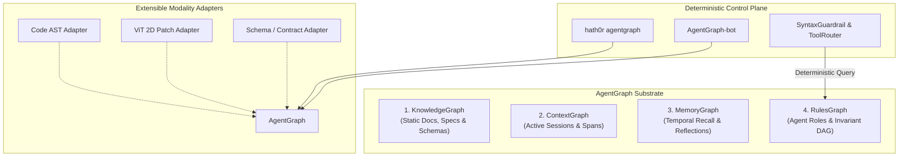

# HATHOR-ADR-009: AgentGraph Unified Quad-Graph Architecture, Policy Governance, and Extensible File Topology

## 1. Context and Problem Statement

The Hath0r Agentic Framework has historically organized its cognitive substrate around the **Tri-Graph Architecture** (`CR-RAG-RETRIEVAL-001`), partitioned across:
1. **KnowledgeGraph (`lib.graph` / `docs/` / `contracts/`):** Static documentation, contracts, schemas, and architectural invariants.
2. **ContextGraph (`lib.context` / `src/hath0r_engine/context/`):** Dynamic session trees, active subagent executions, runtime tool spans, and ephemeral state.
3. **MemoryGraph (`src/hath0r_engine/memory/`):** Long-term temporal entity nodes, Letta-compatible working memory paging, and sleep-cycle consolidation reflections.

While this triadic division effectively mirrors human cognitive memory (Epistemic, Working, and Sensory Attention), it leaves a critical architectural gap in **multi-agent governance, role-based authorization, and rule enforcement**:

- **Probabilistic vs. Deterministic Governance:** Currently, agent rules (`CR-*` invariants, repository rules, and subsystem standards) are ingested as markdown text and retrieved through probabilistic hybrid RAG (BM25 + vector similarity). Governance rules and security boundaries must **never be probabilistic**; an agent should not "probabilistically miss" a safety constraint because the query embedding diverged.
- **Missing Role-to-Rule Inheritance Lineage:** Rules have strict organizational scoping:
  $$\text{Org Invariant (CR-*)} \longrightarrow \text{Repo Rule} \longrightarrow \text{Subsystem Rule} \longrightarrow \text{Agent Role} \longrightarrow \text{Task Scope}$$
  Flat prompt stuffing or disjoint memory nodes cannot deterministically resolve rule precedence, child overrides, or detect circular dependencies and contradictions.
- **Lack of Tool Authorization (RBAC/ABAC):** `DynamicToolRouter` semantically scores tool relevance, but cannot verify if a specific subagent role is *authorized* to invoke sensitive mutations (e.g., shell commands, branch creation, or deployment triggers).
- **Multi-Repo Fragmentation:** Across `~/Development` (OpenSource, BAI, 1-Nation, Ray), rule files (`AGENTS.md`) and operational constraints are defined in diverse, unstructured formats with no centralized synchronization or cross-repository validation mechanism.

---

## 2. Decision Drivers

1. **Deterministic Rule Invariants (Zero-Prompt-Tax):** Eliminate massive rule prompt-stuffing while guaranteeing that all active constraints are deterministically evaluated before LLM execution or tool dispatch.
2. **Unified Agent & Policy Fabric:** Provide first-class graph entities for `AgentRoleNode` and `RuleNode` with explicit relational edges (`GOVERNS`, `INHERITS_FROM`, `AUTHORIZES_TOOL`, `RESTRICTED_BY`, `CAN_SPAWN`, `SUPERSEDES`).
3. **Streamlined Unified Engine (`AgentGraph`):** Unify Knowledge, Context, Memory, and Rules under a single high-performance engine that shares common indexing, bitemporal validity intervals, and persistence primitives.
4. **Extensible File & Modality Scaling:** Architect the engine with pluggable adapters to seamlessly index code ASTs, visual assets (ADR-008), OpenAPI schemas, and arbitrary project files.
5. **Operator Control Plane & Autonomous Bot:** Expose comprehensive management via `hath0r agentgraph` CLI commands, governed by an autonomous `AgentGraph-bot` that audits, heals, and synchronizes rules across all development workspaces.

---

## 3. Considered Options

- **Option A (Status Quo with Tri-Graph):** Retain KnowledgeGraph, ContextGraph, and MemoryGraph. Attempt to handle rules via markdown files in `docs/` and memory paging.  
  *Drawback:* High prompt token overhead, non-deterministic enforcement, no role-based tool gating.
- **Option B (Separate Standalone Policy Engine / OPA):** Deploy an external policy service (e.g., Open Policy Agent / Rego) alongside the Tri-Graph.  
  *Drawback:* Introduces heavy external daemon dependencies, breaks the standalone zero-dependency CLI design (`HATHOR-ADR-006`), and fragments context from memory.
- **Option C (Unified AgentGraph Quad-Substrate — Selected):** Expand and streamline the cognitive engine into **AgentGraph**, unifying Knowledge, Context, Memory, and Agent/Rules into a cohesive graph substrate with pluggable file adapters and a dedicated `AgentGraph-bot`.

---

## 4. The AgentGraph Architecture

The **AgentGraph** substrate unifies four interconnected graph planes within `hath0r_engine.graph`:

### 4.1. Core Graph Taxonomy

| Sub-Graph | Node Types | Relational Edge Types | Lifecycle |
|---|---|---|---|
| **RulesGraph** | `agent_role`, `rule_policy`, `permission_scope` | `GOVERNS`, `INHERITS_FROM`, `AUTHORIZES_TOOL`, `RESTRICTED_BY`, `CAN_SPAWN`, `SUPERSEDES` | Static & Version-Controlled |
| **KnowledgeGraph** | `document`, `contract`, `strategy`, `playbook`, `subsystem` | `depends_on`, `implements`, `references`, `validates`, `contains` | Static Architecture Docs |
| **ContextGraph** | `agent_instance`, `task`, `tool_invocation`, `context_slice` | `spawned_by`, `delegated_to`, `executed_tool`, `guarded_by` | Ephemeral (Session-Scoped) |
| **MemoryGraph** | `concept`, `decision`, `fact`, `episode`, `insight` | `ENFORCES`, `REQUIRES`, `DERIVES_FROM`, `RELATES_TO`, `RESOLVES` | Long-Term Temporal Recall |

### 4.2. Deterministic Rule Inheritance & Conflict Resolution

Rules are structured as a Directed Acyclic Graph (DAG). When an agent is instantiated for a task:
1. **Ancestry Compilation:** The engine computes the transitive closure of rules:
   $$\mathcal{R}_{\text{active}} = \text{Ancestors}(\text{AgentRole}) \cup \text{ScopedRules}(\text{TaskTarget})$$
2. **Precedence Hierarchy:**
   $$\text{Org Invariants (CR-*)} > \text{Repo Rule} > \text{Subsystem Rule} > \text{Agent Role Guideline}$$
3. **Conflict Detection:** If Rule $A$ (`RESTRICTS: shell_mutation`) and Rule $B$ (`ALLOWS: shell_mutation`) collide, higher precedence wins. If at equal precedence, the engine halts with an explicit configuration error rather than hallucinating.
4. **Bitemporal Validity:** Edges maintain `valid_from`, `valid_to`, and `is_current` flags, ensuring deprecated rules are cleanly superseded over time without breaking historical execution replays.

### 4.3. Extensibility to Arbitrary File Modalities

`AgentGraph` implements an open node/edge adapter interface:
- **`CodeASTAdapter`:** Ingests Python/TypeScript files into syntax tree nodes and symbol dependency edges.
- **`VisionPatchAdapter`:** Links pixel-native visual embeddings (ADR-008) to UI test cases and documentation figures.
- **`ContractAdapter`:** Continuously synchronizes JSON schemas in `contracts/` to graph entity validators.

---

## 5. Control Plane: CLI & AgentGraph-bot

### 5.1. Operator CLI Surface (`hath0r agentgraph`)
- `hath0r agentgraph status`: High-level graph topology, node counts, and edge density across all 4 planes.
- `hath0r agentgraph validate`: Run deterministic cycle detection, orphan checks, and rule conflict audits.
- `hath0r agentgraph sync`: Parse and index local repository rules, docs, and ASTs into the persistent graph.
- `hath0r agentgraph route --role <role_id> --task <task>`: Return authorized tools and active constraints for a specific agent role.
- `hath0r agentgraph query --query <str>`: Execute hybrid BM25 + dense vector cross-graph search.

### 5.2. Autonomous AgentGraph-bot
`AgentGraph-bot` operates as a dedicated micro-bot within the CLI control tower:
1. **Automated Workspace Synchronization:** Watches rule files (`AGENTS.md`, `.hath0r/`) and automatically re-indexes graph state upon modification.
2. **Continuous Healing:** Prunes stale context spans, invalidates expired temporal edges, and resolves dangling dependencies.
3. **Clean-Repo Integration:** Executed in Step 7 of the Clean-Repo SOP to audit and catalog graph integrity before PR creation.

---

## 6. Migration Across `~/Development`

All repositories across `~/Development` will be onboarded to the standardized AgentGraph format:
1. **Rule Extraction:** Existing markdown rules from `AGENTS.md` and subsystem documents are parsed and converted into typed `RuleNode` and `AgentRoleNode` contracts.
2. **CLI Alignment:** Target repositories update their preflight and clean-repo checks to run `hath0r agentgraph validate`.
3. **Deprecation of Ad-Hoc Rule Files:** Eliminates scattered, unverified prompt instructions in favor of centralized, verifiable graph definitions.

---

## 7. Consequences & Impact

### Positive
- **Zero-Prompt-Tax Governance:** Reduces LLM prompt context overhead by up to 40% by injecting only active, filtered rule constraints.
- **Deterministic Tool Authorization:** Hard pre-execution security enforcement via RBAC/ABAC prevents rogue agent behavior.
- **Single Source of Truth:** Unifies documentation, session lineage, episodic memory, and governance rules under one coherent API.
- **Scalable Architecture:** Extensible adapters allow ingesting arbitrary source code, schemas, and visual assets without altering core graph logic.

### Negative / Trade-Offs
- **Initial Migration Overhead:** Requires cataloging and validating existing markdown rules across multiple suites.
- **Schema Discipline:** Contributors must author rules with valid metadata, precedence tiers, and target boundaries.
