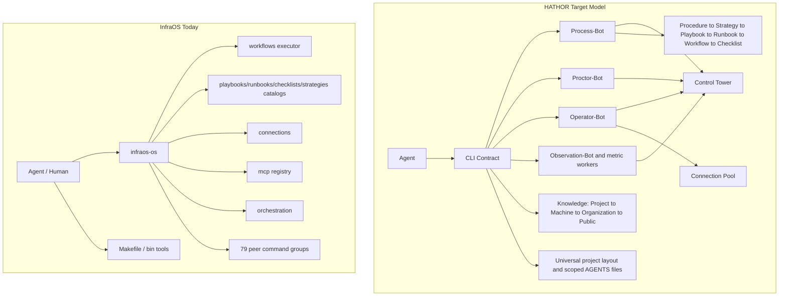

# HATHOR CLI Research Report
**Subject:** HATHOR CLI Vision vs InfraOS CLI (`infraos-os`) vs Industry Practice
**Scope:** Research only — no code changes
**Date:** 2026-09-11
**Systems examined:** Four submitted HATHOR outline images, `infraos-os` 9.3.0, Communications (Hera) product surface, InfraOS architecture docs (AD-001–AD-008), and sampled industry CLI/agent sources
**Status:** Outline terminology cross-checked against the source images; live CLI claims verified separately (see §9); external findings are source-attributed
**Historical-baseline note (2026-09-13):** this report studies `infraos-os` 9.3.0 as the baseline. Strategy decisions taken since — greenfield `hath0r` binary, nine-domain surface, `.hath0r/` layout — are recorded in HATHOR-ADR-003/004; §1.7's `.ai/hath0r` layout is the outline-era label (canonical: `.hath0r/`, CORE §7.1).

---

## 1. What the HATHOR outline is saying

The outline positions **CLI as the control plane**: the single contact surface between agents and everything else (code, assets, knowledge, systems).

### 1.1 Core thesis

| Pillar | Meaning |
|--------|---------|
| **Agent-agnostic** | Any agent runtime can drive the same CLI contract |
| **Code-agnostic** | Same operational surface across languages/repos |
| **Communication contract** | Structured language between agent ↔ machine |
| **Manifest architecture** | Declarative inventory of what exists and how it is invoked |
| **Knowledge microbursts** | Small, incremental knowledge updates after each task or unit of work |
| **Consistent bot architecture** | Same runtime actor patterns across products |
| **Control Tower access** | Every bot reports posture, results, and escalation upward |

### 1.2 Runtime actors (bots) — the Micro-Bot Architecture

The outline frames this as a **Micro-Bot Architecture**: every capability is a small, single-role bot that does one job, is reached through the CLI, and reports upward to the Control Tower. The Control Tower is the authority/visibility plane, not another worker bot.

```
Agent → CLI ←→ Process-Bot      (executes hierarchy / work packages)
            ←→ Proctor-Bot      (guardrails and approval)
            ←→ Operator-Bot     (connection pool / external systems)
            ←→ Observation-Bot  (collects execution and quality signals)

Observation-Bot → task-Bot | benchmark-Bot | success-rate-Bot | retry-Bot | token-Bot
All bots → Control Tower        (authority, governance, visibility, escalation)
```

Process-Bot sits above the **information hierarchy**. Operator-Bot sits on the **connection pool**. Proctor-Bot is the supervision/gate layer for agent action. Observation-Bot owns measurement through focused workers and reports aggregated signals to the Control Tower.

Every bot also answers two questions in its anatomy/taxonomy: **how it works** (its procedure surface) and **how it stores info** (its manifest/knowledge footprint).

### 1.3 Information hierarchy (top → bottom)

```
Procedure   → business problem + required outcome (must be outlined before work)
  Strategy  → direction for one/all procedures (a procedure can have multiple)
    Playbook → guidelines implementing the strategy (or part of it)
      Runbook  → playbook + concrete task/set of tasks → execution entry
        Workflow → scripts/tools progressing Runbook completion
          Checklist → track steps; always updated until success
```

This is **intent → method → executable steps → verification**, not a flat command dump.

### 1.4 Connection pool

First-class external systems (Slack, Teams, Jira, Salesforce, etc.) with Operator-Bot as the integration actor — connections are validated before use, and the connection pool is queried rather than agents freelancing raw API calls.

### 1.5 Explicit product claim

> "The HATHOR CLI is the single point of contact for the agent to interface with the computer, code, assets and knowledge."

This matches current "CLI-as-control-plane" industry thinking (governance, audit, agent execution velocity).

### 1.6 Knowledge Infrastructure

Knowledge is a first-class plane in the outline, distinct from the operational CLI surface, with **clear tier separation** and a fixed **search order**:

| Axis | Model |
|------|-------|
| Tiers (top → bottom) | Organization Level → Machine Level (“CLI Knowledge”) → Project Level |
| Search order (through the CLI) | Project → Machine → Organization → Public |
| Lifecycle | Microbursts write small updates; content carries provenance, TTL/staleness, and Draft/Verified state |
| Quality | Hybrid retrieval, explicit no-confident-match behavior, and retrieval quality are first-class concerns |

This makes the knowledge model concrete: knowledge is packaged per level and resolved **nearest-first**, rather than one flat global index. Agents query through the CLI, never by freelancing a raw search across an un-scoped corpus.

### 1.7 Universal Project Layout

HATHOR assumes a standard, repo-agnostic layout so the CLI and bots can reason about every project identically:

```text
<project>/
  .ai/hath0r/ # hidden HATHOR metadata, manifests, and rules
  CFG/       # configuration not required at repository root
  SRC/       # source
  LIB/       # assets and non-narrative supporting material
  BIN/       # project-specific executables and wrapper scripts
  DIST/      # build/distribution output
  Test/      # tests and test automation
  docs/      # narrative project documentation
  .docker/   # container and deployment files
```

The outline also requires a local `AGENTS.md` in each significant folder, with parent files pointing to child scopes, so agents load relevant instructions without one monolithic context file. Every HATHOR project is a Git project, and the Makefile is a thin façade over stable CLI contracts. The exact capitalization and migration from existing `.infraOS` assets remain implementation decisions; the list above preserves the outline labels.

A uniform layout is a precondition for the knowledge tiers (§1.6) and for "CLI as single contact" across code-agnostic repos.

### 1.8 Framework context: HATHOR + Security and Credentials

The outline labels HATHOR as part of **HATHOR — the Agentic Application Framework**, the umbrella under which the CLI control plane, micro-bot runtime, knowledge tiers, and universal layout are standardized across products. It explicitly calls out digital provenance, graceful degradation, standardized machine-readable communication (JSON by default), micro-linters, retrieval quality, TTL/staleness, governance/rules, and agentic organization. The HATHOR CLI is HATHOR's control-plane realization.

**Security and Credentials** is also a first-class outline box: the CLI mediates credential resolution through policy-declared providers and precedence, while Proctor applies guardrails. Bots receive scoped identity/capability rather than retaining raw ambient credentials (see §6). Exact providers and precedence must be specified by policy rather than inferred from the diagram.

---

## 2. What exists today (`infraos-os` 9.3.0 + Communications)

### 2.1 Architectural alignment (strong)

InfraOS already implements large parts of the HATHOR model:

| HATHOR concept | InfraOS reality | Evidence |
|---------------|-----------------|----------|
| Single CLI entrypoint | `infraos-os` as sole operational binary | AD-001 |
| Agent interface | `agent preflight`, orientation workflows, AGENTS.md start sequence | product rules + CLI |
| Control Tower | `tower` command group + ControlTower repos | CLI surface |
| Process execution | `workflows run/list/describe/validate/refresh` + executor service | workflows-and-execution.md |
| Knowledge plane | `knowledge`, `vectra`, KnowMCP | system-overview.md |
| Connection pool | `connections list/test/test-service/health/probe/failover/show/validate/export` | AD-005 |
| MCP plane | separate from connections (`mcp`, `mcp-servers`, `mcps`) | AD-005 |
| Hierarchy artifacts | `playbooks`, `runbooks`, `checklists`, `workflows`, `strategies`, `policies`, `initiatives`, `plans` | top-level commands (verified) |
| Orchestration | ReAct orchestration with persisted state (`orchestration agents/test/run/status/list/cancel/delete/debug`) | AD-007 |
| Gates | `pr-ai`, `quality`, `qgates`, compliance workflow | AD-008 |
| Product dual surface | Makefile + CLI (`make orient`, `make pr-ai`) | Communications README |

**Verdict:** Conceptually, InfraOS is already a HATHOR-class platform CLI — not a thin wrapper around scripts. The HATHOR diagram is less a "new product" and more a coherent packaging of what the platform already believes.

### 2.2 Structural gaps vs the diagram

| HATHOR expectation | Gap in current CLI |
|-------------------|--------------------|
| Strict chained hierarchy Procedure → … → Checklist | Hierarchy tiers exist as **sibling catalog commands** (`strategies`, `playbooks`, `runbooks`, `checklists` each offer list/show/search/categories/tags/index) but there is no enforced chain: no runtime where a runbook run drives workflows and updates its checklist as one lifecycle. There is no `procedure` object; `plans`/`initiatives`/`projects` partially overlap that tier. |
| Process-Bot / Proctor-Bot / Operator-Bot / Observation-Bot as named runtime roles, reporting to the Control Tower authority | Logic is spread across orchestration, workflows, connections, agent preflight, status, and reports — no named bot roles, observation-worker contract, or uniform upward handoff protocol. |
| Communication contract as product surface | Help is human argparse prose; machine contract is **inconsistent** — verified: `status` supports `--json`, but `workflows list` and `connections list` expose no JSON/format flag. |
| Manifest architecture | `commands inventory` exists, but no full machine-readable capability/manifest schema (command effects, output shapes, error types) for agents. |
| CLI as *only* control plane | Product repos still dual-path heavily via Makefile + scattered `bin/*` tools (`pr-ai-tui`, `docker-manager`, `testing-manager`, `refresh-gen1`). |
| Proctor (trust gate before agent action) | Policy is mostly documentary (`cr-deploy-gov-001`, write boundaries in AGENTS.md) rather than a consistent CLI proctor mode (`--dry-run`, risk class, approval flow). |
| Discoverable hierarchy | Root help lists **79 top-level command groups** (verified); the hierarchy is invisible in the surface shape. |
| Knowledge Infrastructure (tiers + Project→Machine→Organization→Public search order) | `knowledge`/`vectra`/KnowMCP exist but are flat; no tier packaging or declared nearest-first search order. |
| Universal Project Layout (`.ai/hath0r`, CFG/SRC/LIB/BIN/DIST/Test/docs/`.docker`, scoped AGENTS files) | Product repos are Makefile/AGENTS.md-driven, but the target folder contract and per-folder instruction scoping are not uniformly enforced by the CLI. |
| Micro-Bot Architecture (single-role bots reporting to Tower) | Closest is `orchestration agents`; no single-role capability composition or upward Tower reporting contract. |
| Knowledge lifecycle (microbursts, provenance, Draft/Verified, TTL/staleness) | Retrieval and indexing exist, but the outline's write cadence and lifecycle metadata are not one enforced contract. |

### 2.3 UX / engineering issues observed (verified against the live CLI)

1. **Command sprawl** — exactly 79 top-level groups (api, capacity-factor, deep-security-scan, design-sync, docker, health, …, zendesk, rovo, profile, commands). Industry guidance (clig.dev, agent-CLI guides) prefers shallow trees + progressive disclosure; wide flat surfaces raise agent token cost and hallucination risk.
2. **Broken discoverability path** — `infraos-os help` fails with `error: argument command: invalid choice: 'help'` (verified). Both `tool help` and `tool --help` should work.
3. **Inconsistent structured output** — verified: `status --json` exists; `workflows list` and `connections list` have no JSON/format flag. Agents must screen-scrape some outputs and parse JSON in others.
4. **Hybrid registration debt** — AD-002: plugin registry + legacy `commands_*.py` modules; multiple dispatch paths increase debugging complexity and behavioral inconsistency across groups.
5. **Incomplete hierarchy productization** — playbooks/runbooks/checklists are catalog/search/show; workflows is the only real executor. HATHOR wants runbooks to *own* workflow execution and checklists to *track* completion as one lifecycle.
6. **Agent-contract unevenness** — mutation paths lack uniform: structured JSON stdout, stderr-only telemetry, semantic exit codes, effects declarations (read_only / idempotent / non_idempotent), dry-run / `--yes` / non-interactive guarantees.
7. **Dual integration planes are correct but cognitively heavy** — Connections vs MCP (AD-005) matches industry "CLI for local/dev tools, MCP for remote SaaS," but agents need a single documented **router story** ("use CLI when…, MCP when…"), not two catalogs.
8. **Consumer repo friction** — Communications teaches Makefile as the primary lifecycle; HATHOR wants CLI as the single contact with Make as a thin façade.
9. **Tower / agent surfaces are thin** — verified: `tower` exposes only `version`; `agent` exposes only `preflight`. The diagram implies Control Tower Access and the bot runtime as first-class surfaces.

---

## 3. Industry research: frameworks, CLIs, patterns

### 3.1 Canonical CLI design sources

| Source | Key takeaways relevant to HATHOR/InfraOS |
|--------|------------------------------------------|
| **clig.dev** (Command Line Interface Guidelines) | Human-first + composable; consistency across programs; ease of discovery; "saying just enough" |
| **CLI Spec — clispec.dev** (v0.3 candidate, Aug 2026) | Design for humans **and AI agents**: structured output, schema introspection, stdout/stderr separation, non-interactive by default, safe retries, bounded output; per-command `effects` (read_only/idempotent/non_idempotent) and `output_kind` (data/stream/opaque) |
| **12-Factor / production-CLI practice** | Config precedence flags > env > file > defaults; exit codes as a public API; TTY detection; idempotency; dry-run where a meaningful plan can be produced |
| **Agent-CLI design guides (2025–2026)** | Long flags for agents; noun-verb trees; explicit structured output; schema introspection; input validation as hallucination defense; semantic exit codes agents can branch on |

### 3.2 Command taxonomy patterns in mature tools

| Pattern | Examples | Fit for InfraOS |
|---------|----------|-----------------|
| **Action-first** | `kubectl get/apply/delete` | Good for ops verbs across many resources |
| **Resource-first** | `aws s3`, `gh pr`, `argocd app` | Good for domain objects (jira, connections, workflows) |
| **Hybrid** | `docker`, `terraform`, `pulumi` | **Best match**: high-level lifecycle actions (`orient`, `pr-ai`) + nested resource trees |
| **Orchestrator + atoms** | internal platform CLIs | Matches Process-Bot over atomic commands |

Practical limits from the literature: two levels of nesting (`tool resource action`) is the sweet spot; three works when the grouping is obvious; four means redesign.

### 3.3 Agent era: signals from sampled 2026 sources

The sampled benchmark and practitioner write-ups suggest:

- **CLI can win** on token cost, composability, and model familiarity for mature tools (`gh`, `kubectl`, `aws`, docker). In ScaleKit's 75-run GitHub benchmark, CLI used **4–32× fewer tokens**; CLI completed 25/25 runs while the remote MCP path completed 18/25 because of connection timeouts; its 10k-operations cost projection was ~17× higher for direct MCP. This is one tool/server/model benchmark, not a universal MCP reliability result.
- **MCP is often better suited** to multi-tenant SaaS, OAuth flows, typed discovery, cross-client distribution, governance mediation, and systems **without** a good CLI.
- **A hybrid split is usually appropriate** — CLI for mature local/developer operations; MCP or another governed protocol for remote, multi-tenant, or unfamiliar systems. The correct ratio is workload-specific; this corpus does not establish an 80/20 target.
- Emerging pattern: an **operations layer above commands** — agents reason in intents ("restart deployment", "open deploy ticket"); execution providers (CLI or MCP) sit underneath; skills documents encode the how; policy evaluates operations, not raw shell strings.
- **CLI+Skills** was the highest-ROI optimization in the cited ScaleKit benchmark: a small (~800-token) skill document cut tool calls and latency by about a third versus its unguided CLI condition.

**InfraOS implication:** Keeping Connections + MCP separate (AD-005) is right. The missing piece is an **operations/intent façade** (HATHOR Procedure/Strategy/Runbook) so agents don't navigate 79 top-level commands.

### 3.4 Control-plane governance (new risk class)

One practitioner framing calls the CLI the **last honest control plane** — UIs observe, CLIs mutate. Regardless of the slogan, agent execution velocity multiplies the blast radius of ambient credentials: an agent can chain mutating calls across systems before a human sees output. The resulting design requirements are scoped credentials, dry-run where a meaningful plan can be produced, approval gates, audit of *intent* (not just command text), and versioned runbooks instead of home-directory scripts.

This maps almost 1:1 to HATHOR **Proctor-Bot** plus the existing TTHC governance rules (development-only writes, no agent deploy, DVO deploy-ticket handoff).

### 3.5 Frameworks and tools worth borrowing from

| Framework / tool | Idea to steal |
|------------------|---------------|
| **Cobra / Clap / Click** | Consistent command groups, completions, global flags |
| **kubectl** | Resource model + server-side dry-run + uniform structured output |
| **gh** | `--json <fields>` field selection; excellent agent affordance |
| **Terraform** | plan/apply separation — the canonical proctor pattern |
| **Google Workspace CLI (`gws`)** | Command surface generated from a discovery API + built-in MCP server — dual interface from one core |
| **CLI Spec schema** | Machine-readable per-command effects/cardinality/output-kind manifest |
| **Local daemon + thin CLI** (Unix-socket IPC pattern) | Kills cold-start for high-frequency agent calls; holds persistent MCP/connection state |
| **mcp2cli / skills-over-CLI** | Cheap agent efficiency: small skill docs over raw CLI beat dumping full MCP catalogs into context |

---

## 4. Comparative model



**Overlap:** single-entrypoint ambition, hierarchy *vocabulary*, connections, MCP, orchestration, knowledge, gates.
**Delta:** HATHOR specifies **roles + chained hierarchy + machine contract + knowledge lifecycle + project-layout contract**; InfraOS exposes capabilities as a wide flat menu without enforcing all of those relationships.

---

## 5. Findings (prioritized)

### Strengths to preserve
1. Single binary operational entrypoint (AD-001).
2. Workflows as executable runtime assets with validate/run/status (AD-003, AD-004).
3. Split Connections vs MCP planes (AD-005) — matches 2026 hybrid guidance.
4. Explicit quality/release gates and product AGENTS contracts (AD-008).
5. Hierarchy vocabulary already present — playbook/runbook/checklist/workflow *and* strategies/policies/initiatives.
6. Orientation + connection health as agent bootstrap (Communications start sequence).
7. Stateful, inspectable orchestration lifecycle (AD-007).

### Issues / risks
1. **Taxonomy flatness** — hierarchy is catalogued, not orchestrated as one lifecycle.
2. **Discoverability failure modes** — `help` subcommand errors; 79-command root help overwhelms agents (token + hallucination risk).
3. **No universal agent I/O contract** — verified-inconsistent JSON support; uneven exit codes/effects/dry-run.
4. **Proctor gap** — governance is documentary, not a runtime gate on mutations.
5. **Bot roles not reified** — Process/Proctor/Operator/Tower are conceptual only; `tower` and `agent` surfaces are nearly empty.
6. **Parallel control planes** — Makefile + `bin/*` tools dilute "CLI as single contact."
7. **Hybrid plugin/legacy registration** — long-term consistency tax (AD-002 acknowledges this).
8. **MCP token-tax risk** if agents load full MCP catalogs for tasks the CLI does cheaper.
9. **Governance velocity risk** as more agents drive the CLI with broad local credentials.

### Opportunities (recommendations — not an implementation plan)

**A. Productize the HATHOR hierarchy as a runtime, not only catalogs.**
Introduce a first-class `procedure` object (or promote `plans`/`initiatives` into that tier); bind Procedure → Strategy → Playbook → Runbook → Workflow(s) → Checklist. `process runbook run <id>` should drive its workflows and checkpoint checklist progress. Local state writes can be atomic, but external Jira/Teams effects cannot share that transaction; use idempotency keys, durable checkpoints, and reconciliation rather than claiming end-to-end atomicity.

**B. Reify bot roles as CLI namespaces or modes.**
```
infraos-os process …    # execute hierarchy
infraos-os proctor …    # dry-run, risk classification, approve, policy explain
infraos-os operator …   # connections + external side effects
infraos-os tower …      # posture, audit, control-plane status
```
Keep existing commands as aliases during migration.

**C. Adopt a CLI Spec-style communication contract globally.**
Global `--output/-o json|text|auto` (retain `--format` only as a compatibility alias if already contracted); an `infraos-os schema` machine manifest; per-command `effects`, `output_kind`, and `cardinality`; stdout=data / stderr=telemetry; never prompt without a TTY. Keep `--yes`/`--dry-run` on applicable mutations and `--fields`/pagination only on collection commands rather than pretending every flag makes sense globally.

**D. Progressive disclosure of the command tree.**
Group the 79 roots behind the seven-domain façade in ADR-001; hide internal/debug commands; fix `infraos-os help`; ship shell completions plus an agent skill pack ("how to orient / pr-ai / connections") — the highest-ROI item in the cited ScaleKit benchmark.

**E. Make the Makefile a thin façade.**
Every `make X` calls one stable `infraos-os …` contract; retire parallel logic in `bin/` or re-export as CLI subcommands.

**F. Proctor-Bot = policy engine for agent writes.**
Align with cr-deploy-gov-001 (development-only mutations by default); risk classes on commands; block testing/staging/prod writes without explicit human grant; structured audit log of agent invocations (intent + command + effect).

**G. Operator-Bot = connection execution façade.**
Prefer `infraos-os operator jira create-issue …` over agents freelancing raw APIs. Keep MCP for discovery/multi-client distribution; CLI for high-frequency local agent loops.

**H. Consider daemon mode later.**
A persistent local service (Unix socket) for MCP fan-out, connection-health cache, and vectra, with a thin CLI client — only if cold-start latency becomes measurable agent pain.

**I. Operations-not-commands layer for agents.**
A small stable intent catalog ("orient repo", "run pr-ai", "open DVO deploy request") mapped to runbooks/workflows, so agents never live in the 79-command soup.

**J. Measurement.**
Benchmark agent task performance (tokens, success rate, retries) for the top 10 tasks via CLI vs MCP; track hierarchy completion (checklist close %); track time-to-orient for new agents/humans.

---

## 6. Mapping HATHOR "CLI as control plane" to existing governance rules

The Communications AGENTS rules already encode control-plane law that HATHOR would place in Proctor/Operator:

- Development-only write boundary (CR-AWS-GOV-003, cr-deploy-gov-001)
- No agent deploy; DVO deploy-ticket workflow
- Jira-ticket-linked agent workflow (cr-jira-ticket-001)
- `make pr-ai` compliance contract with dashboard reporting
- Connections via InfraOS only; never hardcoded secrets

**Finding:** Governance *content* is strong; **runtime enforcement and UX shape** lag the outline.

---

## 7. Summary judgment

| Dimension | Score vs HATHOR vision | Notes |
|-----------|----------------------|-------|
| Single entrypoint | High | `infraos-os` is real (AD-001) |
| Hierarchy vocabulary | Medium-High | All tiers present as catalogs; not chained |
| Bot/runtime roles | Low–Medium | Process/Proctor/Operator/Observation are implicit; `tower`/`agent` surfaces are thin |
| Connection pool | High | Mature split with MCP (AD-005) |
| Agent communication contract | Medium–Low | JSON/exit/effects verified inconsistent |
| Control Tower | Low–Medium | Named but thin (`tower version` only) |
| Knowledge tiering/lifecycle | Low–Medium | Retrieval exists; tier fallback, provenance, verification, and staleness are not one enforced contract |
| Universal project contract | Low | Outline layout and scoped AGENTS files are not uniformly validated |
| Industry agent-readiness (2026) | Medium | Good bones; needs CLI Spec discipline + progressive disclosure |
| Governance intent | High | Rules strong; proctor runtime incomplete |

**Bottom line:** InfraOS is already closer to HATHOR than a typical internal CLI. The primary gap is **coherence**: turning a 79-command capability menu into a contracted control plane with a chained hierarchy lifecycle, proctor gates, operator integrations, knowledge lifecycle, project-layout contract, and agent-safe I/O. The sampled CLI Spec and CLI/MCP sources support this direction, but the local benchmark does not prove broad modality superiority.

---

## 8. Research sequence status and remaining decisions

| Research step | Corpus output | Status |
|---------------|---------------|--------|
| Top-30 invocation inventory | Report 01 | Complete for one developer machine; fleet validation remains |
| CLI Spec scoring | Report 02 | Provisional scoring complete; full stream/non-interactive conformance probes remain |
| Target command-tree ADR | Report 03 | Proposed; awaits maintainer decision |
| Schema + runbook/checklist spike design | Report 04 | Design complete; implementation not authorized |
| Token/payload baseline | Report 05 | Local payload/proxy baseline complete; controlled CLI-vs-MCP benchmark remains open |

The next decisions are whether to accept ADR-001, authorize the DVO spike, collect fleet-wide invocation evidence, and run benchmark v2 against a healthy KnowMCP endpoint with full input/output token accounting.

---

## 9. Live CLI fact-check appendix (verified 2026-09-11)

| Claim | Method | Result |
|-------|--------|--------|
| CLI version | `infraos-os --version` | **9.3.0** ✓ |
| `infraos-os help` fails | direct invocation | ✓ verbatim: `error: argument command: invalid choice: 'help'` |
| Top-level command count | parsed root help choices list | **79** exactly (earlier draft said "70+" — corrected) |
| `status` JSON support | `status --help` | ✓ has `-j, --json` |
| `workflows list` JSON support | `--help` grep | ✗ no JSON/format flag → inconsistency confirmed |
| `connections list` JSON support | `--help` grep | ✗ no JSON/format flag → inconsistency confirmed |
| Hierarchy tiers as commands | root help | `strategies`, `policies`, `initiatives`, `plans` DO exist as catalogs (earlier draft said "no first-class strategy runtime" — refined: tiers exist as catalogs, the *chained lifecycle* does not) |
| `tower` surface | `tower --help` | only `version` ✓ |
| `agent` surface | `agent --help` | only `preflight` ✓ |
| `orchestration` surface | `--help` | `agents,test,run,status,list,cancel,delete,debug` ✓ |
| playbooks/runbooks/checklists surfaces | `--help` | list/show/search/categories/tags/index (catalog-only) ✓ |
| `mcp` surface | `--help` | `health,list,call` ✓ |
| Hybrid plugin/legacy registration | InfraOS `docs/architecture/cli-and-command-model.md`, AD-002 | ✓ |
| Binary location | `which infraos-os` | `/opt/homebrew/bin/infraos-os` ✓ |
| Parallel `bin/*` tools in Communications | `ls bin` | `docker-manager`, `pr-ai-tui`, `testing-manager`, `refresh-gen1`, `pre-deploy-pack.sh` (+ .cmd variants) ✓ |

---

## References (primary)

- Submitted HATHOR outline images: [`images/00-outline-agent-anatomy-taxonomy.png`](./images/00-outline-agent-anatomy-taxonomy.png), [`images/01-outline-universal-project-layout.png`](./images/01-outline-universal-project-layout.png), [`images/02-outline-universal-project-layout-detailed.png`](./images/02-outline-universal-project-layout-detailed.png), [`images/03-outline-micro-bot-architecture.png`](./images/03-outline-micro-bot-architecture.png)
- [Command Line Interface Guidelines](https://clig.dev/)
- [The CLI Spec v0.3 candidate](https://clispec.dev/) and [version status](https://clispec.dev/versions/)
- InfraOS `docs/architecture/` — decision-log.md (AD-001–AD-008), cli-and-command-model.md, system-overview.md, workflows-and-execution.md, connections-and-mcp.md
- Communications README.md & AGENTS.md (IBS-PRD-HERA)
- [ScaleKit MCP-vs-CLI benchmark article](https://www.scalekit.com/blog/mcp-vs-cli-use) (Claude Sonnet 4, 75 runs) and [benchmark repository](https://github.com/scalekit-inc/mcp-vs-cli-benchmark)
- [StackOne MCP vs CLI analysis](https://www.stackone.com/blog/mcp-vs-cli-for-ai-agents/) and [CLIforAI comparison](https://www.clifor.ai/compare/cli-vs-mcp)
- kubectl / gh / terraform / docker taxonomy patterns; La Rebelion CLI design-pattern classification
- Agent-CLI design guides (noun-verb trees, long flags, dry-run, schema introspection, semantic exit codes)
- "The CLI Was Always the Control Plane" — CLI control-plane governance (Rack2Cloud, 2026)
