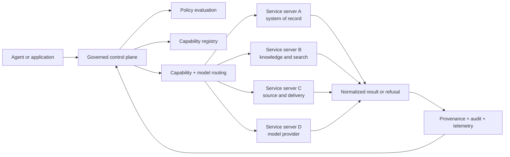

# The Governed Capability Fabric: Integrating Enterprise AI Service Servers

**Status:** DRAFT — architecture guidance and design target, not a claim that every described component is currently shipped.

Enterprise AI rarely arrives as one server. It arrives as a collection of specialized service servers: a system of record adapter, a documentation adapter, a source-control adapter, a feature-management adapter, a collaborative workspace adapter, a search adapter, and one or more model-serving endpoints. Each server may be useful in isolation. The engineering problem begins when an agent must use several of them in one decision or workflow.

The naive answer is to let every server expose its own tools, credentials, response shapes, retry behavior, and authority rules. That produces connectivity, but not a platform. An agent can reach the systems and still be unable to answer the questions that matter in production:

- Which source was authoritative for this answer?
- What policy allowed this action?
- Which model and provider produced this result?
- Was the result complete, partial, stale, or degraded?
- Can an operator reconstruct the chain from request to external side effect?
- If one server is unavailable, what may safely continue?

The better answer is a **governed capability fabric**: multiple service servers behind a shared control plane, normalized into stable capability contracts, with provenance, authorization, routing, degradation, correlation, and evidence treated as part of every interaction.

## The central distinction: connectivity is not capability

A connector knows how to call a provider. A capability knows what the call means, what it is allowed to do, how it can fail, and how its result can be trusted.

That distinction changes the unit of architecture. The unit is not “an MCP server” or “an API client.” It is a **bounded capability adapter**:

1. It has a declared identity and version.
2. It exposes a small, typed contract.
3. It names the provider authority it may consult.
4. It accepts a request envelope carrying actor, purpose, policy, and correlation context.
5. It returns a stable response or refusal envelope.
6. It emits evidence without leaking credentials or sensitive payloads.
7. It can be disabled, degraded, or replaced without changing the control-plane contract.

This is the same architectural move as a micro-bot with one whole responsibility: keep the responsibility narrow, the boundary explicit, and the failure vocabulary visible.

## One fabric, many servers

The fabric does not require every provider to become one monolithic service. Separation is valuable. A ticketing system and a search system have different data models, freshness characteristics, and mutation risks. Model providers have different capabilities, costs, latency profiles, and data-handling agreements.

The fabric standardizes what must be common while preserving what must remain provider-specific:

- **Common:** identity, contract version, authorization context, correlation, refusal semantics, provenance, redaction, audit, timeout, retry, and health.
- **Provider-specific:** query syntax, pagination, resource identifiers, rate limits, feature coverage, model parameters, and native error details.

The adapter owns translation at the edge. The control plane owns policy and composition. Neither side should impersonate the other.



The diagram describes the target shape. A repository may currently implement only parts of it: a CLI gateway, a subset of adapters, or individual contract experiments. Architecture documentation should preserve that distinction rather than turning a target diagram into a shipping claim.

## The canonical interaction contract

Every capability call should enter and leave the fabric through a canonical envelope. The envelope is deliberately boring. Boring contracts are easier to validate, log, test, and evolve.

A request should carry at least:

- `request_id` — unique for the interaction;
- `correlation_id` — shared across the agent task and downstream calls;
- `actor` — human, agent, service, or delegated identity;
- `purpose` — the declared operation or business intent;
- `capability` and `capability_version`;
- `resource` — the target and scope;
- `policy_context` — tenant, environment, approvals, and constraints;
- `deadline` — an absolute time budget;
- `idempotency_key` — required where a retry could repeat a mutation.

A successful response should carry:

- `status` — complete, partial, or accepted;
- `data` — provider-neutral result data;
- `provenance` — source, authority, retrieval time, version, and transformation steps;
- `policy_decision` — the rule or decision class that permitted the operation;
- `routing` — selected server, provider, model, and reason class;
- `evidence` — references to audit and telemetry records;
- `warnings` — omissions, freshness concerns, or non-fatal degradation.

An unsuccessful response is not an unstructured exception. It is a refusal or failure envelope with a stable code, human-readable message, remediation, provenance, time-to-live where relevant, and safe details. A caller should be able to decide whether to retry, ask for approval, narrow scope, choose another capability, or stop.

## Provenance is part of the result

An answer without provenance is only a string with a confidence problem. In a fabric, provenance travels with the result rather than being reconstructed later from log fragments.

For retrieved information, provenance should identify:

- the authoritative provider and resource;
- the resource revision, snapshot, or event time;
- retrieval time and freshness window;
- the access path and transformations applied;
- whether the result was direct, aggregated, inferred, or model-generated;
- the policy and identity under which it was retrieved.

For model-generated output, provenance should additionally record the selected model class, provider, routing policy version, prompt or input reference according to retention policy, tool calls used, and any fallback path. The record need not expose confidential prompts or secrets. It must expose enough evidence to explain the result and reproduce the decision boundary.

Provenance also prevents authority leakage. A search index may be excellent for discovery while not being authoritative for a mutation. A cached document may support orientation while not supporting an approval. The fabric makes those distinctions explicit instead of allowing the most convenient provider to silently become the source of truth.

## Policy is a narrowing layer

The control plane should evaluate policy before dispatch and should pass the resulting constraints into the adapter. Policy may narrow what a capability can do; it must not silently broaden the provider's authority.

Useful policy dimensions include:

- actor and delegated identity;
- tenant, project, environment, and data classification;
- read versus mutation;
- resource scope and field scope;
- required approval state;
- allowed providers and model classes;
- maximum cost, latency, and token budget;
- retention and redaction rules;
- permitted fallback behavior.

The adapter still validates provider-specific permissions. Defense in depth matters because a control-plane decision can be stale, misconfigured, or bypassed by an implementation defect. Conversely, provider success is not evidence that the action was permitted by the fabric. Authorization is a platform decision, not an accidental consequence of a 200 response.

## Model routing is policy-driven, not preference-driven

When a fabric includes several model providers, routing must be observable and constrained. “Use the cheapest model” is not a routing policy; it is one optimization criterion.

A routing decision can consider:

- capability requirements and tool-use support;
- data residency and classification;
- quality tier and evaluation evidence;
- latency and availability;
- cost budget;
- provider or model allowlists;
- tenant-specific agreements;
- current circuit state;
- human approval for exceptional routes.

The decision should produce a reason class, not only a provider name. For example, an operator should be able to distinguish “selected by quality tier,” “fell back after provider timeout,” and “blocked because the provider was outside the data policy.” This makes routing a governed event that can be reviewed and improved.

Fallback is not automatically safe. A lower-capability model may be acceptable for summarization but unsafe for a privileged mutation plan. A different provider may have different retention or residency properties. The route graph therefore needs capability-specific fallback rules, not one global “try the next provider” loop.

## Bounded degradation

Distributed systems fail. The fabric's goal is not to pretend otherwise; it is to make the failure boundary explicit and bounded.

Every capability should declare:

- what can be retried;
- which failures are transient;
- maximum attempts and total time;
- whether retries are safe for the operation;
- when a per-target circuit opens;
- which cached or partial result is acceptable;
- which actions must fail closed;
- what the caller and operator should see.

Observation may degrade open: telemetry export can be delayed while the business request completes, provided the gap is visible. Enforcement must degrade closed: if authorization, approval, or mutation safety cannot be evaluated, the mutation is refused. Read-only discovery may return a marked partial result when its freshness and authority are clear.

This leads to an important contract distinction:

- **Complete:** the declared scope was fulfilled.
- **Partial:** a bounded subset was returned and the omission is named.
- **Stale:** the result is outside its normal freshness window.
- **Unavailable:** no trustworthy result was produced.
- **Refused:** the request was not allowed or could not safely be attempted.

These states should not be collapsed into a boolean success flag or a generic HTTP error. Agents need to reason about them, and operators need to measure them.

## Credentials and external authority

Workers should not each hold long-lived credentials for every external system. A brokered connection layer centralizes secret retrieval, rotation, endpoint policy, and redaction. Adapters receive only the scoped authority required for one operation, ideally through short-lived credentials or an equivalent brokered mechanism.

The broker does not make authorization disappear. It supplies a connection under platform policy; the capability and provider still enforce the operation's scope. The benefit is a smaller blast radius and a reconstructable chain:

```text
actor → policy decision → capability → brokered connection → provider resource
```

No log line in that chain should contain a token, full secret, or unredacted sensitive payload. Evidence should use stable identifiers, hashes, classifications, and references to protected records.

## Correlation and reconstructable evidence

A fabric is only governed if a completed interaction can be reconstructed. Correlation must therefore cross the boundaries that matter:

- agent task;
- control-plane request;
- policy decision;
- adapter invocation;
- provider request;
- model route;
- retry and circuit events;
- ticket or approval;
- resulting mutation;
- telemetry and audit record.

The correlation ID is the spine; typed events are the vertebrae. Each event should identify the service, capability, version, environment, actor class, and outcome while respecting data-minimization rules.

Evidence is not the same as verbose logging. A useful evidence record answers “what happened and why?” without becoming a second data warehouse or a secret store. Retention, access, and redaction are themselves policy-controlled.

## Anti-patterns the fabric prevents

Several designs look productive during a prototype and become liabilities under enterprise use:

### Independent server policies

Each server makes its own authorization decision with no shared policy context. The same actor can receive contradictory answers, and no one can explain the effective boundary. Provider-specific checks remain necessary, but they must sit beneath a common policy decision.

### Provider-specific authority leakage

The agent learns that one provider's identifier, search result, or successful response is authoritative everywhere. The adapter must preserve authority metadata and the control plane must prevent discovery convenience from becoming mutation authority.

### Global retry loops

A single retry middleware retries every failure equally. This duplicates mutations, amplifies outages, and hides the real failure budget. Retry belongs to the capability contract and must be transient-only, bounded, and operation-aware.

### Silent fallback

The system switches providers or models without recording why. The result may be technically valid but operationally untrustworthy. Routing and fallback are evidence-bearing decisions.

### Shared untyped payloads

Every server returns arbitrary JSON and callers learn each provider's quirks. This moves integration cost into every agent and makes contract evolution hazardous. Normalize stable semantics at the boundary and preserve provider details only in a typed extension area.

### Treating refusal as an exception

If refusal is rendered as a stack trace, agents retry blindly and users cannot remediate. Refusal is a product state with code, reason, remediation, and provenance.

## How this fits HATHOR's planes

The capability fabric is compatible with HATHOR's authority model rather than a replacement for it:

- **Registry plane:** declares capabilities, versions, ownership, routing eligibility, and health.
- **Knowledge plane:** stores source material, provenance, freshness, and promotion state; it does not make unreviewed drafts authoritative.
- **Ticketing plane:** records work, approvals, exceptions, and remediation; it supplies durable human authority for changes that should not be inferred.
- **Control plane:** evaluates policy, composes calls, brokers connections, and returns canonical envelopes.

The application/framework DMZ remains important. Applications may consume a governed capability surface, but they should not reach around it to call internal stores or bypass policy. The fabric is a boundary, not merely a convenience library.

## Testing the architecture, not just the adapters

Tests should verify the invariants that make the fabric trustworthy:

- every request carries identity and correlation;
- unauthorized mutations are refused before provider dispatch;
- provider-specific errors become stable typed failures;
- provenance is present on complete, partial, stale, and fallback results;
- transient failures retry only within the declared budget;
- mutation retries require idempotency;
- circuit state is isolated per target or failure domain;
- policy cannot be broadened by an adapter;
- secrets and sensitive payloads are absent from evidence;
- model routing records its reason class;
- telemetry failure does not silently erase business degradation;
- unavailable authority fails closed where enforcement is required.

Injectable clocks, sleepers, policy evaluators, providers, and brokers make these tests deterministic. Contract tests should run against each adapter, while cross-capability tests exercise the control plane and evidence chain. The objective is not a large number of assertions; it is proof that the architecture's promises remain true when dependencies are slow, incomplete, denied, or unavailable.

## Adoption path

An organization does not need to replace every integration at once. A safer migration is incremental:

1. Inventory service servers and classify their authority, mutations, data sensitivity, and failure modes.
2. Define one canonical envelope and refusal vocabulary.
3. Wrap one read-only capability behind the control plane.
4. Add provenance, correlation, redaction, and contract tests before adding more providers.
5. Introduce brokered credentials and policy decisions.
6. Add bounded degradation and per-target circuit behavior.
7. Add model routing only after route decisions and fallback semantics are observable.
8. Migrate mutations last, with explicit approval and idempotency requirements.
9. Measure completeness, refusal quality, freshness, policy outcomes, and reconstructability.

This sequence preserves a working system while increasing its governability. Each new adapter must make the fabric more capable without creating a new exception to the fabric's rules.

## Definition

A **governed capability fabric** is a control-plane architecture in which multiple enterprise AI service servers remain independently bounded but expose shared contracts for identity, policy, provenance, routing, degradation, correlation, audit, and refusal.

Its promise is not that every dependency will be available or every answer will be correct. Its promise is more useful: when the system acts, the action is bounded; when it answers, the source and route are visible; when it degrades, the limit is explicit; and when it refuses, the next safe step is knowable.
