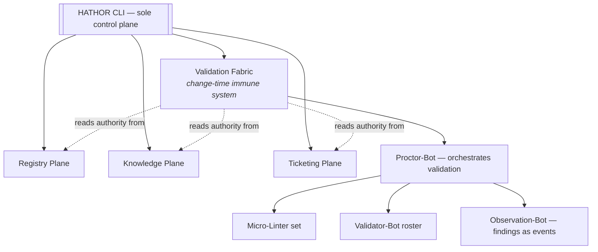
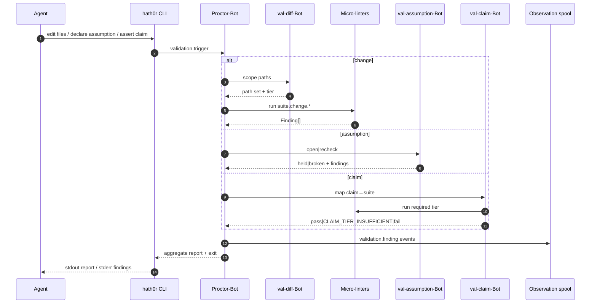
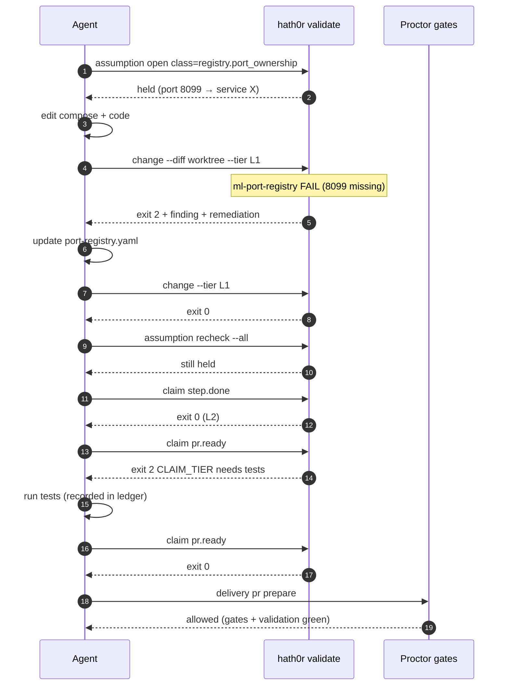

# HATHOR-RP-007 — Continuous Validation System
## Micro-Linters + Validator Micro-Bots as the Change-Time Immune System

- **Document ID:** HATHOR-RP-007
- **Status:** DRAFT v0 — research output, pending operator review
- **Date:** 2026-09-11
- **Author:** Oz (Agent), commissioned by Raymond Bayly (BaylyAI)
- **Companion to:** HATHOR-REQ-CORE-001, HATHOR-ARCH-001, HATHOR-REQ-BOT-001, containerization article
- **Supersedes / extends:** Infra "AI Agent Linting Enforcement Guide" (advisory), InfraAPI `make q-gates` / `make pr-ai` (batch-only), HATHOR Micro-Linter Gate (build-time only)
- **Amended by:** HATHOR-ADR-002 + HATHOR-RP-009 (2026-09-13): §6.1's agent-driven contract is inverted to system-driven ("system calls on event"); `AEG-VAL-015` promoted to mandatory default; `ml-graph-integrity` added to the §4.1 catalog; `val-completeness-Bot` added to the §5 roster. Canonical registries: HATHOR-CANON-010.
- **Scope rule:** research and requirements only. No implementation authorized.

RFC 2119 keywords apply. Requirements in this paper use prefix `AEG-VAL-###`.

---

## 0. Problem statement

### 0.1 What HATHOR already has

| Altitude | Actor | When it runs | What it can do |
|---|---|---|---|
| **Build-time** | Micro-linters | pre-commit, `pr-ai`, image build | Refuse image entry on single error classes |
| **Dispatch-time** | Proctor gates (§14 CORE) | Before bot dispatch | Refuse work on ticket/provenance/contract/env |
| **Runtime** | Observation family | During/after execution | Record only — never mutate, never refuse |
| **Promotion-time** | Knowledge + Deploy gates | On promote | Human-gated; mechanical pre-checks |

### 0.2 The missing altitude: **change-time**

Agent work is a stream of *mutations and claims*:

1. **Code/config diffs** land file-by-file mid-run.
2. **Assumptions** are formed continuously ("this port is free", "ticket AMD-12 authorizes this", "the hierarchy chain is X", "coverage still ≥ 80%", "no secrets in this microburst").
3. **Completion claims** are asserted ("lint passed", "tests green", "ready for PR") often *after* many unverified intermediate steps.

Today those are enforced by **human-readable checklists** (Infra AI Agent Linting Guide) and **batch Q-gates at the end**. Agents can drift for dozens of tool calls before anything refuses. That violates HATHOR canonical rule 2 (*refuse-never-guess*) and rule 5 (*builder + verifier*) for the bulk of agent wall-clock time.

### 0.3 Design goal

Make validation a **continuous, mechanical, CLI-mediated fabric** that:

- validates **every meaningful change** as it lands (diff-scoped, cheap),
- validates **every explicit assumption** before it is acted upon,
- validates **every completion claim** before the agent may announce done,
- never becomes a second control plane (still only through `hath0r`),
- never auto-promotes anything (still human for knowledge/deploy),
- never blocks business telemetry (Observation remains never-fatal),
- stays micro: one error class per linter, one responsibility per validator-bot.

**One-line definition**

> The HATHOR Continuous Validation System is the **change-time immune system**: a Proctor-orchestrated mesh of **micro-linters** (static, zero-I/O detectors) and **validator micro-bots** (active, plane-aware checkers) that constantly refuse invalid changes and unfounded assumptions — so agents never have to take their own work on faith.

---

## 1. Placement in the architecture

### 1.1 Not a fourth authority plane

Registry / Knowledge / Ticketing remain the only SoT planes (CORE PLAT-003). Validation is an **enforcement fabric** over those planes, not a competing source of truth.



### 1.2 Four immune-system altitudes (complete set)

| # | Altitude | Unit | Nature | Fail mode |
|---|---|---|---|---|
| 1 | **Build-time** | Micro-linter | Static, repo-local | Build refuses (exit 2) |
| 2 | **Change-time** *(this paper)* | Micro-linter + Validator-Bot | Static + active | Change/assumption refused; run continues only after fix or explicit waiver |
| 3 | **Dispatch-time** | Proctor gate | Policy | Structured refusal envelope |
| 4 | **Runtime** | Observation family | Passive | Degraded flag; never fatal |

Build-time and change-time share the same micro-linter *binaries*; only the **trigger scope** differs (full image vs diff / assumption set).

### 1.3 Taxonomy decision: Validator-Bots are Orchestration-adjacent, not Observation

Observation bots are **strictly passive** (BOT-TAX-005). Continuous validation must **refuse**. Therefore:

- **Validator-Bots** belong to the **Orchestration family** as a Proctor-owned roster (not a fourth family).
- They are invoked only through Proctor (capability `validation.*`), never called directly by agents or worker bots.
- They may read Registry/Knowledge/Ticketing via CLI/Operator; they never write durable SoT state except:
  - validation findings → telemetry spool + run ledger,
  - assumption ledger updates (run-scoped, ephemeral until run end),
  - optional draft knowledge microbursts of *finding summaries* (still draft; human promote).

**Acceptance (placement):** MBI shows Validator-Bots with `family=orchestration`, `role=validator`, `parent=proctor-Bot`.

---

## 2. Core concepts

### 2.1 Validation unit types

| Unit | Input | Output | Side effects |
|---|---|---|---|
| **Micro-linter** | Path set / diff / artifact | Finding[] + exit 0\|2 | None (pure) |
| **Validator-Bot** | Assumption claim, run context, plane query | Verdict `{pass\|fail\|degraded\|inconclusive}` + evidence | Telemetry event; ledger write |
| **Validation Suite** | Named profile (e.g. `change.default`, `claim.pr-ready`) | Aggregate report + blocking decision | Same as children |
| **Assumption** | Structured claim with TTL + evidence hooks | open → held \| broken \| expired \| waived | Ledger only |

### 2.2 Finding envelope (normative)

Every linter and validator emits the same finding shape so Observation and Tower need zero adapters:

```json
{
  "finding_id": "01a0c0aa-…-uuidv7",
  "schema_version": "1.0.0",
  "class": "secrets.in_diff",
  "severity": "block|warn|info",
  "verdict": "fail",
  "message": "Potential AWS key material in staged diff",
  "remediation": "Remove secret; rotate if committed; use hath0r secrets exec",
  "subject": {
    "kind": "path|assumption|ticket|manifest|claim|run",
    "ref": "src/cfg/local.env:14",
    "digest": "sha256:…"
  },
  "evidence": {
    "tool": "ml-secrets-diff@1.2.0",
    "rule": "AWS_ACCESS_KEY_ID",
    "snippet_redacted": true
  },
  "run": {
    "run_id": "…",
    "ticket_ref": "AMD-1234",
    "hierarchy_chain": "…",
    "binding_id": "…"
  },
  "provenance": {
    "emitter": "micro-linter|validator-Bot",
    "manifest_digest": "sha256:…"
  },
  "ttl": "PT1H"
}
```

Findings are telemetry events (`validation.finding`) and appear on stderr under stream discipline (data on stdout = aggregate report).

### 2.3 Assumption ledger (run-scoped)

Agents (and Process-Bot) MUST declare load-bearing assumptions explicitly. Undeclared assumptions that later surface as failures are classified `assumption.undeclared` (warn→block under strict profiles).

```json
{
  "assumption_id": "asm-01a0…",
  "statement": "Port 8080 is assigned to service knowmcp in port-registry",
  "class": "registry.port_ownership",
  "status": "open|held|broken|expired|waived",
  "made_at": "2026-09-11T14:00:00Z",
  "ttl": "PT30M",
  "evidence_query": {
    "capability": "validation.registry.port_owns@1",
    "args": {"port": 8080, "service": "knowmcp"}
  },
  "last_checked_at": null,
  "check_interval": "PT2M",
  "waive": null,
  "ticket_ref": "AMD-1234",
  "run_id": "…"
}
```

**Rules**

- Default status after successful check: `held`.
- Any failed re-check → `broken` → Proctor refuses dependent mutations until fixed or waived.
- TTL expiry → `expired` → same as broken for blocking profiles.
- Waivers require human identity + reason + expiry; agent identities cannot waive. (Aligns with no auto-promotion.)
- Ledger lives at `.hath0r/state/runs/<run_id>/assumptions.jsonl` (UPL); purged with run retention policy.

### 2.4 Claim types agents must not assert unchecked

| Claim | Required suite | Blocks |
|---|---|---|
| `change.landed` | `suite.change.default` | Further mutation in same files if prior findings block |
| `assumption.rely` | class-specific validator | Acting on the assumption |
| `step.done` | checklist item validators bound to step | Checklist mark complete |
| `run.complete` | `suite.claim.run-complete` | `report` success / agent "done" speech |
| `pr.ready` | `suite.claim.pr-ready` | `hath0r delivery pr prepare` / open |
| `image.buildable` | `suite.build.container` | Image build |
| `knowledge.pushable` | Knowledge Promotion mechanical gates | microburst commit |
| `deploy.requestable` | Deploy-Ticket prechecks | DVO ticket authoring |

---

## 3. Trigger model — "constantly" defined precisely

"Constantly" does **not** mean a busy-loop. It means **every validation-worthy event is covered**, with cheap default cost.

### 3.1 Event triggers

| Trigger | Source | Default suite | Scope |
|---|---|---|---|
| `fs.write` / staged diff | CLI hook, editor bridge, `hath0r delivery diff watch` | `suite.change.fast` | Changed paths only |
| `git.stage` / `git.commit` prep | `hath0r delivery commit` | `suite.change.default` | Staged set |
| `assumption.open` | Agent/Process declares | class validator | Single assumption |
| `assumption.tick` | Process heartbeat / interval | re-check held set | All non-terminal assumptions for run |
| `checklist.mark` | Checklist-Bot | step-bound validators | Step subjects |
| `bot.dispatch` | Proctor (existing gates) | gate set + optional suite | Intent |
| `knowledge.microburst` | Knowledge path | secrets/PII/metadata linters | Payload |
| `claim.assert` | Agent or `hath0r validate claim` | claim suite | Declared claim |
| `run.finalize` | Process end | `suite.claim.run-complete` | Full run |
| `image.build` | Container build | `suite.build.container` | Image context |
| `schedule.reconcile` | optional low-freq | `suite.health.project` | Project drift |

### 3.2 Cost ladder (mandatory)

| Tier | Budget | Contents | When |
|---|---|---|---|
| **L0 instant** | ≤ 50 ms | syntax/schema of the single edited file, secret regex on diff hunk | every write (optional watch mode) |
| **L1 fast** | ≤ 2 s | full micro-linter set on changed paths | every stage / explicit `validate change` |
| **L2 default** | ≤ 30 s | L1 + targeted tests/typecheck for touched packages + assumption re-check | commit prep, step done |
| **L3 full** | ≤ 10 min (project-defined) | L2 + q-gate suite + contract/parity + hierarchy integrity | pr.ready, image.build |
| **L4 soak** | async | Observation-derived regressions, flaky detectors | post-merge / Tower |

Agents MUST escalate tier when claiming a higher claim type. Claiming `pr.ready` after only L1 is a contract violation (`CLAIM_TIER_INSUFFICIENT`).

### 3.3 Watch mode (optional resident)

`hath0r validate watch --run <id>` is a **resident helper** (like Observation drain), not a bot public listener:

- tails git index / filesystem events for the project,
- runs L0/L1 automatically,
- appends findings to the run ledger,
- never auto-fixes without `--fix` and never mutates SoT planes,
- exits on `drain|stop`.

Agents remain responsible for acting on findings; watch mode only closes the "forgot to lint" gap.

---

## 4. Micro-linter catalog (v1)

Micro-linters remain **bots minus runtime surfaces** (containerization article): identity, manifest, contract, executor — no connections, no telemetry sockets. CLI invokes them; CLI emits telemetry on their behalf.

### 4.1 Platform / HATHOR structural linters (always on)

| ID | Class | Detects | Severity |
|---|---|---|---|
| `ml-upl-layout` | `upl.layout` | Missing/invalid `.hath0r/`, forbidden parallel control plane in `bin/` | block |
| `ml-agents-chain` | `upl.agents_md` | Broken nearest-first AGENTS.md chain | warn/block deep |
| `ml-manifest-schema` | `man.schema` | Manifest fails schema (1.1.0 incl. the mandatory `governance` triad + runtime fields — RP-014) / missing commands | block |
| `ml-manifest-digest` | `man.digest` | Digested manifest ≠ registered | block |
| `ml-exit-codes` | `man.exit_codes` | Non-canonical exit codes at bot boundary | block |
| `ml-no-listener` | `sec.no_public_listener` | Bot opens non-CLI listener | block |
| `ml-secrets-diff` | `sec.secrets_in_diff` | Secret/PII patterns in diff | block |
| `ml-secrets-layer` | `sec.secrets_in_layer` | Secrets baked in image layers | block |
| `ml-port-registry` | `cnt.port_registry` | Port/name not in registry | block |
| `ml-cvs-labels` | `cnt.cvs_labels` | Missing CVS/OCI provenance labels | block |
| `ml-otel-contract` | `obs.contract` | Missing required resource attrs / export config | block |
| `ml-line-endings` | `compat.eol` | CRLF/LF policy violations | block |
| `ml-path-case` | `compat.path_case` | Case-only collisions / Windows-unsafe names | block |
| `ml-ticket-bind` | `tkt.pr_branch_bind` | Branch/PR naming lacks ticket key | block |
| `ml-hierarchy-link` | `hie.link` | Runbook/checklist/playbook link integrity | block |
| `ml-knowledge-meta` | `kno.metadata` | Microburst missing mandatory metadata | block |
| `ml-microburst-size` | `kno.microburst_only` | Oversized bulk write disguised as microburst | block |
| `ml-broker-symmetry` | `sec.broker` | Worker references connector SDK / telemetry backend URL | block |
| `ml-langpack-present` | `upl.langpack` | Repo contains code for a language with no bound linter pack (§4.2) | block |
| `ml-graph-integrity` | `gph.integrity` | Process-graph defects: unreachable mandatory node, missing `timeout` branch, bad `requires`, cycle without loop guard *(added by RP-009 §6.4)* | block |

### 4.2 Language / product linters (project-registered)

Projects register language micro-linters in `.hath0r/rules/linters.yaml` (wrappers over ruff/eslint/phpcs/etc.) with:

- `class`, `severity`, `scope_globs`, `tier` (L0–L3),
- `argv` template,
- `output_parser` → Finding envelope,
- `fix_argv` optional.

Infra AI Agent Linting rules (forEach, node: imports, no `any`, complexity caps, JSDoc) land here as **project rule packs**, not hard-coded into HATHOR core. Core only requires that *some* pack is bound for languages present in the repo (`ml-langpack-present`).

### 4.3 Micro-linter anatomy (normative)

```text
ml-<class>
  identity:    name, semver, class, owner
  manifest:    args_schema, output_schema=Finding[], exit 0|2 only
  contract:    pure function over (paths|diff|artifact)
  executor:    any language
  NOT present: connections, secrets, network, durable writes
```

`selftest` for a micro-linter = golden fixtures under `.hath0r/rules/fixtures/<class>/`.

---

## 5. Validator-Bot roster (v1)

Invoked only as capabilities under Proctor. Each is single-responsibility.

| Bot | Capability | Checks |
|---|---|---|
| **val-assumption-Bot** | `validation.assumption.*` | Ledger CRUD, TTL, re-check scheduling, waive authz |
| **val-diff-Bot** | `validation.diff.scope` | Computes change set, maps to linter scope, detects unscoped writes |
| **val-contract-Bot** | `validation.contract.*` | Args/output schema, claim-tier sufficiency, CLI stream discipline samples |
| **val-registry-Bot** | `validation.registry.*` | Port ownership, bot routability state, digest freshness *(read-only over MBI)* |
| **val-ticket-Bot** | `validation.ticket.*` | No-ticket / epic / estimation / PR-bind / deploy-ticket prechecks as *re-entrant* checks mid-run |
| **val-hierarchy-Bot** | `validation.hierarchy.*` | Chain completeness, checklist↔runbook sync, stale chain digest |
| **val-knowledge-Bot** | `validation.knowledge.*` | Draft/verified honesty, TTL flags, redaction gate preflight |
| **val-claim-Bot** | `validation.claim.*` | Maps claim → required suite tier; verifies evidence artifacts exist |
| **val-drift-Bot** | `validation.drift.*` | Repo layout drift, Makefile façade violations, legacy path usage |
| **val-evidence-Bot** | `validation.evidence.*` | Attests that cited commands actually ran (exit codes, report digests in run ledger) |
| **val-completeness-Bot** | `validation.completeness.verify@1` | Reconciles the graph-derived required set against authoritative run/evidence ledgers with telemetry correlation at finalize *(added by RP-009)* |

Naming note: these are **validator** bots, not Hierarchy/Observation namesakes. Canonical names use the `val-<x>-Bot` form and manifests carry `role=validator`.

### 5.1 Proctor orchestration of validation



### 5.2 Interaction with the canonical fifteen-gate registry

CANON-001 §2 is authoritative for the current fifteen gates. Continuous validation introduced G10–G13 below and **reuses** applicable domain-gate predicates as mid-run re-checks via ticket/hierarchy/registry validators, so a ticket that loses its epic *during* a long agent run still breaks assumptions and blocks `claim.run.complete`; RP-009 subsequently registered the Sequence/Barrier Gate as G03.

New gates added by this paper:

| Gate | Refuses when | Exit |
|---|---|---|
| **Change-Validation Gate** | Blocking findings on scoped diff | 2 |
| **Assumption Gate** | Acting on `open|broken|expired` assumption | 2 |
| **Claim-Evidence Gate** | Claim lacks required suite tier or evidence digests | 2 |
| **Undeclared-Assumption Gate** *(strict profile)* | Failure mode matches a known assumption class never declared | 2 |

---

## 6. CLI surface

Additive to ADR-001 tree — progressive disclosure keeps root help clean:

```text
hath0r validate
├── change [--paths …] [--diff staged|worktree|last-commit] [--tier L0|L1|L2|L3] [--fix]
├── assumption
│   ├── open --class <c> --statement <s> [--ttl] [--evidence-query JSON]
│   ├── list [--status held|broken|…]
│   ├── recheck [assumption_id|--all]
│   ├── waive <id> --reason …   # human only
│   └── close <id>
├── claim <claim-type> [--tier] [--evidence run_id]
├── suite run <suite-id> [--tier]
├── suite list
├── watch [--run id] [--tier L0|L1]   # resident helper
├── report [--run id]                 # aggregate findings
└── linters list|selftest|run <id>
```

Also wire into existing façades:

- `hath0r delivery commit|pr prepare` → mandatory `validate claim` preflight
- `hath0r process …` step boundaries → optional/required per runbook metadata `validation.suite`
- `hath0r knowledge push` → knowledge validators
- `hath0r bots selftest` → includes validator bots + micro-linter fixtures
- `hath0r doctor validation` → fabric health (linter pack present, watch status, ledger path)

Global agent orientation pack (NFR-002) gains **one** line-level pointer, not full suite dump:

```text
hath0r validate suite list --fields id,tier,blocking --limit 10
```

### 6.1 Agent contract (normative behavior)

> **⚠ Superseded (2026-09-13) by HATHOR-ADR-002 / HATHOR-RP-009.** Control flow is system-native: the conductor invokes validation on events (`AEG-GW-010`); the agent's obligations reduce to *open a run, do the step content, request completion*. The numbered rules below describe the pre-AOG contract and remain the fallback discipline outside a conducted run.

Agents MUST:

1. Open a run (`process` / delivery context) before substantive mutation.
2. Declare assumptions before relying on them (`validate assumption open`).
3. After each logical edit batch, run `hath0r validate change --diff worktree --tier L1` (or rely on watch).
4. Before any "done" / PR / build claim, run the matching `hath0r validate claim …` and treat non-zero as incomplete work.
5. Never self-waive; never disable a blocking class without human waive + ticket note.
6. Emit no completion narrative that contradicts the latest validation report digests (`val-evidence-Bot` checks this on `claim.run.complete`).

This **replaces** the Infra AI Agent Linting Enforcement Guide as the mechanical contract; the Guide's language rules survive as a project linter pack.

---

## 7. Suites (v1 profiles)

| Suite ID | Tier | Blocking classes (core) | Used by |
|---|---|---|---|
| `suite.change.fast` | L0–L1 | secrets-diff, syntax/schema of touched, port-registry if compose touched | write/watch |
| `suite.change.default` | L1–L2 | fast + lang pack + line-endings + path-case + ticket-bind if branch ops | stage/commit |
| `suite.claim.step-done` | L2 | step-bound + assumption recheck | checklist mark |
| `suite.claim.run-complete` | L2–L3 | default + evidence of commands + no broken assumptions | run finalize |
| `suite.claim.pr-ready` | L3 | run-complete + tests/type + q-gate thresholds + hierarchy-link | PR prepare |
| `suite.build.container` | L3 | secrets-layer, cvs-labels, otel-contract, port-registry, no-listener | image build |
| `suite.knowledge.push` | L1 | secrets, metadata, microburst-size | knowledge push |
| `suite.health.project` | L2 | upl-layout, agents-chain, drift, langpack-present | doctor / schedule |

Suites are data in `.hath0r/rules/suites/*.yaml`, signed when distributed org-wide (same provenance model as manifests).

---

## 8. Telemetry & Observation integration

New events (extend TEL vocabulary):

- `validation.finding`
- `validation.suite.start` / `validation.suite.end`
- `validation.assumption.status_change`
- `validation.claim.asserted`
- `validation.waive`

Observation children stay passive consumers:

- **success-rate-Bot** — validation pass rates by class
- **benchmark-Bot** — suite latency vs tier budgets (NFR)
- **retry-Bot** — recheck storms
- **task-Bot** — suite runs as tasks
- **token-Bot** — unchanged (validation should be near-zero LLM tokens; mechanical)

Finding streams never fail the business command path *except* when the command *is* validation or a gated façade. That preserves TEL-002 for ordinary bot work while allowing validate commands to exit non-zero.

---

## 9. Requirements (normative extract)

### AEG-VAL-001 — Change-time altitude exists
The platform MUST provide continuous validation between build-time linters and dispatch-time gates.
**AC:** `hath0r validate --help` lists change/assumption/claim/suite/watch; ARCH diagram documents four immune altitudes.

### AEG-VAL-002 — Micro-linter purity
Micro-linters MUST be pure, zero-network, zero-secret detectors with exit codes `0|2` only.
**AC:** Registration refuses linters declaring connections or non-{0,2} exits.

### AEG-VAL-003 — Validator-Bots under Proctor
Active validators MUST be orchestration-family bots with `role=validator`, reachable only via Proctor capabilities `validation.*`.
**AC:** Direct invocation path without Proctor is refused; MBI lists parent linkage.

### AEG-VAL-004 — Shared Finding envelope
All linters and validators MUST emit Finding envelope v1 (§2.2).
**AC:** Observation consumes findings with zero per-tool adapters.

### AEG-VAL-005 — Assumption ledger
Every run MUST support an assumption ledger with statuses open|held|broken|expired|waived and mandatory recheck semantics.
**AC:** Broken/expired assumptions block dependent claims; only humans waive.

### AEG-VAL-006 — Claim–tier coupling
Every claim type MUST map to a minimum suite tier; under-tier claims fail `CLAIM_TIER_INSUFFICIENT`.
**AC:** Negative tests for `pr.ready` after L1 only.

### AEG-VAL-007 — Diff-scoped default
Default change validation MUST be path/diff-scoped, not whole-repo, at L0/L1.
**AC:** L1 on a 1-file change does not require full-repo lint wall clock.

### AEG-VAL-008 — Evidence before narrative
`claim.run.complete` and `claim.pr.ready` MUST verify evidence digests of required commands in the run ledger (`val-evidence-Bot`).
**AC:** Agent cannot pass claim by asserting text without recorded command results.

### AEG-VAL-009 — Wire into façades
`delivery commit`, `delivery pr prepare`, `knowledge push`, container build, and run finalize MUST invoke the mapped suites as gates.
**AC:** Each façade negative-path test returns structured refusal.

### AEG-VAL-010 — Replace advisory lint guide
Project language rules MUST register as linter packs; the advisory-only AI Agent Linting Guide is non-authoritative under HATHOR.
**AC:** `ml-langpack-present` fails repos with code but no pack; pack encodes prior guide rules where applicable.

### AEG-VAL-011 — No fourth SoT plane
Validation MUST NOT become a source of truth for work, knowledge, or registry identity.
**AC:** Validators perform no authoritative ticket/knowledge/registry mutations.

### AEG-VAL-012 — Budget NFRs
Tier latency budgets in §3.2 MUST be measured by benchmark-Bot and surfaced in `hath0r doctor validation`.
**AC:** Budget breach → degraded warn, not silent.

### AEG-VAL-013 — Watch is optional, claims are not
Watch mode MAY be disabled; claim/façade gates MUST remain enforced.
**AC:** With watch off, `claim.pr.ready` still requires full suite.

### AEG-VAL-014 — Strict profile for undeclared assumptions
Org MAY enable strict mode where failures matching known classes without a prior assumption open are blocking.
**AC:** Toggle in `.hath0r/rules/validation.yaml`; default off for v1, on for platform dogfood.

### AEG-VAL-015 — Runbook-declared validation
Hierarchy assets MAY declare `validation.suite` per step; Process-Bot MUST honor them at step boundaries.
**AC:** Runbook without suite still runs; runbook with suite blocks step completion on fail.

---

## 10. Worked example — agent implements a port change



Every refusal is structured; no silent drift; no "I linted mentally."

---

## 11. Infra adoption decision log (rule: reuse only when better)

| Infra source | Decision | Rationale |
|---|---|---|
| AI Agent Linting Enforcement Guide (advisory checklist) | **Adopt content as linter pack; reject as enforcement model** | Content is useful; checklist-only fails continuous validation |
| `make q-gates` / `make pr-ai` batch pipelines | **Adopt as L3 suite backends** | Proven thresholds; become evidence producers, not the only moment of truth |
| SonarCloud server gates | **Adopt as optional L3/L4 evidence source** | Keep server-side; never sole local authority |
| ESLint/ruff/phpcs wrappers | **Adopt as language micro-linter executors** | Already single-error-class capable |
| Q-gates report JSON under `.infraOS/reports` | **Adopt shaped → `.hath0r/state/runs/*/validation/`** | Same evidence idea, UPL-canonical |
| Continuous file watchers in IDEs | **Adopt pattern as `validate watch`** | Optional; CLI-mediated |
| Auto-fix on every keystroke | **Reject as default** | Too noisy; `--fix` opt-in at L1+ only |
| Agent self-attestation without command evidence | **Reject** | Violates `val-evidence-Bot` and refuse-never-guess |

---

## 12. Phased delivery (research recommendation only)

| Phase | Deliverable | Exit criteria |
|---|---|---|
| **P0** | Finding envelope + `validate change` L1 over core structural linters | Secrets/port/UPL linters block on fixture repos |
| **P1** | Assumption ledger + `val-assumption-Bot` + recheck | Broken assumption blocks claim |
| **P2** | `val-claim-Bot` + `val-evidence-Bot` + façade wiring (commit/pr/knowledge/build) | pr.ready negative tests green |
| **P3** | Language pack registry + migrate AI Lint Guide rules | ml-langpack-present enforced |
| **P4** | `validate watch` + runbook `validation.suite` metadata | Step-boundary enforcement demo |
| **P5** | Tower rollups + success-rate by class + budget doctor | Org dashboard queryable |

Dogfood target: HATHOR itself + one Infra product (InfraAPI) as first pack hosts.

---

## 13. Open questions

1. **Watch residency:** Is `validate watch` a Class A resident process or a per-run ephemeral helper? (Lean: ephemeral per-run; machine-wide watch is v2.)
2. **Fix authority:** May L1 `--fix` auto-apply mechanical fixes (eol, import order) without human? (Lean: yes for pure mechanical; no for behavioral.)
3. **Cross-repo assumptions:** Can an assumption reference org-tier knowledge as evidence? (Lean: yes, read-only, with staleness flags.)
4. **Strict undeclared mode default:** When to flip org default on? (Lean: after P2 dogfood metrics.)
5. **Validator cardinality:** One container for all val-* bots (shared failure domain) vs one each? (Lean: shared Class C image, six processes — same pattern as Observation children.)
6. **Relation to CLI daemon question (CORE §17 Q4):** Validation watch is a measured need that may force the daemon earlier — track jointly.
7. **Token cost:** Ensure validate paths add ≤ 200 tokens to orientation; full reports stay on-demand.

---

## 14. Traceability

| This paper | Folds into / extends |
|---|---|
| §1–2 concepts | ARCH-001 new § (immune altitudes); CORE new § Validation |
| §4 micro-linters | CNT-006, containerization article — expanded catalog |
| §5 validator bots | BOT taxonomy — orchestration roster extension |
| §6 CLI | ADR-001 command tree — `validate` domain. *Resolved by ADR-003 §2.2 (2026-09-13): `validate` is top-level; `bots` folds under `tower`; PLAT-008 revised to ≤ 9.* |
| §8 telemetry | RP-003 event vocabulary |
| §9 requirements | CORE §14 gates table + §16 acceptance |
| §11 Infra log | CORE §12 adoption log |

**Command-tree fit:** Prefer top-level `hath0r validate` (high agent traffic). If the ≤8 domain cap binds, fold as `hath0r proctor validate …` (since Proctor owns gates). Recommendation: **top-level `validate`** — agent discoverability beats pedantic cap; adjust PLAT-008 to "≤ 9" or move `bots` under `tower`. *(Accepted by ADR-003 §2.2, 2026-09-13: both measures adopted — `validate` top-level, `bots` → `tower`, cap ≤ 9.)*

---

## 15. Acceptance criteria for promoting this paper

Operator review signs off when:

1. Four immune altitudes are accepted as doctrine.
2. Validator-Bots-under-Proctor (not Observation, not fourth family) is accepted.
3. Assumption ledger + claim–tier coupling are accepted as mandatory agent contract.
4. Infra AI Lint Guide demotion to linter-pack content is accepted.
5. Open questions 1–2, 5–7 have provisional answers for v1.
6. INDEX.md lists this paper; CORE/ARCH get follow-on edit tasks (not done in this paper unless authorized).

---

*Research output only. No implementation authorized. Amend before promotion to verified.*
