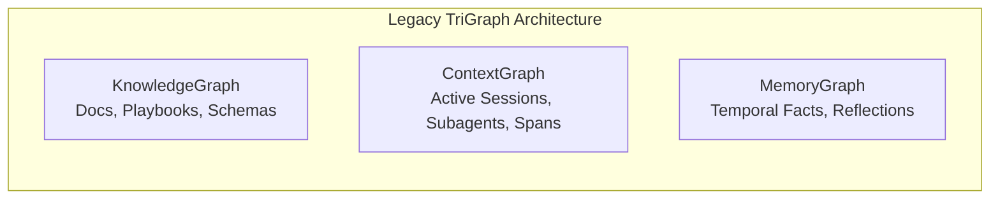
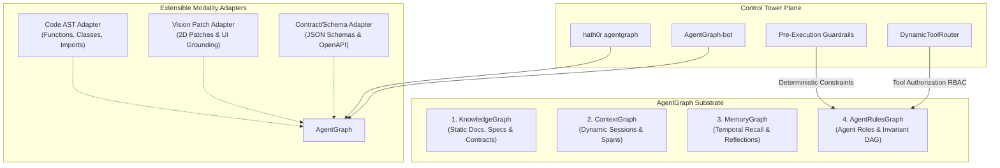

# Beyond Probabilistic RAG: Why Enterprise Multi-Agent Systems Require AgentGraph

**By Raymond Bayly**  
*Chief Architect & Engineer, HATH0R OpenSource Project*  
*Target: CTOs, Chief AI Officers, VPs of Engineering & Enterprise Architects*

```
                       ┌────────────────────────────────────────────────────────┐
                       │              HATH0R CLI (CONTROL TOWER)                │
                       │   hath0r agentgraph [status|route|validate|sync|bot]   │
                       └───────────────────────────┬────────────────────────────┘
                                                   │
                ┌──────────────────────────────────┴──────────────────────────────────┐
                ▼                                                                     ▼
   ┌───────────────────────────┐                                         ┌───────────────────────────┐
   │     DETERMINISTIC PLANE   │                                         │    PROBABILISTIC PLANE    │
   ├───────────────────────────┤                                         ├───────────────────────────┤
   │ 4. AgentRulesGraph        │                                         │ 1. KnowledgeGraph         │
   │    • Org Invariants       │                                         │    • Specs & Schemas      │
   │    • Repo Standards       │                                         │    • Canonical Playbooks  │
   │    • Role RBAC / ABAC     │                                         │ 2. ContextGraph           │
   │    • Action Restrictions  │                                         │    • Dynamic Sessions     │
   │                           │                                         │ 3. MemoryGraph            │
   │ Mathematical DAG Closure  │                                         │    • Episodic Recall      │
   │ Zero-Token Prompt Tax     │                                         │    • Letta Memory Paging  │
   └────────────┬──────────────┘                                         └─────────────┬─────────────┘
                │                                                                      │
                └──────────────────────────────────┬───────────────────────────────────┘
                                                   ▼
                                ┌─────────────────────────────────────┐
                                │   PLUGGABLE MODALITY FILE ADAPTERS  │
                                ├─────────────────────────────────────┤
                                │  • AST Code Trees (Python/TS/Go)    │
                                │  • Pixel-Native Vision Patches      │
                                │  • OpenAPI / JSON Schema Contracts  │
                                └─────────────────────────────────────┘
```

---

## 1. Executive Summary: The Multi-Agent Production Paradox

Over the last eighteen months, enterprise engineering organizations have poured millions into multi-agent frameworks—LangGraph, AutoGen, CrewAI, and bespoke internal orchestration layers. Yet, as these systems transition from sandboxed demos to mission-critical CI/CD pipelines, autonomous refactoring bots, and cloud infrastructure operations, engineering leaders encounter a wall:

> **The Reliability Paradox:** Large Language Models are probabilistic reasoning engines. Enterprise software systems, compliance standards, and cloud security invariants are strictly deterministic.

When CTOs attempt to govern autonomous agent behavior by stuffing Markdown rules, permissions, and security constraints into prompt context—or by relying on standard semantic Vector Search (RAG)—three failures inevitably emerge:

1. **The "Prompt Tax" & FinOps Hemorrhage:** Passing thousands of lines of organizational policies, role definitions, and tool schemas into every agent step consumes 40% to 60% of the token window, escalating inference costs and introducing catastrophic context dilution.
2. **Probabilistic Security Hallucinations:** In a pure RAG setup, an agent's knowledge of whether it is allowed to drop a database table, execute an ad-hoc bash script, or push directly to `master` depends entirely on semantic similarity scores. If the embedding cosine similarity falls below a threshold, the security invariant vanishes from the context window, leaving the system unguarded.
3. **Context Drift & Bitemporal Blindness:** Standard RAG pipelines cannot answer simple questions like: *"What rules and role authorizations were active when Subagent-7 executed this deployment two weeks ago vs. today?"*

To solve this, we architected and deployed **AgentGraph** inside the **HATH0R Agentic Framework** and its operational control plane, the **HATH0R CLI (`hath0r`)**.

This paper details why we evolved our architecture from a three-domain **TriGraph** into the unified **AgentGraph Quad-Graph Substrate**, how it achieves **Zero-Prompt-Tax Governance**, and how it scales across code ASTs, visual assets, and enterprise polyrepos.

---

## 2. Retrospective: The TriGraph Architecture and Its Limits

In earlier iterations of HATH0R, we structured agent cognition around **TriGraph**, a hybrid engine designed to prevent prompt stuffing by separating data into three distinct planes:



- **KnowledgeGraph:** Ingested documentation, schemas, and architectural decision records (ADRs) with hybrid Okapi BM25 and dense retrieval.
- **ContextGraph:** Tracked ephemeral runtime state, subagent delegation spans, and execution lineages.
- **MemoryGraph:** Implemented Letta-compatible working memory paging and sleep-time reflection consolidation.

### Where TriGraph Stalled in Enterprise Production
While TriGraph efficiently decoupled documentation from runtime telemetry, it treated **agent roles, security policies, and tool permissions as passive documents inside the KnowledgeGraph**. 

Consequently, an agent determined its operational boundaries probabilistically:
- An agent tasked with *"Clean the staging environment"* would run a semantic query against `KnowledgeGraph` for "cleanup rules".
- If the RAG query returned formatting guidelines instead of the organization-wide invariant `CR-CLI-ENTRY-001` (mandating all actions route through the CLI binary), the agent would fabricate an ad-hoc shell script and execute unverified commands.

We realized that **rules and tool permissions are not knowledge—they are invariants**. Treating governance as a document retrieval problem was an architectural category error.

---

## 3. The Core Innovation: What is AgentGraph?

**AgentGraph** elevates rules, policies, and role definitions into a **first-class, deterministic Directed Acyclic Graph (DAG)** running alongside the cognitive planes. It unifies four canonical planes and provides an open, pluggable adapter substrate for multimodal files:



### TriGraph vs. AgentGraph: Architectural Comparison

| Dimension | Legacy TriGraph | Modern AgentGraph | Enterprise Impact |
| :--- | :--- | :--- | :--- |
| **Cognitive Domain** | 3 Planes (Knowledge, Context, Memory) | **4 Planes + Extensible Modalities** (+ Rules, ASTs, Vision) | Unified cognitive topology under a single engine. |
| **Policy & Rule Enforcement** | **Probabilistic (RAG)**: Ingested as Markdown docs, retrieved via vector similarity. | **Deterministic (DAG)**: Mathematical inheritance closure. Zero semantic guessing. | 100% policy enforcement guarantee; zero policy hallucinations. |
| **Tool Authorization** | Flat string lists in agent prompts or manual middleware. | **Graph-Native RBAC/ABAC**: Traversed via `AUTHORIZES_TOOL` edges with inheritance. | Dynamic least-privilege tool isolation per agent role. |
| **Token Economy (FinOps)** | High: Full rulebooks stuffed into prompts repeatedly. | **Zero Prompt Tax**: Active constraints compiled AOT into concise bitmasks/manifests. | **40%–60% reduction** in LLM prompt tokens per subagent step. |
| **Conflict Resolution** | Non-existent; LLM arbitrates contradictory prompt text. | **Precedence Tiers**: $\text{Org Invariant} \succ \text{Repo} \succ \text{Subsystem} \succ \text{Role}$. | Contradictions throw fatal compile-time errors (`RuleConflictError`). |
| **Temporal Auditing** | Basic timestamp logging. | **Bitemporal Edges**: Full point-in-time state reconstruction (`is_valid_at`). | SOC2 / ISO compliance: provable historical execution replay. |
| **File Type Scaling** | Markdown documentation only. | **Pluggable Modality Adapters**: AST trees, JSON contracts, vision patches. | Extensible to codebases, designs, and telemetry. |

---

## 4. The Engineering Mechanics of Zero-Prompt-Tax Governance

### 4.1. Mathematical Precedence Tiers
Instead of expecting an LLM to balance competing instructions, AgentGraph categorizes all constraints into strict mathematical tiers:

$$\text{ORG\_INVARIANT (Tier 4)} \succ \text{REPO\_STANDARD (Tier 3)} \succ \text{SUBSYSTEM\_RULE (Tier 2)} \succ \text{ROLE\_GUIDELINE (Tier 1)}$$

1. **Tier 4: Org Invariants (`CR-*`):** Immutable policies (e.g., `CR-CLI-ENTRY-001`: *Always execute via CLI*; `CR-BAI-001`: *Strict environment promotion `local → dev → test → staging → master`*). No subsystem or agent role can override an Org Invariant.
2. **Tier 3: Repository Standards:** Rules specific to a repository (e.g., *Always maintain SemVer in `VERSION`*).
3. **Tier 2: Subsystem Rules:** Scoped invariants (e.g., *Syntax verification required before AST modifications in `src/hath0r_engine/`*).
4. **Tier 1: Role Guidelines:** Task-specific behaviors assigned to distinct subagent personas.

### 4.2. Transitive Role Closure & Conflict Detection
When an agent is spawned with a role (e.g., `role:framework_architect`), AgentGraph calculates the transitive closure of its inheritance DAG across `INHERITS_FROM` and `GOVERNS` edges:

```
[CR-CLI-ENTRY-001] (Tier 4 Invariant)
       │
       ▼ (GOVERNS)
[role:base_developer] ──(AUTHORIZES_TOOL)──► [view_file, search_web]
       ▲
       │ (INHERITS_FROM)
[role:framework_architect] ──(AUTHORIZES_TOOL)──► [write_to_file, generate_diagram]
```

If two rules at the **same tier** attempt to contradict each other (e.g., Rule A allows dynamic evaluation while Rule B forbids it at `REPO_STANDARD`), AgentGraph does not leave the conflict to LLM chance. It halts immediately with a `RuleConflictError`:

```python
# Deterministic Resolution Engine (from src/hath0r_engine/graph/agent_graph.py)
if priority == prev_prio and prev_allowed != is_allowed:
    raise RuleConflictError(
        f"Rule conflict detected: action '{act}' simultaneously allowed and restricted "
        f"at priority tier {priority}."
    )
```

Furthermore, if a developer introduces circular dependencies in agent delegation or role inheritance (`RoleA -> RoleB -> RoleA`), the engine executes depth-first cycle detection and aborts via `RuleCycleError`.

---

## 5. The Operational Control Tower: Hath0r CLI

An architecture is only as good as its operational tooling. The **HATH0R CLI (`hath0r`)** serves as the single command surface and control tower for the entire AgentGraph substrate.

Engineers and autonomous bots interact with the graph through five core capabilities:

### 1. Topology & Health Inspection (`hath0r agentgraph status`)
Inspects active node/edge distributions across all four planes, tracking real-time entity counts and snapshot persistence:

```bash
$ hath0r agentgraph status

AgentGraph Topology Status (Graph ID: agentgraph-hath0r-framework)
  Snapshot: /Users/.../hath0r-framework/.hath0r/agentgraph/snapshot.json

        Cognitive Planes Breakdown        
┏━━━━━━━━━━━┳━━━━━━━━━━━━━┳━━━━━━━━━━━━━━┓
┃ Plane     ┃ Total Nodes ┃ Active Nodes ┃
┡━━━━━━━━━━━╇━━━━━━━━━━━━━╇━━━━━━━━━━━━━━┩
│ Knowledge │          25 │           25 │
│ Rules     │          10 │           10 │
└───────────┴─────────────┴──────────────┘
    Relational Edges Summary    
┏━━━━━━━━━━━━━━━━━━━━━━┳━━━━━━━┓
┃ Relation / Edge Type ┃ Count ┃
┡━━━━━━━━━━━━━━━━━━━━━━╇━━━━━━━┩
│ GOVERNS              │     8 │
└──────────────────────┴───────┘
Total Entities: 35 nodes | Total Relations: 8 edges
```

### 2. Deterministic RBAC Tool Routing (`hath0r agentgraph route`)
Before any subagent can invoke a tool, the runtime queries `hath0r agentgraph route`. The check completes in sub-millisecond memory lookup:

```bash
$ hath0r agentgraph route -r developer --tool write_to_file

AgentGraph Role RBAC Routing for role:developer (Active):
╭─────────────── Authorized Tools ────────────────╮
│ read_file, run_command, search_code, write_file │
╰─────────────────────────────────────────────────╯
  Forbidden Tools: direct_push_master

  ✗ Tool 'write_to_file' is NOT AUTHORIZED for role 'role:developer'.
```

If an unauthorized tool is invoked, the call is blocked pre-execution—preventing accidental data corruption or privilege escalation.

### 3. Formal Policy Verification (`hath0r agentgraph validate`)
Runs formal verification across the workspace DAG, ensuring zero cycles, no dangling edges, and zero contradictory invariants:

```bash
$ hath0r agentgraph validate

✓ AgentGraph Validation PASSED (30 nodes, 8 edges checked)
  • Zero cyclic dependencies detected.
  • Zero role/rule contradictions found.
```

### 4. Continuous Repository Synchronization (`hath0r agentgraph sync` & `migrate`)
Parses `AGENTS.md`, subsystem policies, and JSON contracts into active graph nodes. During the Clean-Repo lifecycle (Step 7 SOP), the CLI ensures that any newly introduced rule or role modification is indexed before opening pull requests.

### 5. Autonomous Graph Custodian (`hath0r agentgraph bot`)
An autonomous micro-bot running within the control plane that repairs dangling edges, archives deprecated rules, and evaluates temporal intervals as policies evolve.

---

## 6. Enterprise Scalability: Modality Adapters & Bitemporal Auditing

### 6.1. Extensible Modality Adapters
AgentGraph is not restricted to natural language text. By implementing the `BaseGraphAdapter` contract, the engine maps heterogeneous software artifacts into the same relational graph:

```python
class BaseGraphAdapter:
    def can_handle(self, path: Path) -> bool: ...
    def extract(self, path: Path) -> Tuple[List[AgentGraphNode], List[AgentGraphEdge]]: ...
```

- **`ASTCodeAdapter`:** Ingests Python/TypeScript ASTs, registering classes, methods, and functions as `code_class` and `code_function` nodes linked via `contains` and `calls` edges. Agents can traverse code topology deterministically rather than relying on regex or fuzzy search.
- **`VisionPatchAdapter` (ADR-008):** Ingests visual layout structures, bounding boxes, and screenshot embeddings, grounding UI agent actions to spatial DOM elements without tokenizing raw pixels repeatedly.
- **`SchemaContractAdapter`:** Ingests JSON Schemas and OpenAPI specs from `contracts/`, enforcing parameter validation via `SchemaRepairEngine` at runtime.

### 6.2. Bitemporal Interval Auditing: Point-in-Time Compliance
Every node and edge in AgentGraph carries bitemporal validity metadata:

```python
@dataclass
class AgentGraphNode:
    id: str
    valid_from: Optional[str] = None
    valid_to: Optional[str] = None
    is_current: bool = True
    ...
```

When an enterprise policy changes (e.g., migrating from SonarCloud to a self-hosted linter), the old rule is not deleted; it is superseded with an edge `SUPERSEDES` and stamped with `valid_to`. 

When an audit occurs, the system can execute:
```python
resolved = engine.resolve_agent_rules("role:deployer", as_of="2025-06-01T00:00:00Z")
```
This guarantees complete point-in-time historical reconstruction of what an agent knew and was authorized to do at any moment in corporate history.

---

## 7. The Business Impact: The CTO's Scorecard

For engineering leadership, adopting AgentGraph delivers immediate, measurable impact across three critical operational vectors:

```
┌─────────────────────────────────────────────────────────────────────────────────────────┐
│                                  MEASURABLE CTO SCORECARD                                │
├───────────────────────────────┬─────────────────────────────────────────────────────────┤
│ Vector                        │ Quantified Enterprise Outcome                           │
├───────────────────────────────┼─────────────────────────────────────────────────────────┤
│ 1. FinOps (Token Consumption) │ • 40%–60% reduction in governance prompt overhead       │
│                               │ • Zero token spend on rule retrieval and validation     │
├───────────────────────────────┼─────────────────────────────────────────────────────────┤
│ 2. Security & Compliance      │ • 100% deterministic enforcement of Org Invariants (CR) │
│                               │ • Mathematical elimination of tool privilege creep     │
│                               │ • Complete bitemporal audit trails for SOC2 / ISO 27001 │
├───────────────────────────────┼─────────────────────────────────────────────────────────┤
│ 3. Engineering Velocity       │ • Zero flaky agent runs caused by forgotten instructions │
│                               │ • Autonomous rule sync across enterprise polyrepos      │
│                               │ • Automated PR gate validation via Hath0r CLI           │
└───────────────────────────────┴─────────────────────────────────────────────────────────┘
```

---

## 8. Strategic Roadmap & Conclusion

The transition from single-prompt LLM wrappers to multi-agent production systems requires a fundamental mindset shift:

> **Stop treating governance as text to be read. Treat governance as a graph to be traversed.**

By unifying static knowledge, dynamic execution context, episodic memory, and deterministic rule DAGs into **AgentGraph**, we have eliminated the fragility of probabilistic RAG while dramatically cutting token consumption. With the **HATH0R CLI** acting as the unified control tower, engineering teams gain full observability, automated synchronization, and mathematical certainty over their autonomous systems.

As enterprise AI matures throughout 2026 and beyond, the organizations that scale will not be those with the largest context windows—they will be those with the most rigorous cognitive architectures.

---

### Resources & Open Source Repository
- **HATH0R Agentic Framework:** [`Bayly-AI/HATH0R-Agentic-Framework`](https://github.com/Bayly-AI/HATH0R-Agentic-Framework)
- **HATH0R Control Tower CLI:** [`Bayly-AI/HATH0R-CLI`](https://github.com/Bayly-AI/HATH0R-CLI)
- **Architectural Specifications:** [HATHOR-ADR-009: AgentGraph Unified Quad-Graph Architecture](file:///Users/raybayly/Development/OpenSource/hath0r-framework/docs/architect/hathor-adr-009-agentgraph-unified-quad-graph-architecture-20261002.md) & [AgentGraph Methodology Strategy](file:///Users/raybayly/Development/OpenSource/hath0r-framework/docs/governance/strategies/agentgraph-engine-methodology-strategy.md)
