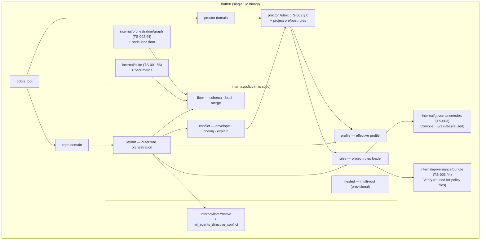
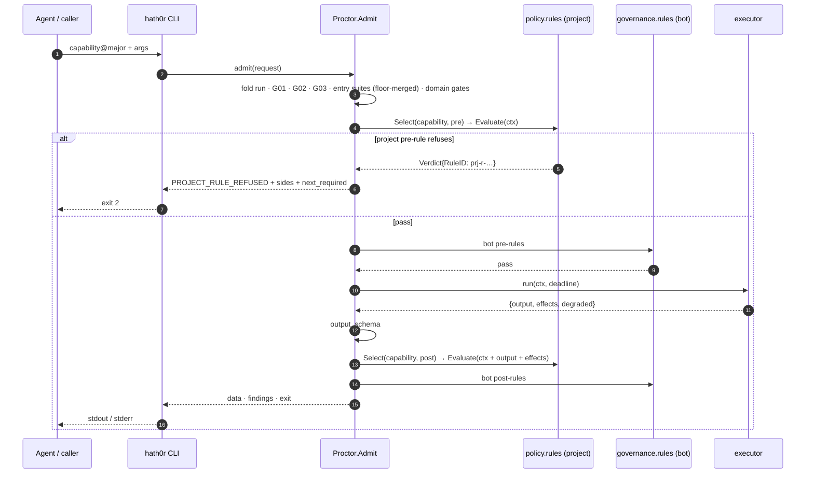
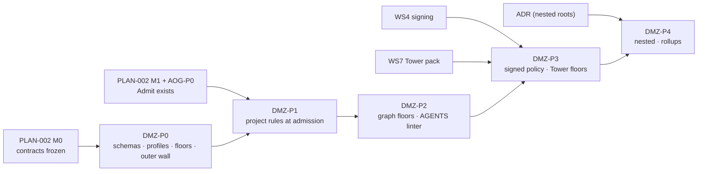

# HATHOR-TS-004 — The DMZ: Application ↔ Framework Integration Boundary
## Implementation specification for static/dynamic admission, project rules, policy floors, conflict envelopes, and profile-staged onboarding

- **Document ID:** HATHOR-TS-004
- **Status:** DRAFT v0 — implementation specification, pending operator review
- **Date:** 2026-09-14
- **Author:** Oz (Agent), commissioned by Raymond Bayly (BaylyAI)
- **Implements:** the *DMZ Integration Boundary* report (2026-09-14, session output; proposed for filing as HATHOR-RP-015) — specifically its §5 conflict-resolution procedure, §6 onboarding ramp, and gaps G1–G5, G7
- **Decision basis (accepted):** RP-014 §3.3–§3.6 (precedence, narrowing-only rules, config-never-governs); ADR-002/RP-009 (Proctor as enforcing gateway); ADR-003 (surface + exit boundaries); ADR-004 (layout/state residency); RP-010 §3.2 (signed policy distribution); RP-013 (trust model, `AEG-THR-004` signed execution inputs); CANON-001 (registries)
- **Conforms to:** HATHOR-REQ-CORE-001 (PLAT/CLI/UPL/SEC/NFR), HATHOR-REQ-BOT-001, RP-007 (validation fabric)
- **Extends:** HATHOR-TS-001 (config precedence §13, suites §6, native linters §5), HATHOR-TS-002 (`proctor.Admit` §7, graph load §4, orchestration config §12), HATHOR-TS-003 (rules engine §5.2–§5.3, bundle verify §4, effects §6)
- **Gating note:** this spec is **not authorized for build**. Prerequisites: (a) the DMZ report is filed and accepted as a design paper; (b) the CANON-001 amendments in §19 are ratified; (c) operator decisions on the project-rules layer (report G1) and policy floors (report G2); (d) an authorizing Ticketing Plane ticket (`AEG-REQ-TKT-004`). §6 nested-root resolution is additionally gated on an ADR (report G7).
- **Scope rule:** describes *how* to build. Authorizes no code by itself.

RFC 2119 keywords apply. New identifiers: decisions `TS4-D-###`, components `TS4-C-###`, interfaces `TS4-I-###`.

---

## 0. Decisions locked for this spec

| ID | Decision | Rationale | Overridable? |
|---|---|---|---|
| **TS4-D-001** | **Built in Go inside the single `hath0r` binary.** New packages under `internal/policy/*`; enforcement inserted into the existing `proctor.Admit` seam (TS-002 §7) and TS-003 rules engine. No daemon, no second evaluator. | One authoritative chokepoint (`BOT-TAX-006`, `AEG-GW-003`); NFR-001 cold-start budget. | Language per TS-001 §16; seam is not. |
| **TS4-D-002** | **Project rules are data with the bot-rule schema.** `.hath0r/rules/rules.yaml` uses the TS-003 `rules-1.0.0` predicate schema with two deltas: `scope: project` and `applies_to` expressed as **capability patterns**, never bot names. Effects remain `refuse \| degrade` only. Evaluated at admission **after platform gates and before bot pre-rules**. | Fills the empty middle of `AEG-BOT-GOV-008`'s chain without a second rule language; narrowing-only by construction (`AEG-BOT-GOV-003`); capability addressing per `AEG-MAN-003`. | No. |
| **TS4-D-003** | **Policy floors are signed data, merged additively.** A floor document (`policy-floor-1.0.0`) names the minimum blocking classes, includes, tiers, node-kind bindings, and locked keys. Project suites/graphs/validation merge *above* the floor; any attempt to fall below is refused `POLICY_CONFLICT`. Floors ship embedded and are superseded by the Tower policy pack (RP-010 §3.2) when present. | Closes the wholesale-override widening vector (TS-001 §6.1) while preserving project override by `id`. | Floor *content* is org policy; the merge rule is not. |
| **TS4-D-004** | **Conflicts get one code and one finding class.** Refusal `POLICY_CONFLICT` (CLI exit 2) with `details.sides[]` naming both artifacts; finding class `governance.conflict`. Project pre-rule refusals use `PROJECT_RULE_REFUSED` (exit 2); project post-rule violations reuse `CONTRACT_OUTPUT_INVALID` (exit 1) with `rule_scope: project`. | Refusals must name both sides and steer (`AEG-GW-014`, RP-014 §3.5.1); Tower must aggregate the class. | Names recorded in CANON-001 §4 on approval. |
| **TS4-D-005** | **Three profiles, monotone upward.** `report-only < dev < enforced`. Effective profile = max(project-declared, machine-declared, Tower `min_profile` for the project key). A project can raise, never lower. `report-only` downgrades refusals to `degraded:true` **except** the never-downgrade set (§9.3). | Gives the whitepaper's "report-only pilot" a mechanical form; prevents an agent-writable file from disabling enforcement (RP-013 §4.1). | Never-downgrade set is fixed; org may add to it. |
| **TS4-D-006** | **`AGENTS.md` contradictions are linted, not adjudicated.** A native L1 structural linter `ml-agents-directive-conflict` scans the resolved chain against a signed pattern pack mapping prose patterns to gate/rule classes. `warn` in `report-only`/`dev`, `block` in `enforced`. Directive prose keeps zero enforcement standing (RP-014 §3.3 r3). | Surfaces C1 conflicts at the outer wall instead of at gate time; keeps AGENTS.md context-only. | Pattern pack is project-extensible; severity mapping is not. |
| **TS4-D-007** | **Project policy is semi-trusted.** In `enforced`, `rules.yaml`, suites, graphs, and `linters.yaml` MUST carry an external DSSE envelope over their JCS-canonical bytes, verified against TUF-distributed keys (reuses TS-003 §4.3 machinery). In `dev`, unsigned policy loads only with `--allow-unsigned`, recorded on the run and flagged degraded (`AEG-THR-004`). | Workspace files are agent-writable (RP-013 A2); enforcement weight requires provenance. | No. |
| **TS4-D-008** | **Nested `.hath0r/` roots: nearest wins for config, outer-first narrowing for governance, root owns the run.** *Provisional* — implementation blocked on the report-G7 ADR. | Extends the add-never-remove rule from bot↔family to child↔parent project. | Yes, by the ADR. |
| **TS4-D-009** | **No new top-level domain; no new event type.** Surface folds under `hath0r repo policy …` and the existing `hath0r proctor gateway explain`. Conflicts ride `validation.finding` and `contract.refused`. | `AEG-REQ-PLAT-008` (≤ 9), CANON-001 §3 stability. | No. |

---

## 1. Scope & depth

| Phase | Deliverable | Depth |
|---|---|---|
| **P0 — Outer wall + floors + profiles** | schemas frozen; effective-profile resolution; embedded floors; suite floor-merge; `repo validate --policy`; `repo policy show\|validate\|floors`; conflict envelope | **Implementation grade** (§3–§4, §6.1, §8–§9, §12) |
| **P1 — Project rules at admission** | `rules.yaml` compile; pre/post evaluation in `proctor.Admit`; fixtures; `gateway explain` renders `sides[]` | **Implementation grade** (§5, §10–§11) |
| **P2 — Graph floors + AGENTS conflict linter** | node-kind floor at graph load; `ml-agents-directive-conflict` + pattern pack; `suite.health.project` inclusion | **Implementation grade** (§6.2, §7) |
| **P3 — Signed policy + Tower floors** | DSSE over project policy files; Tower policy pack carries floors + `min_profile`; enforced-profile gating; TTL behaviour | **Interface level** (§13.2, §17.1) — depends on WS4/WS7 |
| **P4 — Nested roots + Tower rollups** | multi-root resolution (post-ADR); conflict-class rollups | **Interface level** (§6.3, §17.2) |

**Out of scope.** Report G6 (`gateway.event` emitter/evidence policy) is tracked as `PENDING-EDITS.md` R4 and is not a DMZ concern. Report conflict classes C6–C8 keep their owning mechanisms (plane reconciliation, principle audit, drift linting) and are only *aggregated* here (§8.3), never re-implemented.

---

## 2. System architecture

### 2.1 Process model

Everything runs as short-lived CLI invocations over durable `.hath0r/` state (TS-001 §2.1). The DMZ adds no process; it adds a **static admission pass** (outer wall) that runs at `repo validate`, install, and suite/graph load, and a **dynamic admission step** (inner wall) inside the existing `proctor.Admit`.



**Key point:** the DMZ does not introduce a policy engine. Project rules are compiled and evaluated by the TS-003 engine; floors are a merge step in the existing suite/graph loaders; the conflict envelope is the CORE `{code, message, remediation, provenance, ttl}` shape with a typed `details` block.

### 2.2 Package layout (additions to the TS-001/002/003 tree)

```text
hath0r/internal/
  policy/
    layout/       # repo validate --policy orchestration; outer-wall pass (TS4-C-001)
    rules/        # project rules.yaml load, scope/capability checks, nested chain (TS4-C-002)
    floor/        # policy-floor schema, load (tower → machine → embedded), merge (TS4-C-003)
    profile/      # effective profile resolution + never-downgrade set (TS4-C-004)
    conflict/     # POLICY_CONFLICT envelope, governance.conflict finding, explain (TS4-C-005)
    nested/       # multi-root discovery + ordering — provisional (TS4-C-006)
  linter/native/
    ml_agents_directive_conflict.go   # (TS4-C-007)
  proctor/
    admit.go      # (TS-002) — insert project pre-rules after domain gates; project post-rules after output_schema
  suite/          # (TS-001) — Load applies floor.MergeSuite
  orchestration/graph/  # (TS-002) — Load/Derive applies floor.ApplyNodeKinds
  cli/repo/policy/      # hath0r repo policy show|validate|explain|floors
schemas/
  project-rules-1.0.0.json        # go:embed — rules-1.0.0 + scope + capability applies_to
  policy-floor-1.0.0.json         # go:embed
  agents-conflict-pack-1.0.0.json # go:embed
packs/
  policy/floors.yaml              # go:embed — embedded default floors
  agents-conflict/patterns.yaml   # go:embed — bundled pattern pack
```

Reused unchanged: `internal/{finding,evidence,claim,assumption,config,exit,telemetry,gitutil,upl,governance/*,orchestration/run}`.

### 2.3 On-disk state (UPL)

```text
<project>/.hath0r/
  rules/
    rules.yaml                 # NEW — project rules (narrowing-only; TS4-I-001)
    rules.dsse.json            # enforced profile: external DSSE over JCS-canonical rules.yaml
    fixtures/rules/<rule-id>/  # NEW — ≥ 1 passing + ≥ 1 violating case per project rule (§5.4)
    validation.yaml            # gains profile.active (§9); existing keys unchanged
    linters.yaml (+ .dsse.json in enforced)
    claims.yaml
    suites/*.yaml (+ .dsse.json in enforced)     # merged above floor at load
    graphs/*.yaml (+ .dsse.json in enforced)     # node-kind floor applied at load
    knowledge.yaml
    bots/<name>.yaml
  state/
    cache/policy/<digest>.json # merged effective policy; digest = sha256(floor ⊕ project ⊕ machine ⊕ profile)
    runs/<run_id>/run.json     # gains effective_profile, policy_digest, allow_unsigned:bool

machine tier:
  ${XDG_CONFIG_HOME}/hath0r/policy.yaml               # may raise profile / add floors; never lower
  ${XDG_STATE_HOME:-~/.local/state}/hath0r/policy/pack.json   # cached Tower policy pack (TUF-verified, TTL-stamped)
```

The policy cache is digest-keyed and disposable (`AEG-BOT-MEM-002` discipline): deleting it changes latency, never outcome.

---

## 3. Exit codes, streams, output

### 3.1 DMZ exit mapping (`internal/exit`, extends CORE §4.5 — CLI boundary only)

| Condition | Exit | Envelope | Code |
|---|---|---|---|
| Project artifact falls below a floor (suite/graph/validation key) | `2` | `blocking:true`, `details.sides[]`, `details.next_required[]` | `POLICY_CONFLICT` |
| Project attempts to lower effective profile below Tower/machine minimum | `2` | as above; `details.conflict_class:"C9"` | `POLICY_CONFLICT` |
| Project pre-rule violation at admission (bot never runs) | `2` | `blocking:true`, `rule_id`, `rule_scope:"project"` | `PROJECT_RULE_REFUSED` |
| Project post-rule violation over declared output/effects | `1` | `blocking:true`, `rule_id`, `rule_scope:"project"` | `CONTRACT_OUTPUT_INVALID` |
| Project post-rules declared, `effects` absent | `1` | `blocking:true` (fail closed) | `CONTRACT_OUTPUT_INVALID` |
| Unsigned project policy in `enforced` | `4` | — | `PROVENANCE_UNVERIFIED` |
| Tower policy pack expired past TTL on an authority-originating action | `4` | — | `PROVENANCE_UNVERIFIED` |
| `report-only` downgrade of a downgradable refusal | `0` | `degraded:true`, findings on stderr | (original code in `details.downgraded_from`) |
| `--allow-unsigned` accepted in `dev` | `0` | `degraded:true`, `allow_unsigned:true` recorded on run | — |
| Project `rules.yaml` schema violation / unknown capability pattern / grant vocabulary | `2` | — | (schema error; `repo policy validate`) |
| `ml-agents-directive-conflict` blocking finding in `enforced` | `2` | `blocking:true` | via suite (`CHANGE_VALIDATION` at admission) |
| Unknown suite/graph/rule id | `3` | — | — |
| Internal error | `1` | error envelope | — |

Bot-boundary `0|1|2` codes are untouched (ADR-003 §2.3).

### 3.2 Streams (`AEG-REQ-CLI-004`)

- **stdout** = data (`repo policy show` merged view; `validate` report JSON when piped).
- **stderr** = findings + progress; `--quiet` → errors only.
- A `POLICY_CONFLICT` envelope is the last line of stderr as a single JSON object when piped; data stream is empty on refusal.

---

## 4. Outer wall — static admission (P0)

### 4.1 Trigger points

The outer-wall pass (`TS4-C-001`, `internal/policy/layout`) runs at:

| Trigger | Scope | Blocking? |
|---|---|---|
| `hath0r repo validate` (always; `--policy` adds the merged-policy report) | whole `.hath0r/rules/**` + `AGENTS.md` chain | yes, per profile |
| `hath0r tower bots install <ref>` | bundle only (TS-003 §7.2) — unchanged; DMZ adds nothing here | n/a |
| suite load (`internal/suite.Load`) | the loaded suite vs floor | yes |
| graph load (`internal/orchestration/graph.Load`) | the loaded graph vs node-kind floor | yes |
| `hath0r process run open` | effective profile + policy digest stamped into `run.json` | profile-downgrade attempt refuses |
| `suite.health.project` (doctor / schedule) | full pass + `ml-agents-directive-conflict` | per profile |

### 4.2 Pass algorithm

```text
OuterWall(root, profileHint) -> Report:
  1. roots    := nested.Discover(cwd)                   # [repoRoot … nearest]; P0: single root
  2. pack     := floor.Load()                            # tower cache (in TTL) → machine → embedded; verify TUF sig if tower
  3. profile  := profile.Resolve(project, machine, pack.min_profile[projectKey])   # §9.1
  4. for each policy file in roots (outer→inner):
       verifySignatureOrAllowUnsigned(file, profile)     # enforced: DSSE required; dev: --allow-unsigned recorded
       validateSchema(file)
  5. rules    := rules.Load(roots)                       # compile via governance/rules.Compile; capability patterns
  6. suites   := suite.LoadAll(); for s: floor.MergeSuite(bundled[s.id], s, pack.floors.suites[s.id])
  7. graphs   := graph.LoadAll(); for g: floor.ApplyNodeKinds(g, pack.floors.graphs)
  8. vcfg     := config.Load(validation.yaml); floor.CheckLocked(vcfg, pack.floors.validation, profile)
  9. findings += linter.Run(ml-upl-layout, ml-agents-chain, ml-agents-directive-conflict, ml-graph-integrity)
 10. conflicts := collect from 6–9; each → governance.conflict finding + POLICY_CONFLICT (if blocking under profile)
 11. write state/cache/policy/<digest>.json {profile, floorsDigest, rules, suites, graphs}
 12. exit per §3.1; report on stdout
```

Step 4 is deliberately before 5–8: an unsigned artifact in `enforced` never reaches merge logic (refuse before parse of intent, mirroring `AEG-THR-004`).

---

## 5. Project rules (`TS4-I-001`, `schemas/project-rules-1.0.0.json`) — P1

### 5.1 Schema deltas vs bot `rules.yaml` (TS-003 §5.2)

```yaml
version: 1
scope: project                                  # REQUIRED; discriminator (bot files have no scope key)
project: <project-key>                          # matches run.json project
rules:
  - id: prj-r-001                               # project-scoped id; prefix "prj-" reserved
    class: state.write_scope                    # dot-namespaced lowercase (CANON-001 §7.4)
    when: pre                                   # pre | post | always
    applies_to:                                 # CAPABILITY patterns; glob on segments; never bot names
      - "hierarchy.checklist.*@1"
      - "knowledge.microburst.write@*"
    predicate:
      kind: schema                              # schema (default) | cel (gated opt-in, TS-003 §14)
      schema:
        properties:
          effects:
            properties:
              paths_written:
                items: { pattern: "^(src/|test/|\\.hath0r/state/)" }
    on_violation: refuse                        # refuse | degrade — NO grant vocabulary
    message: "Writes outside src/, test/, or .hath0r/state/ are not permitted in this project."
    remediation: "Confine writes to the declared scopes; request a project-rule change via ticket."
    fixtures: .hath0r/rules/fixtures/rules/prj-r-001/   # ≥ 1 passing + ≥ 1 violating
```

Constraints enforced by `Compile`:

- `scope` MUST be `project`; a bot-scoped file placed here fails schema (and vice versa).
- `applies_to` entries MUST parse as `<domain>.<noun>.<verb>@<major>` with `*` permitted per segment; a bot name anywhere fails compile.
- `on_violation ∈ {refuse, degrade}`; the schema has no `allow|skip|waive|disable` (negative tests inherited from `AEG-BOT-GOV-003` AC).
- `kind: cel` only when the TS-003 opt-in is enabled.
- Rule ids MUST be prefixed `prj-`; collisions with bot rule ids are impossible by prefix.

### 5.2 Go model (`TS4-C-002`, `internal/policy/rules`)

```go
package rules

import gov "github.com/Bayly-AI/HATH0R-CLI/internal/governance/rules" // TS-003; module path pending M0 freeze

type Scope string // "project"

type File struct {
    Version int        `json:"version"`
    Scope   Scope      `json:"scope"`
    Project string     `json:"project"`
    Rules   []gov.Rule `json:"rules"` // AppliesTo holds capability patterns here
    Root    string     `json:"-"`     // which .hath0r/ root supplied it (nested chain)
}

// Load walks roots outer→inner, verifies signature/allow-unsigned per profile,
// validates schema, and compiles via gov.Compile with a capability-pattern matcher.
func Load(roots []string, prof profile.Effective) ([]File, []conflict.Conflict, error)

// Select returns the rules whose AppliesTo matches the admitted capability, in outer→inner order.
func Select(files []File, capability string, when gov.When) []gov.Rule
```

### 5.3 Rule context (extends `TS3-I-004`, additive)

The platform-built context gains one field so capability-addressed project rules can match:

```json
{
  "capability": "hierarchy.checklist.mark@1",
  "bot": { "...": "unchanged" }, "command": "mark", "args": {}, "actor": {}, "run": {},
  "env": { "profile": "report-only|dev|enforced", "environment": "development", "tty": false },
  "project": { "key": "…", "root": "/abs/repo", "nested_root": "/abs/repo/pkg/a", "policy_digest": "sha256:…" },
  "output": {}, "effects": {}
}
```

`env.profile` widens from `enforced|dev` to include `report-only`. `project` is new and additive; bot rules ignore it.

### 5.4 Fixtures & self-check

Project-rule fixtures live at `.hath0r/rules/fixtures/rules/<rule-id>/` with the same shape as TS-003 bundle fixtures (`≥ 1` passing, `≥ 1` violating context per rule). They are exercised by `hath0r repo policy validate` and by `suite.health.project`; a rule lacking either fixture kind fails `Compile` (parity with the `AEG-BOT-LIF-003` registration refusals). Fixtures are evaluated platform-side against the §5.3 context, so a Go bot and a Python bot dispatched under the same project rule are refused identically (`AEG-BOT-ANA-004`). There is no project `selftest`; `repo policy validate` is the project-side analogue.

---

## 6. Policy floors & narrowing merge (`TS4-I-002`, `schemas/policy-floor-1.0.0.json`) — P0/P2

### 6.1 Floor document

```yaml
version: 1
set: policy-floor@1
min_profile:                       # per project key; absent or report-only = no minimum
  default: report-only             # the embedded pack imposes NO minimum — Phase 0 onboarding (§15) must work; orgs raise via the Tower pack
  "HATHOR-CORE": enforced           # example: the platform's own repo is pinned enforced
floors:
  suites:
    suite.change.default:
      blocking_classes_floor: [sec.secrets_in_diff, compat.eol, tkt.pr_branch_bind, upl.layout]
      includes_floor: ["ml-*"]
      tier_floor: L2                 # project may raise max tier, not lower
      on_missing_pack_floor: block
    suite.build.container:
      blocking_classes_floor: [sec.secrets_in_layer, cnt.cvs_labels, obs.contract, cnt.port_registry, sec.no_public_listener]
    suite.knowledge.push:
      blocking_classes_floor: [sec.secrets_in_diff, kno.metadata, kno.microburst_only]
  graphs:
    node_kind_defaults:              # RP-009 §6.3 "default profile per node kind", made data
      task_change: { on_change: suite.change.fast, mandatory_suites: [suite.change.default] }
      terminal:    { mandatory_claim: run.complete }
      pr:          { mandatory_claim: pr.ready }
      build:       { mandatory_claim: image.buildable }
      deploy:      { gates: [Deploy-Ticket, Development-Only] }
    forbid_explicit_empty: [mandatory_suites, mandatory_claim, gates]   # explicit [] / null on a floored kind = conflict
  linters:
    always_on: [ml-upl-layout, ml-agents-chain, ml-manifest-schema, ml-manifest-digest, ml-exit-codes,
                ml-no-listener, ml-secrets-diff, ml-secrets-layer, ml-port-registry, ml-cvs-labels,
                ml-otel-contract, ml-line-endings, ml-path-case, ml-ticket-bind, ml-hierarchy-link,
                ml-knowledge-meta, ml-microburst-size, ml-broker-symmetry, ml-langpack-present,
                ml-graph-integrity, ml-agents-directive-conflict]
  validation:
    enforced_locked:                 # keys a project cannot change in enforced
      reconcile_on_finalize: true
    dev_degraded:                    # keys permitted in dev only, surfacing degraded
      reconcile_on_finalize: [false]
```

Load order (`TS4-C-003`): Tower pack (`GET /v1/dist/policy`, TUF-verified, within TTL) → machine `policy.yaml` (may only *add* floor entries or *raise* `min_profile`) → embedded `packs/policy/floors.yaml`. The resolved floor set digest is recorded on every run.

### 6.2 Merge algorithms

```text
MergeSuite(bundled, project, floor) -> (Suite, []Conflict):
  base := project ?? bundled                       # project overrides by id (TS-001 §6.1 preserved)
  for k in [blocking_classes, includes, tier, on_missing_pack, recheck_assumptions]:
      if project && project[k] is OMITTED: base[k] = bundled[k]   # omitted → inherit; explicit → as written
  for c in floor.blocking_classes_floor:
      if c ∉ base.blocking_classes: conflict(C2, app=project#blocking_classes, fw=floor#…)
  for inc in floor.includes_floor:
      if !covers(base.includes, inc):               conflict(C2, …)
  if rank(base.tier) < rank(floor.tier_floor):      conflict(C2, …)
  if floor.on_missing_pack_floor == block && base.on_missing_pack == warn: conflict(C2, …)
  return base, conflicts

ApplyNodeKinds(graph, floors.graphs) -> (Graph, []Conflict):
  for n in graph.nodes:
      kind := classify(n)                           # TS-002 §4.3 derivation rules
      d    := node_kind_defaults[kind]; if !d: continue
      for k,v in d:
          if n[k] is OMITTED:         n[k] = v              # platform fills (RP-009 §6.3)
          elif n[k] is EXPLICIT_EMPTY and k ∈ forbid_explicit_empty:
                                       conflict(C4, app=graph#n.id.k, fw=floor#node_kind_defaults.kind.k)
          elif !superset(n[k], v):     conflict(C4, …)      # may add suites/claims/gates, not drop
  return graph, conflicts

CheckLocked(vcfg, floors.validation, profile):
  for k,v in enforced_locked:  if profile==enforced && vcfg[k]!=v: conflict(C3, …)
  for k,allowed in dev_degraded: if profile==dev && vcfg[k] ∈ allowed: mark degraded (no conflict)
```

Distinguishing **omitted** from **explicit-empty** is load-bearing for suites and graphs alike: omission is honoured as "inherit the bundled value / use the default profile" (accepted RP-009 §6.3); an explicit `blocking_classes: []` in a project suite or `mandatory_suites: []` on a change node is an attempted removal and is refused. This is the one place TS-001 §6.1's "overrides wholesale by `id`" is narrowed (recorded in §19).

### 6.3 Nested roots (`TS4-C-006`, provisional — blocked on ADR)

```text
Discover(cwd) -> roots[]:  every ancestor directory containing .hath0r/, ordered repoRoot → nearest
Config:     nearest root wins per key (TS-001 §13 chain unchanged, with nearest root as "project")
Governance: rules from every root evaluated outer→inner; floors apply at every level;
            a nested suite/graph override merges above the PARENT's effective suite/graph (not the bundled one)
Run owner:  repoRoot .hath0r/state/runs/ ; nested roots may not open runs
```

This is the bot↔family add-never-remove rule (`AEG-BOT-GOV-003`) lifted to child↔parent project. It ships behind a feature flag defaulting off until the ADR lands.

---

## 7. `ml-agents-directive-conflict` (`TS4-C-007`) — P2

Native L1 structural linter (pure, exit `0|2`, `AEG-VAL-002`), class `upl.agents_directive_conflict`, included in `suite.change.default` (when `AGENTS.md` files are in the diff), `suite.health.project`, and the outer-wall pass.

### 7.1 Pattern pack (`TS4-I-003`, `schemas/agents-conflict-pack-1.0.0.json`)

```yaml
version: 1
pack: agents-conflict@1
patterns:
  - id: ac-001
    conflicts_with: { gate: G06, linter: ml-ticket-bind }
    class_hint: C1
    match:
      - '(?i)commit\s+(directly\s+)?(to|on)\s+(main|master)\b'
      - '(?i)push\s+--force'
    message: "Directive instructs direct pushes to a protected branch; PR-Ticket Bind Gate (G06) requires ticketed branches."
    remediation: "Reword to reference `hath0r delivery pr prepare`; branch/PR must carry the ticket key."
  - id: ac-002
    conflicts_with: { gate: G08, requirement: AEG-REQ-SEC-004 }
    match: ['(?i)deploy\s+(to\s+)?(staging|production|prod)\b(?!.*ticket)']
    message: "Directive implies agent deploy authority; Development-Only Gate (G08) and AEG-REQ-TKT-011 reserve deploy to a human DVO ticket."
    remediation: "Replace with the DVO deploy-ticket runbook reference."
  - id: ac-003
    conflicts_with: { requirement: AEG-REQ-TKT-003, linter: ml-broker-symmetry }
    match: ['(?i)(call|use)\s+the\s+(jira|github|ado|azure)\s+api\s+directly', '(?i)token\s+from\s+\.env']
    message: "Directive instructs direct provider access; providers are reached only via Operator-Bot."
  - id: ac-004
    conflicts_with: { gate: G10, requirement: AEG-VAL-013 }
    match: ['(?i)skip\s+(the\s+)?(lint|tests?|validation|checks?)\b']
    message: "Directive instructs skipping validation; mandatory suites are conductor-invoked and human-waivable only."
```

Org-distributed packs are signed (`AEG-THR-004`); the bundled pack is `go:embed`. Projects MAY extend with `.hath0r/rules/agents-conflict.yaml` (additive; cannot remove bundled patterns).

### 7.2 Behaviour

- Input: the resolved nearest-first chain for each changed path (or all chains for `suite.health.project`), via the TS-001 `upl` package.
- Output: Finding envelope v1, `class: upl.agents_directive_conflict`, `subject.kind: path`, `subject.ref: AGENTS.md:<line>`, `evidence.rule: ac-001`, plus `details.sides[]` naming the prose line and the gate/rule.
- Severity by profile: `report-only`/`dev` → `warn`; `enforced` → `block`.
- Suppression: an HTML comment `<!-- hath0r:suppress ac-001 reason="…" ticket="KEY-123" -->` on the preceding line downgrades that hit to `info` and emits an `info` finding recording the suppression (waivers are events, never silence). Missing `ticket` → suppression ignored. The token is deliberately `suppress`, not `allow`: it suppresses a *finding* about prose; it grants nothing at any gate.

---

## 8. Conflict envelope & finding (`TS4-C-005`, `TS4-I-004`) — P0

### 8.1 Envelope

```json
{
  "code": "POLICY_CONFLICT",
  "message": "Project suite 'suite.change.default' removes blocking class 'sec.secrets_in_diff' required by policy floor.",
  "remediation": "Restore 'sec.secrets_in_diff' to blocking_classes, or request a per-run human waiver (Tower token) — standing removal is not permitted.",
  "provenance": { "emitter": "dmz-policy@1", "policy_digest": "sha256:…", "profile": "enforced" },
  "ttl": "PT0S",
  "details": {
    "conflict_class": "C2",
    "sides": [
      { "role": "app",       "artifact": ".hath0r/rules/suites/suite.change.default.yaml", "ref": "blocking_classes", "digest": "sha256:…" },
      { "role": "framework", "artifact": "policy-floor@1", "ref": "floors.suites.suite.change.default.blocking_classes_floor", "digest": "sha256:…", "source": "tower|machine|embedded" }
    ],
    "next_required": ["edit .hath0r/rules/suites/suite.change.default.yaml: add sec.secrets_in_diff", "hath0r repo policy validate"],
    "downgraded_from": null
  }
}
```

Invariants (report §5.2): structured; names both sides; steers; never resolves in the app's favour; recorded.

### 8.2 Finding

Same content as a `validation.finding` event with `class: governance.conflict`, `severity: block|warn` (per profile), `verdict: fail`, `subject.kind: path`, `evidence.tool: dmz-policy@1`, `evidence.rule: <conflict_class>`. Appended to `findings.jsonl` when a run exists; emitted to the spool always.

### 8.3 Conflict classes (fixed enumeration, `details.conflict_class`)

| Class | Meaning | Detected by |
|---|---|---|
| C1 | app directive (AGENTS.md) contradicts a gate/rule | `ml-agents-directive-conflict` |
| C2 | project suite falls below floor | `MergeSuite` |
| C3 | project config attempts to change a locked key / relax a rule | `CheckLocked`, `config validate` |
| C4 | project graph removes a floored node-kind binding | `ApplyNodeKinds` |
| C5 | unsigned policy artifact where signature required | signature verify (`PROVENANCE_UNVERIFIED`, listed for aggregation) |
| C6 | external-truth conflict (ticket/knowledge) | existing plane codes (`TICKET_RECONCILE_CONFLICT`, supersede) — aggregated, not re-coded |
| C7 | two principles conflict on a decision | `report.decisions[]` audit (RP-014 §3.5.3) — aggregated |
| C8 | parallel control plane in `bin/`/Makefile | `ml-upl-layout`, `val-drift-Bot` — aggregated |
| C9 | project attempts to lower effective profile | `profile.Resolve` |
| C10 | nested root attempts to widen parent | `nested` (P4) |

Only C2, C3, C4, C9, C10 *mint* `POLICY_CONFLICT`; the others keep their owning code and are tagged with `conflict_class` in `details` so the Tower can roll them up together.

---

## 9. Profiles (`TS4-C-004`, `TS4-I-005`) — P0

### 9.1 Declaration and resolution

```yaml
# .hath0r/rules/validation.yaml (TS-001 §13 keys unchanged; `profile` block added)
profile:
  active: dev               # report-only | dev | enforced ; default dev
```

```text
Resolve(projectDecl, machineDecl, towerMin) -> Effective:
  order := {report-only:0, dev:1, enforced:2}
  eff   := max(order[projectDecl ?? dev], order[machineDecl ?? 0], order[towerMin ?? 0])
  if order[projectDecl] < order[towerMin]:
      conflict(C9)                  # org minimum under-declared → POLICY_CONFLICT (exit 2) at `repo policy validate`
                                    # and `run open`; next_required = "set profile.active ≥ <towerMin>"
                                    # a run already stamped keeps its profile — C9 never fires mid-run
  # a machine-tier raise above the project declaration is the operator tightening their own machine:
  # applied silently, provenance.source = machine, no conflict
  if towerPack.expired && actionIsAuthorityOriginating: refuse PROVENANCE_UNVERIFIED (PLAT-007)
  return eff
```

An undeclared `profile.active` resolves to `dev`; `hath0r repo init` writes `report-only` explicitly so Phase 0 (§15) is honest on disk. The effective profile is stamped into `run.json`, every finding's `provenance.profile`, and the rule context `env.profile`. A change of effective profile between two invocations on the same run is recorded as a `degraded` condition on the run (no new event type).

### 9.2 Behaviour matrix

| Concern | `report-only` | `dev` | `enforced` |
|---|---|---|---|
| Gates G03–G07, G10–G13, project/bot rule refusals | evaluate → finding → `degraded:true`, **admit** | refuse | refuse |
| G01 Provenance, G02 Contract | refuse | refuse | refuse |
| G08 Development-Only, G09 Deploy-Ticket | refuse | refuse | refuse |
| Any finding with class prefix `sec.` | block | block | block |
| Deploy-path graph nodes (`kind: deploy`, or graph bound to a `deploy` ticket type) | refuse as `enforced` | refuse as `enforced` | refuse |
| Unsigned project policy (rules, suites, graphs, linter packs) | `--allow-unsigned` required to load, recorded; otherwise the artifact is **skipped** with a C5 finding — never weaker than `dev` (`AEG-THR-004`) | `--allow-unsigned` required, recorded | refuse (exit 4) |
| `reconcile_on_finalize: false` | permitted, `degraded` | permitted, `degraded` (TS-002 §12) | refused (locked) |
| Human waiver identity | as `dev` for the never-downgrade set; moot for downgraded items | TTY + local profile until WS7 (PLAN-003 §5) | Tower human token (`AEG-THR-002`) |
| `ml-agents-directive-conflict` | warn | warn | block |
| `val-completeness-Bot` gap at finalize | `degraded`, run finalizes with `COMPLETENESS_GAP` recorded as finding | refuse | refuse |

### 9.3 Never-downgrade set (normative)

`report-only` MUST NOT downgrade: G01, G02, G08, G09; any `sec.*` finding; any action on a deploy-path graph; any `PROVENANCE_UNVERIFIED`. Rationale: these are provenance and human-authority boundaries (CORE §0.3 r5, `AEG-REQ-SEC-004`, `AEG-REQ-TKT-011`); a pilot mode that weakened them would turn onboarding into a loophole (whitepaper §"Resilience").

---

## 10. Inner wall — admission integration (P1)

### 10.1 `proctor.Admit` order (amends TS-002 §7.2; normative)

```text
Admit(req):
  st := run.Fold(load(req.RunID), graph)                # unreadable → exit 6, REFUSE (fail closed)
  prof := profile.FromRun(st) ?? profile.Resolve(...)
  1. G01 Provenance → G02 Contract                        # never downgraded
  2. classify work | transition → SEQUENCE_VIOLATION
  3. G03 predecessors / phase barrier → BARRIER_NOT_MET
  4. entry mandatory_suites (floor-merged) → CHANGE_VALIDATION
  5. node.gates (domain G04–G09)
  6. PROJECT PRE-RULES  (NEW)  rules.Select(files, req.Capability, pre) outer→inner
        violation → PROJECT_RULE_REFUSED (exit 2) | degrade → flag
  7. BOT PRE-RULES (TS-003)   → BOT_RULE_REFUSED
  8. ADMIT → node.entered / dispatch
  --- executor runs ---
  9. output_schema
 10. PROJECT POST-RULES (NEW) over declared output + effects → CONTRACT_OUTPUT_INVALID (rule_scope: project)
 11. BOT POST-RULES (TS-003)  → CONTRACT_OUTPUT_INVALID
 12. emit; report.decisions[]
  In report-only: steps 3–7 and 10–11 downgrade per §9.2 unless in the never-downgrade set.
```



### 10.2 Why project rules sit between domain gates and bot rules

`AEG-BOT-GOV-008`: platform → project → bot → directive. Gates *are* the platform layer's realization (RP-014 §3.4 item 1). Project rules therefore evaluate immediately after the last gate and before any bot-local rule, so the outer level refuses first and a bot rule can never be reached when a project rule already refuses.

---

## 11. Conflict-resolution procedure (runtime, normative)

For every detected conflict, in order:

1. **Classify** (`conflict_class` C1–C10) and build `sides[]` with artifact path/ref/digest for both parties.
2. **Decide blocking** from `(class, effective profile)` per §9.2, respecting the never-downgrade set.
3. **Refuse or degrade**: blocking → the owning code (`POLICY_CONFLICT` / `PROJECT_RULE_REFUSED` / `CONTRACT_OUTPUT_INVALID` / `PROVENANCE_UNVERIFIED`) with `next_required[]`; non-blocking → `degraded:true` + finding.
4. **Record**: `governance.conflict` finding → `findings.jsonl` (if run) + spool `validation.finding`; refusal → `contract.refused` with `payload.rule_id`/`conflict_class`.
5. **Steer**: `hath0r proctor gateway explain` and `hath0r repo policy explain <id>` render `sides[]` and `next_required[]` within the NFR-002 budget.
6. **Escalate** (never automatic): a standing resolution is one of — app edits its artifact; a **per-run human waiver** with Tower token (`AEG-GW-012`); an org curator raises/lowers a **floor** via the Tower policy pack (RP-010 §3.2, operator-only); or, where doctrine is implicated (C7, recurring C1/C2), an **ADR** and a `PENDING-EDITS.md` row.

There is no step in which the platform merges, averages, prefers the most specific, or prefers the most recent artifact. `CORE §0.3 r3` and RP-014 §3.5.1 forbid it.

---

## 12. CLI surface (additive; folds under `repo` and `proctor`; ≤ 9 domains per ADR-003 §2.2)

```text
hath0r repo
├── validate [--deep] [--policy]        # existing; --policy adds merged-policy report + conflicts
├── policy show [--effective] [-o json] # merged floors ⊕ project ⊕ machine ⊕ nested, with per-key provenance
├── policy validate [--allow-unsigned]  # outer-wall pass + project-rule fixtures, no side effects (exit per §3.1)
├── policy explain <conflict_id|path>   # both sides + next_required for one conflict/artifact
└── policy floors [--source tower|machine|embedded]   # resolved floor set + digest + TTL state

hath0r proctor
└── gateway explain [--run id] [--node id]   # existing; renders conflict_class + sides[] when present
```

`repo policy validate` MUST work with no Tower connectivity (embedded/cached floors) and perform no writes (parity with `schema`, report 04 S5).

---

## 13. Telemetry & distribution

### 13.1 Telemetry (RP-003 conformance)

- **No new event types** (CANON-001 §3 unchanged). `validation.finding` carries `class: governance.conflict` for every conflict, static or dynamic. `contract.refused` is emitted **only at admission time** (there is no dispatch to refuse during `repo policy validate` or a suite/graph load outside a run) and then carries `payload.code ∈ {POLICY_CONFLICT, PROJECT_RULE_REFUSED}` plus `payload.conflict_class`.
- Every emitted finding/refusal carries `provenance.profile` and `provenance.policy_digest`.
- Never-fatal (`AEG-REQ-TEL-002`): spool failure degrades status; refusals are driven by policy state, not telemetry.

### 13.2 Tower policy pack (interface level — P3; extends RP-010 §3.2 `GET /v1/dist/policy`)

The org policy pack document gains two top-level keys: `min_profile` (per project key) and `floors` (the §6.1 shape). It remains a static-cacheable, signed, TTL-stamped document verified offline (`AEG-TWR-002`). Client rollback protection applies (`AEG-THR-006`). Past TTL: floors and `min_profile` remain in force from cache; authority-originating actions refuse (`AEG-REQ-PLAT-007`).

---

## 14. Configuration & precedence (the two chains, made explicit)

| Chain | Order | Applies to | Reconciling rule |
|---|---|---|---|
| **Governance (outer wins)** | platform gates/rules → **project `rules.yaml`** (outer root → inner) → bot rules → directive → AGENTS.md (context) → task | refusals, degradations | narrowing-only vocabulary; outer refuses first (`AEG-BOT-GOV-003/008`) |
| **Configuration (nearest wins)** | `--flag` → project `.hath0r/rules/*.yaml` (nearest root) → machine → embedded | tunables, tiers, thresholds, suite/graph *content* | **bounded below by floors** (this spec) and by `config_schema`; config tunes, never governs (RP-014 §3.6) |
| **Profile (max wins)** | max(project, machine, Tower `min_profile`) | strictness | monotone upward only (TS4-D-005) |

Floors are the new element: they convert the configuration chain from "nearest wins, unbounded" to "nearest wins, above the floor", which is what makes suite/graph override by `id` compatible with narrowing-only.

---

## 15. Onboarding procedure (implementation of the report §6 ramp)

| Step | Command / artifact | Phase gate | Conflicts expected |
|---|---|---|---|
| 1 | `hath0r repo init` (or `--from-infraos`) → `.hath0r/` skeleton with `profile.active: report-only`, empty `rules.yaml`, bundled floors | P0 | — |
| 2 | `hath0r repo validate --policy` → layout, chain, floors, C8 parallel-control-plane findings | P0 | C8, layout drift |
| 3 | bind `linters.yaml` packs until `ml-langpack-present` passes | PLAN-002 P3 | — |
| 4 | author `claims.yaml`, project suites (additive above floor), `validation.yaml` | P0 | C2, C3 (as warnings) |
| 5 | author `AGENTS.md` chain; run `suite.health.project` | P2 | C1 (warn) |
| 6 | declare authoritative ticket provider; first conducted run in `report-only` | WS5 | C6 buffered |
| 7 | derive/author `graph.yaml` for the primary runbook; `hath0r process graph validate` | P2 | C4 |
| 8 | flip `profile.active: dev`; add project `rules.yaml` with fixtures; `repo policy validate` | P1 | C2–C4 become refusals; PROJECT_RULE_REFUSED fixtures pass both ways |
| 9 | sign `rules.yaml`, suites, graphs, `linters.yaml` (org key via TUF) | P3 / WS4 | C5 resolved |
| 10 | Tower sets `min_profile: enforced` for the project key; project flips `enforced` | P3 / WS7 | C9 if project lags |

Steps 1–8 are executable offline. Step 9–10 depend on WS4 (signing) and WS7 (Tower pack + human tokens) per PLAN-001 §3.

---

## 16. Implementation sequence (epics; sizing S ≤ 1.5d, M ≈ 2–3d, L ≈ 4–5d)

Prerequisites: PLAN-002 M0 (contracts frozen) for P0; PLAN-002 M1 + AOG-P0 for P1.

| Epic | Contents | Size | Exit criterion |
|---|---|---|---|
| **DMZ-P0-E1 — Schemas + registry deltas** | freeze `project-rules-1.0.0`, `policy-floor-1.0.0`, `agents-conflict-pack-1.0.0`; CANON-001 §4/§5/§8 rows applied (§19) | S | schemas embedded; negative tests reject grant vocabulary and bot-name `applies_to` |
| **DMZ-P0-E2 — Profile resolution** | `profile.Resolve`, never-downgrade set, `run.json` stamping, C9 conflict | M | project `report-only` under Tower `min_profile: enforced` runs at `enforced` and emits C9 |
| **DMZ-P0-E3 — Floors + suite merge** | floor load (embedded → machine), `MergeSuite`, policy cache | M | dropping `sec.secrets_in_diff` from a project suite → `POLICY_CONFLICT` naming both sides |
| **DMZ-P0-E4 — Outer wall + CLI** | `repo validate --policy`, `repo policy show\|validate\|floors\|explain`, conflict envelope/finding | L | `repo policy validate` offline, no writes, exit per §3.1; explain renders `sides[]` |
| **DMZ-P1-E1 — Project rules at admission** | loader, capability matcher, `Admit` steps 6/10, `PROJECT_RULE_REFUSED`, fixture runner inside `repo policy validate` (§5.4) | L | Go bot and Python bot refused identically by one project rule; outer-before-inner proven by conflict fixture |
| **DMZ-P1-E2 — `gateway explain` integration** | `conflict_class` + `sides[]` in `next_required` rendering | S | refusal → explain → remediation round-trip ≤ NFR-002 budget |
| **DMZ-P2-E1 — Graph node-kind floors** | `ApplyNodeKinds`, omitted-vs-explicit-empty, C4 | M | explicit `mandatory_suites: []` on change node refused; omission filled |
| **DMZ-P2-E2 — `ml-agents-directive-conflict`** | linter, bundled pattern pack, suppression-as-finding, profile severity | M | golden AGENTS.md fixtures; `enforced` blocks, `dev` warns; suppression without ticket ignored |
| **DMZ-P3-E1 — Signed project policy** | DSSE verify for policy files via `bundle.Verify`; `--allow-unsigned` recording | M | unsigned suite in `enforced` → exit 4; in `dev` → degraded + recorded |
| **DMZ-P3-E2 — Tower floors + `min_profile`** | policy pack schema extension; client merge order; TTL behaviour | M | expired pack → authority action refused; floors remain in force |
| **DMZ-P4-E1 — Nested roots** (post-ADR) | `nested.Discover`, outer-first rules, child narrowing, C10 | L | child suite dropping parent's blocking class refused |
| **DMZ-P4-E2 — Tower rollups** | `governance.conflict` by class/project; profile distribution | S | `/v1/query/validation?class=governance.conflict` returns per-class counts |

Estimate: **≈ 215–300 base hours** (110–150 reduced @ `jira-standards@50pct`; derived from the S/M/L ranges above at 8 h/day). Lands in PLAN-001 WS1/WS2 (P0–P2) with P3 dependent on WS4/WS7; a PLAN-001 §4 line item is required.



---

## 17. Extensibility seams & threat alignment

### 17.1 Signing (P3)
Policy files reuse `governance/bundle.Verify` semantics: JCS-canonical bytes, external `<file>.dsse.json`, Ed25519 via TUF-distributed keys (RP-013 §6). No new signing path.

### 17.2 Out-of-proc (TS-001 §14 / TS-002 §13)
Project rules are evaluated platform-side at `Admit`; moving a bot out-of-proc changes nothing here. The effects wrapper (`hath0r.bot-response/1`, TS-003 §6) already supplies what project post-rules need.

### 17.3 Floors as data
New floor keys (e.g., per-capability rate floors) are schema-additive; the merge functions are keyed by artifact type, so adding a floored artifact type is a new merge function plus a schema bump, not an engine change.

### 17.4 Threat alignment (RP-013 §3 adversaries)

| Adversary | DMZ exposure | Control in this spec |
|---|---|---|
| **A1** fallible agent | under-declares profile; drops a blocking class; writes AGENTS.md prose contradicting a gate | C9 / C2 / C1 refusals naming both sides (§8); no silent merge (§11) |
| **A2** subverted local process | edits `.hath0r/rules/*` to *add* `refuse` rules (self-denial, harmless) or to *widen* (floors refuse); tampers the policy cache | floors are org data (Tower/embedded), never project-writable; cache is digest-keyed and disposable (§2.3); `policy_digest` stamped on every run for Tower cross-check |
| **A3** malicious repo content | pattern-pack regexes; linter `argv` | signed packs in `enforced`; unsigned never loads without recorded `--allow-unsigned` (§9.2); Go `regexp` (RE2, linear-time) for pattern matching — no catastrophic backtracking |
| **A5** network | stale or rolled-back policy pack | TUF + rollback protection (`AEG-THR-006`); expired pack keeps floors/minimums in force and refuses authority actions (§13.2) |
| **A6** insider | lowers a floor or `min_profile` org-wide | Tower policy writes are operator-only and audited (RP-010 §3.1 pattern); floor digest visible in every run and every finding |

The `AEG-THR-001` statement applies: these controls hold against cooperative-but-fallible actors. An A2 process can still delete `.hath0r/rules/rules.yaml` locally; v1 detects that through the run's `policy_digest` diverging from the Tower-known digest at ingest, and prevention is phased hardening per RP-013 §4.1.

---

## 18. Open implementation questions

1. **Code naming** — `PROJECT_RULE_REFUSED` as a distinct code vs reusing `BOT_RULE_REFUSED` with `rule_scope`. Lean: distinct (agents branch on codes).
2. **Pattern-pack curation** — who owns `agents-conflict@n` bumps (lean: same curator registry as org linter packs, RP-010 §3.3).
3. **Floor granularity** — org-wide floors vs per-project-key overrides in the Tower pack (lean: org-wide + per-key *raises* only).
4. **Tower unreachable past TTL** — treat effective profile as `enforced` for all actions, or only authority-originating (lean: only authority-originating, per PLAT-007; floors stay cached).
5. **Suppression comments** in AGENTS.md — keep (audited) or drop (lean: keep; a silent false-positive workaround would be worse).
6. **Project post-rules over `effects`** for in-proc capabilities — instrumentation parity with TS-003 §6.2 (lean: identical path; no separate capture).
7. **Monorepo** — resolved by the G7 ADR; this spec's §6.3 is a placeholder aligned to nearest-config / outer-governance.
8. **Report-only for `val-completeness-Bot`** — finalizing a run with a recorded gap is useful for pilots but must be impossible on deploy-path graphs; confirm the never-downgrade set is sufficient.

---

## 19. Registry & schema deltas (proposed; require CANON-001 amendment before acceptance)

| Target | Delta | Status |
|---|---|---|
| CANON-001 §4 (refusal codes) | `POLICY_CONFLICT` — project artifact/profile falls below a platform floor; exit 2; envelope `details.sides[]`; source TS-004 §8. `PROJECT_RULE_REFUSED` — project pre-rule refused the action; exit 2; `rule_id`, `rule_scope`; source TS-004 §5/§10 | proposed |
| CANON-001 §5 (linters) | `ml-agents-directive-conflict` (class `upl.agents_directive_conflict`) — catalog grows 20 → **21** | proposed |
| CANON-001 §3 (events) | none | — |
| CANON-001 §2 (gates) | none — project rules are rules, not gates | — |
| CANON-001 §8 (prefixes) | row `TS4-D/C/I-###` → HATHOR-TS-004 | proposed |
| RP-007 §4.1 | linter row for `ml-agents-directive-conflict` | proposed |
| RP-007 §2.2 / TS-001 §4 | finding class `governance.conflict` registered | proposed |
| TS-001 §6.1 | "overrides by `id`" → "overrides by `id` above the policy floor (TS-004 §6.2)" | proposed |
| TS-001 §13 | `validation.yaml` gains `profile.active`; profile set `report-only\|dev\|enforced`; effective-profile rule | proposed |
| TS-002 §2.3, §4.3, §12 | `run.json` gains `effective_profile`, `policy_digest`, `allow_unsigned`; graph load applies node-kind floor; `reconcile_on_finalize` lock expressed via floor `enforced_locked` | proposed |
| TS-003 §5.3 (`TS3-I-004`) | rule context gains `capability`, `project`; `env.profile` widened | proposed (additive) |
| RP-010 §3.2 | policy pack gains `min_profile`, `floors` | proposed |
| RP-014 §3.4 item 2 | names `.hath0r/rules/rules.yaml` as the project-rules artifact | proposed (D8 amendment — operator decision) |
| CORE §7.1 | `rules/rules.yaml` shown in the UPL tree | proposed |
| ADR (new) | nested `.hath0r/` roots (report G7) | required before P4 |

No new top-level domain, family, bot, gate, or event type.

---

## 20. Testing & acceptance

### 20.1 Test layers
- **Schema negatives:** grant vocabulary, bot-name `applies_to`, `scope` mismatch, malformed capability pattern.
- **Floor merge goldens:** `test/fixtures/policy/<case>/{bundled.yaml, project.yaml, floor.yaml, expected}` for suites; graph omitted-vs-explicit-empty.
- **Profile:** monotone resolution matrix (3×3×3); never-downgrade set per gate/class; C9 emission.
- **Admission integration:** project pre-rule refuses before bot pre-rule (order fixture); project post-rule withholds output; fail-closed on absent `effects`; code-agnostic parity (Go + Python bot).
- **Linter goldens:** AGENTS.md fixtures per pattern; suppression with/without ticket; severity by profile.
- **Signing:** unsigned in `enforced` → 4; `dev` + `--allow-unsigned` → degraded and recorded in `run.json`.
- **Offline:** `repo policy validate` with no Tower and no cache uses embedded floors; expired cache refuses authority actions only.
- **Conflict envelope conformance:** every `POLICY_CONFLICT` has exactly two `sides[]`, non-empty `next_required[]`, and a `governance.conflict` finding with the same digests.

### 20.2 Phase Definition-of-Done

| Phase | DoD |
|---|---|
| **P0** | schemas frozen; `POLICY_CONFLICT` minted by C2/C3/C9 (C4 arrives in P2, C10 in P4 — §8.3); `repo policy show\|validate\|floors\|explain` green offline; project-rule fixtures run both ways; suite floor negative tests refuse; profile matrix green |
| **P1** | project rules evaluated at `Admit` steps 6/10; `PROJECT_RULE_REFUSED` round-trips through `gateway explain`; outer-before-inner and code-agnostic parity proven |
| **P2** | graph node-kind floors enforced; `ml-agents-directive-conflict` in `suite.change.default`/`suite.health.project`; suppression audited |
| **P3–P4** | signing + Tower pack interfaces published and stubbed; nested roots behind flag pending ADR; rollup query stub |

---

## 21. Traceability

| Spec section | Satisfies / implements |
|---|---|
| §4 outer wall | report §2 (outer wall), `AEG-REQ-UPL-001/002`, `AEG-THR-004` |
| §5, §10 project rules | report G1; `AEG-BOT-GOV-003/004/005/008`; `AEG-MAN-003` |
| §6 floors | report G2; RP-009 §6.3; TS-001 §6.1; ADR-004 §2.1 (org-tier must-not-contradict pattern) |
| §7 AGENTS linter | report G3; `AEG-REQ-UPL-002`; RP-014 §3.3 r3 |
| §8 envelope/finding | report G4, §5.2; `AEG-REQ-PLAT-004`; `AEG-GW-014`; RP-014 §3.5.1 |
| §9 profiles | report G5, §6; TS-002 §12; PLAN-003 §5; RP-013 §4.3; whitepaper pilot path |
| §11 procedure | report §5; CORE §0.3 r2/r3/r5 |
| §6.3 nested | report G7; CORE §17 Q5 |
| §13.2 Tower pack | RP-010 §3.2, `AEG-TWR-002`, `AEG-THR-006` |
| §16 sequence | PLAN-001 WS1/WS2/WS4/WS7; PLAN-002 M0–M1; PLAN-003 AOG-P0 |

---

*Draft v0 — implementation specification for the application ↔ framework DMZ. Gated on acceptance of the DMZ report as design basis, the §19 registry amendments, and operator decisions on project rules and policy floors. No code authorized without a ticket (`AEG-REQ-TKT-004`).*
