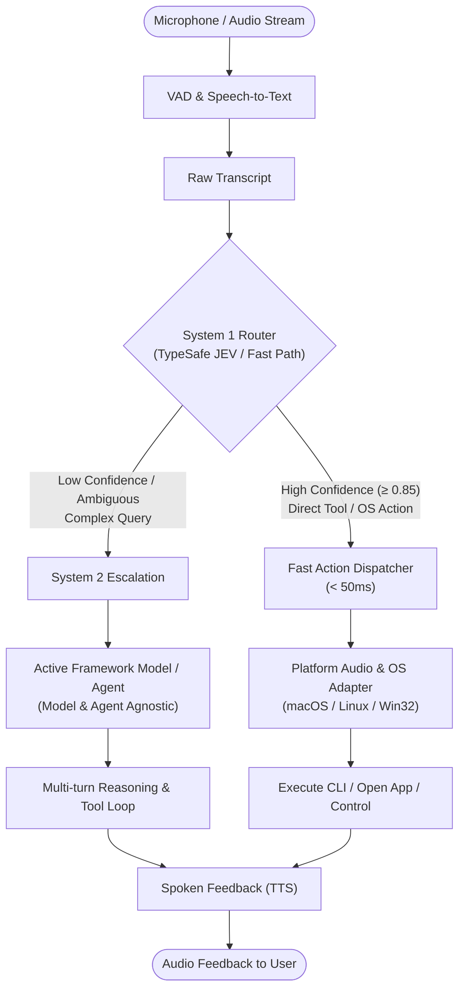

# HATHOR-TS-006: Voice Interface Subsystem & Fast-Path Action Routing

- **Document ID**: HATHOR-TS-006
- **Status**: Implemented / Active
- **Date**: 2026-09-25
- **Author**: Platform Architecture
- **Target Products**: `HATH0R-Agentic-Framework`, `HATH0R-CLI`, `hath0r-mcp`

---

## 1. Executive Summary

Traditional voice agent architectures introduce high round-trip latency ($\ge 1.5 - 3\text{s}$) by forcing all spoken utterances through a heavyweight Large Language Model (System 2) before initiating tool calls or desktop actions.

**HATHOR-TS-006** specifies the **HATH0R Voice Interface Subsystem**, decoupling rapid intent classification and action routing (**System 1**) from deep agent reasoning (**System 2**). 

The subsystem is designed with three core invariants:
1. **Agent-Agnostic**: Does not depend on a specific agent runtime; dispatches through standardized contracts (`hath0r.voice.action/1`) to any active Hath0r agent, Bot Unit, ATC orchestrator, or external harness.
2. **Platform-Agnostic & Cross-Compatible**: Provides native execution and audio adapters for **macOS (`darwin`)**, **Linux (`linux`)**, and **Windows (`win32`)**, with headless/mock fallbacks for CI and containerized clusters.
3. **Model-Agnostic**: Whichever model is configured in the environment (Gemini, Claude, GPT, local SLM, etc.) serves as the System 2 reasoning engine, while fast deterministic routers (e.g. TypeSafe AI Jev) drive System 1 dispatch.

---

## 2. Architecture Topology



---

## 3. Subsystem Components

### 3.1 Audio Ingest & Platform Adapters (`PlatformAudioAdapter`)
Abstracts OS-specific audio input, speech synthesis (TTS), and system automation:
- **macOS (`DarwinAudioAdapter`)**: Uses CoreAudio/AVFoundation for capture, `say` for low-latency synthesis, and `open`/`osascript` for computer-use control.
- **Linux (`LinuxAudioAdapter`)**: Uses ALSA/PulseAudio/PipeWire for capture, `espeak-ng` or `piper` for synthesis, and `xdg-open` for application execution.
- **Windows (`WindowsAudioAdapter`)**: Uses WASAPI/DirectSound, PowerShell `System.Speech.Synthesis`, and `Start-Process`.
- **Mock/Headless (`MockAudioAdapter`)**: Fully in-memory adapter ensuring testability in headless CI/CD environments.

### 3.2 System 1 Router (`SystemOneRouter`)
Evaluates the real-time transcript against registered actions and tools in sub-50 milliseconds:
- **TypeSafe AI Jev Router (`JevDecisionRouter`)**: Consumes typed decision signals from TypeSafe AI's Jev model or offline deterministic stubs.
- **Heuristic Fast Router (`HeuristicDecisionRouter`)**: Zero-overhead prefix and pattern matcher for direct `hath0r` CLI commands, application launches, and system control tokens (`mute`, `cancel`).

### 3.3 System 2 Agent Dispatcher (`AgentDispatcher`)
Provides the agent-agnostic interface:
- Captures queries that require contextual synthesis, codebase navigation, or creative generation.
- Delegates to the active model powering the Hath0r environment without coupling the voice stack to any model vendor.

---

## 4. Contract Specification: `hath0r.voice.action/1`

All voice interactions emit standardized JSON payloads conforming to `contracts/hath0r-voice-action-v1.schema.json`:

```json
{
  "$schema": "http://json-schema.org/draft-07/schema#",
  "schema": "hath0r.voice.action/1",
  "action_id": "8f8b82aa-c923-4d40-9a48-f68266eeec68",
  "timestamp": "2026-09-25T14:32:00Z",
  "transcript": "hathor doctor",
  "routing_tier": "system_one",
  "intent": "cli_command",
  "confidence": 0.98,
  "platform": "darwin",
  "payload": {
    "command": "hath0r doctor",
    "args": [],
    "feedback_text": "Running Hathor doctor"
  },
  "metadata": {
    "latency_ms": 1.45,
    "model_id": "typesafe-jev-fastpath"
  }
}
```

---

## 5. Governance & Trust Tier Mediation

Voice actions are subject to Hath0r framework governance tiers:
- **Guest Tier**: Read-only diagnostic queries (`hath0r doctor`, `hath0r version`). Executed immediately.
- **Elevated Tier**: Computer-use application launching, workspace navigation, safe scripts. Requires active session authorization.
- **Sovereign Tier**: Destructive operations, credential mutation, or file deletion. Require explicit confirmation before execution.

---

## 6. Implementation References

- Implementation: [`lib/voice/voice_engine.py`](../../lib/voice/voice_engine.py)
- Configuration: [`cfg/voice.json`](../../cfg/voice.json), [`lib/voice/voice_config.py`](../../lib/voice/voice_config.py)
- Schema Contract: [`contracts/hath0r-voice-action-v1.schema.json`](../../contracts/hath0r-voice-action-v1.schema.json)
- Component Documentation: [`lib/voice/README.md`](../../lib/voice/README.md)
- Unit Tests: [`tests/test_voice_engine.py`](../../tests/test_voice_engine.py)
