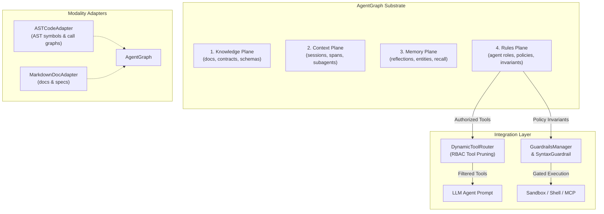
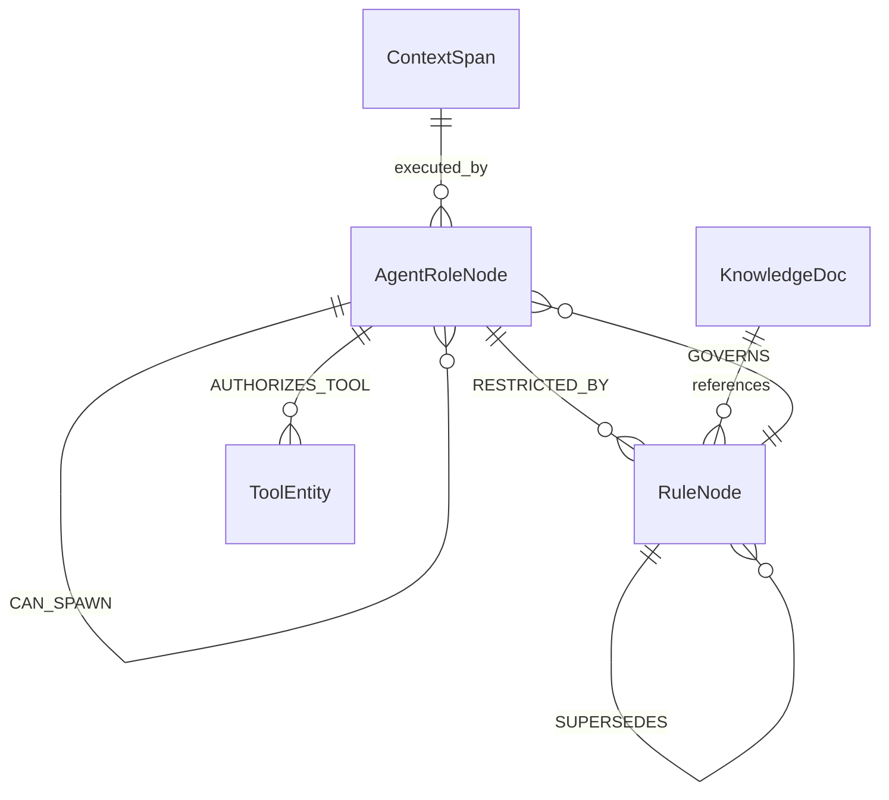

# ADR-008: AgentGraph Methodology, Unified Quad-Graph Architecture, and Governance Strategy Specification

## 1. Context and Problem Statement

The Hath0r framework's cognitive substrate historically consisted of three distinct graph domains (Tri-Graph Architecture):
1. **KnowledgeGraph**: Static design documentation, architecture invariants, and JSON Schema contracts.
2. **ContextGraph**: Ephemeral runtime execution spans, session lineage, and subagent invocation trees.
3. **MemoryGraph**: Long-term episodic memory, Letta-compatible memory paging, and sleep-cycle reflection records.

While this partition addressed storage of knowledge, runtime context, and historical memory, it left a critical void in **multi-agent governance, role-based tool authorization, and rule enforcement**:

- **Probabilistic vs. Deterministic Governance**: Agent rules, organizational policies (`CR-*` invariants), and repository standards were previously retrieved via probabilistic RAG (BM25 and vector embeddings). Crucial safety and operational boundaries must **never be probabilistic**. An agent must not miss a safety invariant because the semantic similarity score fell below an arbitrary threshold.
- **Hierarchical Lineage & Precedence**: Rules in enterprise multi-repo architectures obey strict hierarchical scoping:
  $$\text{Org Invariants (CR-*)} \longrightarrow \text{Repo Standards} \longrightarrow \text{Subsystem Rules} \longrightarrow \text{Agent Role Guidelines}$$
  Unstructured markdown stuffing cannot deterministically compute active rule closures, child overrides, or detect cyclic dependencies and direct rule contradictions.
- **Zero-Prompt-Tax Tool Authorization (RBAC/ABAC)**: Stuffing dozens of irrelevant or unauthorized tool definitions into the LLM system prompt wastes context window tokens (token tax) and degrades model reasoning. Pre-execution authorization must occur at the graph level, exposing to the model only those tools permitted for its active role and context.

---

## 2. Decision Drivers

1. **Zero-Prompt-Tax Deterministic Governance**: Eliminate bulky rule prompt-stuffing by deterministically evaluating active constraints and role authorizations prior to LLM dispatch.
2. **Unified Quad-Graph Cognitive Substrate**: Unify Knowledge, Context, Memory, and Rules under a single high-performance engine (`AgentGraphEngine` / `AgentRulesGraph`) sharing common indexing, bitemporal validity intervals, and persistence primitives (JSON snapshot + SQLite ACID store).
3. **Role-Based Access Control (RBAC/ABAC)**: Support first-class `AgentRoleNode` and `RuleNode` entity schemas with relational edge semantics (`GOVERNS`, `INHERITS_FROM`, `AUTHORIZES_TOOL`, `RESTRICTED_BY`, `CAN_SPAWN`, `SUPERSEDES`).
4. **Pre-Execution Guardrails Integration**: Connect `DynamicToolRouter`, `SyntaxGuardrail`, and `GuardrailsManager` directly to `AgentRulesGraph` to deterministically block prohibited shell commands and unauthorized tool invocations.
5. **Operator Control Plane & Autonomous Synchronization**: Provide an operator CLI (`hath0r agentgraph`) and continuous background reconciler (`AgentGraph-bot`) for cross-workspace synchronization and health auditing.

---

## 3. Architecture Blueprint

### 3.1 Quad-Plane Cognitive Topology

The `AgentGraph` substrate coordinates four primary planes and extensible file modality adapters:

### 3.2 Entity-Relationship Model

### 3.3 Core Node and Edge Specifications

| Plane | Node Type | Properties & Responsibilities | Edge Relations |
|---|---|---|---|
| **Rules** | `agent_role` | `role_name`, `scope`, `permitted_tools`, `forbidden_tools`, `max_subagents` | `INHERITS_FROM`, `AUTHORIZES_TOOL`, `RESTRICTED_BY`, `CAN_SPAWN` |
| **Rules** | `rule_policy` | `priority` (1..4), `target_scope`, `restricted_actions`, `allowed_actions` | `GOVERNS`, `SUPERSEDES` |
| **Knowledge** | `knowledge_doc`, `contract` | `title`, `path`, `subsystem`, `content`, `importance` | `references`, `implements`, `contains` |
| **Context** | `context_span`, `task` | `session_id`, `caller_id`, `tokens_used`, `status` | `calls`, `spawned_by`, `depends_on` |
| **Memory** | `memory_entity`, `concept` | `entity_type`, `reflection_text`, `temporal_depth` | `recalls`, `derives_from` |

---

## 4. Deterministic Rule Inheritance and Conflict Resolution

### 4.1 Precedence Hierarchy
Rules are assigned strict, non-overlapping numeric precedence levels:
$$\text{ORG\_INVARIANT (Tier 4)} > \text{REPO\_STANDARD (Tier 3)} > \text{SUBSYSTEM\_RULE (Tier 2)} > \text{ROLE\_GUIDELINE (Tier 1)}$$

### 4.2 Ancestry DAG Traversal
When compiling active constraints for an agent role:
1. Traverse the `INHERITS_FROM` ancestry DAG from `target_role` to root.
2. Accumulate all `permitted_tools` along the path.
3. Prune any tool present in `forbidden_tools` at any level of the inheritance hierarchy.
4. Collect all governing `RuleNode` instances linked via `GOVERNS` or scoped to the workspace subsystem.
5. In case of conflict (e.g. Rule A allows an action, Rule B restricts it), higher precedence strictly governs. Collisions at identical priority trigger an immediate deterministic `RuleConflictError`.
6. Cyclic role inheritance or rule references raise an explicit `RuleCycleError`.

### 4.3 Bitemporal Validity Intervals
Every node and edge records bitemporal intervals:
- `valid_from`: Start of real-world temporal validity (ISO 8601).
- `valid_to`: End of validity (or null if currently active).
- `is_current`: Boolean flag for fast active-set queries.

This enables point-in-time graph traversal and deterministic auditing of historical execution replays without breaking as policies evolve.

---

## 5. Security & Pre-Execution Guardrails Integration

1. **`DynamicToolRouter` Zero-Prompt-Tax Integration**:
   Before generating tool definitions for an LLM prompt, the router queries `agent_graph.get_authorized_tools(role_id)`. Tools not authorized for the role are omitted from candidate selection, slashing prompt token overhead and preventing hallucinated invocations.

2. **`SyntaxGuardrail` and `GuardrailsManager` Enforcement**:
   Prior to dispatching any tool invocation (`ToolCallDescriptor`):
   - Verifies that the requested tool is authorized for `caller_role`.
   - Compiles active `restricted_actions` from governing rules.
   - Evaluates command strings, Python ASTs, and SQL queries against the restricted action patterns.
   - Returns `GuardrailAction.BLOCK` if a policy constraint is violated.

---

## 6. Persistence & Storage Architecture

AgentGraph supports dual persistence strategies:
- **Immutable JSON Snapshots**: Version-controlled graph snapshots conforming to `contracts/hath0r-agentgraph-v1.schema.json`.
- **High-Performance SQLite Store**: Embedded ACID property graph with SQLite FTS5 full-text indexing and float32 dense vector embeddings (`SQLiteGraphStore`).

---

## 7. Migration & Rollout Strategy

1. **Phase 1 (Framework Engine)**: Implement `AgentGraphEngine`, `AgentRulesGraph`, contracts, and guardrails integration in `Bayly-AI/HATH0R-Agentic-Framework`.
2. **Phase 2 (CLI Control Plane)**: Expose `hath0r agentgraph` subcommands and `AgentGraph-bot` in `Bayly-AI/HATH0R-CLI`.
3. **Phase 3 (Workflow Integration)**: Integrate `hath0r agentgraph validate` into Clean-Repo SOP, PR Bot, and Quality Gate workflows.
4. **Phase 4 (Workspace Migration)**: Convert legacy `AGENTS.md` and scattered rules across `~/Development` into standardized AgentGraph contract fixtures.

---

## 8. Status and Sign-Off

- **Status**: Ratified
- **Date**: 2026-10-02
- **Related Issues**: #170, #171, #172, #173, #174
