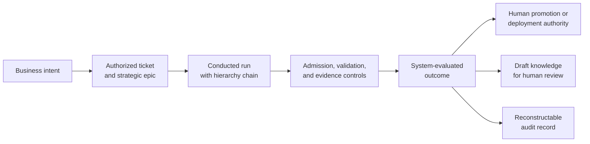

# AEGIS Executive Overview

- **Business document:** 01 of 08
- **Status:** Derived draft for business review
- **Source baseline:** Architecture corpus as of 2026-09-14
- **Primary sources:** [`INDEX`](../architect/INDEX.md), [`AEGIS-REQ-CORE-001`](../architect/AEGIS-REQ-CORE-001-initial-requirements-20260911.md), [`AEGIS-ADR-002`](../architect/aegis-adr-002-orchestration-coordination-model-20260913.md), accepted RP-010 through RP-014 decisions, and [`AEGIS-PLAN-001`](../architect/aegis-plan-001-platform-roadmap-20260913.md)

## Executive summary

AEGIS is a proposed agentic governance platform for organizations that want people and AI agents to work at machine speed without giving up authorization, accountability, evidence, or human control.

HATHOR is the broader framework: it defines a durable, portable operating model for agent navigation, knowledge, governance, credentials, and attributable work. AEGIS is the concrete realization of that model through a single command surface, small governed automation units, three explicit sources of truth, continuous validation, conducted runs, secure connection brokering, and centralized trust and audit services.

AEGIS is not intended to be an AI model, an agent harness, another issue tracker, or a replacement for existing engineering tools. It is intended to be the governance layer that connects those tools and actors under one consistent contract.

The design responds to a simple executive concern:

> As autonomous and semi-autonomous work scales, can the organization prove what happened, why it happened, which authority permitted it, which controls ran, and which human retained final decision rights?

## Problem hypothesis

Agentic engineering may change the risk profile of delivery. AI agents can create changes, invoke tools, update tickets, and interact with providers at a pace that can outstrip manual reconciliation. If that occurs without a common control layer, delivery throughput may rise while institutional control falls. The pilot must test this hypothesis rather than assume it is true across the organization.

Without a common operating layer, organizations are exposed to:

- work initiated from chat or memory without durable authorization;
- changes disconnected from strategic initiatives;
- inconsistent policy between humans, agents, repositories, and tools;
- self-declared completion without complete evidence;
- direct provider integrations and credential sprawl;
- knowledge copied without provenance, quality, freshness, or review status;
- tracker outages that either stop delivery or drive work outside the ledger;
- inconsistent evidence that is expensive to reconstruct for incidents and audits; and
- vendor and agent-harness lock-in at the point where governance should be stable.

AEGIS treats these as operating-model problems, not prompt-engineering problems.

## The business proposition

### One governed front door

Every human, agent, and automation capability uses the `aegis` CLI as the public operational entry point. The goal is one place to authenticate intent, apply policy, route capabilities, produce structured refusals, and record evidence.

This does not collapse all authority into one service. The design deliberately keeps separate authorities for:

- **runnable capability** in the Registry Plane;
- **trusted information** in the Knowledge Plane; and
- **authorized work** in the Ticketing Plane.

The Control Tower distributes trust material, manages registration and revocation, identifies authorized people and curators, ingests rollups, and supports audit query. It is not a bot and is not placed on every local request path.

### One accountability model for people and agents

The same work, evidence, and authority rules apply regardless of whether the actor is human or machine. Substantive work must have an authorizing ticket, that ticket must link to a strategic epic, the run must carry its hierarchy and evidence, and high-risk actions remain human-authorized.

Agents may prepare, build, test, and request progression. They do not grant themselves waivers, declare a run complete, verify their own knowledge as authoritative, or authorize deployment or promotion beyond development.

### Evidence-backed completion

The target model replaces narrative completion with a conducted run:

Only the conductor advances run state. Agents and bots submit requests. A final reconciler compares the required work with the recorded execution and evidence before finalization. This is intended to make “done” a platform verdict rather than an actor assertion.

### Small, replaceable automation units

The target design uses 26 single-purpose microbots across orchestration, validation, information hierarchy, and observation roles. Each bot has one responsibility, a versioned contract, a governed definition, an externalized memory model, and a controlled lifecycle.

The business objective is replaceability and constrained failure:

- change or retire one capability without rewriting the platform;
- route by capability rather than implementation name;
- prevent private durable state from becoming organizational dependency;
- prevent worker bots from owning long-lived provider credentials; and
- make judgement, refusal, retry, and cost visible.

The accepted bot-unit design cryptographically binds the manifest and governance artifacts. Binding the actual executor or image bytes remains an unresolved pre-implementation control gap and must not be represented as complete supply-chain assurance.

## Expected business outcomes

| Outcome | Business effect | Target mechanism |
|---|---|---|
| Accountable agentic work | Higher automation volume without losing authorization or ownership | Ticket, actor, run, hierarchy, and outcome linkage |
| Faster assurance | Less manual evidence archaeology at review and audit time | Event-sourced run record, validation evidence, structured query |
| Safer change and release | Reduced opportunity for unapproved promotion or skipped controls | Mechanical gates, system-evaluated completion, human deployment authority |
| Tool portability | Governance remains stable across trackers and agent harnesses | Provider-neutral contracts and adapters behind one control surface |
| Lower credential exposure | Reduced secret distribution across bots and integrations | Operator-mediated proxy by default; scoped short-lived exceptions |
| Trusted organizational knowledge | Less rediscovery and less reliance on stale or unattributed content | Tiered retrieval, provenance, TTL, draft/verified lifecycle, human promotion |
| Resilient operations | Work capture can continue through bounded outages without silent bypass | Local authority caches, backup ticketing, explicit degradation and reconciliation |
| Predictable automation economics | Cost, retries, validation time, and failure trends become observable | Per-run telemetry, token ledger, bounded retry and validation budgets |

These are **value hypotheses** until implementation and pilot evidence establish a baseline and measured change.

## Stakeholder value

### Executive and portfolio leadership

- continuous line of sight from strategic epic to executed work;
- clearer accountability for machine-generated activity;
- explicit decision points for risk appetite and human authority; and
- measurable value rather than unbounded claims of agent productivity.

### Engineering and platform leadership

- one stable contract across repositories, languages, tools, and agent harnesses;
- reusable project structure and orientation;
- provider-neutral ticketing and knowledge access;
- evidence-based run progress; and
- independently replaceable capabilities.

### Security, risk, compliance, and audit

- centralized admission, provenance, revocation, and identity controls;
- brokered external access with one audit chokepoint;
- separation of duties for promotion and deployment;
- structured refusals and reconstructable intent; and
- an explicit trust boundary that prevents overstated security claims.

### Developers, delivery operations, and knowledge curators

- clearer next actions when a control refuses work;
- fewer hidden dependencies and less tool-specific process;
- bounded degraded modes during provider outages;
- a reviewable lifecycle for shared knowledge; and
- human control over high-impact decisions.

## What is in the v1 target

The draft core requirements and accepted roadmap target:

- one `aegis` CLI with a bounded, progressively disclosed command surface;
- a shared bot chassis and the canonical bot roster;
- signed manifests, local and Tower registries, contract negotiation, and revocation;
- conducted runs, sequence enforcement, run-state reconstruction, and completion reconciliation;
- continuous validation, evidence, claims, and assumption controls;
- Ticketing Plane integration for Jira, Azure DevOps, GitHub, and a backup service;
- a tiered Knowledge Plane with human promotion;
- asynchronous telemetry and Tower rollups;
- a universal project layout;
- secure external connection brokering;
- reference container classes and deployment governance; and
- macOS and Linux support for the v1 platform.

The browser-based Tower UI, multi-tenant SaaS operation, automatic knowledge promotion, automatic work promotion, and additional execution engines are outside the stated v1 target.

## Guardrails and limitations

### Design maturity

The corpus contains accepted design decisions and approved sequencing, but it does not establish that the platform is implemented or production-ready. Core requirements and technical specifications remain draft.

### Trust-model boundary

The accepted v1 security model provides mechanical controls against a **cooperative-but-fallible** agent using platform interfaces. A fully adversarial local process with arbitrary workspace access is outside v1 prevention guarantees. The design calls for detection and later hardening through log integrity and independent evidence.

### Human authority

Human-only operations require short-lived, Tower-issued identity tokens in the target design. The detailed token claim, audience, action, run-binding, and replay contract still needs to be frozen before enforced waiver and deployment workflows can be trusted.

### Supply-chain integrity

The accepted signature design covers canonical manifests and referenced governance artifacts. It does not yet bind executor bytes, images, or an attestation. This must be resolved before claiming executable substitution resistance.

### Evidence limitations

The existing command inventory reflects one developer machine. The token benchmark is a limited baseline rather than an equivalent CLI-versus-MCP comparison. Fleet-wide demand, customer willingness to adopt, benefit magnitude, and ROI are not yet validated.

## Delivery outlook

The approved roadmap sequences eight workstreams through six milestones:

1. foundations;
2. enforcement;
3. identity and registry;
4. ticketing and knowledge planes;
5. conducted delivery; and
6. containers and dogfood.

The planning estimate is approximately 2,370–3,080 base engineering hours, described as roughly 20–26 weeks for two engineers or 12–16 weeks for four engineers with planned parallelization, **post-M0**—after the initial contracts and interfaces are frozen. These figures are planning-grade, pre-implementation estimates and must be re-baselined after the foundation milestone.

## Executive decisions required

Before broad enforcement, sponsors and control owners should decide:

1. which business unit, repositories, and tracker form the pilot;
2. which outcomes and baselines justify continued investment;
3. who owns the product, platform, control framework, and operating policies;
4. whether high-risk waivers, deployments, and organization-tier knowledge promotions require four-eyes approval;
5. the v1 hosting boundary and whether the accepted EKS direction remains exclusive;
6. the human identity and replay-prevention contract;
7. the executable-artifact attestation approach;
8. the acceptable trust TTL and degradation policy by authority and environment;
9. evidence retention, privacy, and access policies; and
10. the conditions for moving from report-only observation to enforced refusal.

## Recommended executive position

Treat AEGIS as a control and operating-model investment whose product claim must be earned incrementally. Fund a narrow pilot that first measures current authorization and evidence gaps, then introduces low-risk controls, and only expands enforcement after identity, artifact integrity, recovery, false-refusal, and value measures meet agreed thresholds.

