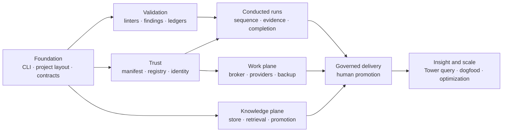

# HATHOR Business Capability Model

- **Business document:** 03 of 08
- **Status:** Derived draft for business review
- **Source baseline:** Architecture corpus as of 2026-09-14
- **Purpose:** Describe what the organization must be able to do, independent of a specific implementation

## 1. Capability-model intent

The top-level business capability is **governed agentic delivery**:

> The ability to delegate work to people and AI agents while preserving authorization, strategic lineage, trusted knowledge, evidence-based completion, secure external access, human decision rights, and reconstructable outcomes.

This capability model translates architecture components into durable business abilities. It does not imply that those abilities are implemented.

## 2. Capability map

```mermaid
flowchart TB
  GAD["Governed agentic delivery"]

  GAD --> GT["Governance and trust"]
  GAD --> WD["Work and delivery"]
  GAD --> KI["Knowledge and integration"]
  GAD --> OA["Operations and assurance"]
  GAD --> PE["Platform enablement"]

  GT --> GI["Governed interaction"]
  GT --> ID["Identity and human authority"]
  GT --> CP["Capability provenance and lifecycle"]
  GT --> PC["Policy and control management"]

  WD --> WA["Work authorization and strategic linkage"]
  WD --> CR["Conducted runs and hierarchy"]
  WD --> EC["Evidence-based completion"]
  WD --> DP["Human-authorized promotion"]

  KI --> KG["Knowledge governance and retrieval"]
  KI --> EI["Secure external integration"]
  KI --> TP["Tracker portability and reconciliation"]

  OA --> CV["Continuous validation"]
  OA --> AU["Audit and reconstruction"]
  OA --> OB["Observation and economics"]
  OA --> BC["Bounded continuity and recovery"]

  PE --> PO["Portable project orientation"]
  PE --> CM["Component modularity"]
  PE --> CD["Container and delivery governance"]
```

## 3. Capability definitions

### 3.1 Governance and trust

| Capability | Business definition | Principal outcomes | Design basis |
|---|---|---|---|
| Governed interaction | Apply one operational contract to people, agents, and automation | Consistent identity, policy, refusal, routing, and evidence | Accepted ADR-003; draft CORE CLI requirements |
| Identity and human authority | Prove when a human, machine, or automation identity acts and reserve specified decisions for people | Separation of duties; accountable waivers, promotions, and curation | Accepted RP-010 and RP-013; detailed token profile remains open |
| Capability provenance and lifecycle | Authorize, register, verify, evolve, revoke, and retire automation components | Known runnable inventory; controlled change; replaceability | Accepted RP-014; draft RP-001/002; accepted CANON-001 roster |
| Policy and control management | Express constraints as inspectable data and apply them consistently | Rules narrow permissions; control behavior is reviewable | Accepted RP-014; canonical gate/linter/refusal registries |

#### Governed interaction

The organization must be able to route every supported action through a single public interface while keeping the underlying sources of truth distinct. Business policy must not depend on which agent harness, language, repository framework, or supported tracker performs the work.

#### Identity and human authority

The organization must distinguish human, machine, agent, and bot identities and make specified human-only actions cryptographically verifiable. Identity is a prerequisite for waiver, deployment authority, organization-tier knowledge promotion, revocation, and curator maintenance.

The Control Tower identity surface is accepted at design level. Token claims, action and audience binding, replay protection, identity-provider choice, and lifetime policy remain implementation decisions.

#### Capability provenance and lifecycle

Automation must move through a governed lifecycle:

`authorize → create → self-test → sign → register → operate → evolve → revoke or retire`

The accepted target binds a bot's manifest and governance artifacts to its signed identity. Runtime executable or image bytes are not yet bound and must be added before claiming complete executable substitution resistance.

#### Policy and control management

The architecture separates:

- **directives:** what a bot is for;
- **rules:** what it must never do;
- **principles:** how it explains discretionary choices; and
- **configuration:** tunable behavior that cannot relax policy.

Business control owners must maintain platform and project policy, approve exceptions, review control performance, and prevent local configuration from becoming a grant mechanism.

### 3.2 Work and delivery

| Capability | Business definition | Principal outcomes | Design basis |
|---|---|---|---|
| Work authorization and strategic linkage | Require substantive work to be authorized and linked to a strategic epic | Traceability from portfolio intent to change | Draft RP-006/CORE; accepted canonical work gates |
| Conducted runs and hierarchy | Execute work through a governed chain from business procedure to checklist | Repeatable work with explicit lineage and sequence | Accepted ADR-002; draft RP-005/009 |
| Evidence-based completion | Decide claims and completion from recorded evidence and required work | Reduced unsupported “done” claims and skipped controls | Draft RP-007/009 and TS-001/002; approved sequencing |
| Human-authorized promotion | Reserve deployment and other high-risk promotion for verified human authority | Separation of duties and controlled release | Accepted RP-010/013 authority design; draft CORE workflows |

#### Work authorization and strategic linkage

The Ticketing Plane is intended to make work the durable unit of authorization. The business relationship is:

`strategic epic → authorized ticket → branch/change/run → evidence → outcome`

Tracker-native details remain behind adapters. The enterprise provider remains authoritative, while HATHOR supplies a canonical contract and policy layer.

#### Conducted runs and hierarchy

Conducted work is organized through six levels:

1. **Procedure:** the business problem and required outcome.
2. **Strategy:** the selected direction.
3. **Playbook:** the governing guidelines.
4. **Runbook:** the concrete task set and execution entry point.
5. **Workflow:** the scripts and tools used to progress work.
6. **Checklist:** the completion ledger.

Events may trigger evaluation, but they do not decide. Process conducts the run; Proctor enforces admission and sequence.

#### Evidence-based completion

Completion is a controlled state transition. Claims must point to evidence, evidence must meet the required validation tier, assumptions must remain valid, and the required work set must reconcile with the completed set before finalization.

#### Human-authorized promotion

Agents can author, build, validate, and prepare a deployment request. The target model requires a human-executed deployment ticket for promotion. Organization policy must define approver roles, possible four-eyes requirements, environment scope, and emergency handling.

### 3.3 Knowledge and integration

| Capability | Business definition | Principal outcomes | Design basis |
|---|---|---|---|
| Knowledge governance and retrieval | Capture, review, find, age, dispute, supersede, and archive organizational knowledge | Reuse without treating stale or unattributed content as truth | Accepted RP-012; draft RP-004 and CORE |
| Secure external integration | Mediate provider access and external effects through controlled sessions | Reduced credential distribution; attributable effects | Accepted RP-011 |
| Tracker portability and reconciliation | Apply one work contract across supported providers and continue capture during outages | Lower process lock-in and controlled continuity | Draft RP-006; accepted ADR-005 |

#### Knowledge governance and retrieval

Knowledge is organized by trust and proximity:

`Project → Machine → Organization → Public`

New content enters as a bounded draft microburst. Promotion is a human act. Retrieval exposes status, freshness, provenance, and confidence. No confident match is a valid result and is preferable to an unqualified low-quality answer.

#### Secure external integration

External calls use:

- **Class 1:** proxy through Operator; the worker receives no provider credential; or
- **Class 2:** a declared exception with a narrow, short-lived, run-bound, memory-only token.

The broker is responsible for credential resolution, session management, rate limits, circuit breaking, idempotency, degradation, and external-effect audit.

#### Tracker portability and reconciliation

Jira, Azure DevOps, GitHub, and the backup ticket service are intended to map to one Ticket Contract. The design preserves provider authority and treats buffered state as pending reconciliation rather than competing truth.

### 3.4 Operations and assurance

| Capability | Business definition | Principal outcomes | Design basis |
|---|---|---|---|
| Continuous validation | Evaluate changes, assumptions, claims, contracts, hierarchy, tickets, and knowledge throughout work | Earlier detection and proportionate assurance | Draft RP-007/TS-001; approved PLAN-002/003 |
| Audit and reconstruction | Reconstruct intent, authorization, run state, decisions, evidence, and effects | Faster incident and audit response | Draft CORE/TEL; accepted RP-010/011 query and receipt design |
| Observation and economics | Measure task outcome, latency, success, retry, degradation, and token use without becoming authority | Operational insight and cost visibility | Draft RP-003; canonical observation roster |
| Bounded continuity and recovery | Continue eligible work through outages within declared trust and recover without duplicate or silent loss | Resilience without unbounded local authority | Accepted RP-010/011 and ADR-005; draft plane details |

#### Continuous validation

The validation fabric combines:

- pure static micro-linters;
- plane-aware validator bots;
- named validation suites;
- normalized findings;
- assumption and evidence ledgers;
- claims mapped to required validation tiers; and
- change, assumption, evidence, and completion gates.

Validation is an enforcement capability, not another source of truth. Validators may refuse work but must not write authoritative plane state.

#### Audit and reconstruction

Reconstruction should use authoritative run and audit ledgers plus provider receipts. Telemetry adds correlated operational views and Tower query, but must not be the only source of business state.

#### Observation and economics

Observation is passive by design. It records and aggregates but never mutates or refuses. The canonical target measures task lifecycle, latency, success rate, retry, and token use.

#### Bounded continuity and recovery

Local indexes, signed cached policy, append-only ledgers, spools, backup work capture, idempotency, and reconciliation allow limited offline or degraded operation. Trust TTL, environment policy, and authority boundaries determine what may continue.

### 3.5 Platform enablement

| Capability | Business definition | Principal outcomes | Design basis |
|---|---|---|---|
| Portable project orientation | Give every supported repository a recognizable structure and bounded orientation path | Lower rediscovery and more consistent automation behavior | Draft CORE UPL; accepted ADR-004 paths and OS scope |
| Component modularity | Keep each bot single-purpose, independently testable, and late-bound by capability | Constrained failures and replaceable implementations | Accepted RP-014 and CANON-001 roster |
| Container and delivery governance | Apply identity, contracts, secrets, health, versioning, lint, and promotion controls to deployment units | Consistent build and release posture | Draft container doctrine and CORE container requirements |

## 4. Capability dependencies

Key dependencies:

- conducted runs depend on the CLI foundation and validation runtime;
- trusted bot dispatch depends on manifest, registry, signing, and Tower distribution;
- strict human-only operations depend on the human identity-token profile;
- ticketing depends on identity, Operator, provider adapters, and backup/reconciliation;
- knowledge promotion depends on storage, redaction, identity, and curator authority;
- container promotion depends on validation and deployment-ticket governance; and
- broad rollout depends on operational evidence, not only feature completion.

## 5. Capability-to-value mapping

| Value theme | Enabling capabilities | Evidence required before claiming value |
|---|---|---|
| Accountability | Work authorization, strategic linkage, audit reconstruction, identity | Traceability coverage and sampled reconstruction tests |
| Assurance | Conducted runs, continuous validation, evidence-based completion | False-completion negative tests, gap rates, escaped-defect trend |
| Human control | Human authority, policy management, deployment governance | Verifiable human-token and separation-of-duties tests |
| Portability | Governed interaction, provider-neutral ticketing, component modularity | Equivalent behavior across providers, languages, and agent harnesses |
| Credential risk reduction | Secure external integration, capability provenance | Worker credential-exposure tests and complete external-effect receipts |
| Knowledge reuse | Knowledge governance, portable orientation | Search quality, reuse, staleness, promotion, and dispute measures |
| Continuity | Bounded continuity, tracker reconciliation, local trust | Outage, expiry, replay, conflict, and recovery tests |
| Predictable economics | Observation, proportional validation, bounded discovery | Equivalent-task token, latency, retry, and operator-effort baselines |

## 6. Capability prioritization

### Foundation capabilities

Build and stabilize before dependent teams fan out:

- governed interaction;
- portable project orientation;
- common contracts and error behavior;
- validation findings and ledgers;
- capability provenance primitives; and
- authoritative local run records.

### Control-enabling capabilities

Required before enforced pilot operation:

- human identity;
- Proctor admission;
- Process run-state control;
- artifact verification and revocation;
- work authorization;
- evidence-based completion;
- brokered external access; and
- strict degradation boundaries.

### Value-expansion capabilities

Add after the control foundation works:

- multiple work-provider adapters;
- organization knowledge and curation;
- full hierarchy breadth;
- Tower rollups and trend analysis;
- container classes and delivery integration; and
- broader repository and team adoption.

## 7. Maturity interpretation

Capability maturity must be reported using evidence, not document volume:

| Maturity | Meaning |
|---|---|
| Defined | Business outcome, authority, interface, and control intent are documented |
| Implemented | Code and configuration exist for an authorized scope |
| Verified | Positive, negative, recovery, and threat-boundary tests pass |
| Piloted | Real users and agent workloads operate in bounded scope with measured friction and outcomes |
| Operational | Ownership, SLOs, support, retention, access, change, and incident practices are active |
| Scaled | Multiple teams/providers use the capability and benefits persist without control erosion |

The current corpus supports substantial **Defined** maturity for many capabilities. It does not, by itself, establish the later levels.

## 8. Boundary conditions

The following are not independent business capabilities in the target model:

- Control Tower as a general workflow engine;
- provider adapters as autonomous bots;
- telemetry as the source of run or work truth;
- agent narrative as evidence of completion;
- local configuration as a policy grant;
- the backup ticket service as a second enterprise tracker; or
- an AI model as the owner of control flow.

Treating any of these as a capability would invert an accepted authority boundary.

