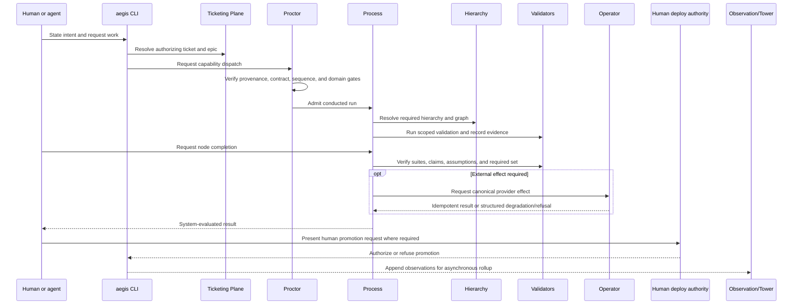
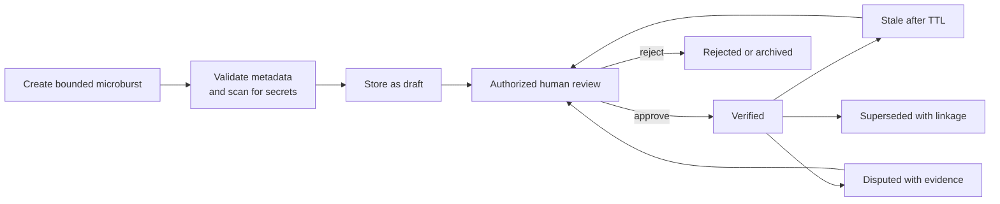

# AEGIS Target Operating Model

- **Business document:** 04 of 08
- **Status:** Derived draft for business review
- **Source baseline:** Architecture corpus as of 2026-09-14
- **Purpose:** Define target actors, decision rights, authorities, workflows, records, and operating cadence

## 1. Operating-model principles

The target operating model is based on the following source-grounded rules:

1. One public operational ingress does not mean one source of truth.
2. Registry, Knowledge, and Ticketing authorities remain separate.
3. Events trigger evaluation; they do not own decisions.
4. Process conducts runs and owns authoritative run transitions.
5. Proctor decides whether a requested action is admissible now.
6. Operator is the exclusive broker of supported third-party effects and long-lived provider credentials.
7. Agents and worker bots request progress; the platform decides completion.
8. Agents build and verify; verified humans authorize high-risk promotion and exception.
9. Observation records and aggregates but never blocks or mutates business work.
10. Degraded operation is visible, bounded, and never a silent grant of authority.
11. Durable knowledge is shared, provenance-bearing, and human-promoted.
12. Security claims remain inside the cooperative-but-fallible v1 trust boundary.

The proposed `hathor-principles@1` synthesis expresses similar concepts but is not yet ratified. This operating model relies on accepted source decisions and labels draft workflows accordingly.

## 2. Authority model

| Authority | Owns | Does not own |
|---|---|---|
| Registry Plane | Which bot definitions may run; identity, state, digest, registration, and revocation | Work authorization, knowledge truth, or run completion |
| Knowledge Plane | Knowledge records, status, provenance, freshness, dispute, and verification | Work state, bot authorization, or deployment authority |
| Ticketing Plane | Which work exists; work state, epic linkage, estimates, change linkage, and authorization | Bot provenance, knowledge verification, or run sequence |
| Process run ledger | Conducted-run events and reconstructed run state | Provider work truth or organization knowledge |
| Human authority | Waiver, deployment or promotion, curation, revocation, and other reserved actions | Unrecorded authority by chat, memory, or TTY presence |
| Control Tower | Registration, trust distribution, revocation, curator identity, human identity, rollup ingest, and bounded query | Ordinary bot dispatch, third-party brokering, or every local request |
| Provider system | Provider-native record and ultimate reconciliation authority for mapped work | AEGIS run state or capability authorization |

## 3. Actors and responsibilities

### 3.1 Organizational roles

These roles must be assigned by the adopting organization. The architecture does not name their accountabilities.

| Role | Target accountability |
|---|---|
| Executive sponsor | Funds the capability, sets business outcomes and risk appetite, and approves scale decisions |
| Product owner | Owns business requirements, prioritization, user adoption, and value realization |
| Platform service owner | Owns service reliability, support, releases, SLOs, capacity, and operational readiness |
| Control owner | Owns control objectives, design, testing, evidence, exceptions, and remediation |
| Security or risk owner | Accepts residual risk, approves threat assumptions, and governs identity and artifact trust |
| Data and privacy owner | Defines evidence, telemetry, identity, and knowledge retention and access policy |
| Work-system owner | Approves provider integration and reconciliation policy |
| Knowledge owner or curator lead | Assigns review authority and governs promotion, dispute, and lifecycle policy |
| Pilot or team owner | Owns local adoption, training, workflow fit, and pilot outcomes |

### 3.2 Source-defined operating actors

| Actor | Source-defined responsibility | Decision right |
|---|---|---|
| Human operator | Authors tickets, reviews evidence, promotes knowledge, executes deploys, and handles exceptions | Reserved human actions when identity and policy are satisfied |
| AI agent | Orients, builds, validates, files or reads work, and drives runbooks | May request actions and transitions; does not self-authorize |
| Proctor-Bot | Resolves capability, verifies contract and provenance, applies gates, and structures refusal | Admit or refuse a requested dispatch |
| Process-Bot | Opens, conducts, folds, resumes, and finalizes governed runs | Sole writer of authoritative run-transition events |
| Operator-Bot | Manages provider connections, credentials, sessions, idempotency, rate limits, and degraded external paths | Execute or refuse brokered third-party effects |
| Hierarchy bots | Resolve Procedure through Checklist responsibilities | Own their tier's resolution, not overall run state |
| Validator bots | Evaluate diffs, contracts, assumptions, registry, tickets, hierarchy, knowledge, claims, drift, evidence, and completeness | Return verdicts and refuse through Proctor; never write plane authority |
| Observation bots | Drain, measure, aggregate, and roll up passive operational events | Record only; never mutate or refuse |
| Control Tower | Operates platform authority surfaces | Register, revoke, distribute trust, identify humans and curators, ingest, and query |
| External provider | Serves as system of record for integrated work or external service | Provider-native authority within the adapter contract |

“DVO” is used throughout the source corpus for the human deployment role or workflow but is not expanded into an organizational definition. The adopting organization must define the role, eligibility, segregation, and escalation path.

## 4. Decision-right matrix

| Decision or action | May prepare or request | Decides or authorizes | Authoritative record |
|---|---|---|---|
| Start substantive work | Human or agent | Ticketing rules and Proctor admission | Ticketing Plane |
| Select runnable capability | Caller states capability intent | Proctor resolves; Registry determines eligibility | MBI/TBR registry records |
| Advance run state | Human, agent, or bot requests | Process evaluates current state and controls | Run event ledger |
| Declare node or run complete | Human, agent, or bot submits claim | Process and validation/completeness controls | Run, evidence, assumption, and finding ledgers |
| Perform external provider effect | Worker submits canonical request | Operator applies connection and policy | Operator receipt plus provider record |
| Verify knowledge | Agent or human authors draft | Authorized human reviewer or curator | Knowledge record |
| Waive a mandatory control | Human submits reason and expiry | Authorized human under policy; agent prohibited | Waiver and identity-token evidence |
| Promote or deploy | Agent may build, test, and prepare request | Authorized human using a reconciled deployment ticket | Ticket, deployment evidence, and provider receipt |
| Register a bot | Bot owner submits signed definition | Registry/Tower validates and acknowledges | TBR and MBI state |
| Revoke or retire a bot | Component or risk owner requests | Authorized operator | Revocation record and distributed CRL |
| Change canonical roster or add a tenth domain | Architecture stakeholders propose | ADR and operator sign-off | Accepted ADR and canonical registry |
| Change organization policy | Control owner proposes | Designated human governance authority | Signed policy pack and change record |

## 5. Core work lifecycle

### 5.1 End-to-end governed change

### 5.2 Lifecycle steps

1. **Orient.** The user or agent retrieves bounded repository, capability, connection, work, and knowledge context instead of loading complete catalogs.
2. **Authorize.** A substantive change resolves to an authorizing ticket, strategic epic, estimate, and required linkage.
3. **Open.** Process creates a run and binds ticket, hierarchy, actor, capability, and policy context.
4. **Admit.** Proctor evaluates provenance, contract, sequence/barrier, and applicable domain gates.
5. **Execute.** The selected capability performs one bounded responsibility. External effects route through Operator.
6. **Validate.** Required diff, contract, assumption, evidence, ticket, hierarchy, knowledge, and claim checks run at their triggers.
7. **Request completion.** The actor submits completion as a request, never as authoritative state.
8. **Reconcile.** Process and completeness validation compare required work, completed nodes, evidence, claims, and assumptions.
9. **Finalize.** The run records outcome or refuses with named gaps and remediation.
10. **Promote.** An authorized human executes deployment or other high-risk promotion when a reconciled ticket and controls permit it.
11. **Learn.** The run may produce a bounded draft knowledge microburst for human review.
12. **Observe.** Passive events roll up for quality, risk, performance, and cost analysis.

## 6. Exception and recovery workflows

### 6.1 Structured refusal

A refusal must identify:

- the control or authority that refused;
- a stable code and human-readable explanation;
- the evidence or state that caused the refusal;
- the next required action or remediation;
- provenance and applicable trust or retry timing; and
- whether the condition is a policy, validation, dependency, not-found, or conflict outcome.

The user or agent corrects the condition and resubmits. Bypass is not a normal recovery path.

### 6.2 Human waiver

Target flow:

1. the platform produces a refusal or blocking finding;
2. a human reviews the evidence and business need;
3. the human authenticates through the organization identity path;
4. the waiver names scope, reason, control, run or action, and expiry;
5. the platform verifies the short-lived Tower-issued identity token;
6. the waiver is recorded and applied only where policy permits; and
7. waiver use is included in audit and control-performance review.

TTY presence may improve user experience in a development profile but is not proof of human authority.

### 6.3 Provider outage and work buffering

1. Operator detects provider failure or an open circuit.
2. Eligible work capture uses the backup path and is marked `buffered` and degraded.
3. The run and response expose the authoritative-versus-buffered state.
4. Trust TTL and environment policy restrict what may continue.
5. On reconnect, the enterprise provider remains authority.
6. A buffered delta is replayed, deduplicated, or raised as a reconciliation conflict.
7. No record is silently dropped or overwritten.
8. Unreconciled backup state cannot create deployment authority.

### 6.4 Run interruption and resume

1. Process reconstructs state by folding the append-only event ledger.
2. Completed nodes remain complete.
3. Incomplete work is evaluated for safe re-dispatch.
4. Execution keys and Operator idempotency prevent duplicate effects.
5. Conflicting concurrent state becomes an explicit degraded condition for review.
6. Finalization still requires the complete required set and evidence.

### 6.5 Authority or Tower outage

Cached signed keys, revocation data, policy, and verified-local records may support declared operations inside their trust TTL. Explicit Tower authority commands cannot pretend to succeed offline. Once cached authority expires, authority-originating actions refuse.

### 6.6 Telemetry outage

Observation fails open: business work continues while telemetry status degrades. This is acceptable only if the authoritative run and audit ledger remains safely committed. Export and rollup replay later and deduplicate by event identity.

## 7. Knowledge operating lifecycle

Decision rights by tier:

| Tier | Record authority | Review authority |
|---|---|---|
| Project | Project knowledge files | Project owner or designated reviewer |
| Machine | Machine-local knowledge files | Machine operator |
| Organization | Organization knowledge service | Tower-registered domain curator |
| Public | External reference only | Not promotable to verified in place |

The organization must set reviewer eligibility, SLA, four-eyes policy, conflict handling, retention, privacy, and escalation.

## 8. Automation-unit operating lifecycle

### 8.1 Authorize and create

- Confirm the capability belongs to the canonical roster or has an approved ADR.
- Assign a component owner.
- Scaffold identity, manifest, directive, rules, principles, executor, and test fixtures.
- Declare dependencies by capability, never by direct bot reference.
- Keep rules narrowing-only.

### 8.2 Verify and register

- Run structural linters and isolated self-test.
- Canonicalize and sign the manifest and governance artifacts.
- Verify signatures, schemas, governance digests, and registration constraints.
- Enter local verified state, then reconcile with the Tower.
- Quarantine any rejected, revoked, expired, or inconsistent definition.

### 8.3 Operate and observe

- Route only by declared capability.
- Apply timeouts and no more than five bounded retries.
- Use sanctioned stores and never private durable memory.
- Broker external effects.
- Report decisions, findings, retries, degradation, and usage.

### 8.4 Evolve and retire

- Treat behavioral or governance change as a version event.
- Re-sign, re-register, and invalidate stale bindings.
- Allow side-by-side major contracts during breaking change.
- Revoke or retire with a reason and successor where available.
- Preserve historical knowledge and telemetry provenance.

## 9. Operating cadence

| Cadence | Activity |
|---|---|
| Every request | Identity, capability, contract, provenance, and policy evaluation |
| Every substantive change | Ticket, strategic linkage, diff scope, validation, evidence, and audit |
| Every run transition | Process state fold, sequence/barrier admission, required-suite and assumption evaluation |
| Every external effect | Operator session, idempotency, receipt, rate, and circuit policy |
| Every knowledge write | Metadata validation, redaction, draft status, and provenance |
| Every reconciliation cycle | Registration push, trust pull, revocation quarantine, provider work reconciliation |
| Continuous/asynchronous | Telemetry drain, rollup, retry/cost/quality observation |
| Periodic control review | Waivers, degraded operation, drift, false refusals, stale knowledge, revocations, and incidents |
| Release or policy change | Interface freeze, versioning, signed artifacts, positive/negative tests, approval |

## 10. Records and evidence

| Record | Business purpose | Authority |
|---|---|---|
| Ticket and epic | Work authorization and strategic linkage | Ticketing provider/plane |
| Bot manifest and registration | Runnable capability identity and contract | Registry Plane |
| Signed policy and trust material | Organization control and offline verification | Control Tower |
| Run event ledger | Reconstruct current and historical run state | Process/run store |
| Findings, assumptions, claims, and evidence | Control evaluation and completion proof | Run-scoped ledgers under their owning contracts |
| Provider receipt and idempotency record | Proof of external effect and replay safety | Operator plus provider |
| Knowledge record | Shared organizational knowledge and review state | Knowledge Plane |
| Telemetry spool and rollup | Passive operational, quality, and economic view | Observation/Tower; not business-state authority |
| Human token and waiver record | Proof of reserved human decision | Tower identity plus run/audit record |

## 11. Required organizational policies

Before operational use, define and approve:

- identity-provider and human-token policy;
- environment and deployment authority;
- four-eyes and emergency exception policy;
- trust TTL by authority, environment, and action;
- work-provider and reconciliation rules;
- evidence, audit, telemetry, and knowledge retention;
- privacy, redaction, and access control;
- component ownership, signing, revocation, and incident response;
- accepted Class-2 token exceptions;
- validation profiles and acceptable false-refusal levels;
- knowledge curator and dispute governance;
- service SLO, support, capacity, backup, and recovery;
- risk acceptance for adversarial local processes; and
- promotion criteria from report-only to enforced operation.

## 12. Operating-model gaps

The architecture does not yet define:

- the accountable executive, product owner, service owner, or control owners;
- support model, incident severity, SLOs, or on-call ownership;
- retention and data-classification requirements;
- a full RACI for deployment, waiver, revocation, and knowledge promotion;
- the human token claim and replay contract;
- four-eyes scope;
- artifact-byte attestation;
- hash-anchor custody and hardening schedule;
- Operator high availability;
- maintenance and state-cleanup ownership; or
- commercial, funding, chargeback, or service-consumption models.

These are adoption prerequisites, not optional documentation details.

