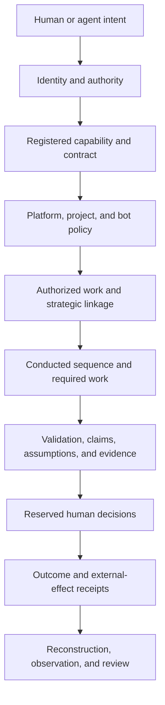

# AEGIS Governance, Risk, and Controls

- **Business document:** 05 of 08
- **Status:** Derived draft for business review
- **Source baseline:** Architecture corpus as of 2026-09-14
- **Primary authorities:** [`HATHOR-CANON-010`](../architect/aegis-canon-001-registries-20260913.md), [`HATHOR-RP-013`](../architect/aegis-rp-013-threat-model-20260913.md), accepted ADRs, and accepted RP-010/011/014 designs

## 1. Governance objective

AEGIS is intended to let an organization increase the speed and volume of delegated work without weakening:

- authorization;
- separation of duties;
- traceability;
- evidence quality;
- credential control;
- capability provenance;
- knowledge integrity;
- change management;
- resilience; or
- the honesty of security claims.

Governance is applied as a layered system. No single gate, signature, ticket, or telemetry stream is sufficient by itself.

## 2. Governance model

### Control layers

| Layer | Control purpose | Evidence |
|---|---|---|
| Identity and authority | Prove who or what acts and reserve specified decisions for humans | Machine signatures, human token references, actor identity |
| Capability trust | Allow only known, valid, non-revoked automation | Signed manifest, governance digests, registry state, revocation record |
| Contract and policy | Constrain inputs, outputs, side effects, and local behavior | Schemas, rules, configuration validation, refusal envelope |
| Work governance | Bind substantive action to authorized and strategically aligned work | Ticket, epic, estimate, branch/PR/run links |
| Conducted execution | Prevent unsupported order, hidden skips, and self-declared state | Process graph, run ledger, barrier and transition records |
| Continuous assurance | Evaluate change, assumption, claim, evidence, and completeness | Findings, suite results, evidence and assumption ledgers |
| External-effect control | Contain credentials and make provider mutations idempotent and attributable | Broker session, idempotency key, provider receipt |
| Human decision | Preserve approval for waiver, deployment, and authoritative knowledge | Human token, reason, expiry, approval and ticket |
| Observation and review | Detect drift, cost, retry, failure, and control performance | Passive telemetry, Tower rollups, control reports |

## 3. Canonical mechanical gates

The accepted gate registry contains 15 gates. Their business purpose is summarized below; exact identity and semantics remain in `HATHOR-CANON-010`.

| ID | Gate | Business control objective |
|---|---|---|
| G01 | Provenance Gate | Prevent unknown, invalidly signed, revoked, or quarantined automation from receiving work |
| G02 | Contract Gate | Prevent incompatible or structurally invalid requests and responses |
| G03 | Sequence/Barrier Gate | Prevent out-of-order, predecessor-incomplete, or unbound execution |
| G04 | No-Ticket Gate | Prevent substantive work without durable authorization |
| G05 | Epic-Linkage Gate | Prevent work from advancing without strategic lineage |
| G06 | PR-Ticket Bind Gate | Prevent code changes from losing work authorization linkage |
| G07 | Estimation Gate | Require planning data and force oversized work to be reconsidered |
| G08 | Development-Only Gate | Prevent non-development mutation without a human grant |
| G09 | Deploy-Ticket Gate | Prevent promotion without a reconciled, human-executed deployment ticket |
| G10 | Change-Validation Gate | Prevent changed work with blocking findings from progressing |
| G11 | Assumption Gate | Prevent action that depends on open, broken, or expired assumptions |
| G12 | Claim-Evidence Gate | Prevent claims that lack required validation and evidence |
| G13 | Undeclared-Assumption Gate | In strict profiles, prevent known failure classes from remaining undeclared |
| G14 | Micro-Linter Gate | Prevent structurally noncompliant artifacts from being containerized |
| G15 | Knowledge Promotion Gate | Prevent unfit drafts from entering trusted knowledge |

On the dispatch path, the accepted order is:

`provenance → contract → sequence/barrier → applicable domain gates`

Validation, build, and knowledge gates run at their own triggers.

## 4. Preventive, detective, and corrective controls

### 4.1 Preventive controls

- capability signature, registration, verification state, and revocation;
- schema validation and contract negotiation;
- sequence and barrier enforcement;
- work, epic, change-binding, estimation, environment, and deployment gates;
- narrowing-only rules;
- provider access through Operator;
- human identity for waiver, promotion, and organization curation;
- signed organization-distributed packs, suites, graphs, and adapters;
- build-time structural linters;
- secret and PII checks;
- explicit trust TTL and environment policy; and
- no public listeners for bots.

### 4.2 Detective controls

- append-only run, evidence, finding, and assumption ledgers;
- completeness reconciliation;
- provider receipts and idempotency records;
- Tower-side registration, revocation, ingest, and query;
- validation findings and drift detection;
- knowledge staleness, disputes, and promotion review;
- retry, success, latency, token, and degradation observation;
- principle-use and rule-violation monitoring; and
- future hash-chain and independent CI/Tower cross-checks for local tampering.

### 4.3 Corrective controls

- structured refusals with named remediation;
- fix and resubmit;
- quarantine and revocation;
- recorded human waiver within policy;
- provider conflict escalation;
- run resume from the authoritative fold;
- knowledge reject, supersede, dispute, re-review, or archive;
- replay and deduplication;
- successor routing after component retirement; and
- policy or design amendment through controlled decisions.

Automated compensation for a post-rule external-effect violation is explicitly excluded from the accepted bot model. The system detects and flags; a human determines corrective action.

## 5. Trust and threat boundary

### 5.1 Accepted v1 statement

AEGIS v1 prevention guarantees apply to a **cooperative-but-fallible** agent using platform interfaces—an actor that may drift, forget, reorder, hallucinate, or overclaim but does not deliberately subvert platform files.

A fully adversarial local process with arbitrary workspace access is:

- outside v1 prevention guarantees;
- inside v1 detection goals; and
- a subject of later integrity hardening.

No-skip, human-only, state-ownership, and tamper-resistance claims must include this boundary.

### 5.2 Threat categories

| Threat | Primary business exposure | Current target treatment |
|---|---|---|
| Fallible agent | Skipped work, false completion, unsupported claim | Central conductor, gates, evidence, completeness reconciliation |
| Malicious local process | Run-ledger, spool, or cache forgery | Explicit limitation, reconciliation, planned hash chaining and independent evidence |
| Malicious repository content | Configuration-driven execution | Signed packs, dev override disclosure, no-network probes, future OS sandboxing |
| Compromised bot artifact | Substituted behavior or supply-chain compromise | Signed manifest and governance; executable binding still open |
| Network attacker | Replay or rollback of trust and ingest data | Signed monotonic distribution, TUF, authenticated transport, deduplication |
| Insider misuse | Valid identity used for wrong waiver, promotion, or curation | Human tokens, reason/expiry, audit; four-eyes scope unresolved |

## 6. Risk register

Priority indicates when the issue should be resolved; it is not a quantified likelihood assessment.

| Risk | Business impact | Current position | Required treatment | Priority |
|---|---|---|---|---|
| Design mistaken for delivered product | Funding, assurance, or customer claims rely on unimplemented controls | Many source documents remain draft; plans authorize no code | Maintain claim classes, require implementation and test evidence | Immediate |
| Executable bytes not bound to signed manifest | A valid definition could be paired with substituted runtime code | Recorded open R10 gap | Freeze executable, image, or OCI/SLSA attestation binding and run substitution tests | Before registration implementation or strong supply-chain claims |
| Human-token profile incomplete | Waiver or deployment authority may be replayed or mis-scoped | Tower token surface accepted; detailed claims open | Define issuer, subject, audience, action, run, nonce, expiry, revocation, and negative tests | Before enforced human-only actions |
| Locally writable run logs and spool | Malicious local process may forge or delete evidence | Explicitly outside v1 prevention | Add hash chain with external anchor and independent Tower/CI cross-checks | Before claims beyond cooperative actors |
| Gateway event authority incomplete | Spoofed or replayed events may select control-bearing branches | Open in pending register | Bind event class to authenticated emitter, evidence, run, nonce, and idempotency | Before event-driven strict mode |
| Process graph semantics incomplete | Loops, retries, and required-set logic may produce unsafe completion decisions | Draft design has DAG/cycle ambiguity | Freeze cyclic-state or expanded-DAG semantics, bounds, attempts, and crash-resume tests | Before complex graph adoption |
| Telemetry and finalization authority conflict | “Telemetry never blocks” could conflict with required evidence | Pending recommendation favors local ledger authority | Make local run/audit commit fail closed; keep export and rollup fail open | Before finalization enforcement |
| Out-of-process effects are self-declared | A worker may omit an effect that post-rules should inspect | Accepted cooperative trust boundary | Add mediated or observed-effect reconciliation and integration tests | Before untrusted or out-of-process workers |
| Operator crash, HA, and idempotency gaps | Duplicate or lost provider effects and service interruption | Proxy/idempotency design accepted; operational details open | Freeze persistence, recovery, retention, concurrency, and fault-injection behavior | Before production provider writes |
| Knowledge confidence not calibrated | Low-quality answers or excessive misses reduce trust and productivity | Threshold mechanism accepted; calibration open | Define evaluation set, feedback event, threshold ownership, and periodic review | Before knowledge-quality claims |
| Four-eyes scope unresolved | High-risk insiders may approve their own exception or promotion | Open source decision | Set policy for deployment, waiver, revocation, and organization knowledge | Before high-risk environment use |
| Retention and cleanup ownership absent | Evidence loss, privacy breach, or uncontrolled storage growth | Cleaner/state ownership open | Assign data owner, retention schedules, legal holds, deletion, and maintenance owner | Before operational pilot |
| Backup ticket conflict or overgrowth | Buffered work may diverge or the backup may become a competing tracker | ADR-005 limits scope | Enforce minimal contract, TTL, authority-wins reconciliation, and conflict workflow | Before continuity testing |
| Direct integration bypass | Credentials and work effects escape central audit | Target forbids worker-provider access | Static/runtime checks, egress control where appropriate, and exception register | Before enforced provider integration |
| Documentation and implementation drift | Controls or users rely on stale contracts | Skill-pack and schema generation planned | Generate bounded guidance from schemas and test documentation claims in CI | Before broad user adoption |
| Baseline evidence too narrow | Investment and value decisions may overgeneralize one-machine observations | Invocation and payload evidence is explicitly limited | Run fleet and equivalent-task baselines | Before ROI or scale claims |

## 7. Control ownership model

The source architecture defines technical owners but not enterprise control owners. Assign at least:

| Control domain | Recommended accountable role | Operational actors |
|---|---|---|
| Identity and reserved human actions | Security or identity control owner | Tower operator, human approvers |
| Capability signing and revocation | Software supply-chain control owner | Bot owners, registry/Tower operators |
| Work authorization and strategic linkage | Delivery-governance owner | Work-system owners, Proctor |
| Conducted sequence and completion | Platform control owner | Process, Proctor, validator owners |
| Knowledge lifecycle | Knowledge-governance owner | Project reviewers, machine operators, curators |
| Provider credentials and effects | Integration-security owner | Operator service owner, provider owners |
| Evidence and retention | Audit/data owner | Platform service, Tower, data/privacy |
| Deployment promotion | Release or change-management owner | Authorized DVO operators |
| Degraded operation and continuity | Service continuity owner | Platform and provider owners |
| Control monitoring | Risk/control assurance owner | Observation/Tower analysts, auditors |

Product code ownership does not automatically confer control ownership or waiver authority.

## 8. Assurance model

### 8.1 Design assurance

- source status and authority are explicit;
- interfaces freeze before dependent implementation;
- registry changes update canonical enumerations in the same change;
- new bot roster members or public command domains require an ADR;
- security claims trace to the accepted threat model; and
- open gaps remain visible in the change-control register.

### 8.2 Implementation assurance

For each control:

1. map the business objective to requirement and implementation;
2. identify positive, negative, boundary, recovery, and replay tests;
3. prove the authoritative record and evidence source;
4. test failure and degradation behavior;
5. assign an owner and remediation SLA;
6. record exceptions and expiry; and
7. prevent implementation from claiming stronger assurance than its trust boundary.

### 8.3 Operational assurance

Review at a defined cadence:

- work authorization and linkage coverage;
- false completion and completeness gaps;
- waivers and human-token failures;
- revoked or quarantined dispatch attempts;
- Class-2 token use;
- duplicate or unreconciled external effects;
- buffered ticket age and conflict;
- validation false refusals and overrides;
- stale, disputed, rejected, or unreviewed knowledge;
- degraded authority time and TTL expiry;
- retry storms, latency breaches, and token anomalies;
- secret/PII findings;
- documentation/schema drift; and
- incidents outside the cooperative trust model.

## 9. Compliance-aligned outcomes

The design may support organization-specific controls for:

- change authorization;
- separation of duties;
- least privilege;
- credential management;
- software provenance;
- audit logging;
- evidence retention;
- incident reconstruction;
- business continuity;
- data quality and provenance; and
- third-party integration oversight.

AEGIS does not create compliance by architecture alone. Control mapping, implementation, operating evidence, policy, access review, testing, and independent assessment remain organization responsibilities.

## 10. Conditions that prohibit enforcement expansion

Do not expand to stricter profiles, higher-risk environments, or more teams if any of the following is unresolved for the proposed scope:

- human identity can be spoofed or replayed;
- runtime artifacts are not bound at the assurance level being claimed;
- authoritative run records can be lost during normal failures;
- reconciliation can silently overwrite or duplicate provider effects;
- mandatory work can be skipped without detection inside the accepted trust boundary;
- false-refusal or latency impact exceeds the agreed threshold;
- control owners and incident paths are unassigned;
- retention, privacy, or access policy is undefined;
- users require routine bypasses to complete legitimate work; or
- measured value does not justify the operating and control cost.

## 11. Claim guidance

### Appropriate now

- “The accepted target design uses…”
- “The approved roadmap sequences…”
- “The architecture intends to…”
- “The v1 trust model covers cooperative-but-fallible actors…”
- “The current corpus does not evidence implementation or realized value…”

### Requires implementation and test evidence

- “AEGIS blocks unauthorized work.”
- “Runs cannot skip mandatory steps.”
- “Provider effects occur exactly once.”
- “Revoked bots receive no work.”
- “Knowledge is free of secrets.”
- “Work continues without loss during outages.”

### Requires operational and business evidence

- “AEGIS reduces incidents.”
- “AEGIS improves cycle time.”
- “AEGIS lowers cost.”
- “AEGIS accelerates onboarding.”
- “AEGIS provides governance without drag.”
- “AEGIS works across the enterprise.”

### Must remain scoped or avoided

- tamper-proof;
- impossible to bypass;
- fully autonomous and safe;
- guaranteed exactly-once delivery;
- compliance-certified;
- production-ready; and
- proven ROI.

