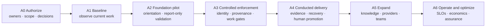

# AEGIS Adoption Roadmap

- **Business document:** 06 of 08
- **Status:** Derived draft for business review
- **Source baseline:** Architecture corpus as of 2026-09-14
- **Primary source:** Approved [`HATHOR-PLAN-001`](../architect/aegis-plan-001-platform-roadmap-20260913.md), supported by PLAN-002/003 and the draft Ticketing Economy pilot recommendation

## 1. Roadmap objective

Move from design to measurable, governed use without treating feature completion as operational readiness or business value.

The adoption strategy is:

> Establish foundations and baselines first, introduce controls in visible report-only or development profiles, prove recovery and negative paths, then expand enforcement, providers, environments, and teams only when measured value and control effectiveness justify the next step.

Report-only and pilot practices in this document are recommended adoption controls. They do not replace source roadmap milestones.

## 2. Source delivery sequence

The approved platform plan contains eight workstreams:

| Workstream | Scope |
|---|---|
| WS1 | CLI chassis, command contract, project layout, and schema orientation |
| WS2 | Continuous Validation System |
| WS3 | Orchestration Gateway and conducted runs |
| WS4 | Manifest, signing, local registry, and capability handshake |
| WS5 | Ticketing Plane, provider adapters, backup, and work gates |
| WS6 | Knowledge storage, retrieval, and promotion |
| WS7 | Control Tower, trust distribution, identity, ingest, and query |
| WS8 | Container classes, build gates, and deployment governance |

The source milestones are:

| Milestone | Source content | Business meaning |
|---|---|---|
| M-A Foundations | CLI/UPL plus initial change validation | A stable entry point and basic evidence foundation exist |
| M-B Enforcement | Assumptions, claims, gates, run log, and sequence control | The platform can begin proving and refusing work in bounded scope |
| M-C Identity & Registry | Signed manifests, local/Tower registry, trust distribution | Runnable automation and human/platform identity become governable |
| M-D Planes | Initial Ticketing and Knowledge capabilities | Authorized work and trusted knowledge become integrated authorities |
| M-E Conducted Delivery | Resume, reconciliation, graphs, Tower facets, human tokens | End-to-end evidence-backed delivery becomes possible |
| M-F Containers & Dogfood | Reference deployment units and strict self-use | The platform demonstrates its own governance model in operation |

## 3. Adoption overlay

### A0 — Authorize and prepare

**Objective:** Make the program governable before code or rollout expands.

**Required actions:**

- name executive sponsor, product owner, service owner, control owners, risk owner, and pilot owner;
- select pilot repositories, actors, provider, and development-only boundary;
- approve value hypotheses, baseline method, stop conditions, and risk appetite;
- confirm document authority and resolve contradictions with the repository README;
- create the authorizing epics and tickets;
- freeze module/repository ownership before publishing package interfaces;
- decide the identity-token profile and artifact-binding approach;
- assign retention, privacy, access, and state-cleanup ownership;
- decide four-eyes scope and emergency process; and
- approve the initial trust TTL and degradation policy.

**Exit evidence:**

- signed charter and scope;
- assigned RACI;
- approved risk register;
- measurement plan;
- source and interface decision log; and
- funded, ticket-authorized foundation backlog.

### A1 — Establish the baseline

**Objective:** Measure the current state without asserting enterprise-wide conclusions from the existing one-machine evidence.

**Baseline activities:**

- inventory representative human and agent workflows across the pilot;
- measure time and tokens to orient;
- measure ticket, epic, branch, PR, run, and deployment linkage;
- sample audit reconstruction effort;
- record direct provider and credential paths;
- measure validation duration, reruns, escaped defects, and manual evidence gathering;
- measure tracker outages, delayed work capture, and reconciliation effort;
- measure knowledge search success, staleness, duplication, and reviewer effort; and
- establish equivalent-task CLI, MCP, and hybrid comparisons where relevant.

**Exit evidence:**

- representative sample definition;
- reproducible baseline data;
- known data-quality limitations;
- initial target ranges approved by stakeholders; and
- no unsupported fleet, ROI, or modality-superiority claim.

### A2 — Foundation pilot

**Objective:** Introduce the common contract and observe controls before making them broadly blocking.

**Technical alignment:** M-A and early WS4.

**Pilot scope:**

- one bounded command surface and project layout;
- generated orientation guidance;
- common envelopes and schema introspection;
- initial diff and contract validation;
- local findings and initial change-validation records;
- manifest and governance validation;
- development-profile warnings or report-only findings;
- no production writes; and
- passive task, latency, retry, and token measurement where available.

**Change activities:**

- train pilot users on refusal remediation and authority boundaries;
- document current bypass needs as product gaps;
- review false positives weekly;
- compare pilot behavior with baseline;
- update interfaces before dependent implementation fans out; and
- avoid forcing teams to replace their existing tracker.

**Exit evidence:**

- stable CLI and schema contracts;
- bounded orientation and validation budgets;
- acceptable report accuracy;
- recoverable local records;
- no unassigned critical findings; and
- approved decision to introduce selective blocking.

### A3 — Controlled enforcement

**Objective:** Enforce low-ambiguity controls for the pilot while preserving a safe development boundary.

**Technical alignment:** M-B and M-C.

**Candidate enforcement order:**

1. contract and structural validation;
2. capability provenance and registration;
3. change, assumption, claim, and evidence controls;
4. sequence/barrier behavior for simple linear runs;
5. revocation and trust-expiry behavior; and
6. no waiver in an enforced profile until Tower-issued human identity is available.

**Required tests:**

- invalid contract and signature refusal;
- revoked capability receives no post-reconcile work;
- false completion and missing evidence refusal;
- out-of-order action refusal;
- process crash and lossless resume;
- trust TTL expiry;
- structured remediation supports legitimate recovery; and
- enforced profiles reject every waiver until Tower-issued human identity is available.

**Exit evidence:**

- control pass rates and false-refusal trend;
- artifact-binding decision implemented to the claimed assurance level;
- threat-boundary statement in user and stakeholder material;
- development-only exception paths remain visibly degraded and unavailable to enforced profiles;
- assigned incident and support path; and
- explicit approval for integrated work and knowledge pilots.

### A4 — Conducted delivery

**Objective:** Prove the complete accountability chain for a bounded development workflow.

**Technical alignment:** M-D and M-E.

**Scope:**

- one primary work provider first, consistent with the plan's Jira-first sequencing;
- minimal backup ticket service and authority-wins reconciliation;
- live ticket, epic-linkage, and change-binding gates;
- provider access through Operator;
- complete ticket, hierarchy, run, evidence, and outcome linkage;
- knowledge draft and human promotion;
- graph-based sequence and completeness reconciliation;
- short-lived Tower-issued human authority;
- deployment dry-run and refusal behavior; and
- Tower ingest and query.

**Recovery exercises:**

- provider outage, buffer, reconnect, and conflict;
- Operator interruption and idempotent replay;
- Tower outage and trust-expiry boundary;
- telemetry outage with authoritative ledger intact;
- concurrent or torn run-ledger write;
- missing required node at finalization;
- stale or disputed knowledge retrieval; and
- key or component revocation;
- PTY spoof, expired token, wrong-action token, and replayed human authority.

**Exit evidence:**

- sampled end-to-end audit reconstruction;
- no silent work loss or duplicate effect in tested scenarios;
- 100% human authorization for in-scope deployment and waiver;
- reconciliation backlog within approved TTL;
- acceptable user and operator effort; and
- business sponsor decision to continue, revise, or stop.

### A5 — Expand capabilities and adoption

**Objective:** Add breadth without weakening the proven control model.

**Potential sequence:**

- add the remaining supported work-provider adapters;
- add organization knowledge and curator operations;
- extend hierarchy from P0 roles to Strategy and Playbook;
- add complete observation metrics;
- introduce explicit complex graphs only after semantics and recovery are frozen;
- add container and build governance;
- expand from the AEGIS repository to the InfraAPI façade and one Communications workflow as planned; and
- onboard another team only after the first operating model is stable.

Each expansion repeats baseline, threat, recovery, user-friction, and value review for the new scope.

### A6 — Operate and optimize

**Objective:** Move from project delivery to a supported business service.

**Required capabilities:**

- service SLOs, capacity, backup, support, and incident management;
- access review and key lifecycle;
- control testing and audit evidence retention;
- policy and schema drift detection;
- cost and benefit reporting;
- waiver, degradation, and reconciliation governance;
- knowledge-quality calibration;
- release and deprecation management;
- documented business continuity; and
- periodic risk and value re-approval.

## 4. Interface-freeze decisions

Freeze before dependent teams or workstreams fan out:

- command and error contract;
- schema and bounded discovery contract;
- finding, claim, evidence, assumption, and run-ledger formats;
- Process and Proctor responsibility boundary;
- process graph and loop/attempt semantics;
- manifest, governance, executable-attestation, and signing format;
- Tower API and identity-token profile;
- Operator connection, session, idempotency, and receipt format;
- Ticket Contract and provider authority model;
- Knowledge record, threshold, and promotion contract; and
- telemetry versus authoritative-ledger responsibility.

Changing these after adoption begins creates migration cost and control ambiguity.

## 5. Pilot design

### Recommended pilot characteristics

- one team with engaged engineering and delivery leadership;
- one or two representative repositories;
- one primary tracker;
- development-only mutation;
- a small set of repeatable workflows;
- enough agent activity to produce meaningful evidence;
- known manual process and historical baseline;
- named knowledge reviewer and deployment operator;
- users willing to record friction and remediation effort; and
- no critical production dependency on immature capabilities.

### Pilot comparison

Compare baseline and pilot on:

- authorization and strategic-link coverage;
- time to orient;
- change lead time and waiting time;
- evidence completeness and audit reconstruction time;
- validation duration and false-refusal rate;
- rework and escaped-defect indicators;
- direct credential and provider-access paths;
- human approval coverage;
- outage work loss, buffer age, and conflicts;
- knowledge search and reuse;
- tokens, retries, and external calls per equivalent task; and
- user and operator effort.

### Pilot stop or redesign conditions

- routine bypass is required;
- identity or artifact trust does not withstand negative tests;
- legitimate work is frequently blocked without actionable remediation;
- authoritative records are lost or diverge;
- provider replay causes duplicate or silent effects;
- user and operator cost exceeds agreed bounds without offsetting value;
- measured outcomes do not improve;
- privacy or retention obligations cannot be met; or
- the implemented system requires claims stronger than its threat model.

## 6. Change-management workstream

Product delivery alone will not establish the operating model. Plan for:

- role and decision-right workshops;
- workflow and control mapping with pilot teams;
- short, generated agent and human orientation;
- refusal and recovery training;
- provider-owner and curator onboarding;
- support and escalation channels;
- communications that distinguish target, pilot, and operational capability;
- feedback on false positives, missing capabilities, and bypass pressure;
- transparent publication of control and value results; and
- retirement of legacy paths only after equivalent governed paths are proven.

## 7. Planning estimate

The approved source roadmap estimates:

- **2,370–3,080 base engineering hours**;
- approximately **20–26 weeks for two engineers, post-M0**; or
- approximately **12–16 weeks for four engineers, post-M0**, using the planned parallelization.

`Post-M0` means after the initial contracts and interfaces are frozen; it is not elapsed time from the current design state.

These are:

- planning-grade estimates;
- pre-governance base hours;
- not a fixed delivery commitment;
- not a commercial price;
- not evidence of a 50% productivity saving; and
- subject to re-baselining after M-A.

Add explicit effort for product management, security, control design, provider coordination, change management, support, documentation, audit, and pilot participation; those costs are not fully represented by engineering estimates.

## 8. Governance checkpoints

| Checkpoint | Decision |
|---|---|
| Charter approved | Proceed to baseline or revise scope |
| Baseline complete | Fund foundation pilot based on evidenced problem |
| Foundation verified | Introduce selected blocking controls or remain report-only |
| Identity and provenance verified | Permit human-only and trusted-capability tests |
| End-to-end pilot complete | Continue, redesign, or stop based on value and risk |
| Provider/team expansion proposed | Confirm prior outcomes persist and new risks are controlled |
| Operational readiness review | Accept service ownership and SLOs |
| Periodic value/risk review | Continue, reprioritize, constrain, or retire capabilities |

## 9. Roadmap dependencies and open decisions

Before their dependent phase, resolve:

- executable or image binding;
- human token claims and replay;
- authenticated gateway events;
- graph cycle and attempt semantics;
- local ledger versus telemetry authority;
- out-of-process effect verification;
- Operator persistence and high availability;
- knowledge confidence calibration;
- four-eyes scope;
- state retention and cleaner ownership;
- module/repository path;
- EKS-only versus alternate container hosting;
- cross-project local registry scope;
- Tower tenancy and storage;
- daemon timing;
- Class-2 provider catalog; and
- organization-specific service and control ownership.

## 10. Expansion rule

No phase advances merely because code exists. Advance when:

`design accepted + implementation authorized + tests passed + operating owner ready + users prepared + risks accepted + value evidenced`

