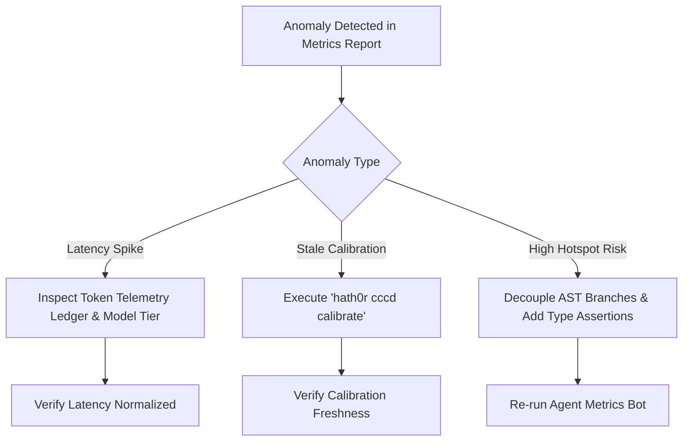

# Playbook: Agent Metrics Anomaly Diagnostic & Remediation

> Canonical Remediation Playbook · Hath0r Agentic Framework  
> Updated: 2026-10-05

## 1. Trigger Conditions

This playbook is activated when `AgentMetricsBot` reports any of the following metric anomalies:
- **Tail Latency Spike**: P90 latency $> 1000\text{ ms}$ or P99 latency $> 3000\text{ ms}$.
- **Stale Calibration**: Continuous Calibration (CCCD) status is `STALE (>24h)` or parameter drift metrics exceed thresholds.
- **High Hotspot Risk**: Any module scores Composite Hotspot Risk Index $R(f) \ge 0.75$.

---

## 2. Diagnostic & Remediation Protocol



### Protocol 1: Latency Spike Remediation
1. Inspect token telemetry log for model tier overload.
2. Route standard queries through `ComplexityTier.LIGHT` in `TieredRouter`.

### Protocol 2: Calibration Drift Remediation
1. Trigger parameter re-calibration via CLI:
   ```bash
   hath0r cccd calibrate
   ```
2. Verify `.hath0r/cccd_state.json` is updated and calibration freshness evaluates to `True`.

### Protocol 3: Code Hotspot Remediation
1. Refactor modules flagged with `CRITICAL` or `HIGH` risk tiers.
2. Increase formal provability $P(f)$ above $0.80$ by adding explicit type annotations and AST invariant assertions.
