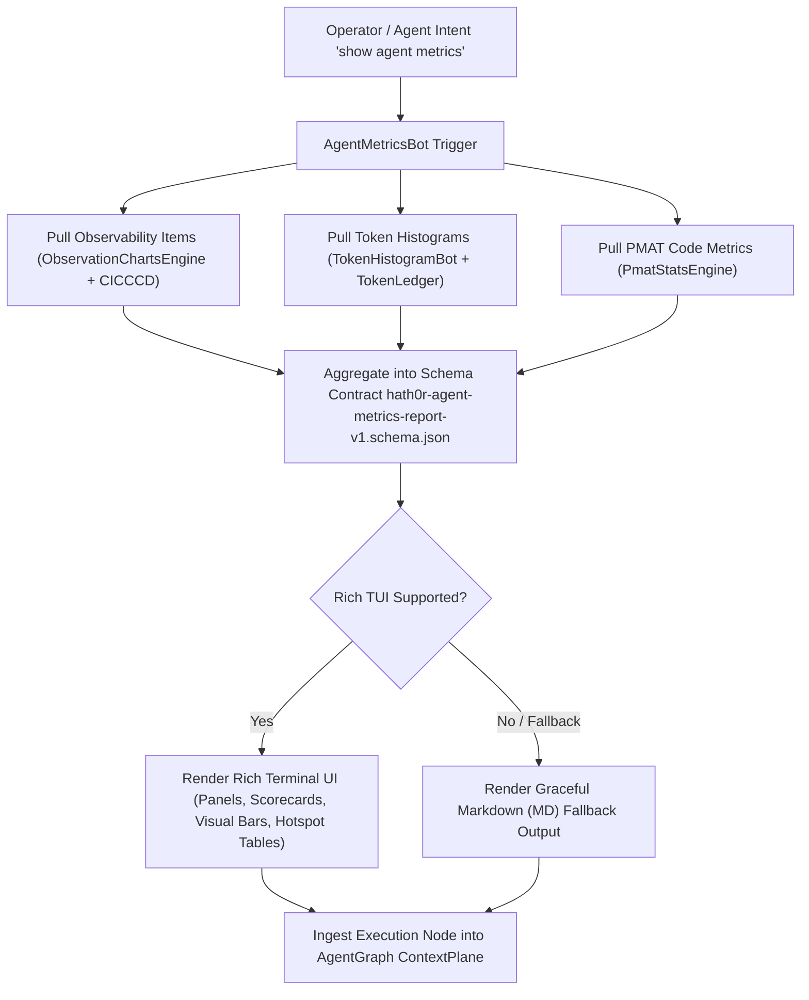

# Strategy: Agent Metrics Aggregation & Dual-Mode UI Reporting

> Canonical Strategy Specification · Hath0r Agentic Framework  
> Updated: 2026-10-05

## 1. Executive Summary & Core Objectives

Autonomous agent fleets require real-time observability, statistical telemetry, and code health analysis to maintain high reliability and cost control. The **Agent Metrics Aggregation & Dual-Mode UI Reporting Strategy** unifies three critical operational vectors into a single automated intelligence pipeline:

1. **Observability Items**: Response latencies (P50, P90, P95, P99 quantiles), total requests, token counts, inference cost (USD), and Continuous Integration, Calibration & Deployment (CICCCD) parameter drift metrics.
2. **Token Telemetry Histograms**: Statistical distributions, mean/median/percentile breakdowns, and user/model allocation across request intervals.
3. **PMAT Multi-Dimensional Code Metrics**: Polyglot code churn volatility, AST complexity, formal provability scores, and Composite Hotspot Risk Indices ($R$).

---

## 2. Architecture & Dual-Mode UI Standards

1. **Terminal UI (TUI) Primary**: Rendered via `rich` library with styled panels, scorecards, colored quantiles, visual distribution bars, and formatted hotspot tables.
2. **Markdown (MD) Fallback**: Graceful, robust Markdown formatting when stdout is redirected, non-interactive, or when `rich` is unavailable.
3. **Zero-Prompt-Tax Integration**: Metric executions are ingested into `AgentGraph` (`ContextPlane`) to provide immediate context awareness without expanding LLM prompt overhead.

---

## 3. Compliance & Governance

All reports must validate against `contracts/hath0r-agent-metrics-report-v1.schema.json` and comply with CR-CLI-ENTRY-001, CR-AGENTGRAPH-001, and CR-SUBSTRATE-001.
