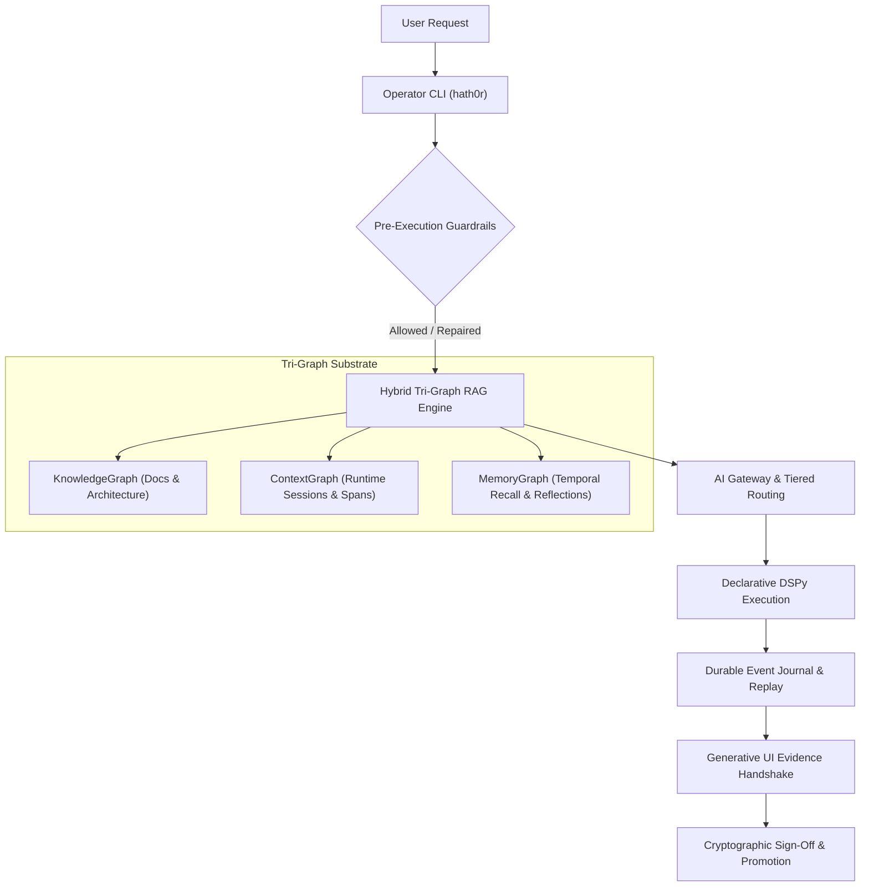

# Agent Rules, RAG Strategy & CLI-First Knowledge Architecture

> **Status:** Ratified Architectural Specification  
> **Parent Issue:** Bayly-AI/HATH0R-Agentic-Framework#142  
> **Governing Standards:** `CR-CLI-ENTRY-001`, `cr-kb-tower-001`, `cr-branch-gov-001`, `CR-BAI-001`

---

## 1. Executive Summary

As the Hath0r cognitive substrate expands, agents must adhere to strict operational boundaries that eliminate hallucinations, prevent context window pollution, and ensure predictable tool execution. 

This strategy establishes the **Unified Agent RAG & CLI-First Knowledge Doctrine**:
1. **CLI as Sole Operating Gate:** All agent activities (starting tasks, memory queries, schema validations, preflights, and docs publication) MUST execute through the `hath0r` Operator CLI.
2. **Tri-Graph Hybrid RAG Retrieval:** Flat context stuffing is deprecated. Agents must query information through hybrid BM25 + dense vector indexing across the **Tri-Graph Substrate** (`KnowledgeGraph`, `ContextGraph`, `MemoryGraph`) with temporal validity filtering.
3. **End-to-End Runtime Substrate Leverage:** Agents must actively use the core engine components:
   - **Pre-Execution Guardrails:** Static AST, SQL mutation, and bash syntax checks (`SyntaxGuardrail`) with automated parameter schema repair (`SchemaRepairEngine`).
   - **Dynamic Tool Routing & Schema Pruning:** Hybrid tool selection (`DynamicToolRouter`) and aggressive schema pruning (`SchemaPruner`).
   - **Tiered Multi-Provider AI Gateway:** Tiered model routing (`LIGHT`, `STANDARD`, `REASONING`) with semantic response caching (`SemanticCache`).
   - **Durable Orchestration & Hibernation:** Replayable workflows (`DurableWorkflowEngine`) with zero-compute human hibernation gates (`HumanHibernationGate`).
   - **Declarative DSPy Pipelines:** Typed signatures (`Signature`), programmatic schema assertions (`Assert`), and teleprompter few-shot optimization (`BootstrapFewShotCompiler`).
   - **Generative UI Evidence Handshakes:** Streaming interactive visual diffs, parameter sliders, test badges, and cryptographic HMAC SHA-256 sign-offs (`HandshakeSession`, `UIComponentBuilder`).
   - **Zero-Trust Sandboxing:** Ephemeral micro-VMs (`E2BSandboxProvider`, `DaytonaSandboxProvider`) with zero-trust egress policies.

