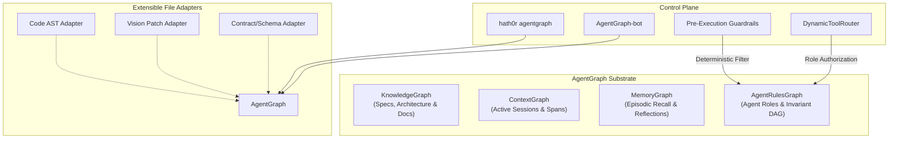

# AgentGraph Engine: Unified Cognitive Substrate & Methodology Strategy

> **Status:** Ratified Strategy Specification  
> **Parent Issue:** Bayly-AI/HATH0R-Agentic-Framework#170  
> **Governing ADR:** HATHOR-ADR-009 (`docs/architect/hathor-adr-009-agentgraph-unified-quad-graph-architecture-20261002.md`)  
> **Governing Standards:** `CR-CLI-ENTRY-001`, `CR-RAG-RETRIEVAL-001`, `CR-SUBSTRATE-001`, `cr-branch-gov-001`

---

## 1. Executive Summary

As Hath0r scales across multi-agent workflows, autonomous micro-bots, and diverse enterprise repositories, governance cannot rely on probabilistic prompt stuffing or disparate graph stores.

This strategy ratifies the **AgentGraph Methodology & Cognitive Substrate**:
1. **The Quad-Graph Unified Substrate:** Unifies four operational planes—**KnowledgeGraph**, **ContextGraph**, **MemoryGraph**, and **AgentRulesGraph**—under a streamlined, high-performance engine (`hath0r_engine.graph.AgentGraphEngine`).
2. **Deterministic Governance & Tool RBAC:** Replaces probabilistic rule retrieval with a deterministic rule inheritance Directed Acyclic Graph (DAG) and agent role authorization gating.
3. **Extensible Multi-Modality Topology:** Provides open adapter abstractions to ingest code ASTs, visual assets (ADR-008), JSON schemas, and arbitrary project files.
4. **Autonomous Management with AgentGraph-bot:** Deploys an automated bot custodian to synchronize rules, invalidate expired temporal intervals, resolve circular dependencies, and audit cross-repository compliance.
5. **Universal CLI-First Control Plane:** Standardizes all graph operations behind the `hath0r agentgraph` command suite.



---

## 2. Theoretical Methodology & Formal Graph Model

The complete AgentGraph is formally defined as a tuple:
$$\mathcal{G}_{\text{agent}} = \left( \mathcal{V}_K \cup \mathcal{V}_C \cup \mathcal{V}_M \cup \mathcal{V}_R, \; \mathcal{E}_K \cup \mathcal{E}_C \cup \mathcal{E}_M \cup \mathcal{E}_R \cup \mathcal{E}_{X} \right)$$

Where:
- $\mathcal{V}_K, \mathcal{E}_K$: Knowledge plane (documents, contracts, procedures).
- $\mathcal{V}_C, \mathcal{E}_C$: Context plane (session tokens, running subagents, tool spans).
- $\mathcal{V}_M, \mathcal{E}_M$: Memory plane (long-term facts, reflections, episodic nodes).
- $\mathcal{V}_R, \mathcal{E}_R$: Rules plane (agent roles, policies, invariants, tool capabilities).
- $\mathcal{E}_X$: Inter-plane bridges connecting dynamic sessions to static roles, episodic learnings to rules, and docs to implementations.

### 2.1. Deterministic Rule Invariant Inheritance

Let $\mathcal{R}$ be the set of rules and $\mathcal{A}$ be the set of agent roles. Each rule node $r \in \mathcal{R}$ has a priority tier:
$$\text{tier}(r) \in \{ \text{ORG\_INVARIANT} = 4, \;\; \text{REPO\_STANDARD} = 3, \;\; \text{SUBSYSTEM\_RULE} = 2, \;\; \text{ROLE\_GUIDELINE} = 1 \}$$

When an agent with role $a \in \mathcal{A}$ executes a task in target scope $s$:
1. **Ancestry Closure:**
   $$\mathcal{R}_{\text{closure}}(a, s) = \{ r \in \mathcal{R} \mid (r \xrightarrow{\text{INHERITS\_FROM}^*} a) \lor (r \xrightarrow{\text{GOVERNS}} s) \}$$
2. **Conflict Invariant:** If two active rules $r_1, r_2 \in \mathcal{R}_{\text{closure}}$ prescribe opposing constraints on action $T$, the rule with $\max(\text{tier}(r_1), \text{tier}(r_2))$ overrides. If $\text{tier}(r_1) = \text{tier}(r_2)$, the graph engine flags a `RuleConflictException` requiring human or operator resolution.
3. **Temporal Validity Filtering:**
   An edge $e$ or node $v$ is valid at time $t$ if and only if:
   $$\text{is\_valid}(x, t) = (x.\text{valid\_from} \le t) \land (x.\text{valid\_to} \text{ is null} \lor x.\text{valid\_to} > t) \land (x.\text{is\_current} = \text{true})$$

---

## 3. Component Architecture

### 3.1. Unified AgentGraph Engine (`AgentGraphEngine`)
Located at `src/hath0r_engine/graph/agent_graph.py`, this engine aggregates the 4 subgraphs while presenting a streamlined single API:
- `add_node(node)` / `get_node(id)`
- `add_edge(edge)` / `get_edges(source, target)`
- `query_hybrid(query, planes=[...], as_of=None)`: Okapi BM25 lexical search combined with normalized dense vector similarity.
- `resolve_agent_constraints(role_id, scope)`: Deterministic extraction of active rules, forbidden operations, and authorized tool IDs.
- `export_snapshot()` / `import_snapshot()`: JSON / SQLite transactional roundtrip persistence.

### 3.2. Extensible File & Modality Adapters
To allow scaling across different project artifacts without altering graph core logic:
- **`BaseGraphAdapter`**: Standardized interface (`extract_nodes(path) -> List[Node]`, `extract_edges(path) -> List[Edge]`).
- **`ASTCodeAdapter`**: Extracts function/class signatures, calls, and imports as graph relationships.
- **`MarkdownDocAdapter`**: Extracts YAML frontmatter, headers, cross-references, and rules.
- **`VisionPatchAdapter`**: Links 2D patch embeddings (ADR-008) to UI test cases and documentation diagrams.

### 3.3. Dynamic Tool Authorization & RBAC
Before any LLM prompt is assembled:
1. `DynamicToolRouter` requests permitted tools from `AgentGraphEngine.get_authorized_tools(agent_role)`.
2. Any tool not linked via `AUTHORIZES_TOOL` is pruned prior to model exposure.
3. `SyntaxGuardrail` validates incoming shell and code AST commands against active rule constraints, guaranteeing zero-trust enforcement.

---

## 4. Operational Playbook & AgentGraph-bot

### 4.1. Autonomous Bot Responsibilities
`AgentGraph-bot` serves as the proactive maintainer of the graph:
1. **Repository Synchronization:** Scans `AGENTS.md`, contracts, and subsystem guidelines, updating the persistent graph with zero manual intervention.
2. **Cycle & Contradiction Auditing:** Runs Tarjan's strongly connected components algorithm on `INHERITS_FROM` and `SUPERSEDES` edges to catch loops.
3. **Bitemporal Maintenance:** Automatically sets `valid_to = now()` and `is_current = false` on superseded rules during release promotions.
4. **Clean-Repo Integration:** In Step 7 of the Clean-Repo SOP, the bot executes an audit, refusing PR creation if the graph has unverified rule violations.

### 4.2. Operator CLI Usage (`hath0r agentgraph`)
```bash
# Check status and node distribution across the 4 planes
hath0r agentgraph status

# Ingest and synchronize the current repository into the graph
hath0r agentgraph sync

# Validate rule consistency, cycles, and role bindings
hath0r agentgraph validate

# Query authorized tools and active rules for a role
hath0r agentgraph route --role "engine_coder" --task "refactor_database"

# Hybrid BM25 + dense vector search across planes
hath0r agentgraph query --query "promotion path policy"
```

---

## 5. Multi-Repo Rollout Plan (`~/Development`)

To align all active suites across `~/Development`:
1. **Phase 1 (Core Substrate):** Ratify ADR-009, implement `AgentRulesGraph` and `AgentGraphEngine` in `hath0r-framework`, and define schema contracts.
2. **Phase 2 (CLI & Bot):** Implement `hath0r agentgraph` CLI command group and `AgentGraph-bot` in `HATH0R-CLI`.
3. **Phase 3 (Suite Migration):** Deploy the automated migration tool to parse `AGENTS.md` and rule files across OpenSource, BAI, 1-Nation, and Ray workspaces, registering each repository into the unified AgentGraph format.
