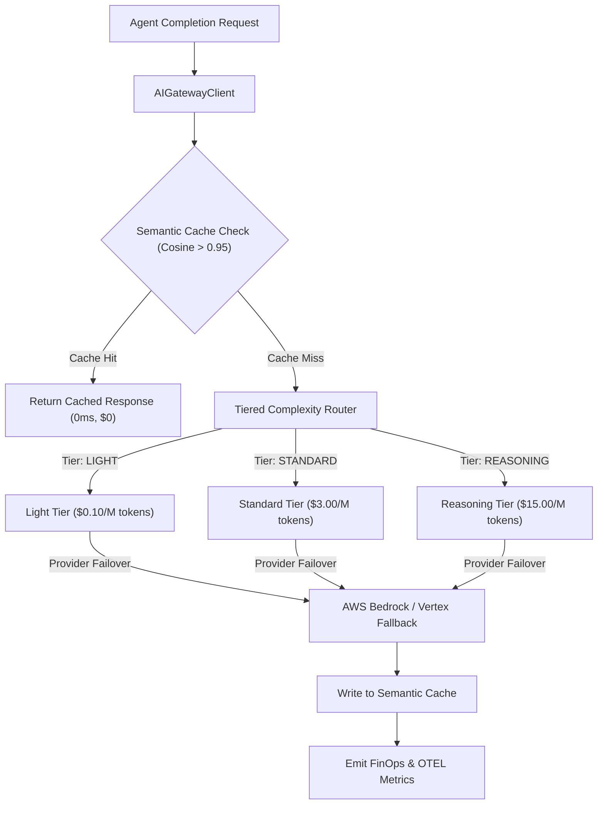

# Multi-Provider AI Gateway & Tiered Routing Strategy

> **Status:** Ratified Architectural Specification  
> **Parent Issue:** Bayly-AI/HATH0R-Agentic-Framework#130  
> **Governing Standards:** `cr-cli-first-001`, `cr-kb-tower-001`, `cr-branch-gov-001`

---

## 1. Executive Summary

Autonomous agent fleets execute thousands of model completions per hour across diverse task classes: simple schema extraction, entity matching, tool routing, code refactoring, and multi-step reasoning. Hardcoding individual model provider SDKs introduces vendor lock-in, unmitigated provider outages, and unchecked token costs.

This strategy establishes a **Unified AI Gateway Adapter Subsystem (`hath0r_engine.gateway`)**:
1. **Unified Gateway Architecture:** Native support for reverse proxies (Portkey and LiteLLM) and direct model providers (Anthropic, OpenAI, AWS Bedrock, Google Vertex, Ollama).
2. **Tiered Complexity Routing:** Dynamically routes prompts to cost-appropriate model tiers (`LIGHT`, `STANDARD`, `REASONING`) based on task complexity metadata.
3. **Multi-Provider Failover:** Graceful automated fallback chains (e.g., Anthropic -> AWS Bedrock -> Google Vertex -> Local Ollama/Mock).
4. **Semantic Prompt Caching:** Evaluates prompt semantic similarity with cosine vector indexing to return cached completions for repetitive validation and reflection loops, cutting token spend by 30–50%.
5. **FinOps & Telemetry Integration:** Emits virtual key quotas, exact token footprints, cost estimations in USD, and latency metrics into Hath0r OpenTelemetry traces and doctor diagnostics.

---

## 2. Complexity Tiers & Model Mappings

| Complexity Tier | Primary Model | Typical Use Cases | Cost / 1M Tokens (Est.) |
| :--- | :--- | :--- | :--- |
| **`LIGHT`** | `claude-3-5-haiku` / `gpt-4o-mini` / `gemini-1.5-flash` | Schema parsing, triage, entity extraction, intent classification | ~\$0.10 - \$0.80 |
| **`STANDARD`** | `claude-3-5-sonnet` / `gpt-4o` | Tool calling, code writing, iterative refactoring | ~\$3.00 - \$15.00 |
| **`REASONING`** | `o3-mini` / `deepseek-r1` / `claude-3-opus` | Architectural synthesis, complex multi-graph analysis, formal verification | ~\$15.00 - \$60.00 |
