# Continuous Integration, Continuous Calibration & Continuous Deployment (CICCCD) Strategy

> **Status:** Ratified Strategy Specification  
> **Parent Standard:** `CR-CICCCD-001`  
> **Governing ADRs:** `HATHOR-ADR-009` (AgentGraph Engine), `HATHOR-ADR-004` (Cognitive Substrate)  
> **Governing Standards:** `CR-CLI-ENTRY-001`, `CR-SUBSTRATE-001`, `CR-BAI-001`, `cr-branch-gov-001`

---

## 1. Executive Summary

Traditional software delivery relies on **Continuous Integration and Continuous Deployment (CI/CD)**. CI/CD assumes a deterministic execution model where verified source code and passing unit tests guarantee stable production runtime behavior:

$$\text{Code State } S_0 \xrightarrow{\text{CI/CD}} \text{Production Runtime } R_0 \quad (\text{Deterministic } R_0 \equiv S_0)$$

In enterprise agentic architectures and non-deterministic cognitive substrates (LLMs, dynamic retrieval graphs, autonomous subagent chains), this assumption breaks down. Even when zero code changes occur, production runtime behavior drifts due to model updates, retrieval index shifts, context bloat, and prompt decay.

The **CICCCD (Continuous Integration, Continuous Calibration, Continuous Deployment)** methodology expands traditional CI/CD into a three-pillar closed-loop lifecycle specifically engineered for autonomous AI systems.

```mermaid
flowchart LR
    subgraph CI["1. Continuous Integration (CI)"]
        Contracts["Schema & Contract Validation"]
        AgentGraph["AgentGraph Policy Audits"]
        UnitTests["Deterministic Unit & AST Tests"]
    end

    subgraph CC["2. Continuous Calibration (CC)"]
        Telemetry["Span Metrics & Telemetry Hook"]
        Drift["Parameter & Drift Detection"]
        Tuning["Dynamic Parameter Coercion (< 24h SLA)"]
    end

    subgraph CD["3. Continuous Deployment (CD)"]
        Promotion["Promotion Path (Dev -> Test -> Staging -> Prod)"]
        AutoTune["Background Auto-Tune & FinOps"]
        Hexad["Living Artifact Hexad Synchronization"]
    end

    CI --> CC
    CC --> CD
    CD -.->|"Telemetry Feedback Loop"| CI
```



---

## 2. The Three Pillars of CICCCD

### 2.1. Continuous Integration (CI) — Deterministic Policy & Schema Defense
Continuous Integration in an agentic framework ensures that all structural, programmatic, and declarative components pass strict gate checks prior to merging or execution:

1. **Schema & Interface Contracts:** All inputs, outputs, Generative UI payloads, and subagent communication interfaces are validated against JSON Schema / Protobuf specifications via `hath0r contracts validate`.
2. **Deterministic AgentGraph Policy Checks:** Rule inheritance DAGs, tool RBAC assignments, and authorization boundaries are validated via `hath0r agentgraph validate`.
3. **AST & Syntax Guardrails:** Code ASTs, SQL generation templates, and execution commands undergo pre-flight syntax checks (`SyntaxGuardrail`) and unit test suites.

### 2.2. Continuous Calibration (CC) — Runtime Telemetry & Parameter Drift Governance
Continuous Calibration introduces real-time measurement and runtime parameter correction:

1. **Parameter Drift Telemetry:** The runtime substrate records telemetry via `CICCCDTelemetryHook` (`src/hath0r_engine/telemetry/cicccd_telemetry.py`), measuring:
   - **Accuracy Drift ($\Delta_{\text{acc}}$):** Degradation against golden benchmark tasks.
   - **Latency Drift ($\Delta_{\text{lat}}$):** Execution latency per model inference and tool span.
   - **Token Tax Drift ($\Delta_{\text{tok}}$):** Retrieval token growth and context inflation.
2. **Freshness SLA ($\le 24.0\text{ hours}$):** Calibration state is stored in `.hath0r/cccd_state.json`. If telemetry age exceeds 24.0 hours, systems flag a stale calibration alert or trigger on-demand recalibration.
3. **Dynamic Parameter Coercion:** Temperature, Top-P, token budgets, and guardrail confidence thresholds are dynamically adjusted without requiring full binary redeployments.

### 2.3. Continuous Deployment (CD) — Promotion Validation & Closed-Loop Delivery
Continuous Deployment ensures safe, stage-gated delivery and automated operational synchronization:

1. **Strict Promotion Path Governance (`CR-BAI-001`):** PRs and deployments must follow the unbroken promotional progression:
   $$\text{local} \longrightarrow \text{development} \longrightarrow \text{testing} \longrightarrow \text{staging} \longrightarrow \text{master (Production)}$$
2. **Living Artifact Hexad Synchronization:** Every deployed feature must maintain complete, synchronized documentation across the six canonical artifacts:
   - Strategy (`docs/governance/strategies/`)
   - Procedure (`docs/governance/procedures/`)
   - Playbook (`docs/governance/playbooks/`)
   - Runbook (`docs/governance/runbooks/`)
   - Workflow (`.github/workflows/` or `.agents/skills/`)
   - Bot Specification (`src/hath0r_engine/`)
3. **Background Auto-Tuning & FinOps:** Deployed agents continuously monitor operational telemetry via `hath0r cicccd auto-tune` to optimize cost-per-task, prune stale context nodes, and maintain optimal model tiering.

---

## 3. Substrate Telemetry Architecture

The core calibration telemetry state is managed by `CICCCDTelemetryHook`:

```python
from hath0r_engine.telemetry import CICCCDTelemetryHook

hook = CICCCDTelemetryHook()
metrics = hook.get_calibration_metrics()

# Check if calibration meets the <= 24h freshness requirement
if not hook.is_calibration_fresh(max_age_hours=24.0):
    # Trigger calibration routine
    hook.record_calibration_telemetry(
        signature_name="agent_reasoning_v1",
        drift_metrics={"accuracy_drift": 0.002, "latency_drift_ms": 1.4, "token_tax_drift": 0.01},
        calibrated_params={"temperature": 0.2, "max_tokens": 2048, "guardrail_threshold": 0.88},
    )
```

---

## 4. Control Plane CLI Operations

All CICCCD operations are exposed through the operator CLI:

| Command | Action | Primary Stage |
| :--- | :--- | :--- |
| `hath0r contracts validate` | Validates all schema definitions and JSON schemas | Continuous Integration |
| `hath0r agentgraph validate` | Audits policy inheritance and tool access rules | Continuous Integration |
| `hath0r cicccd calibrate` | Computes runtime drift and recalibrates parameters | Continuous Calibration |
| `hath0r cicccd validate` | Verifies calibration freshness and drift compliance | Continuous Calibration |
| `hath0r cicccd auto-tune` | Runs background optimization for prompt and routing tokens | Continuous Deployment |
| `hath0r branch validate` | Ensures promotion path and branch naming compliance | Continuous Deployment |

---

## 5. Summary & Enterprise Governance Impact

| Capability | Traditional CI/CD | CICCCD Paradigm |
| :--- | :--- | :--- |
| **Verification Scope** | Static code and deterministic unit tests | Dynamic schema contracts, AgentGraph policies, and behavioral guardrails |
| **Runtime Governance** | Static configuration files | Continuous telemetry recording with 24h calibration freshness SLAs |
| **Delivery Target** | Code binaries and infrastructure configs | Code, calibrated parameter state, living Artifact Hexads, and promotion gates |
