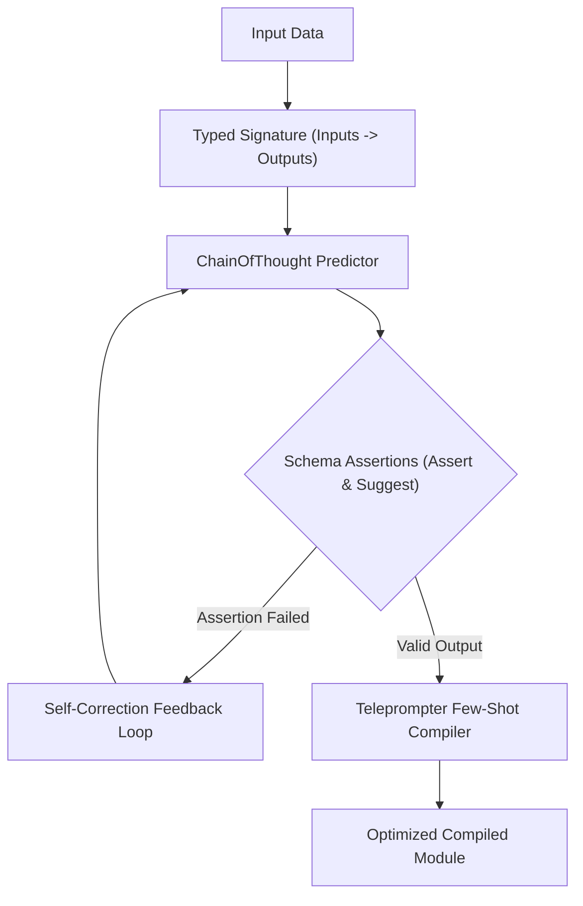

# Declarative Agent Pipelines & DSPy Module Compilation Strategy

> **Status:** Ratified Architectural Specification  
> **Parent Issue:** Bayly-AI/HATH0R-Agentic-Framework#131  
> **Governing Standards:** `cr-cli-first-001`, `cr-kb-tower-001`, `cr-branch-gov-001`

---

## 1. Executive Summary

Prompt engineering by hand creates brittle agent pipelines that fail silently on model parameter updates and cannot be mathematically optimized. Treating agent reasoning as **declarative, typed software programs** (DSPy paradigm) aligns directly with Hath0r's *"TDD as a Design Discipline"* doctrine.

This strategy establishes the **Declarative Agent Pipeline Subsystem (`hath0r_engine.pipeline`)**:
1. **Typed Signatures:** Replaces monolithic system prompts with explicit `Signature(Inputs -> Outputs)` contracts with field descriptions and schema constraints.
2. **Programmatic Assertions (`Assert` & `Suggest`):** Enforces contract invariants and schema constraints with automated self-correction feedback retry loops.
3. **Teleprompter Optimization:** `BootstrapFewShotCompiler` automatically synthesizes verified input-reasoning-output demonstrations to maximize validation scores.
4. **Deterministic Invariant Validation:** Replaces ad-hoc string regexes with JSON Schema assertions.

