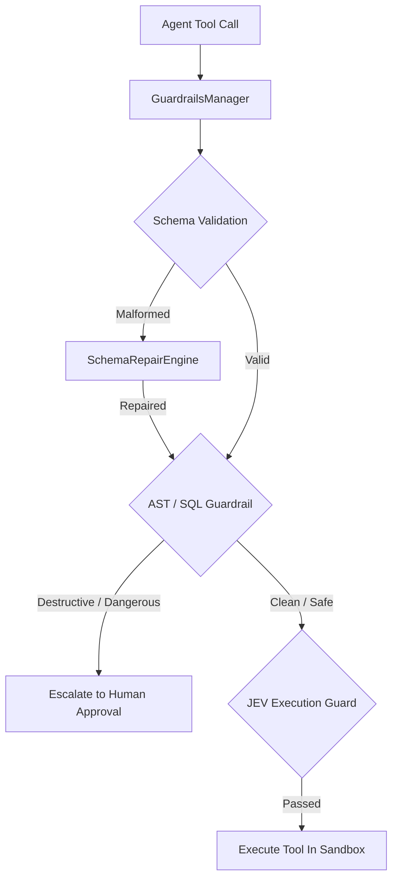

# Deterministic Pre-Execution Tool Guardrails Strategy

> **Status:** Ratified Architectural Specification  
> **Parent Issue:** Bayly-AI/HATH0R-Agentic-Framework#132  
> **Governing Standards:** `cr-cli-first-001`, `cr-kb-tower-001`, `cr-branch-gov-001`

---

## 1. Executive Summary

Prompt-based safety instructions in system prompts cannot guarantee protection against prompt injection, destructive shell execution, or corrupted tool parameter payloads. Production multi-agent swarms require deterministic, programmatic boundary defenses before any tool is executed.

This strategy establishes the **Deterministic Pre-Execution Tool Guardrails Subsystem (`hath0r_engine.guardrails`)**:
1. **Pre-Execution Interceptor Pipeline:** Intercepts every tool invocation before payload dispatch, enforcing safety invariants.
2. **Deterministic AST & SQL Validation:** Evaluates code and SQL queries against static AST security rules (blocking destructive operations like `DROP DATABASE`, unconstrained `DELETE`, shell escapes, and unauthorized subprocess spawning).
3. **Pydantic Schema Repair Engine:** Automatically repairs common parameter typing errors (stringified numbers, boolean coercion, missing required defaults) in-flight.
4. **Human Escalation Audit Hook:** Escalates high-risk or destructive actions into the Hath0r human approval gate rather than crashing silently.

