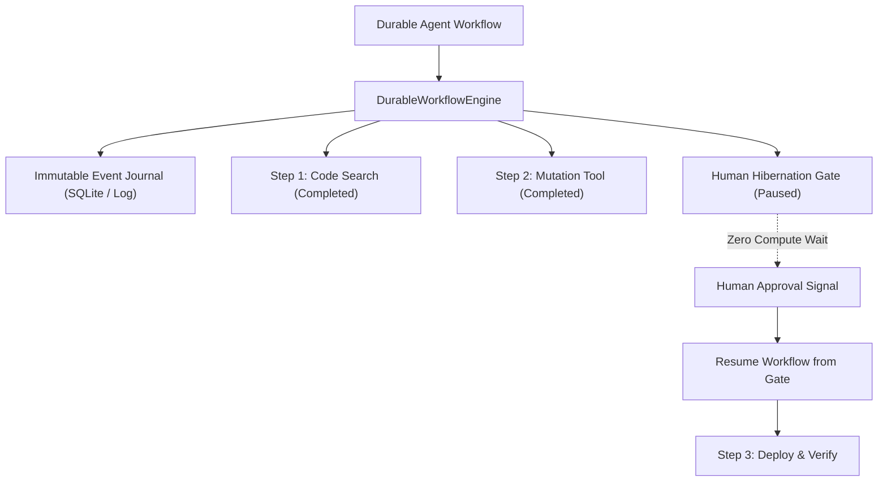

# Durable Execution & Event-Sourced Checkpointing Strategy

> **Status:** Ratified Architectural Specification  
> **Parent Issue:** Bayly-AI/HATH0R-Agentic-Framework#129  
> **Governing Standards:** `cr-cli-first-001`, `cr-kb-tower-001`, `cr-branch-gov-001`

---

## 1. Executive Summary

Long-running agentic workflows (e.g., 45-minute code refactorings, multi-repo migration runs, and asynchronous human authorization loops) are vulnerable to process interruptions, worker crashes, network timeouts, and model rate limits (HTTP 429). Pure in-memory Python loops lose their entire execution state upon termination.

This strategy establishes a **Durable Execution & Event-Sourced Checkpointing Subsystem (`hath0r_engine.orchestration`)** inspired by Temporal and Restate architectures:
1. **Immutable Event Journal:** Every step initiation, model completion, tool execution output, and state mutation is appended as an immutable journal entry.
2. **Deterministic Event Replay:** On recovery or restart, the workflow engine replays the event log, restoring state instantly while skipping already executed deterministic side effects (memoization).
3. **Human Hibernation Gate:** Allows workflows to yield execution and hibernate indefinitely until an external human approval signal is dispatched, consuming zero CPU cycles while waiting.
4. **Idempotency & Deduplication:** Ensures side-effecting operations (e.g. git commits, PR creation, shell commands) are executed strictly once per idempotency key.

---

## 2. Key Components

### 2.1 Event Journal (`src/hath0r_engine/orchestration/journal.py`)
- `EventRecord`: Stores `workflow_id`, `seq_num`, `event_type`, `idempotency_key`, `payload`, `timestamp`.
- `JournalStore`: Backed by SQLite table `workflow_events` or append-only log with deterministic replay queries.

### 2.2 Event-Sourced State Machine (`src/hath0r_engine/orchestration/state_machine.py`)
- `DurableWorkflowEngine`:
  - Tracks `WorkflowState` (`status`: `RUNNING`, `SUSPENDED`, `COMPLETED`, `FAILED`).
  - `run_step(step_name, func, *args, **kwargs)`: Replays cached result if previously recorded; otherwise executes, records journal entry, and returns.

### 2.3 Human Hibernation Gate (`src/hath0r_engine/orchestration/hibernation.py`)
- `HumanHibernationGate`:
  - `pause_for_human(gate_name, prompt, required_role)`: Suspends execution and emits `HUMAN_PAUSED` event.
  - `signal_approval(workflow_id, gate_name, approved, payload)`: Unblocks the gate and resumes execution.
