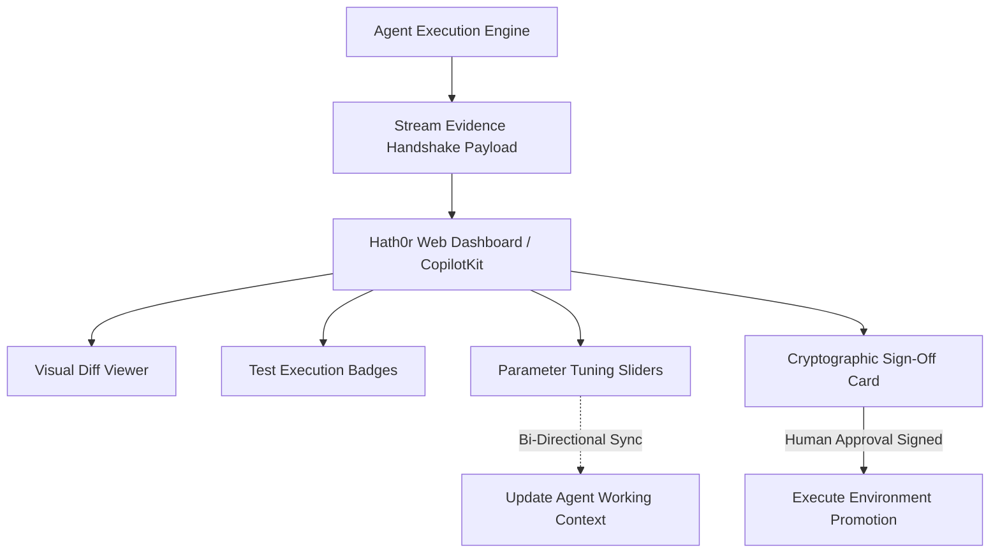

# Generative UI & Evidence Handshake Protocol Strategy

> **Status:** Ratified Architectural Specification  
> **Parent Issue:** Bayly-AI/HATH0R-Agentic-Framework#133  
> **Governing Standards:** `cr-cli-first-001`, `cr-kb-tower-001`, `cr-branch-gov-001`

---

## 1. Executive Summary

To fulfill Hath0r's core thesis of *"Authority Remains Human"*, human reviewers need rich, interactive, structured visual evidence when inspecting agent actions (e.g., refactorings, database migrations, configuration changes). Raw markdown text logs do not provide safe interaction boundaries.

This strategy establishes the **Generative UI & Evidence Handshake Protocol Subsystem (`hath0r_engine.ui`)**:
1. **Evidence Handshake Protocol:** Standardized JSON payload exchange for streaming dynamic UI widgets (diff viewers, parameter sliders, test badges, and sign-off cards) to web dashboards.
2. **Bi-Directional State Synchronization:** Human slider/parameter updates on the dashboard stream directly back into the agent's active memory and context graph.
3. **Cryptographic Sign-Off & Promotion Verification:** Generates immutable SHA-256 signatures for human release authorizations satisfying compliance and auditability standards.

