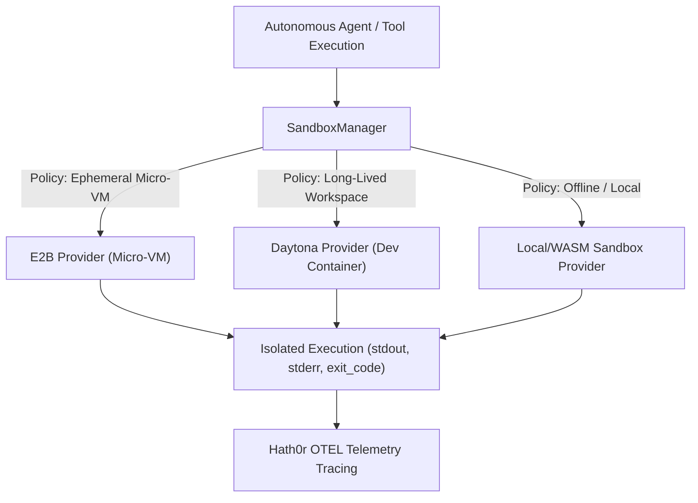

# Zero-Trust Isolated Compute Provider Strategy

> **Status:** Ratified Architectural Specification  
> **Parent Issue:** Bayly-AI/HATH0R-Agentic-Framework#128  
> **Governing Standards:** `cr-cli-first-001`, `cr-kb-tower-001`, `cr-branch-gov-001`

---

## 1. Executive Summary

Autonomous coding and analysis agents routinely generate and execute untrusted code (Python scripts, shell commands, test runs, and dependency installation). Executing untrusted code in shared host environments risks container breakouts, environment corruption, and credential exfiltration.

This strategy establishes a **Zero-Trust Isolated Compute Provider Subsystem (`hath0r_engine.sandbox`)** supporting multiple isolated execution backends:
1. **E2B Micro-VM Provider:** Sub-200ms ephemeral Linux micro-virtual machines (Firecracker-based) with strict network egress filtering and copy-on-write snapshots.
2. **Daytona Dev Container Provider:** Long-lived, persistent cloud development environment containers for complex multi-step refactoring workflows.
3. **Local / WASM Isolated Fallback Provider:** Lightweight offline zero-trust fallback execution engine.
4. **Hath0r OTEL Tracing Integration:** Emits sandbox lifecycle events, CPU/memory resource utilization, command exit codes, and network egress telemetry into Hath0r OpenTelemetry traces.

---

## 2. Architecture & Lifecycle Contract

All providers implement `SandboxProvider`:
- `start(config: SandboxConfig) -> str`: Launches or provisions sandbox instance.
- `exec(command: str, timeout: Optional[float], env: Optional[Dict[str, str]], cwd: Optional[str]) -> ExecutionResult`: Executes arbitrary command within isolated container.
- `read_file(path: str) -> bytes`: Reads file content from sandbox filesystem.
- `write_file(path: str, data: bytes) -> None`: Injects file into sandbox filesystem.
- `sync_files(source_dir: str, target_dir: str) -> int`: Bi-directional synchronization between local host and sandbox.
- `snapshot(label: str) -> str`: Captures copy-on-write snapshot ID for rewind or branching.
- `terminate() -> None`: Shuts down and purges compute resources.
