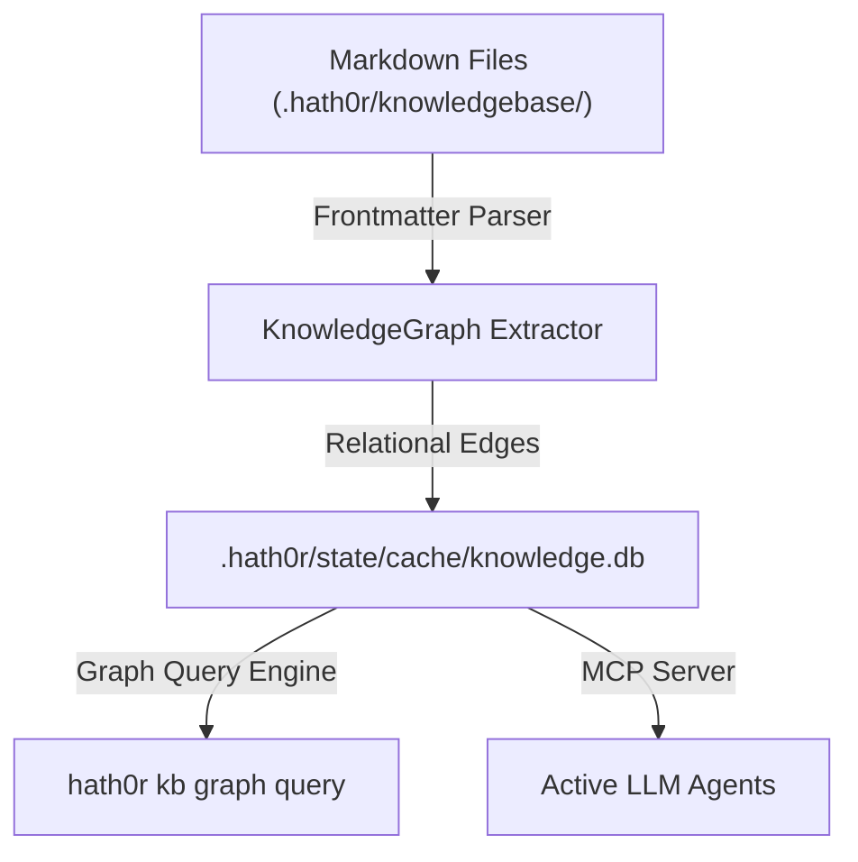
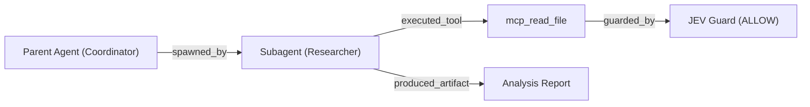

# KnowledgeGraph and ContextGraph Architectural Strategy

> **Status:** Ratified RFC & Architectural Specification  
> **Parent Epic:** Bayly-AI/HATH0R-Agentic-Framework#77  
> **Governing Standards:** `cr-cli-first-001`, `cr-kb-tower-001`, `cr-branch-gov-001`

---

## 1. Executive Summary

This strategy establishes the architectural foundation for evolving the Hath0r Framework and CLI knowledge substrate into a dual-layer graph topology:
1. **KnowledgeGraph (KG):** A compiled, relational entity graph extracted from static, Git-versioned Markdown and YAML frontmatter (`files-as-truth`).
2. **ContextGraph (CG):** A dynamic, ephemeral runtime graph that tracks multi-agent session topologies, delegation trees, JEV security validations, and context slice provenance.

This hybrid approach maintains Hath0r's **file-first** principle while providing deterministic multi-hop relational queries and multi-agent context pruning.

---

## 2. Architecture & Design

### 2.1 Static KnowledgeGraph (KG)
- **Authoritative Substrate:** Markdown files (`.hath0r/knowledgebase/**`, `docs/**`, `contracts/**`).
- **Entity Model:** Nodes represent Documents, Policies, Contracts, Procedures, Playbooks, Tools, and Bots.
- **Relational Edges:** Parsed from frontmatter attributes:
  - `depends_on`: Upstream requirements or prerequisite files.
  - `implements`: Contracts, RFCs, or specifications fulfilled.
  - `references`: Cross-cutting technical guides or sibling repositories.
  - `governed_by`: Policies or quality gate standards.
- **Storage:** Persisted to `.hath0r/state/cache/knowledge.db` as SQLite relational tables alongside FTS5 and vector indices.

### 2.2 Dynamic ContextGraph (CG)
- **Session Substrate:** In-memory graph engine capturing real-time agent execution state.
- **Node Types:** `agent`, `subagent`, `task`, `tool_invocation`, `jev_guard`, `context_slice`, `artifact`.
- **Edge Types:** `spawned_by`, `delegated_to`, `executed_tool`, `guarded_by`, `produced_artifact`, `consumed_context`.
- **JEV Integration:** Every guarded tool execution automatically logs a `guarded_by` edge pointing to the JEV policy validation record.

---

## 3. Contract Schemas & CLI Integration

- **KnowledgeGraph Schema:** `contracts/hath0r-knowledgegraph-v1.schema.json`
- **ContextGraph Schema:** `contracts/hath0r-contextgraph-v1.schema.json`
- **CLI Commands:**
  - `hath0r kb graph query --entity <id> [--depth <n>]`
  - `hath0r kb graph lineage <file-path>`
  - `hath0r context graph status [--session <id>]`

---

## 4. Verification and Acceptance
- Contract validation tests in `tests/test_graph_contracts.py`.
- Subsystem metadata compliance across `docs/`, `contracts/`, `lib/`, and `cfg/`.
