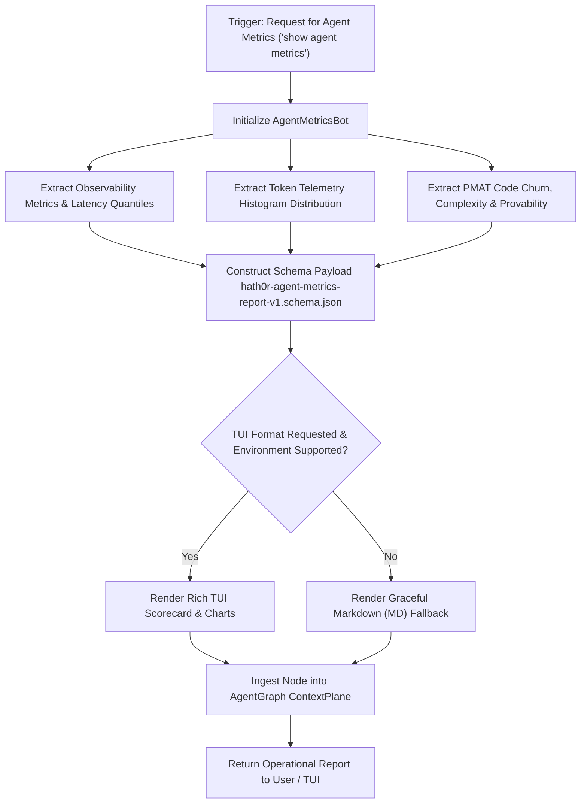

# Workflow: Agent Metrics Query & Report Generation Workflow

> Canonical Workflow Definition · Hath0r Agentic Framework  
> Updated: 2026-10-05

## Supported Intent Triggers
1. `"show agent metrics"`
2. `"get agent metrics"`
3. `"agent metrics report"`
4. `"show metrics"`
5. `"display agent metrics"`
