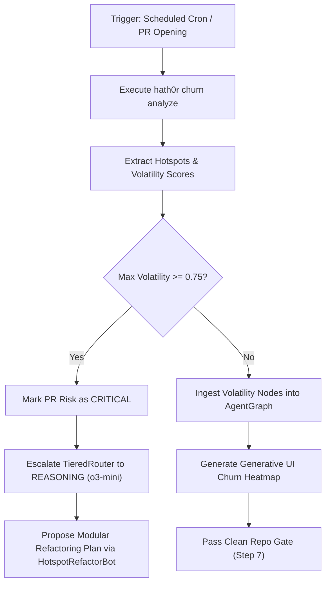

# Workflow: Automated Code Churn Audit

> Canonical Workflow Definition · Hath0r Agentic Framework  
> Updated: 2026-10-05

## Step Details
1. **Trigger**: Scheduled heartbeat or PR pre-flight evaluation.
2. **Analysis**: Fast extraction via `PmatAdapter`.
3. **Graph Ingestion**: Write `file_hotspot` nodes and `CO_CHANGES_WITH` edges to `AgentGraph`.
4. **Evidence Emission**: Emit `ChurnHeatmapComponent` for operator inspection.
