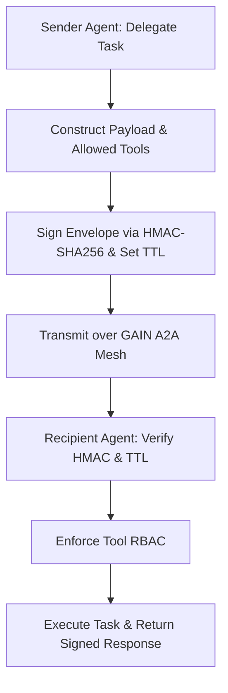

# Workflow: GAIN A2A Task Delegation Workflow

> Canonical Workflow Definition · Hath0r Agentic Framework  
> Updated: 2026-10-05

```mermaid
flowchart TD
    A["Sender Agent: Delegate Task"] --> B["Construct Payload & Allowed Tools"]
    B --> C["Sign Envelope via HMAC-SHA256 & Set TTL"]
    C --> D["Transmit over GAIN A2A Mesh"]
    D --> E["Recipient Agent: Verify HMAC & TTL"]
    E --> F["Enforce Tool RBAC"]
    F --> G["Execute Task & Return Signed Response"]
```
