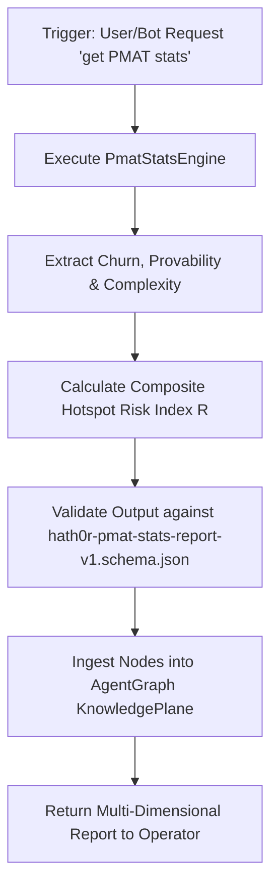

# Workflow: PMAT Multi-Dimensional Stats Query

> Canonical Workflow Definition · Hath0r Agentic Framework  
> Updated: 2026-10-05

```mermaid
flowchart TD
    A["Trigger: User/Bot Request 'get PMAT stats'"] --> B["Execute PmatStatsEngine"]
    B --> C["Extract Churn, Provability & Complexity"]
    C --> D["Calculate Composite Hotspot Risk Index R"]
    D --> E["Validate Output against hath0r-pmat-stats-report-v1.schema.json"]
    E --> F["Ingest Nodes into AgentGraph KnowledgePlane"]
    F --> G["Return Multi-Dimensional Report to Operator"]
```
