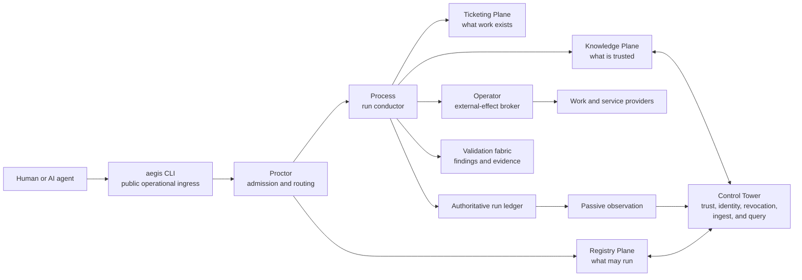

# Architecture and Integrations

- **Audience:** CTO, enterprise architecture, platform engineering, security architecture, integration, and operations
- **Disclosure:** Buyer-facing technical draft; do not represent diagrams as deployed topology
- **Maturity:** Accepted architecture directions with draft implementation specifications

## Architectural intent

AEGIS is designed as a provider-neutral governance layer between human or agent intent and the tools that execute or record work.

This is a logical target architecture. It is not evidence that the services are deployed.

## Major boundaries

### HATHOR and AEGIS

- **HATHOR** defines the framework: portable project structure, discoverable knowledge, governance, secure capability access, and attributable work.
- **AEGIS** is the proposed realization through the CLI, bot runtime, validation and orchestration fabrics, authority planes, and Control Tower.

### CLI

The `aegis` CLI is the accepted public operational ingress. It is not itself the source of truth for capability, knowledge, work, or run state.

### Authority planes

- Registry decides which automation definitions are eligible.
- Knowledge owns record status, provenance, freshness, and verification.
- Ticketing owns work records and provider reconciliation.
- Process owns authoritative run transitions.
- Humans own specified promotion, waiver, curation, and revocation decisions.

### Control Tower

The accepted Tower design provides authenticated, asynchronous services for:

- registration and revocation;
- trust and policy distribution;
- human and curator identity;
- rollup ingest; and
- bounded audit query.

Tower is not a bot, a general workflow engine, or the terminus of every local request.

### Orchestration

The accepted coordination decision is event-triggered central orchestration:

1. events trigger evaluation;
2. Process decides state transitions; and
3. Proctor enforces admission and sequence.

This avoids making event emitters or individual workers the owner of workflow state.

## Command and capability model

The accepted direction uses a greenfield `aegis` command with nine bounded domains. Callers request versioned capabilities rather than invoking implementation names directly.

The target interaction includes:

- machine-readable output;
- structured refusals and remediation;
- bounded schemas and pagination;
- health and version contracts;
- dry-run and confirmation behavior for mutations;
- capability discovery and contract negotiation; and
- a broader CLI exit boundary than the internal bot runtime.

Detailed command implementation is not established by documentation alone.

## Registry and trust

The target registry design combines:

- a machine-local index for routing and verification state;
- a Tower registry for organization acknowledgement and revocation;
- signed and canonicalized manifests and governance artifacts;
- offline-verifiable trust distribution;
- trust TTL and visible degradation; and
- quarantine for invalid, stale, revoked, or inconsistent definitions.

**Open assurance gap:** The current accepted signature direction covers the canonical definition and governance files but does not bind the executable, image, or attestation. Strong supply-chain claims must wait for that decision and implementation.

## Conducted-run data model

The draft run architecture includes:

- actor, ticket, capability, policy, and hierarchy binding;
- append-only run events;
- deterministic state reconstruction by fold;
- required and executed work sets;
- sequence and barrier evaluation;
- findings, assumptions, claims, and evidence;
- lawful skip records;
- execution and idempotency keys;
- interruption and resume; and
- final completeness reconciliation.

The central model is accepted; complex cyclic graphs, attempts, and some crash semantics require further interface freeze.

## Integration model

### Work systems

Target adapters are documented for:

- Jira;
- Azure DevOps;
- GitHub; and
- a minimal first-party backup ticket service.

The enterprise provider remains authoritative. AEGIS intends to normalize common work operations and control outcomes through a canonical Ticket Contract.

**Sales boundary:** These are target adapters, not verified integration availability.

### Knowledge services

The Knowledge Plane target includes:

- project-local records;
- machine-local records;
- organization records served through Tower-related services;
- public references as lowest-trust fallback;
- keyword and vector retrieval where appropriate;
- status, freshness, provenance, and confidence in results;
- human review and promotion; and
- MCP-compatible contracts where specified.

### External service providers

Operator is designed as the exclusive broker for supported provider connections and long-lived credentials.

Examples in legacy visuals include collaboration, work, and CRM services. Those images are conceptual and do not establish supported adapters. Only a provider with an approved connection definition, implemented broker path, policy, and tests should be called supported.

### Source control and CI/CD

The target assumes Git-based projects and links tickets to branches, pull requests, validation, and promotion evidence. It is designed to complement rather than replace source control and CI/CD.

The organization’s required promotion path is:

`local → development → testing → staging → master (Production)`

Each stage requires deployment and URL validation before promotion to the next stage. This is an organizational policy, not a universal product claim.

### Identity

Tower-issued short-lived human identity is part of the accepted design direction. The identity provider and detailed token contract remain open. Any integration claim must specify issuer, subject, audience, action, run, nonce, expiry, revocation, and replay behavior once defined.

### Observability

The draft design uses a local JSONL spool, passive Observation components, batch delivery, deduplication, and Tower rollups. Container material also discusses OpenTelemetry collectors and external observability backends.

Telemetry must not become the sole authority for work or run state.

## Deployment direction

The source corpus describes:

- macOS and Linux clients for v1;
- arm64 and amd64 targets;
- a primarily Go 1.23+ platform implementation direction;
- class-based containers;
- EKS for testing, staging, and production in developer guidance; and
- local operation with bounded Tower disconnection.

The final hosting boundary, multi-tenancy, service ownership, HA, capacity, backup, SLOs, and support model are not established.

## Non-functional targets

These are design targets, not observed SLAs:

| Target | Intended behavior |
|---|---|
| Cheap health check | Under 250 ms steady-state |
| Default agent orientation | At most 2,500 output tokens |
| Default schema page | At most 8 KB |
| Hierarchy resolution | At most three CLI round-trip waves |
| Transient retry | At most five attempts with backoff |
| Validation L0 | At most 50 ms |
| Validation L1 | At most 2 seconds |
| Validation L2 | At most 30 seconds |
| Validation L3 | At most 10 minutes |
| Validation L4 | Asynchronous |

Operational SLOs require measured implementation evidence and service ownership.

## Resilience direction

The architecture aims to degrade honestly:

- cached signed authority may remain usable within a trust TTL;
- authority-originating actions refuse after expiry;
- eligible ticket capture may buffer during provider failure;
- provider authority wins reconciliation;
- conflicts remain explicit;
- run state reconstructs from authoritative local events;
- idempotency limits duplicate external effects; and
- observation export replays independently of business logic.

Exactly-once and lossless-operation claims are not approved. Use “idempotent target behavior within tested scenarios” only after evidence exists.

## Buyer architecture review checklist

Before a technical commitment, confirm:

- target repositories, operating systems, architectures, and environments;
- work provider and exact required operations;
- identity provider and reserved human actions;
- network and egress policy;
- provider credential custody and Class-2 exceptions;
- Tower hosting, tenancy, HA, backup, and data residency;
- authoritative record locations;
- evidence, telemetry, and knowledge retention;
- supported agent harnesses and CLI invocation path;
- Git and CI/CD integration;
- required control profiles and latency budgets;
- threat assumptions;
- recovery and reconciliation tests; and
- ownership and support.

## Sources

- [Architecture Corpus Index](../architect/INDEX.md)
- [Architecture Diagrams](../architect/AEGIS-ARCH-001-architecture-mermaid-20260911.md)
- [Core Requirements](../architect/AEGIS-REQ-CORE-001-initial-requirements-20260911.md)
- [Central Orchestration Decision](../architect/aegis-adr-002-orchestration-coordination-model-20260913.md)
- [Command Surface Decision](../architect/aegis-adr-003-greenfield-command-surface-20260913.md)
- [State Residency Decision](../architect/aegis-adr-004-layout-state-residency-20260913.md)
- [Tower Surface](../architect/aegis-rp-010-tower-surface-20260913.md)
- [Operator Brokering](../architect/aegis-rp-011-operator-brokering-20260913.md)
